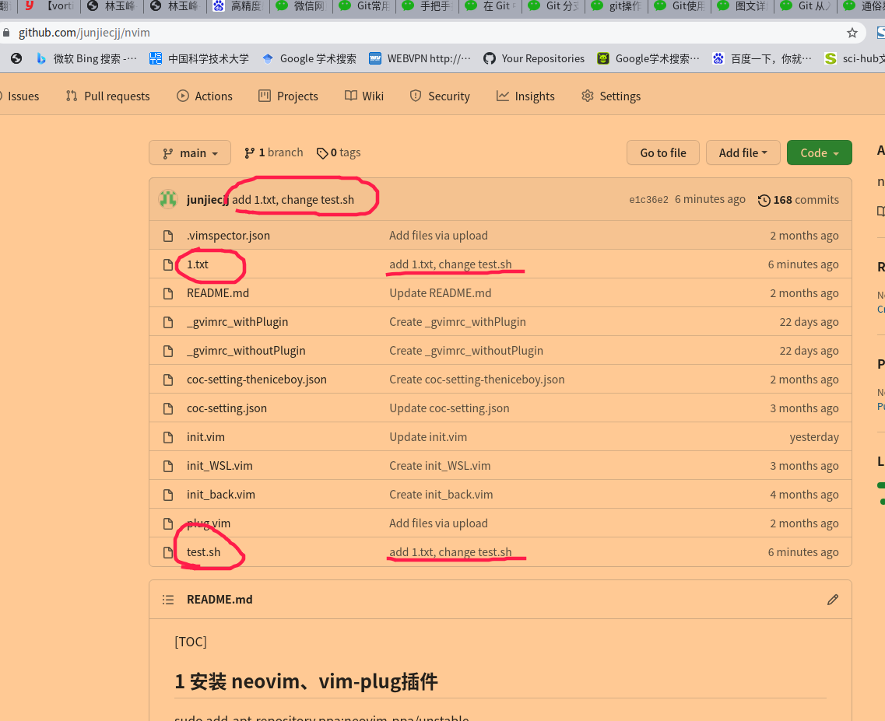

[TOC]

#  自己对Git的认识

git的一些网络文章：

[手把手指导您使用 Git | Linux 中国](https://mp.weixin.qq.com/s/AsVF0Nzcgap8Le66rkrOqA)

[在 Git 中怎样克隆、修改、添加和删除文件？](https://mp.weixin.qq.com/s/ZdfY08pk1OkPfvc1IdVuSQ)

[Git 分支操作介绍 | Linux 中国](https://mp.weixin.qq.com/s/6XA8wqMvNu7fNLjhs5DJOw)

[通俗易懂，让你深入 Git 基本原理](https://mp.weixin.qq.com/s/GOSMjFGcAchlYerdeLqiKA)

[22 张图让你洞察 Git 秘密](https://mp.weixin.qq.com/s/2n-J9H6_MW0sL2wWFaznAw)

[Git使用的奇技淫巧](https://mp.weixin.qq.com/s/tHBRjg_QTjDTHOGOaFEi9w)

[Git 从入门到精通，这一篇就够了](https://mp.weixin.qq.com/s/b8bQW2N5VC-qmGD4dTiwKQ)

[图文详解 Git 工作原理](https://mp.weixin.qq.com/s/sRnfLAe5Aq720iwNAgzwVQ)

[Git使用教程：超详细、超浅显、真正手把手教！](https://mp.weixin.qq.com/s/YQOhF7Nc94ZRLxFWpd2Wbw)

[git操作，看这一篇文章就够了！](https://mp.weixin.qq.com/s/_AJKZT8oCza8hBAxT-kU2g)

[Git常用命令整理与重要概念整理](https://mp.weixin.qq.com/s/P9ifvcexrY_NwIonVJYRFw)

[廖雪峰的git教程](https://www.liaoxuefeng.com/wiki/896043488029600)


## 基本概念

+ 工作区Workspace：就是你在电脑里能看到的目录，即你代码放的那个文件夹。即时性强，对文件的所有更改都会立刻提现在这里。
+ 版本库：工作区有一个隐藏目录.git，这个不算工作区，而是Git的版本库。
+ 暂存区 Index / Stage：git add以后，当前对文件的更改会保存到这个区
+ 本地仓库Repository：git commit以后，当前暂存区里对文件的更改会提交到本地仓库
+ 远程仓库Remote：远程仓库名一般叫origin。git push以后，本地仓库里优先于远程仓库的commit会被push到远程仓库


本节主要介绍git在不同场景下的使用，且默认使用ssh登录GitHub。

- [ ] github上已经存在Repository且已经有内容，此时在本地需要建立一个与远程仓库同步的仓库，然后在本地写代码，并不定期push到远程仓库；
- [ ] 想在本地新建一个仓库，并在本地仓库写代码，最后同步到远程github上的Repository；
- [ ] 创建分支、合并分支；
- [ ] 多人协同；


在进行之后的操作前，都需要进行以下步骤：

```bash

#设置你的git用户名及邮箱
$: git config --global user.name 'ustc-desktop'
$: git config --global user.email '2716705056@qq.com'
# 以上两行用于Github识别是哪个git用户提交了代码，也就是给本地仓库Repository取名。

# 给git添加 ssh-key，查看家目录下是否有.ssh目录，若没有则生成一个ssh-key，
ssh-keygen -t rsa -C "2716705056@qq.com"
#这行命令将会在~/.ssh/下生成两个文件：id_rsa  id_rsa.pub
┌─[jack@unix] - [~] - [2021-09-11 12:36:03]
└─[0] cd .ssh                 
┌─[jack@unix] - [~/.ssh] - [2021-09-11 12:36:05]
└─[0] ll
总用量 20K
drwx------  2 jack jack 4.0K  9月 10 19:46 ./
drwxr-xr-x 86 jack jack 4.0K  9月 11 00:36 ../
-rw-------  1 jack jack 2.6K  9月 10 19:51 id_rsa
-rw-r--r--  1 jack jack  571  9月 10 19:51 id_rsa.pub
-rw-r--r--  1 jack jack 1.8K  9月 10 20:03 known_hosts
┌─[jack@unix] - [~/.ssh] - [2021-09-11 12:36:07]
└─[0] 
# id_rsa.pub是可以放到很多台服务器上的，这样本电脑登录这些服务器都会免密。
```


将id_rsa.pub放到github下的密钥区：

**文件windows位置：**

****

 

 

**github添加 你的ssh操作步骤：**

****


 


标题一般用`电脑型号`，便于记忆是哪台机器的公钥，这里注意，对于同一个Github上的仓库，如果多个电脑都需要建立本地仓库并与之建立链接，且设置免密登录，则在每台电脑上都需要执行`ssh-keygen -t rsa -C "2716705056@qq.com"`并将生成的公钥以上述方式添加到github上。


## 常用命令


### **配置**

 Git的设置文件为`.git/config`，它可以在用户主目录下（全局配置），也可以在项目目录下（项目配置）。

```bash

# 显示当前的Git配置
$ git config --list

# 编辑Git配置文件
$ git config -e [--global]

# 设置提交代码时的用户信息
$ git config [--global] user.name "[name]"
$ git config [--global] user.email "[email address]"
```


### **三、增加/删除文件**

```bash

# 添加指定文件到暂存区
$ git add [file1] [file2] ...

# 添加指定目录到暂存区，包括子目录
$ git add [dir]

# 添加当前目录的所有文件到暂存区
$ git add .

# 添加每个变化前，都会要求确认
# 对于同一个文件的多处变化，可以实现分次提交
$ git add -p

# 删除工作区文件，并且将这次删除放入暂存区
$ git rm [file1] [file2] ...

# 停止追踪指定文件，但该文件会保留在工作区
$ git rm --cached [file]

# 改名文件，并且将这个改名放入暂存区
$ git mv [file-original] [file-renamed]
```


### 代码提交

```bash

# 提交暂存区到仓库区
$ git commit -m [message]

# 提交暂存区的指定文件到仓库区
$ git commit [file1] [file2] ... -m [message]

# 提交工作区自上次commit之后的变化，直接到仓库区
$ git commit -a

# 提交时显示所有diff信息
$ git commit -v

# 使用一次新的commit，替代上一次提交
# 如果代码没有任何新变化，则用来改写上一次commit的提交信息
$ git commit --amend -m [message]

# 重做上一次commit，并包括指定文件的新变化
$ git commit --amend [file1] [file2] ...
```


### 分支


```bash
# 列出所有本地分支
$ git branch

# 列出所有远程分支
$ git branch -r

# 列出所有本地分支和远程分支
$ git branch -a

# 新建一个分支，但依然停留在当前分支
$ git branch [branch-name]

# 新建一个分支，并切换到该分支
$ git checkout -b [branch]

# 新建一个分支，指向指定commit
$ git branch [branch] [commit]

# 新建一个分支，与指定的远程分支建立追踪关系
$ git branch --track [branch] [remote-branch]

# 切换到指定分支，并更新工作区
$ git checkout [branch-name]

# 切换到上一个分支
$ git checkout -

# 建立追踪关系，在现有分支与指定的远程分支之间
$ git branch --set-upstream [branch] [remote-branch]

# 合并指定分支到当前分支
$ git merge [branch]

# 选择一个commit，合并进当前分支
$ git cherry-pick [commit]

# 删除分支
$ git branch -d [branch-name]

# 删除远程分支
$ git push origin --delete [branch-name]
$ git branch -dr [remote/branch]
```


### 标签

```bash

# 列出所有tag
$ git tag

# 新建一个tag在当前commit
$ git tag [tag]

# 新建一个tag在指定commit
$ git tag [tag] [commit]

# 删除本地tag
$ git tag -d [tag]

# 删除远程tag
$ git push origin :refs/tags/[tagName]

# 查看tag信息
$ git show [tag]

# 提交指定tag
$ git push [remote] [tag]

# 提交所有tag
$ git push [remote] --tags

# 新建一个分支，指向某个tag
$ git checkout -b [branch] [tag]
```


## 查看信息

```bash

# 显示有变更的文件
$ git status

# 显示当前分支的版本历史
$ git log

# 显示commit历史，以及每次commit发生变更的文件
$ git log --stat

# 搜索提交历史，根据关键词
$ git log -S [keyword]

# 显示某个commit之后的所有变动，每个commit占据一行
$ git log [tag] HEAD --pretty=format:%s

# 显示某个commit之后的所有变动，其"提交说明"必须符合搜索条件
$ git log [tag] HEAD --grep feature

# 显示某个文件的版本历史，包括文件改名
$ git log --follow [file]
$ git whatchanged [file]

# 显示指定文件相关的每一次diff
$ git log -p [file]

# 显示过去5次提交
$ git log -5 --pretty --oneline

# 显示所有提交过的用户，按提交次数排序
$ git shortlog -sn

# 显示指定文件是什么人在什么时间修改过
$ git blame [file]

# 显示暂存区和工作区的差异
$ git diff

# 显示暂存区和上一个commit的差异
$ git diff --cached [file]

# 显示工作区与当前分支最新commit之间的差异
$ git diff HEAD

# 显示两次提交之间的差异
$ git diff [first-branch]...[second-branch]

# 显示今天你写了多少行代码
$ git diff --shortstat "@{0 day ago}"

# 显示某次提交的元数据和内容变化
$ git show [commit]

# 显示某次提交发生变化的文件
$ git show --name-only [commit]

# 显示某次提交时，某个文件的内容
$ git show [commit]:[filename]

# 显示当前分支的最近几次提交
$ git reflog
```


## 远程同步

```bash

# 下载远程仓库的所有变动
$ git fetch [remote]

# 显示所有远程仓库
$ git remote -v

# 显示某个远程仓库的信息
$ git remote show [remote]

# 增加一个新的远程仓库，并命名
$ git remote add [shortname] [url]

# 取回远程仓库的变化，并与本地分支合并
$ git pull [remote] [branch]

# 上传本地指定分支到远程仓库
$ git push [remote] [branch]

# 强行推送当前分支到远程仓库，即使有冲突
$ git push [remote] --force

# 推送所有分支到远程仓库
$ git push [remote] --all
```


## 撤销

```bash

# 恢复暂存区的指定文件到工作区
$ git checkout [file]

# 恢复某个commit的指定文件到暂存区和工作区
$ git checkout [commit] [file]

# 恢复暂存区的所有文件到工作区
$ git checkout .

# 重置暂存区的指定文件，与上一次commit保持一致，但工作区不变
$ git reset [file]

# 重置暂存区与工作区，与上一次commit保持一致
$ git reset --hard

# 重置当前分支的指针为指定commit，同时重置暂存区，但工作区不变
$ git reset [commit]

# 重置当前分支的HEAD为指定commit，同时重置暂存区和工作区，与指定commit一致
$ git reset --hard [commit]

# 重置当前HEAD为指定commit，但保持暂存区和工作区不变
$ git reset --keep [commit]

# 新建一个commit，用来撤销指定commit
# 后者的所有变化都将被前者抵消，并且应用到当前分支
$ git revert [commit]

# 暂时将未提交的变化移除，稍后再移入
$ git stash
$ git stash pop
```


##  github上已经存在Repository且已经有内容

github上已经存在Repository且已经有内容，想将远程仓库clone到本地，然后在本地写代码，最后提交到远程仓库，这个比较简单也比较常用。

```bash
╭─jack@unix ~/公共的/gitlearn  
╰─➤  ll
总用量 12K
drwxrwxr-x  3 jack jack 4.0K  9月 11 00:48 ./
drwxr-xr-x 19 jack jack 4.0K  9月 10 19:42 ../
drwxrwxr-x  3 jack jack 4.0K  9月 11 00:22 Demo/
╭─jack@unix ~/公共的/gitlearn  
╰─➤  git clone git@github.com:junjiecjj/nvim.git    
正克隆到 'nvim'...
remote: Enumerating objects: 492, done.
remote: Counting objects: 100% (66/66), done.
remote: Compressing objects: 100% (64/64), done.
remote: Total 492 (delta 40), reused 6 (delta 2), pack-reused 426
接收对象中: 100% (492/492), 379.29 KiB | 514.00 KiB/s, 完成.
处理 delta 中: 100% (307/307), 完成.
╭─jack@unix ~/公共的/gitlearn  
╰─➤  cd nvim 
╭─jack@unix ~/公共的/gitlearn/nvim  ‹main› 
╰─➤  l 
coc-setting.json             _gvimrc_withoutPlugin  init_back.vim  init_WSL.vim  README.md
coc-setting-theniceboy.json  _gvimrc_withPlugin     init.vim       plug.vim      test.sh
╭─jack@unix ~/公共的/gitlearn/nvim  ‹main› 
╰─➤  touch 1.txt   #新增文件
╭─jack@unix ~/公共的/gitlearn/nvim  ‹main*› 
╰─➤  nv test.sh #修改文件
╭─jack@unix ~/公共的/gitlearn/nvim  ‹main*› 
╰─➤  git add .           
╭─jack@unix ~/公共的/gitlearn/nvim  ‹main*› 
╰─➤  git commit -m "add 1.txt, change test.sh"
[main e1c36e2] add 1.txt, change test.sh
 2 files changed, 1 insertion(+), 1 deletion(-)
 create mode 100644 1.txt
╭─jack@unix ~/公共的/gitlearn/nvim  ‹main› 
╰─➤  git status                               
位于分支 main
您的分支领先 'origin/main' 共 1 个提交。
  （使用 "git push" 来发布您的本地提交）

无文件要提交，干净的工作区
╭─jack@unix ~/公共的/gitlearn/nvim  ‹main› 
╰─➤  git remote 
origin
╭─jack@unix ~/公共的/gitlearn/nvim  ‹main› 
╰─➤  git branch 
╭─jack@unix ~/公共的/gitlearn/nvim  ‹main› 
╰─➤  git push origin main 
枚举对象: 6, 完成.
对象计数中: 100% (6/6), 完成.
使用 8 个线程进行压缩
压缩对象中: 100% (3/3), 完成.
写入对象中: 100% (4/4), 337 字节 | 337.00 KiB/s, 完成.
总共 4（差异 2），复用 0（差异 0），包复用 0
remote: Resolving deltas: 100% (2/2), completed with 2 local objects.
To github.com:junjiecjj/nvim.git
   6914560..e1c36e2  main -> main
╭─jack@unix ~/公共的/gitlearn/nvim  ‹main› 
╰─➤  rm init_back.vim   #删除文件
rm：是否删除普通文件 'init_back.vim'？ y
╭─jack@unix ~/公共的/gitlearn/nvim  ‹main*› 
╰─➤  git add .           
╭─jack@unix ~/公共的/gitlearn/nvim  ‹main*› 
╰─➤  git status                               
位于分支 main
您的分支与上游分支 'origin/main' 一致。

要提交的变更：
  （使用 "git restore --staged <文件>..." 以取消暂存）
        删除：     init_back.vim

╭─jack@unix ~/公共的/gitlearn/nvim  ‹main*› 
╰─➤  git commit -m "delete init_bak.vim"      
[main 0c8ec4e] delete init_bak.vim
 1 file changed, 4678 deletions(-)
 delete mode 100644 init_back.vim
╭─jack@unix ~/公共的/gitlearn/nvim  ‹main› 
╰─➤  git push origin main               
枚举对象: 3, 完成.
对象计数中: 100% (3/3), 完成.
使用 8 个线程进行压缩
压缩对象中: 100% (2/2), 完成.
写入对象中: 100% (2/2), 230 字节 | 230.00 KiB/s, 完成.
总共 2（差异 1），复用 0（差异 0），包复用 0
remote: Resolving deltas: 100% (1/1), completed with 1 local object.
To github.com:junjiecjj/nvim.git
   e1c36e2..0c8ec4e  main -> main
╭─jack@unix ~/公共的/gitlearn/nvim  ‹main› 
╰─➤  

```


## 想在本地新建一个仓库，并在本地仓库写代码，最后同步到远程github上的Repository


这种情况多半是想在本地文件夹新建一个仓库，然后在这个新仓库里写代码，并提交本地仓库，最后同步到远程仓库。为了方便，步骤如下：

<font face="黑体" color=green size=5>步骤 1：</font> 申请一个 GitHub 账户

在 GitHub.com 网站上（免费）创建一个账户是最简单的方式。


选择一个用户名（比如说，octocat123），输入您的邮箱地址和密码，然后点击 Sign up for GitHub。进入之后，您将看到下方插图的界面：


<font face="黑体" color=green size=5>步骤 2：</font>创建一个新的仓库

一个仓库（ repository），类似于能储存物品的场所或是容器；在这里，我们创建仓库存储代码。在 `+` 符号（在插图的右上角，我已经选中它了） 的下拉菜单中选择 New Repository。


给您的仓库命名（比如说，Demo）然后点击 Create Repository，无需考虑本页面的其他选项，<font face="黑体" color=red>特别是千万勾选`Add Readme.md`和`Add .gitignore`</font>。

恭喜！您已经在 GitHub.com 中建立了您的第一个仓库。

<font face="黑体" color=green size=5>步骤 3：</font> 创建文件

当仓库创建完毕后，界面将和下方一致：

```bash
Quick setup — if you’ve done this kind of thing before
or	
https://github.com/junjiecjj/Demo.git
Get started by creating a new file or uploading an existing file. We recommend every repository include a README, LICENSE, and .gitignore.

…or create a new repository on the command line
echo "# Demo" >> README.md
git init
git add README.md
git commit -m "first commit"
git branch -M main
git remote add origin https://github.com/junjiecjj/Demo.git
git push -u origin main


…or push an existing repository from the command line
git remote add origin https://github.com/junjiecjj/Demo.git
git branch -M main
git push -u origin main


…or import code from another repository
You can initialize this repository with code from a Subversion, Mercurial, or TFS project.


```


上面的`git remote add origin https://github.com/junjiecjj/Demo.git`改为`git remote add origin  git@github.com:junjiecjj/Demo.git`，原因下面会阐述。

不必惊慌，它比看上去简单。跟紧步骤。忽略其他内容，注意截图上的 “...or create a new repository on the command line,”。

在您的计算机中打开终端。

`sudo   apt   install   git-all`

键入 `git` 然后回车。如果命令行显示 `bash: git: command not found`，在您的操作系统或发行版 安装 Git命令。键入 `git` 并回车检查是否成功安装；如果安装成功，您将看见大量关于使用该命令的说明信息。

在终端内输入：

```
mkdir Demo
```

这个命令将会创建一个名为 Demo 的目录（文件夹）。

如下命令将会切换终端目录，跳转到 Demo 目录：

```
cd Demo
```

然后输入：

```
echo "#Demo" >> README.md
```

创建一个名为 `README.md` 的文件，并写入 `#Demo`。检查文件是否创建成功，请输入：

```
cat README.md
```

这将会为您显示 `README.md` 文件的内容，如果文件创建成功，您的终端会有如下显示：


使用 Git 程序告诉您的电脑，Demo 是一个被 Git 管理的目录，请输入：

```bash
git init
```

然后，告诉 Git 程序您关心的文件并且想在此刻起跟踪它的任何改变，请输入：

```bash
git add README.md
#或者提交所有更改文件到
git add .
```

步骤 4：创建一次提交

目前为止，您已经创建了一个文件，并且已经通知了 Git，现在，是时候创建一次提交commit了。提交可以看作是一个里程碑。每当完成一些工作之时，您都可以创建一次提交，保存文件当前版本，这样一来，您可以返回之前的版本，并且查看那时候的文件内容。无论何时您修改了文件，都可以对文件创建一个上一次的不一样的新版本。

创建一次提交，请输入：

```bash
git commit -m "first commit"
```

就是这样！刚才您创建了包含一条注释为 “first commit” 的 Git 提交。每次提交，您都必须编辑注释信息；它不仅能协助您识别提交，而且能让您理解此时您对文件做了什么修改。这样到了明天，如果您在文件中添加新的代码，您可以写一句提交信息：“添加了新的代码”，然后当您一个月后回来查看提交记录或者 Git 日志（即提交列表），您还能知道当时的您在文件夹里做了什么。

步骤 5: 将您的计算机与 GitHub 仓库相连接

现在，是时候用如下命令将您的计算机连接到 GitHub 仓库了：

```bash
git remote add origin   git@github.com:junjiecjj/Demo.git
```

让我们一步步的分析这行命令。我们通知 Git 去添加一个叫做 `origin` （起源）的，拥有地址为 `git@github.com:junjiecjj/Demo.git`（它也是您的仓库的 GitHub 地址） 的 `remote` （远程仓库）。当您提交代码时，这允许您在 GitHub.com 和 Git 仓库交互时使用 `origin` 这个名称而不是完整的 Git 地址。为什么叫做 `origin`？当然，您可以叫点别的，只要您喜欢（惯例而已），<font face="黑体" color=red>注意要用`git@github.com:junjiecjj/Demo.git`</font>而不是`https://github.com/junjiecjj/Demo.git`。

因为用`git@github.com:junjiecjj/Demo.git`相当于用ssh登录github，而`https://github.com/junjiecjj/Demo.git`是用http登录，在push时ssh登录设置免密登录后再使用`git push origin master`非常方便，但是http需要生成一个GitHub token（非常不好用，需要定期更新，每次push需要手动输入密码）。

现在，我们已经将本地 Demo 仓库副本`连接`到了其在 GitHub.com 远程副本上。您的终端看起来如下：


此刻我们已经连接到远程仓库，可以推送我们的代码 到 GitHub.com（例如上传 `README.md` 文件）。

```bash
git push origin master
```


执行完毕后，您的终端会显示如下信息：


然后，如果您访问 `https://github.com/<your_username>/Demo`，您会看到截图内显示的情况：


就是这么回事！您已经创建了您的第一个 GitHub 仓库，连接到了您的电脑，并且从你的计算机推送（或者称：上传）一个文件到 GitHub.com 名叫 Demo 的远程仓库上了。下一次，我将编写关于 Git 复制（从 GitHub 上下载文件到你的计算机上）、添加新文件、修改现存文件、推送（上传）文件到 GitHub。


以上过程代码如下：

```bash
╭─jack@unix ~/公共的/gitlearn  
╰─➤  cd Demo 
╭─jack@unix ~/公共的/gitlearn/Demo  
╰─➤  echo "#Demo" >> README.md
╭─jack@unix ~/公共的/gitlearn/Demo  
╰─➤  git init 
已初始化空的 Git 仓库于 /home/jack/公共的/gitlearn/Demo/.git/
╭─jack@unix ~/公共的/gitlearn/Demo  ‹master*› 
╰─➤  git add .
╭─jack@unix ~/公共的/gitlearn/Demo  ‹master*› 
╰─➤  git commit -m "first commit"
[master （根提交） 9acc47a] first commit
 1 file changed, 1 insertion(+)
 create mode 100644 README.md
╭─jack@unix ~/公共的/gitlearn/Demo  ‹master› 
╰─➤  git remote add origin   git@github.com:junjiecjj/Demo.git
╭─jack@unix ~/公共的/gitlearn/Demo  ‹master› 
╰─➤  git push origin master 
枚举对象: 3, 完成.
对象计数中: 100% (3/3), 完成.
写入对象中: 100% (3/3), 215 字节 | 215.00 KiB/s, 完成.
总共 3（差异 0），复用 0（差异 0），包复用 0
To github.com:junjiecjj/Demo.git
 * [new branch]      master -> master
 
 #远程仓库更改时用此命令将远程仓库拖到本地
┌─[jack@unix] - [~/公共的/gitlearn/Demo] - [2021-09-11 03:45:36]
└─[0] <git:(master d24144d) > git pull origin master               
warning: 不建议在没有为偏离分支指定合并策略时执行 pull 操作。 您可以在执行下一次
pull 操作之前执行下面一条命令来抑制本消息：

  git config pull.rebase false  # 合并（缺省策略）
  git config pull.rebase true   # 变基
  git config pull.ff only       # 仅快进

您可以将 "git config" 替换为 "git config --global" 以便为所有仓库设置
缺省的配置项。您也可以在每次执行 pull 命令时添加 --rebase、--no-rebase，
或者 --ff-only 参数覆盖缺省设置。

来自 github.com:junjiecjj/Demo
 * branch            master     -> FETCH_HEAD
已经是最新的。
┌─[jack@unix] - [~/公共的/gitlearn/Demo] - [2021-09-11 03:45:51]
└─[0] <git:(master d24144d) > 


# 新建/删除 目录
┌─[jack@unix] - [~/公共的/gitlearn/Demo] - [六 9月 11, 16:09]
└─[$] <git:(master)> mkdir dic                  
┌─[jack@unix] - [~/公共的/gitlearn/Demo] - [六 9月 11, 16:09]
└─[$] <git:(master)> cd dic                     
┌─[jack@unix] - [~/公共的/gitlearn/Demo/dic] - [六 9月 11, 16:09]
└─[$] <git:(master)> echo "hekkhdkda tetst" >> 1.txt
┌─[jack@unix] - [~/公共的/gitlearn/Demo/dic] - [六 9月 11, 16:10]
└─[$] <git:(master*)> cd ..                          
┌─[jack@unix] - [~/公共的/gitlearn/Demo] - [六 9月 11, 16:10]
└─[$] <git:(master*)> ll
总用量 28K
drwxrwxr-x 4 jack jack 4.0K  9月 11 16:09 ./
drwxrwxr-x 4 jack jack 4.0K  9月 11 00:48 ../
drwxrwxr-x 2 jack jack 4.0K  9月 11 16:10 dic/
drwxrwxr-x 8 jack jack 4.0K  9月 11 16:09 .git/
-rw-rw-r-- 1 jack jack   13  9月 11 14:40 README1.md
-rw-rw-r-- 1 jack jack   13  9月 11 15:03 README2.md
-rw-rw-r-- 1 jack jack    6  9月 11 00:21 README.md
┌─[jack@unix] - [~/公共的/gitlearn/Demo] - [六 9月 11, 16:10]
└─[$] <git:(master*)> git add .                  
┌─[jack@unix] - [~/公共的/gitlearn/Demo] - [六 9月 11, 16:10]
└─[$] <git:(master*)> git commit -m "add dir dic"
[master cd66fdc] add dir dic
 1 file changed, 1 insertion(+)
 create mode 100644 dic/1.txt
┌─[jack@unix] - [~/公共的/gitlearn/Demo] - [六 9月 11, 16:10]
└─[$] <git:(master)> git push origin master     
枚举对象: 5, 完成.
对象计数中: 100% (5/5), 完成.
使用 8 个线程进行压缩
压缩对象中: 100% (2/2), 完成.
写入对象中: 100% (4/4), 318 字节 | 318.00 KiB/s, 完成.
总共 4（差异 1），复用 0（差异 0），包复用 0
remote: Resolving deltas: 100% (1/1), completed with 1 local object.
To github.com:junjiecjj/Demo.git
   240a168..cd66fdc  master -> master
┌─[jack@unix] - [~/公共的/gitlearn/Demo] - [六 9月 11, 16:10]
└─[$] <git:(master)> rm -rf dic                 
┌─[jack@unix] - [~/公共的/gitlearn/Demo] - [六 9月 11, 16:10]
└─[$] <git:(master*)> git add .                  
┌─[jack@unix] - [~/公共的/gitlearn/Demo] - [六 9月 11, 16:10]
└─[$] <git:(master*)> git commit -m "del dir dic"
[master 022cd18] del dir dic
 1 file changed, 1 deletion(-)
 delete mode 100644 dic/1.txt
┌─[jack@unix] - [~/公共的/gitlearn/Demo] - [六 9月 11, 16:10]
└─[$] <git:(master)> git push origin master     
枚举对象: 3, 完成.
对象计数中: 100% (3/3), 完成.
使用 8 个线程进行压缩
压缩对象中: 100% (2/2), 完成.
写入对象中: 100% (2/2), 217 字节 | 217.00 KiB/s, 完成.
总共 2（差异 1），复用 0（差异 0），包复用 0
remote: Resolving deltas: 100% (1/1), completed with 1 local object.
To github.com:junjiecjj/Demo.git
   cd66fdc..022cd18  master -> master
┌─[jack@unix] - [~/公共的/gitlearn/Demo] - [六 9月 11, 16:10]
└─[$] <git:(master)> 


```




# [手把手指导您使用 Git](https://mp.weixin.qq.com/s/B7rjSShEFBkuxM7wsNtlkg)


如果您从未使用过 Git[1]，甚至可能从未听说过它。莫慌张，只需要一步步地跟着这篇入门教程，很快您就会在 GitHub[2] 上拥有一个全新的 Git 仓库。

在开始之前，让我们先理清一个常见的误解：Git 并不是 GitHub。Git 是一套版本控制系统（或者说是一款软件），能够协助您跟踪计算机程序和文件在任何时间的更改。它同样允许您在程序、代码和文件操作上与同事协作。GitHub 以及类似服务（包括 GitLab 和 BitBucket）都属于部署了 Git 程序的网站，能够托管您的代码。

步骤 1：申请一个 GitHub 账户

在 GitHub.com 网站上（免费）创建一个账户是最简单的方式。


选择一个用户名（比如说，octocat123），输入您的邮箱地址和密码，然后点击 Sign up for GitHub。进入之后，您将看到下方插图的界面：


步骤 2：创建一个新的仓库

一个仓库（ repository），类似于能储存物品的场所或是容器；在这里，我们创建仓库存储代码。在 `+` 符号（在插图的右上角，我已经选中它了） 的下拉菜单中选择 New Repository。


给您的仓库命名（比如说，Demo）然后点击 Create Repository。无需考虑本页面的其他选项。

恭喜！您已经在 GitHub.com 中建立了您的第一个仓库。

步骤 3: 创建文件

当仓库创建完毕后，界面将和下方一致：


不必惊慌，它比看上去简单。跟紧步骤。忽略其他内容，注意截图上的 “...or create a new repository on the command line,”。

在您的计算机中打开终端。


键入 `git` 然后回车。如果命令行显示 `bash: git: command not found`，在您的操作系统或发行版 安装 Git[4] 命令。键入 `git` 并回车检查是否成功安装；如果安装成功，您将看见大量关于使用该命令的说明信息。

在终端内输入：

```bash
mkdir Demo
```

这个命令将会创建一个名为 Demo 的目录（文件夹）。

如下命令将会切换终端目录，跳转到 Demo 目录：

```bash
cd Demo
```

然后输入：

```bash
echo "#Demo" >> README.md
```

创建一个名为 `README.md` 的文件，并写入 `#Demo`。检查文件是否创建成功，请输入：

```bash
cat README.md
```

这将会为您显示 `README.md` 文件的内容，如果文件创建成功，您的终端会有如下显示：


使用 Git 程序告诉您的电脑，Demo 是一个被 Git 管理的目录，请输入：

```bash
git init
```

然后，告诉 Git 程序您关心的文件并且想在此刻起跟踪它的任何改变，请输入：

```bash
git add README.md
```

步骤 4：创建一次提交

目前为止，您已经创建了一个文件，并且已经通知了 Git，现在，是时候创建一次提交commit了。提交可以看作是一个里程碑。每当完成一些工作之时，您都可以创建一次提交，保存文件当前版本，这样一来，您可以返回之前的版本，并且查看那时候的文件内容。无论何时您修改了文件，都可以对文件创建一个上一次的不一样的新版本。

创建一次提交，请输入：

```bash
git commit -m "first commit"
```

就是这样！刚才您创建了包含一条注释为 “first commit” 的 Git 提交。每次提交，您都必须编辑注释信息；它不仅能协助您识别提交，而且能让您理解此时您对文件做了什么修改。这样到了明天，如果您在文件中添加新的代码，您可以写一句提交信息：“添加了新的代码”，然后当您一个月后回来查看提交记录或者 Git 日志（即提交列表），您还能知道当时的您在文件夹里做了什么。

步骤 5: 将您的计算机与 GitHub 仓库相连接

现在，是时候用如下命令将您的计算机连接到 GitHub 仓库了：

```bash
git remote add origin https://github.com/<your_username>/Demo.git
```

让我们一步步的分析这行命令。我们通知 Git 去添加一个叫做 `origin` （起源）的，拥有地址为 `https://github.com/<your_username>/Demo.git`（它也是您的仓库的 GitHub 地址） 的 `remote` （远程仓库）。当您提交代码时，这允许您在 GitHub.com 和 Git 仓库交互时使用 `origin` 这个名称而不是完整的 Git 地址。为什么叫做 `origin`？当然，您可以叫点别的，只要您喜欢（惯例而已）。

现在，我们已经将本地 Demo 仓库副本连接到了其在 GitHub.com 远程副本上。您的终端看起来如下：


此刻我们已经连接到远程仓库，可以推送我们的代码 到 GitHub.com（例如上传 `README.md` 文件）。

执行完毕后，您的终端会显示如下信息：


然后，如果您访问 `https://github.com/<your_username>/Demo`，您会看到截图内显示的情况：


就是这么回事！您已经创建了您的第一个 GitHub 仓库，连接到了您的电脑，并且从你的计算机推送（或者称：上传）一个文件到 GitHub.com 名叫 Demo 的远程仓库上了。下一次，我将编写关于 Git 复制（从 GitHub 上下载文件到你的计算机上）、添加新文件、修改现存文件、推送（上传）文件到 GitHub。


# [克隆、修改、添加和删除文件？](https://mp.weixin.qq.com/s/g_1iDs0W1ToGlmYoUbjEpw)


在 [本系列的第一篇文章](http://mp.weixin.qq.com/s?__biz=MzAxODI5ODMwOA==&mid=2666542358&idx=1&sn=1603a3d1514f350267ee07a8884892ec&chksm=80dcf1bdb7ab78ab12cf0744aba22a7f8e7db25f9c0465c6d6b3d6341124495d38d42f75f0cd&scene=21#wechat_redirect) 开始使用 Git 时，我们创建了一个简单的 Git 仓库，并用我们的计算机连接到它，向其中添加一个文件。在本文中，我们将学习一些关于 Git 的其他内容，即如何克隆（下载）、修改、添加和删除 Git 仓库中的文件。


## **让我们来克隆一下**


假设你在 GitHub 上已经有一个 Git 仓库，并且想从它那里获取你的文件——也许你在你的计算机上丢失了本地副本，或者你正在另一台计算机上工作，但是想访问仓库中的文件，你该怎么办？从 GitHub 下载你的文件？没错！在 Git 术语中我们称之为“克隆clone”。（你也可以将仓库作为 ZIP 文件下载，但我们将在本文中探讨克隆方式。）


让我们克隆在上一篇文章中创建的名为 Demo 的仓库。（如果你还没有创建 Demo 仓库，请跳回到那篇文章并在继续之前执行那些步骤）要克隆文件，只需打开浏览器并导航到 https://github.com/<your_username>/Demo (其中 <your_username> 是你仓库的名称。例如，我的仓库是 https://github.com/kedark3/Demo)。一旦你导航到该 URL，点击“克隆或下载Clone or download”按钮，你的浏览器看起来应该是这样的：


正如你在上面看到的，“使用 HTTPS 克隆Clone with HTTPS”选项已打开。从该下拉框中复制你的仓库地址（https://github.com/<your_username>/Demo.git），打开终端并输入以下命令将 GitHub 仓库克隆到你的计算机：


> git **clone** https:*//github.com/<your_username>/Demo.git*

 

然后，要查看 Demo 目录中的文件列表，请输入以下命令：


> ls Demo/

 

终端看起来应该是这样的：


## **修改文件**


现在我们已经克隆了仓库，让我们修改文件并在 GitHub 上更新它们。首先，逐个输入下面的命令，将目录更改为 Demo/，检查 README.md 中的内容，添加新的（附加的）内容到 README.md，然后使用 git status 检查状态:


> cd Demo/
>
> ls
>
> cat README.md
>
> echo "Added another line to REAMD.md" >> README.md
>
> cat README.md
>
> git status


如果你逐一运行这些命令，终端看起开将会是这样：


让我们看一下 git status 的输出，并了解它的意思。不要担心这样的语句：


> On branch master
>
> Your branch **is** up-**to**-date with 'origin/master'.".


因为我们还没有学习这些。（LCTT 译注：学了你就知道了）下一行说：Changes not staged for commit（变化未筹划提交）；这是告诉你，它下面列出的文件没有被标记准备（“筹划stage”）提交。如果你运行 git add，Git 会把这些文件标记为 Ready for commit（准备提交）；换句话说就是 Changes staged for commit（变化筹划提交）。在我们这样做之前，让我们用 git diff 命令来检查我们添加了什么到 Git 中，然后运行 git add。


这里是终端输出：


我们来分析一下：


- diff --git a/README.md b/README.md 是 Git 比较的内容（在这个例子中是 README.md）。
- --- a/README.md 会显示从文件中删除的任何东西。
- +++ b/README.md 会显示从文件中添加的任何东西。
- 任何添加到文件中的内容都以绿色文本打印，并在该行的开头加上 + 号。
- 如果我们删除了任何内容，它将以红色文本打印，并在该行的开头加上 - 号。
- 现在 git status 显示 Changes to be committed:（变化将被提交），并列出文件名（即 README.md）以及该文件发生了什么（即它已经被 modified 并准备提交）。


提示：如果你已经运行了 git add，现在你想看看文件有什么不同，通常 git diff 不会输出任何东西，因为你已经添加了文件。相反，你必须使用 git diff --cached。它会告诉你 Git 添加的当前版本和以前版本文件之间的差别。你的终端输出看起来会是这样：


## **上传文件到你的仓库**


我们用一些新内容修改了 README.md 文件，现在是时候将它上传到 GitHub。

让我们提交更改并将其推送到 GitHub。运行：


> git commit -m "Updated Readme file"

 

这告诉 Git 你正在“提交”已经“添加”的更改，你可能还记得，从本系列的第一部分中，添加一条消息来解释你在提交中所做的操作是非常重要的，以便你在稍后回顾 Git 日志时了解当时的目的。（我们将在下一篇文章中更多地关注这个话题。）Updated Readme file是这个提交的消息——如果你认为这没有合理解释你所做的事情，那么请根据需要写下你的提交消息。


运行 git push -u origin master，这会提示你输入用户名和密码，然后将文件上传到你的 GitHub 仓库。刷新你的 GitHub 页面，你应该会看到刚刚对 README.md 所做的更改。


终端的右下角显示我提交了更改，检查了 Git 状态，并将更改推送到了 GitHub。git status 显示：


> Your branch **is** ahead of 'origin/master' by 1 commit
>
>  (**use** "git push" **to** publish your local commits)


第一行表示在本地仓库中有一个提交，但不在 origin/master 中（即在 GitHub 上）。下一行指示我们将这些更改推送到 origin/master 中，这就是我们所做的。（在本例中，请参阅本系列的第一篇文章，以唤醒你对 origin 含义的记忆。我将在下一篇文章中讨论分支的时候，解释 master 的含义。）


**添加新文件到 Git**


现在我们修改了一个文件并在 GitHub 上更新了它，让我们创建一个新文件，将它添加到 Git，然后将其上传到 GitHub。 运行：


> echo "This is a new file" >> file.txt

 

这将会创建一个名为 file.txt 的新文件。


如果使用 cat 查看它：


> cat file.txt

 

你将看到文件的内容。现在继续运行：


> git status

 

Git 报告说你的仓库中有一个未跟踪的文件（名为 file.txt）。这是 Git 告诉你说在你的计算机中的仓库目录下有一个新文件，然而你并没有告诉 Git，Git 也没有跟踪你所做的任何修改。


我们需要告诉 Git 跟踪这个文件，以便我们可以提交并上传文件到我们的仓库。以下是执行该操作的命令：


> git add file.txt
>
> git status


终端输出如下：


git status 告诉你有 file.txt 被修改，对于 Git 来说它是一个 new file，Git 在此之前并不知道。现在我们已经为 Git 添加了 file.txt，我们可以提交更改并将其推送到 origin/master。


Git 现在已经将这个新文件上传到 GitHub；如果刷新 GitHub 页面，则应该在 GitHub 上的仓库中看到新文件 file.txt。


通过这些步骤，你可以创建尽可能多的文件，将它们添加到 Git 中，然后提交并将它们推送到 GitHub。


## **从 Git 中删除文件**


如果我们发现我们犯了一个错误，并且需要从我们的仓库中删除 file.txt，该怎么办？一种方法是使用以下命令从本地副本中删除文件：


> rm file.txt

 

如果你现在做 git status，Git 就会说有一个文件 not staged for commit（未筹划提交），并且它已经从仓库的本地拷贝中删除了。如果我们现在运行：


> git add file.txt
>
> git status


我知道我们正在删除这个文件，但是我们仍然运行 git add，因为我们需要告诉 Git 我们正在做的更改，git add 可以用于我们添加新文件、修改一个已存在文件的内容、或者从仓库中删除文件时。实际上，git add 将所有更改考虑在内，并将这些筹划提交这些更改。如果有疑问，请仔细查看下面终端屏幕截图中每个命令的输出。


Git 会告诉我们已删除的文件正在进行提交。只要你提交此更改并将其推送到 GitHub，该文件也将从 GitHub 的仓库中删除。运行以下命令：


> git commit -m "Delete file.txt"
>
> git push -u origin master


现在你的终端看起来像这样：


你的 GitHub 看起来像这样：


现在你知道如何从你的仓库克隆、添加、修改和删除 Git 文件。本系列的下一篇文章将检查 Git 分支。


**系列回顾**


- 《[手把手指导您使用 Git](http://mp.weixin.qq.com/s?__biz=MzAxODI5ODMwOA==&mid=2666542358&idx=1&sn=1603a3d1514f350267ee07a8884892ec&chksm=80dcf1bdb7ab78ab12cf0744aba22a7f8e7db25f9c0465c6d6b3d6341124495d38d42f75f0cd&scene=21#wechat_redirect)》

# [Git 分支操作介绍 | Linux 中国](https://mp.weixin.qq.com/s?__biz=MjM5NjQ4MjYwMQ==&mid=2664611334&idx=3&sn=991f02e666ef834b94228467680ab984&chksm=bdce85408ab90c565d8ca9aa073b20ae154ef9358c537a583545ee97f27580c436e87426416e&mpshare=1&scene=24&srcid=06080ht1Vc5hZGjRHg11aR34&exportkey=AWmtljWTpHz1ZJWrDLlmui4%3D&pass_ticket=JNZ%2F5iIhykV2GBdMbTQRPskIcghO88o%2BQLn5z0XdRu8MGxbWxZ0sHkKO5llNX5Su&wx_header=0#rd)

在本系列的前两篇文章中，我们[开始使用 Git](http://mp.weixin.qq.com/s?__biz=MjM5NjQ4MjYwMQ==&mid=2664610417&idx=3&sn=371f417d03b7eae1e8d159d304229e2b&chksm=bdce81378ab90821f2b49dceb1ccfa73eafb52833a1d3cf29e3080e3219c1926fee81f78c286&scene=21#wechat_redirect)[1]，学会如何克隆项目，修改、增加和删除内容[2]。在这第三篇文章中，我将介绍 Git 分支，为何以及如何使用分支。


不妨用树来描绘 Git 仓库。图中的树有很多分支，或长或短，或从树干延伸或从其它分支延伸。在这里，我们用树干比作仓库的 master 分支，其中 `master` 代指 ”master 分支”，是 Git 仓库的中心分支或第一个分支。为简单起见，我们假设 `master` 是树干，其它分支都是从该分支分出的。

为何在 Git 仓库中使用分支

使用分支的主要理由为：

◈ 如果你希望为项目增加新特性，但很可能会影响当前可正常工作的代码。对于该项目的活跃用户而言，这是很糟糕的事情。与其将特性加入到其它人正在使用的 `master` 分支，更好的方法是在仓库的其它分支中变更代码，下面会给出具体的工作方式。

◈ 更重要的是，Git 其设计[3]用于协作。如果所有人都在你代码仓库的 `master` 分支上操作，会引发很多混乱。对编程语言或项目的知识和阅历因人而异；有些人可能会编写有错误或缺陷的代码，也可能会编写你觉得不适合该项目的代码。使用分支可以让你核验他人的贡献并选择适合的加入到项目中。（这里假设你是代码库唯一的所有者，希望对增加到项目中的代码有完全的控制。在真实的项目中，代码库有多个具有合并代码权限的所有者）

创建分支

让我们回顾本系列上一篇文章[2]，看一下在我们的 Demo 目录中分支是怎样的。如果你没有完成上述操作，请按照文章中的指示从 GitHub 克隆代码并进入 Demo 目录。运行如下命令：

```
pwdgit branchls -la
```

`pwd` 命令（是当前工作目录的英文缩写）返回当前你所处的目录（以便确认你在 `Demo` 目录中），`git branch` 列出该项目在你主机上的全部分支，`ls -la` 列出当前目录下的所有文件。你的终端输出类似于：


*Terminal output*

在 `master` 分支中，只有一个文件 `README.md`。（Git 会友好地忽略掉其它目录和文件。）

接下来，运行如下命令：

```
git statusgit checkout -b myBranchgit status
```

第一条命令 `git status` 告知你当前位于 `branch master`，（就像在终端中看到的那样）它与 `origin/master` 处于同步状态，这意味着 master 分支的本地副本中的全部文件也出现在 GitHub 中。两份副本没有差异，所有的提交也是一致的。

下一条命令 `git checkout -b myBranch` 中的 `-b` 告知 Git 创建一个名为 `myBranch` 的新分支，然后 `checkout` 命令将我们切换到新创建的分支。运行第三条命令 `git status` 确保你已经位于刚创建的分支下。

如你所见，`git status` 告知你当前处于 `myBranch` 分支，没有变更需要提交。这是因为我们既没有增加新文件，也没有修改已有文件。


*Terminal output*

如果希望以可视化的方式查看分支，可以运行 `gitk` 命令。如果遇到报错 `bash: gitk: command not found...`，请先安装 `gitk` 软件包（找到你操作系统对应的安装文档，以获得安装方式）。

（LCTT 译注：需要在有 X 服务器的终端运行 `gitk`，否则会报错）

下图展示了我们在 Demo 项目中的所作所为：你最后一次提交（的对应信息）是 `Delete file.txt`，在此之前有三次提交。当前的提交用黄点标注，之前的提交用蓝点标注，黄点和 `Delete file.txt` 之间的三个方块展示每个分支所在的位置（或者说每个分支中的最后一次提交的位置）。由于 `myBranch` 刚创建，提交状态与 `master` 分支及其对应的记为 `remotes/origin/master` 的远程 `master` 分支保持一致。（非常感谢来自 Red Hat 的 Peter Savage[4] 让我知道 `gitk` 这个工具）


*Gitk output*

下面让我们在 `myBranch` 分支下创建一个新文件并观察终端输出。运行如下命令：

```
echo "Creating a newFile on myBranch" > newFilecat newFilegit status
```

第一条命令中的 `echo` 创建了名为 `newFile` 的文件，接着 `cat newFile` 打印出文件内容，最后 `git status` 告知你我们 `myBranch` 分支的当前状态。在下面的终端输出中，Git 告知 `myBranch` 分支下有一个名为 `newFile` 的文件当前处于 `untracked` 状态。这表明我们没有让 Git 追踪发生在文件 `newFile` 上的变更。


*Terminal output*

下一步是增加文件，提交变更并将 `newFile` 文件推送至 `myBranch` 分支（请回顾本系列上一篇文章获得更多细节）。

```
git add newFilegit commit -m "Adding newFile to myBranch"git push origin myBranch
```

在上述命令中，`push` 命令使用的分支参数为 `myBranch` 而不是 `master`。Git 添加 `newFile` 并将变更推送到你 GitHub 账号下的 Demo 仓库中，告知你在 GitHub 上创建了一个与你本地副本分支 `myBranch` 一样的新分支。终端输出截图给出了运行命令的细节及命令输出。


*Terminal output*

当你访问 GitHub 时，在分支选择的下拉列表中可以发现两个可供选择的分支。


*GitHub*

点击 `myBranch` 切换到 `myBranch` 分支，你可以看到在此分支上新增的文件。


*GitHub*

截至目前，我们有两个分支：一个是 `master` 分支，只有一个 `README.md` 文件；另一个是 `myBranch` 分支，有两个文件。

你已经知道如何创建分支了，下面我们再创建一个分支。输入如下命令：

```
git checkout mastergit checkout -b myBranch2touch newFile2git add newFile2git commit -m "Adding newFile2 to myBranch2"git push origin myBranch2
```

我不再给出终端输出，需要你自己尝试，但你可以在 GitHub 代码库[5] 中验证你的结果。

删除分支

由于我们增加了两个分支，下面删除其中的一个（`myBranch`），包括两步：

☉

删除本地分支 你不能删除正在操作的分支，故切换到 `master` 分支 （或其它你希望保留的分支），命令及终端输出如下：


`git branch` 可以列出可用的分支，使用 `checkout` 切换到 `master` 分支，然后使用 `git branch -D myBranch` 删除该分支。再次运行 `git branch` 检查是否只剩下两个分支（而不是三个）。

☉

删除 GitHub 上的分支 使用如下命令删除 `myBranch` 的远程分支：

```
git push origin :myBranch
```


*Terminal output*

上面 `push` 命令中分支名称前面的冒号（`:`）告知 GitHub 删除分支。另一种写法为：

```
git push -d origin myBranch
```

其中 `-d` (也可以用 `--delete`) 也用于告知 GitHub 删除你的分支。

我们学习了 Git 分支的使用，在本系列的下一篇文章中，我们将介绍如何执行 `fetch` 和 `rebase` 操作，对于多人同时的贡献的项目而言，这是很必须学会的。


# [git 操作，看这一篇文章就够了！](https://mp.weixin.qq.com/s/_AJKZT8oCza8hBAxT-kU2g)

**Git 是什么？**

Git 是目前世界上最先进的分布式版本控制系统（没有之一）。


**Git 有什么特点？**

简单来说就是：**高端大气上档次！**


**那什么是版本控制系统？**

如果你用 Microsoft Word 写过长篇大论，那你一定有这样的经历：

想删除一个段落，又怕将来想恢复找不回来怎么办？有办法，先把当前文件 “另存为……” 一个新的 Word 文件，再接着改，改到一定程度，再 “另存为……” 一个新文件，这样一直改下去，最后你的 Word 文档变成了这样：


过了一周，你想找回被删除的文字，但是已经记不清删除前保存在哪个文件里了，只好一个一个文件去找，真麻烦。

看着一堆乱七八糟的文件，想保留最新的一个，然后把其他的删掉，又怕哪天会用上，还不敢删，真郁闷。

更要命的是，有些部分需要你的财务同事帮助填写，于是你把文件 Copy 到 U 盘里给她（也可能通过 Email 发送一份给她），然后，你继续修改 Word 文件。一天后，同事再把 Word 文件传给你，此时，你必须想想，发给她之后到你收到她的文件期间，你作了哪些改动，得把你的改动和她的部分合并，真困难。

于是你想，如果有一个软件，不但能自动帮我记录每次文件的改动，还可以让同事协作编辑，这样就不用自己管理一堆类似的文件了，也不需要把文件传来传去。如果想查看某次改动，只需要在软件里瞄一眼就可以，岂不是很方便？

这个软件用起来就应该像这个样子，能记录每次文件的改动：

| 版本 | 文件名      | 用户 | 说明                    | 日期       |
| :--- | :---------- | :--- | :---------------------- | :--------- |
| 1    | service.doc | 张三 | 删除了软件服务条款 5    | 7/12 10:38 |
| 2    | service.doc | 张三 | 增加了 License 人数限制 | 7/12 18:09 |
| 3    | service.doc | 李四 | 财务部门调整了合同金额  | 7/13 9:51  |
| 4    | service.doc | 张三 | 延长了免费升级周期      | 7/14 15:17 |


Git 有很多命令记不住，怎么办？

一般来说，日常使用只要记住下图 6 个命令，就可以了。但是熟练使用，恐怕要记住 60～100 个命令。


下面是我整理的常用 Git 命令清单。几个专用名词的译名如下。


```bash
Workspace：工作区Index / Stage：暂存区Repository：仓库区（或本地仓库）Remote：远程仓库
```

## **一、新建代码库**


```bash
# 在当前目录新建一个Git代码库
$ git init

# 新建一个目录，将其初始化为Git代码库
$ git init [project-name]

#  下载一个项目和它的整个代码历史
$ git clone [url]
```

## **二、配置**

 Git 的设置文件为`.gitconfig`，它可以在用户主目录下（全局配置），也可以在项目目录下（项目配置）。

```bash
# 显示当前的Git配置
$ git config --list

# 编辑Git配置文件
$ git config -e [--global]

# 设置提交代码时的用户信息
$ git config [--global] user.name "[name]"
$ git config [--global] user.email "[email address]"
```

## **三、增加 / 删除文件**


```bash
# 添加指定文件到暂存区
$ git add [file1] [file2] ...
# 添加指定目录到暂存区，包括子目录
$ git add [dir]
# 添加当前目录的所有文件到暂存区
$ git add .
# 添加每个变化前，都会要求确认
# 对于同一个文件的多处变化，可以实现分次提交
$ git add -p
# 删除工作区文件，并且将这次删除放入暂存区
$ git rm [file1] [file2] ...
# 停止追踪指定文件，但该文件会保留在工作区
$ git rm --cached [file]
# 改名文件，并且将这个改名放入暂存区
$ git mv [file-original] [file-renamed]
```

## 四、代码提交

- 

```bash
# 提交暂存区到仓库区
$ git commit -m [message]
# 提交暂存区的指定文件到仓库区
$ git commit [file1] [file2] ... -m [message]
# 提交工作区自上次commit之后的变化，直接到仓库区
$ git commit -a
# 提交时显示所有diff信息
$ git commit -v
# 使用一次新的commit，替代上一次提交
# 如果代码没有任何新变化，则用来改写上一次commit的提交信息
$ git commit --amend -m [message]
# 重做上一次commit，并包括指定文件的新变化
$ git commit --amend [file1] [file2] ...

```

## 五、分支

```bash
# 列出所有本地分支
$ git branch
# 列出所有远程分支
$ git branch -r
# 列出所有本地分支和远程分支
$ git branch -a
# 新建一个分支，但依然停留在当前分支
$ git branch [branch-name]
# 新建一个分支，并切换到该分支
$ git checkout -b [branch]
# 新建一个分支，指向指定commit
$ git branch [branch] [commit]
# 新建一个分支，与指定的远程分支建立追踪关系
$ git branch --track [branch] [remote-branch]
# 切换到指定分支，并更新工作区
$ git checkout [branch-name]
# 切换到上一个分支
$ git checkout -
# 建立追踪关系，在现有分支与指定的远程分支之间
$ git branch --set-upstream [branch] [remote-branch]
# 合并指定分支到当前分支
$ git merge [branch]
# 选择一个commit，合并进当前分支
$ git cherry-pick [commit]
# 删除分支
$ git branch -d [branch-name]
# 删除远程分支
$ git push origin --delete [branch-name]$ git branch -dr [remote/branch]

```

## 六、标签

```bash
# 列出所有tag
$ git tag
# 新建一个tag在当前commit
$ git tag [tag]
# 新建一个tag在指定commit
$ git tag [tag] [commit]
# 删除本地tag
$ git tag -d [tag]
# 删除远程tag
$ git push origin :refs/tags/[tagName]
# 查看tag信息
$ git show [tag]
# 提交指定tag
$ git push [remote] [tag]
# 提交所有tag
$ git push [remote] --tags
# 新建一个分支，指向某个tag
$ git checkout -b [branch] [tag]

```

## 七、查看信息

```bash
# 显示有变更的文件
$ git status
# 显示当前分支的版本历史
$ git log
# 显示commit历史，以及每次commit发生变更的文件
$ git log --stat
# 搜索提交历史，根据关键词
$ git log -S [keyword]
# 显示某个commit之后的所有变动，每个commit占据一行
$ git log [tag] HEAD --pretty=format:%s
# 显示某个commit之后的所有变动，其"提交说明"必须符合搜索条件
$ git log [tag] HEAD --grep feature
# 显示某个文件的版本历史，包括文件改名
$ git log --follow [file]
$ git whatchanged [file]
# 显示指定文件相关的每一次diff
$ git log -p [file]
# 显示过去5次提交
$ git log -5 --pretty --oneline
# 显示所有提交过的用户，按提交次数排序
$ git shortlog -sn
# 显示指定文件是什么人在什么时间修改过
$ git blame [file]
# 显示暂存区和工作区的差异
$ git diff
# 显示暂存区和上一个commit的差异
$ git diff --cached [file]
# 显示工作区与当前分支最新commit之间的差异
$ git diff HEAD
# 显示两次提交之间的差异
$ git diff [first-branch]...[second-branch]
# 显示今天你写了多少行代码
$ git diff --shortstat "@{0 day ago}"
# 显示某次提交的元数据和内容变化
$ git show [commit]
# 显示某次提交发生变化的文件
$ git show --name-only [commit]
# 显示某次提交时，某个文件的内容
$ git show [commit]:[filename]
# 显示当前分支的最近几次提交
$ git reflog
```

## 八、远程同步

```bash
# 下载远程仓库的所有变动
$ git fetch [remote]
# 显示所有远程仓库
$ git remote -v
# 显示某个远程仓库的信息
$ git remote show [remote]
# 增加一个新的远程仓库，并命名
$ git remote add [shortname] [url]
# 取回远程仓库的变化，并与本地分支合并
$ git pull [remote] [branch]
# 上传本地指定分支到远程仓库
$ git push [remote] [branch]
# 强行推送当前分支到远程仓库，即使有冲突
$ git push [remote] --force
# 推送所有分支到远程仓库
$ git push [remote] --all
```

## 九、撤销


```bash
# 恢复暂存区的指定文件到工作区
$ git checkout [file]

# 恢复某个commit的指定文件到暂存区和工作区
$ git checkout [commit] [file]

# 恢复暂存区的所有文件到工作区
$ git checkout .

# 重置暂存区的指定文件，与上一次commit保持一致，但工作区不变
$ git reset [file]

# 重置暂存区与工作区，与上一次commit保持一致
$ git reset --hard

# 重置当前分支的指针为指定commit，同时重置暂存区，但工作区不变
$ git reset [commit]

# 重置当前分支的HEAD为指定commit，同时重置暂存区和工作区，与指定commit一致
$ git reset --hard [commit]

# 重置当前HEAD为指定commit，但保持暂存区和工作区不变
$ git reset --keep [commit]

# 新建一个commit，用来撤销指定commit# 后者的所有变化都将被前者抵消，并且应用到当前分支
$ git revert [commit]

# 暂时将未提交的变化移除，稍后再移入
$ git stash
$ git stash pop

```

##  十、其他

```bash
# 生成一个可供发布的压缩包
$ git archive
```


# [Git使用教程：超详细、超浅显、真正手把手教！](https://mp.weixin.qq.com/s/YQOhF7Nc94ZRLxFWpd2Wbw)

## **一、Git 是什么？**

Git 是目前世界上最先进的分布式版本控制系统。
工作原理 / 流程：


- Workspace：工作区
- Index / Stage：暂存区
- Repository：仓库区（或本地仓库）
- Remote：远程仓库

## **二、SVN 与 Git 的最主要的区别？**

SVN 是集中式版本控制系统，版本库是集中放在中央服务器的，而干活的时候，用的都是自己的电脑，所以首先要从中央服务器哪里得到最新的版本，然后干活，干完后，需要把自己做完的活推送到中央服务器。集中式版本控制系统是必须联网才能工作，如果在局域网还可以，带宽够大，速度够快，如果在互联网下，如果网速慢的话，就纳闷了。

Git 是分布式版本控制系统，那么它就没有中央服务器的，每个人的电脑就是一个完整的版本库，这样，工作的时候就不需要联网了，因为版本都是在自己的电脑上。既然每个人的电脑都有一个完整的版本库，那多个人如何协作呢？比如说自己在电脑上改了文件 A，其他人也在电脑上改了文件 A，这时，你们两之间只需把各自的修改推送给对方，就可以互相看到对方的修改了。

## **三、在 windows 上如何安装 Git？**

msysgit 是 windows 版的 Git, 如下：


需要从网上下载一个，然后进行默认安装即可。安装完成后，在开始菜单里面找到 "Git --> Git Bash", 如下：


会弹出一个类似的命令窗口的东西，就说明 Git 安装成功。如下：


安装完成后，还需要最后一步设置，在命令行输入如下：


因为 Git 是分布式版本控制系统，所以需要填写用户名和邮箱作为一个标识。

注意：git config --global 参数，有了这个参数，表示你这台机器上所有的 Git 仓库都会使用这个配置，当然你也可以对某个仓库指定的不同的用户名和邮箱。

## **四、如何操作？**

**1. 创建版本库。**

什么是版本库？版本库又名仓库，英文名 repository, 你可以简单的理解一个目录，这个目录里面的所有文件都可以被 Git 管理起来，每个文件的修改，删除，Git 都能跟踪，以便任何时刻都可以追踪历史，或者在将来某个时刻还可以将文件” 还原”。

所以创建一个版本库也非常简单，如下我是 D 盘 –> www 下 目录下新建一个 testgit 版本库。


pwd 命令是用于显示当前的目录。

通过命令 git init 把这个目录变成 git 可以管理的仓库，如下：


这时候你当前 testgit 目录下会多了一个.git 的目录，这个目录是 Git 来跟踪管理版本的，没事千万不要手动乱改这个目录里面的文件，否则，会把 git 仓库给破坏了。如下：


下面先看下 demo 如下演示：

我在版本库 testgit 目录下新建一个记事本文件 readme.txt 内容如下：11111111

第一步：使用命令 git add readme.txt 添加到暂存区里面去。如下：


如果和上面一样，没有任何提示，说明已经添加成功了。

第二步：用命令 git commit 告诉 Git，把文件提交到仓库。


现在我们已经提交了一个 readme.txt 文件了，我们下面可以通过命令 git status 来查看是否还有文件未提交，如下：


说明没有任何文件未提交，但是我现在继续来改下 readme.txt 内容，比如我在下面添加一行 2222222222 内容，继续使用 git status 来查看下结果，如下：


上面的命令告诉我们 readme.txt 文件已被修改，但是未被提交的修改。

把文件添加到版本库中。

首先要明确下，所有的版本控制系统，只能跟踪文本文件的改动，比如 txt 文件，网页，所有程序的代码等，Git 也不列外，版本控制系统可以告诉你每次的改动，但是图片，视频这些二进制文件，虽能也能由版本控制系统管理，但没法跟踪文件的变化，只能把二进制文件每次改动串起来，也就是知道图片从 1kb 变成 2kb，但是到底改了啥，版本控制也不知道。

接下来我想看下 readme.txt 文件到底改了什么内容，如何查看呢？可以使用如下命令：

git diff readme.txt 如下：


如上可以看到，readme.txt 文件内容从一行 11111111 改成 二行 添加了一行 22222222 内容。

知道了对 readme.txt 文件做了什么修改后，我们可以放心的提交到仓库了，提交修改和提交文件是一样的 2 步 (第一步是 git add 第二步是：git commit)。

如下：

**2. 版本回退：**
如上，我们已经学会了修改文件，现在我继续对 readme.txt 文件进行修改，再增加一行

内容为 33333333333333. 继续执行命令如下：


现在我已经对 readme.txt 文件做了三次修改了，那么我现在想查看下历史记录，如何查呢？我们现在可以使用命令 git log 演示如下所示：


git log 命令显示从最近到最远的显示日志，我们可以看到最近三次提交，最近的一次是，增加内容为 333333. 上一次是添加内容 222222，第一次默认是 111111. 如果嫌上面显示的信息太多的话，我们可以使用命令 git log –pretty=oneline 演示如下：


现在我想使用版本回退操作，我想把当前的版本回退到上一个版本，要使用什么命令呢？可以使用如下 2 种命令，第一种是：git reset --hard HEAD^ 那么如果要回退到上上个版本只需把 HEAD^ 改成 HEAD^^ 以此类推。那如果要回退到前 100 个版本的话，使用上面的方法肯定不方便，我们可以使用下面的简便命令操作：git reset --hard HEAD~100 即可。未回退之前的 readme.txt 内容如下：


如果想回退到上一个版本的命令如下操作：


再来查看下 readme.txt 内容如下：通过命令 cat readme.txt 查看


可以看到，内容已经回退到上一个版本了。我们可以继续使用 git log 来查看下历史记录信息，如下：


我们看到 增加 333333 内容我们没有看到了，但是现在我想回退到最新的版本，如：有 333333 的内容要如何恢复呢？我们可以通过版本号回退，使用命令方法如下：

git reset --hard 版本号 ，但是现在的问题假如我已经关掉过一次命令行或者 333 内容的版本号我并不知道呢？要如何知道增加 3333 内容的版本号呢？可以通过如下命令即可获取到版本号：git reflog 演示如下：


通过上面的显示我们可以知道，增加内容 3333 的版本号是 6fcfc89. 我们现在可以命令

git reset --hard 6fcfc89 来恢复了。演示如下：


可以看到 目前已经是最新的版本了。

**3. 理解工作区与暂存区的区别？**
工作区：就是你在电脑上看到的目录，比如目录下 testgit 里的文件 (.git 隐藏目录版本库除外)。或者以后需要再新建的目录文件等等都属于工作区范畴。
版本库 (Repository)：工作区有一个隐藏目录.git, 这个不属于工作区，这是版本库。其中版本库里面存了很多东西，其中最重要的就是 stage (暂存区)，还有 Git 为我们自动创建了第一个分支 master, 以及指向 master 的一个指针 HEAD。

我们前面说过使用 Git 提交文件到版本库有两步：

**第一步：是使用 git add 把文件添加进去，实际上就是把文件添加到暂存区。**

**第二步：使用 git commit 提交更改，实际上就是把暂存区的所有内容提交到当前分支上。**

我们继续使用 demo 来演示下：

我们在 readme.txt 再添加一行内容为 4444444，接着在目录下新建一个文件为 test.txt 内容为 test，我们先用命令 git status 来查看下状态，如下：


现在我们先使用 git add 命令把 2 个文件都添加到暂存区中，再使用 git status 来查看下状态，如下：


接着我们可以使用 git commit 一次性提交到分支上，如下：


**4. Git 撤销修改和删除文件操作。**
\1. 撤销修改：
比如我现在在 readme.txt 文件里面增加一行 内容为 555555555555，我们先通过命令查看如下：


在我未提交之前，我发现添加 5555555555555 内容有误，所以我得马上恢复以前的版本，现在我可以有如下几种方法可以做修改：

**第一：如果我知道要删掉那些内容的话，直接手动更改去掉那些需要的文件，然后 add 添加到暂存区，最后 commit 掉。**

**第二：我可以按以前的方法直接恢复到上一个版本。使用 git reset --hard HEAD^**

但是现在我不想使用上面的 2 种方法，我想直接想使用撤销命令该如何操作呢？首先在做撤销之前，我们可以先用 git status 查看下当前的状态。如下所示：


可以发现，Git 会告诉你，git checkout -- file 可以丢弃工作区的修改，如下命令：
git checkout -- readme.txt, 如下所示：


命令 git checkout --readme.txt 意思就是，把 readme.txt 文件在工作区做的修改全部撤销，这里有 2 种情况，如下：

**1.readme.txt 自动修改后，还没有放到暂存区，使用 撤销修改就回到和版本库一模一样的状态。
\2. 另外一种是 readme.txt 已经放入暂存区了，接着又作了修改，撤销修改就回到添加暂存区后的状态。**
对于第二种情况，我想我们继续做 demo 来看下，假如现在我对 readme.txt 添加一行 内容为 6666666666666，我 git add 增加到暂存区后，接着添加内容 7777777，我想通过撤销命令让其回到暂存区后的状态。如下所示：


注意：命令 git checkout -- readme.txt 中的 -- 很重要，如果没有 -- 的话，那么命令变成创建分支了。

\2. 删除文件。
假如我现在版本库 testgit 目录添加一个文件 b.txt, 然后提交。如下：


如上：一般情况下，可以直接在文件目录中把文件删了，或者使用如上 rm 命令：rm b.txt ，如果我想彻底从版本库中删掉了此文件的话，可以再执行 commit 命令 提交掉，现在目录是这样的，


只要没有 commit 之前，如果我想在版本库中恢复此文件如何操作呢？

可以使用如下命令 git checkout -- b.txt，如下所示：


再来看看我们 testgit 目录，添加了 3 个文件了。如下所示：


### **五、远程仓库**
在了解之前，先注册 github 账号，由于你的本地 Git 仓库和 github 仓库之间的传输是通过 SSH 加密的，所以需要一点设置：
第一步：创建 SSH Key。在用户主目录下，看看有没有.ssh 目录，如果有，再看看这个目录下有没有 id_rsa 和 id_rsa.pub 这两个文件，如果有的话，直接跳过此如下命令，如果没有的话，打开命令行，输入如下命令：

ssh-keygen -t rsa –C “youremail@example.com”, 由于我本地此前运行过一次，所以本地有，如下所示：


id_rsa 是私钥，不能泄露出去，id_rsa.pub 是公钥，可以放心地告诉任何人。

第二步：登录 github, 打开” settings” 中的 SSH Keys 页面，然后点击 “Add SSH Key”, 填上任意 title，在 Key 文本框里黏贴 id_rsa.pub 文件的内容。


点击 Add Key，你就应该可以看到已经添加的 key。


\1. 如何添加远程库？
现在的情景是：我们已经在本地创建了一个 Git 仓库后，又想在 github 创建一个 Git 仓库，并且希望这两个仓库进行远程同步，这样 github 的仓库可以作为备份，又可以其他人通过该仓库来协作。

首先，登录 github 上，然后在右上角找到 “create a new repo” 创建一个新的仓库。如下：


在 Repository name 填入 testgit，其他保持默认设置，点击 “Create repository” 按钮，就成功地创建了一个新的 Git 仓库：


```
目前，在GitHub上的这个testgit仓库还是空的，GitHub告诉我们，可以从这个仓库克隆出新的仓库，也可以把一个已有的本地仓库与之关联，然后，把本地仓库的内容推送到GitHub仓库。
```

现在，我们根据 GitHub 的提示，在本地的 testgit 仓库下运行命令：

```bash
git remote add origin https://github.com/tugenhua0707/testgit.git
```

所有的如下：


把本地库的内容推送到远程，使用 git push 命令，实际上是把当前分支 master 推送到远程。

由于远程库是空的，我们第一次推送 master 分支时，加上了 –u 参数，Git 不但会把本地的 master 分支内容推送的远程新的 master 分支，还会把本地的 master 分支和远程的 master 分支关联起来，在以后的推送或者拉取时就可以简化命令。推送成功后，可以立刻在 github 页面中看到远程库的内容已经和本地一模一样了，上面的要输入 github 的用户名和密码如下所示：


从现在起，只要本地作了提交，就可以通过如下命令：

```
git push origin master
```

把本地 master 分支的最新修改推送到 github 上了，现在你就拥有了真正的分布式版本库了。

\2. 如何从远程库克隆？

上面我们了解了先有本地库，后有远程库时候，如何关联远程库。

现在我们想，假如远程库有新的内容了，我想克隆到本地来 如何克隆呢？

首先，登录 github，创建一个新的仓库，名字叫 testgit2. 如下：


如下，我们看到：


现在，远程库已经准备好了，下一步是使用命令 git clone 克隆一个本地库了。如下所示：


接着在我本地目录下 生成 testgit2 目录了，如下所示：


### **六、创建与合并分支**

在 版本回填退里，你已经知道，每次提交，Git 都把它们串成一条时间线，这条时间线就是一个分支。截止到目前，只有一条时间线，在 Git 里，这个分支叫主分支，即 master 分支。HEAD 严格来说不是指向提交，而是指向 master，master 才是指向提交的，所以，HEAD 指向的就是当前分支。

首先，我们来创建 dev 分支，然后切换到 dev 分支上。如下操作：


git checkout 命令加上 –b 参数表示创建并切换，相当于如下 2 条命令

```
git branch dev
git checkout dev
```

git branch 查看分支，会列出所有的分支，当前分支前面会添加一个星号。然后我们在 dev 分支上继续做 demo，比如我们现在在 readme.txt 再增加一行 7777777777777

首先我们先来查看下 readme.txt 内容，接着添加内容 77777777，如下：


现在 dev 分支工作已完成，现在我们切换到主分支 master 上，继续查看 readme.txt 内容如下：


现在我们可以把 dev 分支上的内容合并到分支 master 上了，可以在 master 分支上，使用如下命令 git merge dev 如下所示：


git merge 命令用于合并指定分支到当前分支上，合并后，再查看 readme.txt 内容，可以看到，和 dev 分支最新提交的是完全一样的。

注意到上面的 Fast-forward 信息，Git 告诉我们，这次合并是 “快进模式”，也就是直接把 master 指向 dev 的当前提交，所以合并速度非常快。

合并完成后，我们可以接着删除 dev 分支了，操作如下：


总结创建与合并分支命令如下：

查看分支：git branch

创建分支：git branch name

切换分支：git checkout name

创建 + 切换分支：git checkout –b name

合并某分支到当前分支：git merge name

删除分支：git branch –d name

**如何解决冲突？**

下面我们还是一步一步来，先新建一个新分支，比如名字叫 fenzhi1，在 readme.txt 添加一行内容 8888888，然后提交，如下所示：


同样，我们现在切换到 master 分支上来，也在最后一行添加内容，内容为 99999999，如下所示：


现在我们需要在 master 分支上来合并 fenzhi1，如下操作：


Git 用 <<<<<<<，=======，>>>>>>> 标记出不同分支的内容，其中 <<<HEAD 是指主分支修改的内容，>>>>>fenzhi1 是指 fenzhi1 上修改的内容，我们可以修改下如下后保存：


如果我想查看分支合并的情况的话，需要使用命令 git log. 命令行演示如下：


\3. 分支管理策略。通常合并分支时，git 一般使用”Fast forward” 模式，在这种模式下，删除分支后，会丢掉分支信息，现在我们来使用带参数 –no-ff 来禁用”Fast forward” 模式。首先我们来做 demo 演示下：

- 创建一个 dev 分支。
- 修改 readme.txt 内容。
- 添加到暂存区。
- 切换回主分支 (master)。
- 合并 dev 分支，使用命令 git merge –no-ff -m “注释” dev
- 查看历史记录

截图如下：


分支策略：首先 master 主分支应该是非常稳定的，也就是用来发布新版本，一般情况下不允许在上面干活，干活一般情况下在新建的 dev 分支上干活，干完后，比如上要发布，或者说 dev 分支代码稳定后可以合并到主分支 master 上来。

### **七、bug 分支**
在开发中，会经常碰到 bug 问题，那么有了 bug 就需要修复，在 Git 中，分支是很强大的，每个 bug 都可以通过一个临时分支来修复，修复完成后，合并分支，然后将临时的分支删除掉。

比如我在开发中接到一个 404 bug 时候，我们可以创建一个 404 分支来修复它，但是，当前的 dev 分支上的工作还没有提交。比如如下：


并不是我不想提交，而是工作进行到一半时候，我们还无法提交，比如我这个分支 bug 要 2 天完成，但是我 issue-404 bug 需要 5 个小时内完成。怎么办呢？还好，Git 还提供了一个 stash 功能，可以把当前工作现场 ” 隐藏起来”，等以后恢复现场后继续工作。如下：


所以现在我可以通过创建 issue-404 分支来修复 bug 了。

首先我们要确定在那个分支上修复 bug，比如我现在是在主分支 master 上来修复的，现在我要在 master 分支上创建一个临时分支，演示如下：


修复完成后，切换到 master 分支上，并完成合并，最后删除 issue-404 分支。演示如下：


现在，我们回到 dev 分支上干活了。


工作区是干净的，那么我们工作现场去哪里呢？我们可以使用命令 git stash list 来查看下。如下：


工作现场还在，Git 把 stash 内容存在某个地方了，但是需要恢复一下，可以使用如下 2 个方法：

**1.git stash apply 恢复，恢复后，stash 内容并不删除，你需要使用命令 git stash drop 来删除。
\2. 另一种方式是使用 git stash pop, 恢复的同时把 stash 内容也删除了。**
演示如下


### **八、多人协作**
当你从远程库克隆时候，实际上 Git 自动把本地的 master 分支和远程的 master 分支对应起来了，并且远程库的默认名称是 origin。

1. 要查看远程库的信息 使用 git remote
2. 要查看远程库的详细信息 使用 git remote –v


如下演示：


**1. 推送分支：**

推送分支就是把该分支上所有本地提交到远程库中，推送时，要指定本地分支，这样，Git 就会把该分支推送到远程库对应的远程分支上：使用命令 git push origin master

比如我现在的 github 上的 readme.txt 代码如下：


本地的 readme.txt 代码如下：


现在我想把本地更新的 readme.txt 代码推送到远程库中，使用命令如下：


我们可以看到如上，推送成功，我们可以继续来截图 github 上的 readme.txt 内容 如下：


可以看到 推送成功了，如果我们现在要推送到其他分支，比如 dev 分支上，我们还是那个命令 git push origin dev

那么一般情况下，那些分支要推送呢？

master 分支是主分支，因此要时刻与远程同步。
一些修复 bug 分支不需要推送到远程去，可以先合并到主分支上，然后把主分支 master 推送到远程去。
**2. 抓取分支：**

多人协作时，大家都会往 master 分支上推送各自的修改。现在我们可以模拟另外一个同事，可以在另一台电脑上（注意要把 SSH key 添加到 github 上）或者同一台电脑上另外一个目录克隆，新建一个目录名字叫 testgit2

但是我首先要把 dev 分支也要推送到远程去，如下


接着进入 testgit2 目录，进行克隆远程的库到本地来，如下：


现在目录下生成有如下所示：


现在我们的小伙伴要在 dev 分支上做开发，就必须把远程的 origin 的 dev 分支到本地来，于是可以使用命令创建本地 dev 分支：

```
git checkout –b dev origin/dev
```

现在小伙伴们就可以在 dev 分支上做开发了，开发完成后把 dev 分支推送到远程库时。

如下：


小伙伴们已经向 origin/dev 分支上推送了提交，而我在我的目录文件下也对同样的文件同个地方作了修改，也试图推送到远程库时，如下：


由上面可知：推送失败，因为我的小伙伴最新提交的和我试图推送的有冲突，解决的办法也很简单，上面已经提示我们，先用 git pull 把最新的提交从 origin/dev 抓下来，然后在本地合并，解决冲突，再推送。


git pull 也失败了，原因是没有指定本地 dev 分支与远程 origin/dev 分支的链接，根据提示，设置 dev 和 origin/dev 的链接：如下：


这回 git pull 成功，但是合并有冲突，需要手动解决，解决的方法和分支管理中的 解决冲突完全一样。解决后，提交，再 push：
我们可以先来看看 readme.txt 内容了。


现在手动已经解决完了，我接在需要再提交，再 push 到远程库里面去。如下所示：


因此：多人协作工作模式一般是这样的：

首先，可以试图用 git push origin branch-name 推送自己的修改.
如果推送失败，则因为远程分支比你的本地更新早，需要先用 git pull 试图合并。
如果合并有冲突，则需要解决冲突，并在本地提交。再用 git push origin branch-name 推送。


# [图文详解 Git 工作原理](https://mp.weixin.qq.com/s/sRnfLAe5Aq720iwNAgzwVQ)


本文图解 Git 中的最常用命令。如果你稍微理解 Git 的工作原理，这篇文章能够让你理解的更透彻。


## 基本用法


上面的四条命令在工作目录、暂存目录（也叫做索引）和仓库之间复制文件。


- git add files 把当前文件放入暂存区域。
- git commit 给暂存区域生成快照并提交。
- git reset – files 用来撤销最后一次 git add files，你也可以用 git reset 撤销所有暂存区域文件。
- git checkout – files 把文件从暂存区域复制到工作目录，用来丢弃本地修改。


你可以用 git reset -p，git checkout -p，or git add -p 进入交互模式。


也可以跳过暂存区域直接从仓库取出文件或者直接提交代码。


- git commit -a 相当于运行 git add 把所有当前目录下的文件加入暂存区域再运行。
- git commit files 进行一次包含最后一次提交加上工作目录中文件快照的提交。并且文件被添加到暂存区域。
- git checkout HEAD – files 回滚到复制最后一次提交。


##  约定


后文中以下面的形式使用图片。


绿色的 5 位字符表示提交的 ID，分别指向父节点。分支用橘色显示，分别指向特定的提交。当前分支由附在其上的 HEAD 标识。这张图片里显示最后 5 次提交，ed489 是最新提交。master 分支指向此次提交，另一个 maint 分支指向祖父提交节点。


## 命令详解


### **Diff**


有许多种方法查看两次提交之间的变动，下面是一些示例。


### **Commit**


提交时，Git 用暂存区域的文件创建一个新的提交，并把此时的节点设为父节点。然后把当前分支指向新的提交节点。下图中，当前分支是 master。在运行命令之前，master 指向 ed489，提交后，master 指向新的节点 f0cec 并以 ed489 作为父节点。


即便当前分支是某次提交的祖父节点，git 会同样操作。下图中，在 master 分支的祖父节点 maint 分支进行一次提交，生成了 1800b。这样，maint 分支就不再是 master 分支的祖父节点。此时，合并 [1]（或者衍合 [2]）是必须的。


如果想更改一次提交，使用 git commit –amend。Git 会使用与当前提交相同的父节点进行一次新提交，旧的提交会被取消。


另一个例子是分离 HEAD 提交 [3]，后文讲。


### **Checkout**


Checkout 命令用于从历史提交（或者暂存区域）中拷贝文件到工作目录，也可用于切换分支。


当给定某个文件名（或者打开 - p 选项，或者文件名和 - p 选项同时打开）时，Git 会从指定的提交中拷贝文件到暂存区域和工作目录。比如，git checkout HEAD~ foo.c 会将提交节点 HEAD~（即当前提交节点的父节点）中的 foo.c 复制到工作目录并且加到暂存区域中。（如果命令中没有指定提交节点，则会从暂存区域中拷贝内容。）注意当前分支不会发生变化。


当不指定文件名，而是给出一个（本地）分支时，那么 HEAD 标识会移动到那个分支（也就是说，我们 “切换” 到那个分支了），然后暂存区域和工作目录中的内容会和 HEAD 对应的提交节点一致。新提交节点（下图中的 a47c3）中的所有文件都会被复制（到暂存区域和工作目录中）；只存在于老的提交节点（ed489）中的文件会被删除；不属于上述两者的文件会被忽略，不受影响。


如果既没有指定文件名，也没有指定分支名，而是一个标签、远程分支、SHA-1 值或者是像 master~3 类似的东西，就得到一个匿名分支，称作 detached HEAD（被分离的 HEAD 标识）。这样可以很方便地在历史版本之间互相切换。比如说你想要编译 1.6.6.1 版本的 Git，你可以运行 git checkout v1.6.6.1（这是一个标签，而非分支名），编译，安装，然后切换回另一个分支，比如说 git checkout master。然而，当提交操作涉及到 “分离的 HEAD” 时，其行为会略有不同，详情见在下面。


### **HEAD 标识处于分离状态时的提交操作**


当 HEAD 处于分离状态（不依附于任一分支）时，提交操作可以正常进行，但是不会更新任何已命名的分支。（你可以认为这是在更新一个匿名分支。）


一旦此后你切换到别的分支，比如说 master，那么这个提交节点（可能）再也不会被引用到，然后就会被丢弃掉了。注意这个命令之后就不会有东西引用 2eecb。


但是，如果你想保存这个状态，可以用命令 git checkout -b name 来创建一个新的分支。


### **Reset**

Reset 命令把当前分支指向另一个位置，并且有选择的变动工作目录和索引。也用来在从历史仓库中复制文件到索引，而不动工作目录。


如果不给选项，那么当前分支指向到那个提交。如果用–hard 选项，那么工作目录也更新，如果用–soft 选项，那么都不变。


如果没有给出提交点的版本号，那么默认用 HEAD。这样，分支指向不变，但是索引会回滚到最后一次提交，如果用–hard 选项，工作目录也同样。


如果给了文件名（或者 - p 选项），那么工作效果和带文件名的 checkout 差不多，除了索引被更新。


### **Merge**


Merge 命令把不同分支合并起来。合并前，索引必须和当前提交相同。如果另一个分支是当前提交的祖父节点，那么合并命令将什么也不做。另一种情况是如果当前提交是另一个分支的祖父节点，就导致 fast-forward 合并。指向只是简单的移动，并生成一个新的提交。


否则就是一次真正的合并。默认把当前提交（ed489 如下所示）和另一个提交（33104）以及他们的共同祖父节点（b325c）进行一次三方合并 [4]。结果是先保存当前目录和索引，然后和父节点 33104 一起做一次新提交。


### **Cherry Pick**


cherry-pick 命令 “复制” 一个提交节点并在当前分支做一次完全一样的新提交。


### **Rebase**

衍合是合并命令的另一种选择。合并把两个父分支合并进行一次提交，提交历史不是线性的。衍合在当前分支上重演另一个分支的历史，提交历史是线性的。本质上，这是线性化的自动的 cherry-pick。


上面的命令都在 topic 分支中进行，而不是 master 分支，在 master 分支上重演，并且把分支指向新的节点。注意旧提交没有被引用，将被回收。


要限制回滚范围，使用–onto 选项。下面的命令在 master 分支上重演当前分支从 169a6 以来的最近几个提交，即 2c33a。


同样有 git rebase –interactive 让你更方便的完成一些复杂操作，比如丢弃、重排、修改、合并提交。没有图片体现这些，细节看这里：git-rebase (1)[5]。


## 技术说明

文件内容并没有真正存储在索引（.git/index）或者提交对象中，而是以 blob 的形式分别存储在数据库中（.git/objects），并用 SHA-1 值来校验。索引文件用识别码列出相关的 blob 文件以及别的数据。对于提交来说，以树（tree）的形式存储，同样用对于的哈希值识别。树对应着工作目录中的文件夹，树中包含的 树或者 blob 对象对应着相应的子目录和文件。每次提交都存储下它的上一级树的识别码。


如果用 detached HEAD 提交，那么最后一次提交会被 the reflog for HEAD 引用。但是过一段时间就失效，最终被回收，与 git commit –amend 或者 git rebase 很像。


>  相关链接：
>
>  1. http://marklodato.github.io/visual-git-guide/index-zh-cn.html#merge
>  2. http://marklodato.github.io/visual-git-guide/index-zh-cn.html#rebase
>  3. http://marklodato.github.io/visual-git-guide/index-zh-cn.html#detached
>  4. http://en.wikipedia.org/wiki/Three-way_merge
>  5. http://www.kernel.org/pub/software/scm/git/docs/git-rebase.html#_interactive_mode
>
>  
>
>  原文链接：http://marklodato.github.io/visual-git-guide/index-zh-cn.html


# [Git 从入门到精通，这一篇就够了](https://mp.weixin.qq.com/s/b8bQW2N5VC-qmGD4dTiwKQ)


## 简介

### Git 是什么

Git 是一个开源的分布式版本控制系统。

### 什么是版本控制

版本控制是一种记录一个或若干文件内容变化，以便将来查阅特定版本修订情况的系统。

### 什么是分布式版本控制系统

介绍分布式版本控制系统前，有必要先了解一下传统的集中式版本控制系统。

**集中化的版本控制系统**，诸如 CVS，Subversion 等，都有一个单一的集中管理的服务器，保存所有文件的修订版本，而协同工作的人们都通过客户端连到这台服务器，取出最新的文件或者提交更新。

这么做最显而易见的缺点是中央服务器的单点故障。如果宕机一小时，那么在这一小时内，谁都无法提交更新，也就无法协同工作。要是中央服务器的磁盘发生故障，碰巧没做备份，或者备份不够及时，就会有丢失数据的风险。最坏的情况是彻底丢失整个项目的所有历史更改记录。


**分布式版本控制系统**的客户端并不只提取最新版本的文件快照，而是把代码仓库完整地镜像下来。这么一来，任何一处协同工作用的服务器发生故障，事后都可以用任何一个镜像出来的本地仓库恢复。因为每一次的提取操作，实际上都是一次对代码仓库的完整备份。


### 为什么使用 Git

Git 是分布式的。这是 Git 和其它非分布式的版本控制系统，例如 svn，cvs 等，最核心的区别。分布式带来以下好处：

**工作时不需要联网**

首先，分布式版本控制系统根本没有 “中央服务器”，每个人的电脑上都是一个完整的版本库，这样，你工作的时候，就不需要联网了，因为版本库就在你自己的电脑上。既然每个人电脑上都有一个完整的版本库，那多个人如何协作呢？比方说你在自己电脑上改了文件 A，你的同事也在他的电脑上改了文件 A，这时，你们俩之间只需把各自的修改推送给对方，就可以互相看到对方的修改了。

**更加安全**

集中式版本控制系统，一旦中央服务器出了问题，所有人都无法工作。

分布式版本控制系统，每个人电脑中都有完整的版本库，所以某人的机器挂了，并不影响其它人。

## 安装

**Debian/Ubuntu 环境安装**

如果你使用的系统是 Debian/Ubuntu ， 安装命令为：

```bash
$ apt-get install libcurl4-gnutls-dev libexpat1-dev gettext \
> libz-dev libssl-dev
$ apt-get install git-core
$ git --version
git version 1.8.1.2
```

**Centos/RedHat 环境安装**

如果你使用的系统是 Centos/RedHat ，安装命令为：

```bash
$ yum install curl-devel expat-devel gettext-devel \
> openssl-devel zlib-devel
$ yum -y install git-core
$ git --version
git version 1.7.1
```

**Windows 环境安装**

在 *Git 官方下载地址*下载 exe 安装包。按照安装向导安装即可。

建议安装 Git Bash 这个 git 的命令行工具。

**Mac 环境安装**

在 *Git 官方下载地址*下载 mac 安装包。按照安装向导安装即可。

> https://git-scm.com/downloads

## 配置

Git 自带一个 `git config` 的工具来帮助设置控制 Git 外观和行为的配置变量。这些变量存储在三个不同的位置：

1. `/etc/gitconfig` 文件：包含系统上每一个用户及他们仓库的通用配置。如果使用带有 `--system` 选项的 `git config` 时，它会从此文件读写配置变量。
2. `~/.gitconfig` 或 `~/.config/git/config` 文件：只针对当前用户。可以传递 `--global` 选项让 Git 读写此文件。
3. 当前使用仓库的 Git 目录中的 `config` 文件（就是 `.git/config`）：针对该仓库。

每一个级别覆盖上一级别的配置，所以 `.git/config` 的配置变量会覆盖 `/etc/gitconfig` 中的配置变量。

在 Windows 系统中，Git 会查找 `$HOME` 目录下（一般情况下是 `C:\Users\$USER`）的 `.gitconfig` 文件。Git 同样也会寻找 `/etc/gitconfig` 文件，但只限于 MSys 的根目录下，即安装 Git 时所选的目标位置。

### 用户信息

当安装完 Git 应该做的第一件事就是设置你的用户名称与邮件地址。这样做很重要，因为每一个 Git 的提交都会使用这些信息，并且它会写入到你的每一次提交中，不可更改：

```bash
$ git config --global user.name "John Doe"
$ git config --global user.email johndoe@example.com
```

再次强调，如果使用了 `--global` 选项，那么该命令只需要运行一次，因为之后无论你在该系统上做任何事情， Git 都会使用那些信息。当你想针对特定项目使用不同的用户名称与邮件地址时，可以在那个项目目录下运行没有 `--global` 选项的命令来配置。

很多 GUI 工具都会在第一次运行时帮助你配置这些信息。

### .gitignore

`.gitignore` 文件可能从字面含义也不难猜出：这个文件里配置的文件或目录，会自动被 git 所忽略，不纳入版本控制。

在日常开发中，我们的项目经常会产生一些临时文件，如编译 Java 产生的 `*.class` 文件，又或是 IDE 自动生成的隐藏目录（Intellij 的 `.idea` 目录、Eclipse 的 `.settings` 目录等）等等。这些文件或目录实在没必要纳入版本管理。在这种场景下，你就需要用到 `.gitignore` 配置来过滤这些文件或目录。

配置的规则很简单，也没什么可说的，看几个例子，自然就明白了。

这里推荐一下 Github 的开源项目：https://github.com/github/gitignore

在这里，你可以找到很多常用的模板，如：Java、Nodejs、C++ 的 `.gitignore` 模板等等。

## 原理

个人认为，对于 Git 这个版本工具，再不了解原理的情况下，直接去学习命令行，可能会一头雾水。所以，本文特意将原理放在命令使用章节之前讲解。可以参考：[Git 原理入门解析](http://mp.weixin.qq.com/s?__biz=MzI4Njc5NjM1NQ==&mid=2247489338&idx=2&sn=6fdd8968003b8f59d43c09b72894e877&chksm=ebd62816dca1a1003dcefb6dae8296dd08924426fa6f12d09b8695922007fcb9bfa342c35bd1&scene=21#wechat_redirect)

### 版本库

当你一个项目到本地或创建一个 git 项目，项目目录下会有一个隐藏的 `.git` 子目录。这个目录是 git 用来跟踪管理版本库的，千万不要手动修改。

### 哈希值

Git 中所有数据在存储前都计算校验和，然后以校验和来引用。这意味着不可能在 Git 不知情时更改任何文件内容或目录内容。这个功能建构在 Git 底层，是构成 Git 哲学不可或缺的部分。若你在传送过程中丢失信息或损坏文件，Git 就能发现。

Git 用以计算校验和的机制叫做 SHA-1 散列（hash，哈希）。这是一个由 40 个十六进制字符（0-9 和 a-f）组成字符串，基于 Git 中文件的内容或目录结构计算出来。SHA-1 哈希看起来是这样：

```bash
24b9da6552252987aa493b52f8696cd6d3b00373
```

Git 中使用这种哈希值的情况很多，你将经常看到这种哈希值。实际上，Git 数据库中保存的信息都是以文件内容的哈希值来索引，而不是文件名。

### 文件状态

在 GIt 中，你的文件可能会处于三种状态之一：

- **已修改（modified）** - 已修改表示修改了文件，但还没保存到数据库中。
- **已暂存（staged）** - 已暂存表示对一个已修改文件的当前版本做了标记，使之包含在下次提交的快照中。
- **已提交（committed）** - 已提交表示数据已经安全的保存在本地数据库中。

### 工作区域

与文件状态对应的，不同状态的文件在 Git 中处于不同的工作区域。

- **工作区（working）** - 当你 `git clone` 一个项目到本地，相当于在本地克隆了项目的一个副本。工作区是对项目的某个版本独立提取出来的内容。这些从 Git 仓库的压缩数据库中提取出来的文件，放在磁盘上供你使用或修改。

- **暂存区（staging）** - 暂存区是一个文件，保存了下次将提交的文件列表信息，一般在 Git 仓库目录中。有时候也被称作`索引`，不过一般说法还是叫暂存区。

- **本地仓库（local）** - 提交更新，找到暂存区域的文件，将快照永久性存储到 Git 本地仓库。

- **远程仓库（remote）** - 以上几个工作区都是在本地。为了让别人可以看到你的修改，你需要将你的更新推送到远程仓库。同理，如果你想同步别人的修改，你需要从远程仓库拉取更新。

  


## 命令

国外网友制作了一张 Git Cheat Sheet，总结很精炼，各位不妨收藏一下。

本节选择性介绍 git 中比较常用的命令行场景。


### 创建仓库

克隆一个已创建的仓库：

```bash
# 通过 SSH
$ git clone ssh://user@domain.com/repo.git

#通过 HTTP
$ git clone http://domain.com/user/repo.git
```

创建一个新的本地仓库：

```bash
$ git init
```

### 添加修改

添加修改到暂存区：

```bash
# 把指定文件添加到暂存区
$ git add xxx

# 把当前所有修改添加到暂存区
$ git add .

# 把所有修改添加到暂存区
$ git add -A
```

提交修改到本地仓库：

```bash
# 提交本地的所有修改
$ git commit -a

# 提交之前已标记的变化
$ git commit

# 附加消息提交
$ git commit -m 'commit message'
```

### 储藏

有时，我们需要在同一个项目的不同分支上工作。当需要切换分支时，偏偏本地的工作还没有完成，此时，提交修改显得不严谨，但是不提交代码又无法切换分支。这时，你可以使用 `git stash` 将本地的修改内容作为草稿储藏起来。

官方称之为储藏，但我个人更喜欢称之为存草稿。

```bash
# 1. 将修改作为当前分支的草稿保存
$ git stash

# 2. 查看草稿列表
$ git stash list
stash@{0}: WIP on master: 6fae349 :memo: Writing docs.

# 3.1 删除草稿
$ git stash drop stash@{0}

# 3.2 读取草稿
$ git stash apply stash@{0}
```

### 撤销修改

撤销本地修改：

```bash
# 移除缓存区的所有文件（i.e. 撤销上次git add）
$ git reset HEAD

# 将HEAD重置到上一次提交的版本，并将之后的修改标记为未添加到缓存区的修改
$ git reset <commit>

# 将HEAD重置到上一次提交的版本，并保留未提交的本地修改
$ git reset --keep <commit>

# 放弃工作目录下的所有修改
$ git reset --hard HEAD

# 将HEAD重置到指定的版本，并抛弃该版本之后的所有修改
$ git reset --hard <commit-hash>

# 用远端分支强制覆盖本地分支
$ git reset --hard <remote/branch> e.g., upstream/master, origin/my-feature

# 放弃某个文件的所有本地修改
$ git checkout HEAD <file>
```

删除添加`.gitignore` 文件前错误提交的文件：

```bash
$ git rm -r --cached .
$ git add .
$ git commit -m "remove xyz file"
```

撤销远程修改（创建一个新的提交，并回滚到指定版本）：

```bash
$ git revert <commit-hash>
```

彻底删除指定版本：

```bash
# 执行下面命令后，commit-hash 提交后的记录都会被彻底删除，使用需谨慎
$ git reset --hard <commit-hash>
$ git push -f
```

### 更新与推送

更新：

```bash
# 下载远程端版本，但不合并到HEAD中
$ git fetch <remote>

# 将远程端版本合并到本地版本中
$ git pull origin master

# 以rebase方式将远端分支与本地合并
$ git pull --rebase <remote> <branch>
```

推送：

```bash
# 将本地版本推送到远程端
$ git push remote <remote> <branch>

# 删除远程端分支
$ git push <remote> :<branch> (since Git v1.5.0)
$ git push <remote> --delete <branch> (since Git v1.7.0)

# 发布标签
$ git push --tags
```

### 查看信息

显示工作路径下已修改的文件：

```
$ git status
```

显示与上次提交版本文件的不同：

```
$ git diff
```

显示提交历史：

```
# 从最新提交开始，显示所有的提交记录（显示hash， 作者信息，提交的标题和时间）
$ git log

# 显示某个用户的所有提交
$ git log --author="username"

# 显示某个文件的所有修改
$ git log -p <file>
```

显示搜索内容：

```
# 从当前目录的所有文件中查找文本内容
$ git grep "Hello"

# 在某一版本中搜索文本
$ git grep "Hello" v2.5
```

### 分支

增删查分支：

```
# 列出所有的分支
$ git branch

# 列出所有的远端分支
$ git branch -r

# 基于当前分支创建新分支
$ git branch <new-branch>

# 基于远程分支创建新的可追溯的分支
$ git branch --track <new-branch> <remote-branch>

# 删除本地分支
$ git branch -d <branch>

# 强制删除本地分支，将会丢失未合并的修改
$ git branch -D <branch>
```

切换分支：

```
# 切换分支
$ git checkout <branch>

# 创建并切换到新分支
$ git checkout -b <branch>
```

### 标签

```
# 给当前版本打标签
$ git tag <tag-name>

# 给当前版本打标签并附加消息
$ git tag -a <tag-name>
```

### 合并与重置

> merge 与 rebase 虽然是 git 常用功能，但是强烈建议不要使用 git 命令来完成这项工作。
>
> 因为如果出现代码冲突，在没有代码比对工具的情况下，实在太艰难了。
>
> 你可以考虑使用各种 Git GUI 工具。

合并：

```
# 将分支合并到当前HEAD中
$ git merge <branch>
```

重置：

```
# 将当前HEAD版本重置到分支中，请勿重置已发布的提交
$ git rebase <branch>
```

### Github

Github 作为最著名的代码开源协作社区，在程序员圈想必无人不知，无人不晓。[关于 Git 和 Github 你不知道的十件事](http://mp.weixin.qq.com/s?__biz=MzI4Njc5NjM1NQ==&mid=2247489949&idx=2&sn=99b2d900eed1e313ba165c75d07348bd&chksm=ebd626b1dca1afa7affee39ed37d094a62a24303eb08d364fa060fa3f29dc1780409fc33f022&scene=21#wechat_redirect)

这里不赘述 Github 的用法，确实有不会用的新手同学，可以参考官方教程：

> https://guides.github.com/

#### clone 方式

Git 支持三种协议：HTTPS / SSH / GIT

而 Github 上支持 HTTPS 和 SSH。

HTTPS 这种方式要求你每次 push 时都要输入用户名、密码，有些繁琐。

而 SSH 要求你本地生成证书，然后在你的 Github 账户中注册。第一次配置麻烦是麻烦了点，但是以后就免去了每次 push 需要输入用户名、密码的繁琐。


以下介绍一下，如何生成证书，以及在 Github 中注册。

#### 生成 SSH 公钥

如前所述，许多 Git 服务器都使用 SSH 公钥进行认证。为了向 Git 服务器提供 SSH 公钥，如果某系统用户尚未拥有密钥，必须事先为其生成一份。这个过程在所有操作系统上都是相似的。首先，你需要确认自己是否已经拥有密钥。默认情况下，用户的 SSH 密钥存储在其 `\~/.ssh` 目录下。进入该目录并列出其中内容，你便可以快速确认自己是否已拥有密钥：

```
$ cd ~/.ssh
$ ls
authorized_keys2  id_dsa       known_hosts
config            id_dsa.pub
```

我们需要寻找一对以 `id_dsa` 或 `id_rsa` 命名的文件，其中一个带有 `.pub` 扩展名。 `.pub` 文件是你的公钥，另一个则是私钥。如果找不到这样的文件（或者根本没有 `.ssh` 目录），你可以通过运行 `ssh-keygen` 程序来创建它们。在 Linux/Mac 系统中，`ssh-keygen` 随 SSH 软件包提供；在 Windows 上，该程序包含于 MSysGit 软件包中。

```
$ ssh-keygen
Generating public/private rsa key pair.
Enter file in which to save the key (/home/schacon/.ssh/id_rsa):
Created directory '/home/schacon/.ssh'.
Enter passphrase (empty for no passphrase):
Enter same passphrase again:
Your identification has been saved in /home/schacon/.ssh/id_rsa.
Your public key has been saved in /home/schacon/.ssh/id_rsa.pub.
The key fingerprint is:
d0:82:24:8e:d7:f1:bb:9b:33:53:96:93:49:da:9b:e3 schacon@mylaptop.local
```

首先 `ssh-keygen` 会确认密钥的存储位置（默认是 `.ssh/id_rsa`），然后它会要求你输入两次密钥口令。如果你不想在使用密钥时输入口令，将其留空即可。

现在，进行了上述操作的用户需要将各自的公钥发送给任意一个 Git 服务器管理员（假设服务器正在使用基于公钥的 SSH 验证设置）。他们所要做的就是复制各自的 `.pub` 文件内容，并将其通过邮件发送。公钥看起来是这样的：

```
$ cat ~/.ssh/id_rsa.pub
ssh-rsa AAAAB3NzaC1yc2EAAAABIwAAAQEAklOUpkDHrfHY17SbrmTIpNLTGK9Tjom/BWDSU
GPl+nafzlHDTYW7hdI4yZ5ew18JH4JW9jbhUFrviQzM7xlELEVf4h9lFX5QVkbPppSwg0cda3
Pbv7kOdJ/MTyBlWXFCR+HAo3FXRitBqxiX1nKhXpHAZsMciLq8V6RjsNAQwdsdMFvSlVK/7XA
t3FaoJoAsncM1Q9x5+3V0Ww68/eIFmb1zuUFljQJKprrX88XypNDvjYNby6vw/Pb0rwert/En
mZ+AW4OZPnTPI89ZPmVMLuayrD2cE86Z/il8b+gw3r3+1nKatmIkjn2so1d01QraTlMqVSsbx
NrRFi9wrf+M7Q== schacon@mylaptop.local
```

在你的 Github 账户中，依次点击 **Settings** > **SSH and GPG keys** > **New SSH key**

然后，将上面生成的公钥内容粘贴到 `Key` 编辑框并保存。至此大功告成。

后面，你在克隆你的 Github 项目时使用 SSH 方式即可。

如果觉得我的讲解还不够细致，可以参考：https://help.github.com/articles/adding-a-new-ssh-key-to-your-github-account/

### 最佳实践 Git Flow

> 详细内容，可以参考这篇文章：Git 在团队中的最佳实践 -- 如何正确使用 Git Flow

> https://www.cnblogs.com/cnblogsfans/p/5075073.html

Git 在实际开发中的最佳实践策略 Git Flow 可以归纳为以下：

- **`master` 分支** - 也就是我们经常使用的主线分支，这个分支是最近发布到生产环境的代码，这个分支只能从其他分支合并，不能在这个分支直接修改。
- **`develop` 分支** - 这个分支是我们的主开发分支，包含所有要发布到下一个 release 的代码，这个分支主要是从其他分支合并代码过来，比如 feature 分支。
- **`feature` 分支** - 这个分支主要是用来开发一个新的功能，一旦开发完成，我们合并回 develop 分支进入下一个 release。
- **`release` 分支** - 当你需要一个发布一个新 release 的时候，我们基于 Develop 分支创建一个 release 分支，完成 release 后，我们合并到 master 和 develop 分支。
- **`hotfix` 分支** - 当我们在 master 发现新的 Bug 时候，我们需要创建一个 hotfix, 完成 hotfix 后，我们合并回 master 和 develop 分支，所以 hotfix 的改动会进入下一个 release

### 常见问题

#### 编辑提交 (editting commits)

##### 我刚才提交了什么

如果你用 `git commit -a` 提交了一次变化 (changes)，而你又不确定到底这次提交了哪些内容。你就可以用下面的命令显示当前 `HEAD` 上的最近一次的提交 (commit):

```
(master)$ git show
```

或者

```
$ git log -n1 -p
```

##### 我的提交信息 (commit message) 写错了

如果你的提交信息 (commit message) 写错了且这次提交 (commit) 还没有推 (push), 你可以通过下面的方法来修改提交信息 (commit message):

```
$ git commit --amend
```

这会打开你的默认编辑器，在这里你可以编辑信息。另一方面，你也可以用一条命令一次完成:

```
$ git commit --amend -m 'xxxxxxx'
```

如果你已经推 (push) 了这次提交 (commit), 你可以修改这次提交 (commit) 然后强推 (force push), 但是不推荐这么做。

##### 我提交 (commit) 里的用户名和邮箱不对

如果这只是单个提交 (commit)，修改它：

```
$ git commit --amend --author "New Authorname <authoremail@mydomain.com>"
```

如果你需要修改所有历史，参考 'git filter-branch' 的指南页.

##### 我想从一个提交 (commit) 里移除一个文件

通过下面的方法，从一个提交 (commit) 里移除一个文件:

```
$ git checkout HEAD^ myfile
$ git add -A
$ git commit --amend
```

这将非常有用，当你有一个开放的补丁 (open patch)，你往上面提交了一个不必要的文件，你需要强推 (force push) 去更新这个远程补丁。

##### 我想删除我的的最后一次提交 (commit)

如果你需要删除推了的提交 (pushed commits)，你可以使用下面的方法。可是，这会不可逆的改变你的历史，也会搞乱那些已经从该仓库拉取 (pulled) 了的人的历史。简而言之，如果你不是很确定，千万不要这么做。

```
$ git reset HEAD^ --hard
$ git push -f [remote] [branch]
```

如果你还没有推到远程，把 Git 重置 (reset) 到你最后一次提交前的状态就可以了 (同时保存暂存的变化):

```
(my-branch*)$ git reset --soft HEAD@{1}
```

这只能在没有推送之前有用。如果你已经推了，唯一安全能做的是 `git revert SHAofBadCommit`， 那会创建一个新的提交 (commit) 用于撤消前一个提交的所有变化 (changes)；或者，如果你推的这个分支是 rebase-safe 的 (例如：其它开发者不会从这个分支拉), 只需要使用 `git push -f`；更多，请参考 *the above section*。

> https://juejin.im/post/5c8296f85188257e3941b2d4

##### 删除任意提交 (commit)

同样的警告：不到万不得已的时候不要这么做.

```
$ git rebase --onto SHA1_OF_BAD_COMMIT^ SHA1_OF_BAD_COMMIT
$ git push -f [remote] [branch]
```

或者做一个 交互式 rebase 删除那些你想要删除的提交 (commit) 里所对应的行。

##### 我尝试推一个修正后的提交 (amended commit) 到远程，但是报错：

```
To https://github.com/yourusername/repo.git
! [rejected]        mybranch -> mybranch (non-fast-forward)
error: failed to push some refs to 'https://github.com/tanay1337/webmaker.org.git'
hint: Updates were rejected because the tip of your current branch is behind
hint: its remote counterpart. Integrate the remote changes (e.g.
hint: 'git pull ...') before pushing again.
hint: See the 'Note about fast-forwards' in 'git push --help' for details.
```

注意，rebasing (见下面) 和修正 (amending) 会用一个**新的提交 (commit) 代替旧的** , 所以如果之前你已经往远程仓库上推过一次修正前的提交 (commit)，那你现在就必须强推 (force push) (`-f`)。注意 – *总是* 确保你指明一个分支！

```
(my-branch)$ git push origin mybranch -f
```

一般来说， **要避免强推**. 最好是创建和推 (push) 一个新的提交 (commit)，而不是强推一个修正后的提交。后者会使那些与该分支或该分支的子分支工作的开发者，在源历史中产生冲突。

##### 我意外的做了一次硬重置 (hard reset)，我想找回我的内容

如果你意外的做了 `git reset --hard`, 你通常能找回你的提交 (commit), 因为 Git 对每件事都会有日志，且都会保存几天。

```
(master)$ git reflog
```

你将会看到一个你过去提交 (commit) 的列表，和一个重置的提交。选择你想要回到的提交 (commit) 的 SHA，再重置一次:

```
(master)$ git reset --hard SHA1234
```

这样就完成了。

#### 暂存 (Staging)

##### 我需要把暂存的内容添加到上一次的提交 (commit)

```
(my-branch*)$ git commit --amend
```

##### 我想要暂存一个新文件的一部分，而不是这个文件的全部

一般来说，如果你想暂存一个文件的一部分，你可这样做:

```
$ git add --patch filename.x
```

`-p` 简写。这会打开交互模式， 你将能够用 `s` 选项来分隔提交 (commit)；然而，如果这个文件是新的，会没有这个选择， 添加一个新文件时，这样做:

```
$ git add -N filename.x
```

然后，你需要用 `e` 选项来手动选择需要添加的行，执行 `git diff --cached` 将会显示哪些行暂存了哪些行只是保存在本地了。

##### 我想把在一个文件里的变化 (changes) 加到两个提交 (commit) 里

`git add` 会把整个文件加入到一个提交. `git add -p` 允许交互式的选择你想要提交的部分.

##### 我想把暂存的内容变成未暂存，把未暂存的内容暂存起来

这个有点困难， 我能想到的最好的方法是先 stash 未暂存的内容， 然后重置 (reset)，再 pop 第一步 stashed 的内容，最后再 add 它们。

```
$ git stash -k
$ git reset --hard
$ git stash pop
$ git add -A
```

#### 未暂存 (Unstaged) 的内容

##### 我想把未暂存的内容移动到一个新分支

```
$ git checkout -b my-branch
```

##### 我想把未暂存的内容移动到另一个已存在的分支

```
$ git stash
$ git checkout my-branch
$ git stash pop
```

##### 我想丢弃本地未提交的变化 (uncommitted changes)

如果你只是想重置源 (origin) 和你本地 (local) 之间的一些提交 (commit)，你可以：

```
## one commit
(my-branch)$ git reset --hard HEAD^
## two commits
(my-branch)$ git reset --hard HEAD^^
## four commits
(my-branch)$ git reset --hard HEAD~4
## or
(master)$ git checkout -f
```

重置某个特殊的文件，你可以用文件名做为参数:

```
$ git reset filename
```

##### 我想丢弃某些未暂存的内容

如果你想丢弃工作拷贝中的一部分内容，而不是全部。

签出 (checkout) 不需要的内容，保留需要的。

```
$ git checkout -p
## Answer y to all of the snippets you want to drop
```

另外一个方法是使用 `stash`， Stash 所有要保留下的内容，重置工作拷贝，重新应用保留的部分。

```
$ git stash -p
## Select all of the snippets you want to save
$ git reset --hard
$ git stash pop
```

或者，stash 你不需要的部分，然后 stash drop。

```
$ git stash -p
## Select all of the snippets you don't want to save
$ git stash drop
```

#### 分支 (Branches)

##### 我从错误的分支拉取了内容，或把内容拉取到了错误的分支

这是另外一种使用 `git reflog` 情况，找到在这次错误拉 (pull) 之前 HEAD 的指向。

```
(master)$ git reflog
ab7555f HEAD@{0}: pull origin wrong-branch: Fast-forward
c5bc55a HEAD@{1}: checkout: checkout message goes here
```

重置分支到你所需的提交 (desired commit):

```
$ git reset --hard c5bc55a
```

完成。

##### 我想扔掉本地的提交 (commit)，以便我的分支与远程的保持一致

先确认你没有推 (push) 你的内容到远程。

`git status` 会显示你领先 (ahead) 源 (origin) 多少个提交:

```
(my-branch)$ git status
## On branch my-branch
## Your branch is ahead of 'origin/my-branch' by 2 commits.
##   (use "git push" to publish your local commits)
#
```

一种方法是:

```
(master)$ git reset --hard origin/my-branch
```

##### 我需要提交到一个新分支，但错误的提交到了 master

在 master 下创建一个新分支，不切换到新分支，仍在 master 下:

```
(master)$ git branch my-branch
```

把 master 分支重置到前一个提交:

```
(master)$ git reset --hard HEAD^
```

`HEAD^` 是 `HEAD^1` 的简写，你可以通过指定要设置的 `HEAD` 来进一步重置。

或者，如果你不想使用 `HEAD^`, 找到你想重置到的提交 (commit) 的 hash (`git log` 能够完成)， 然后重置到这个 hash。使用 `git push` 同步内容到远程。

例如，master 分支想重置到的提交的 hash 为 `a13b85e`:

```
(master)$ git reset --hard a13b85e
HEAD is now at a13b85e
```

签出 (checkout) 刚才新建的分支继续工作:

```
(master)$ git checkout my-branch
```

##### 我想保留来自另外一个 ref-ish 的整个文件

假设你正在做一个原型方案 (原文为 working spike (see note)), 有成百的内容，每个都工作得很好。现在，你提交到了一个分支，保存工作内容:

```
(solution)$ git add -A && git commit -m "Adding all changes from this spike into one big commit."
```

当你想要把它放到一个分支里 (可能是 `feature`, 或者 `develop`), 你关心是保持整个文件的完整，你想要一个大的提交分隔成比较小。

假设你有:

- 分支 `solution`, 拥有原型方案， 领先 `develop` 分支。
- 分支 `develop`, 在这里你应用原型方案的一些内容。

我去可以通过把内容拿到你的分支里，来解决这个问题:

```bash
(develop)$ git checkout solution -- file1.txt
```

这会把这个文件内容从分支 `solution` 拿到分支 `develop` 里来:

```bash
## On branch develop
## Your branch is up-to-date with 'origin/develop'.
## Changes to be committed:
##  (use "git reset HEAD <file>..." to unstage)
#
##        modified:   file1.txt
```

然后，正常提交。

Note: Spike solutions are made to analyze or solve the problem. These solutions are used for estimation and discarded once everyone gets clear visualization of the problem. ~ Wikipedia.

##### 我把几个提交 (commit) 提交到了同一个分支，而这些提交应该分布在不同的分支里

假设你有一个 `master` 分支， 执行 `git log`, 你看到你做过两次提交:

```bash
(master)$ git log

commit e3851e817c451cc36f2e6f3049db528415e3c114
Author: Alex Lee <alexlee@example.com>
Date:   Tue Jul 22 15:39:27 2014 -0400

    Bug #21 - Added CSRF protection

commit 5ea51731d150f7ddc4a365437931cd8be3bf3131
Author: Alex Lee <alexlee@example.com>
Date:   Tue Jul 22 15:39:12 2014 -0400

    Bug #14 - Fixed spacing on title

commit a13b85e984171c6e2a1729bb061994525f626d14
Author: Aki Rose <akirose@example.com>
Date:   Tue Jul 21 01:12:48 2014 -0400

    First commit
```

让我们用提交 hash (commit hash) 标记 bug (`e3851e8` for #21, `5ea5173` for #14).

首先，我们把 `master` 分支重置到正确的提交 (`a13b85e`):

```bash
(master)$ git reset --hard a13b85e
HEAD is now at a13b85e
```

现在，我们对 bug #21 创建一个新的分支:

```bash
(master)$ git checkout -b 21
(21)$
```

接着，我们用 *cherry-pick* 把对 bug #21 的提交放入当前分支。这意味着我们将应用 (apply) 这个提交 (commit)，仅仅这一个提交 (commit)，直接在 HEAD 上面。

```bash
(21)$ git cherry-pick e3851e8
```

这时候，这里可能会产生冲突， 参见交互式 rebasing 章 **冲突节** 解决冲突.

再者， 我们为 bug #14 创建一个新的分支，也基于 `master` 分支

```bash
(21)$ git checkout master
(master)$ git checkout -b 14
(14)$
```

最后，为 bug #14 执行 `cherry-pick`:

```bash
(14)$ git cherry-pick 5ea5173
```

##### 我想删除上游 (upstream) 分支被删除了的本地分支

一旦你在 github 上面合并 (merge) 了一个 pull request, 你就可以删除你 fork 里被合并的分支。如果你不准备继续在这个分支里工作，删除这个分支的本地拷贝会更干净，使你不会陷入工作分支和一堆陈旧分支的混乱之中。

```bash
$ git fetch -p
```

##### 我不小心删除了我的分支

如果你定期推送到远程，多数情况下应该是安全的，但有些时候还是可能删除了还没有推到远程的分支。让我们先创建一个分支和一个新的文件:

```bash
(master)$ git checkout -b my-branch
(my-branch)$ git branch
(my-branch)$ touch foo.txt
(my-branch)$ ls
README.md foo.txt
```

添加文件并做一次提交

```bash
(my-branch)$ git add .
(my-branch)$ git commit -m 'foo.txt added'
(my-branch)$ foo.txt added
 1 files changed, 1 insertions(+)
 create mode 100644 foo.txt
(my-branch)$ git log

commit 4e3cd85a670ced7cc17a2b5d8d3d809ac88d5012
Author: siemiatj <siemiatj@example.com>
Date:   Wed Jul 30 00:34:10 2014 +0200

    foo.txt added

commit 69204cdf0acbab201619d95ad8295928e7f411d5
Author: Kate Hudson <katehudson@example.com>
Date:   Tue Jul 29 13:14:46 2014 -0400

    Fixes #6: Force pushing after amending commits
```

现在我们切回到主 (master) 分支，‘不小心的’删除 `my-branch` 分支

```bash
(my-branch)$ git checkout master
Switched to branch 'master'
Your branch is up-to-date with 'origin/master'.
(master)$ git branch -D my-branch
Deleted branch my-branch (was 4e3cd85).
(master)$ echo oh noes, deleted my branch!
oh noes, deleted my branch!
```

在这时候你应该想起了 `reflog`, 一个升级版的日志，它存储了仓库 (repo) 里面所有动作的历史。

```bash
(master)$ git reflog
69204cd HEAD@{0}: checkout: moving from my-branch to master
4e3cd85 HEAD@{1}: commit: foo.txt added
69204cd HEAD@{2}: checkout: moving from master to my-branch
```

正如你所见，我们有一个来自删除分支的提交 hash (commit hash)，接下来看看是否能恢复删除了的分支。

```bash
(master)$ git checkout -b my-branch-help
Switched to a new branch 'my-branch-help'
(my-branch-help)$ git reset --hard 4e3cd85
HEAD is now at 4e3cd85 foo.txt added
(my-branch-help)$ ls
README.md foo.txt
```

看！我们把删除的文件找回来了。Git 的 `reflog` 在 rebasing 出错的时候也是同样有用的。

##### 我想删除一个分支

删除一个远程分支:

```bash
(master)$ git push origin --delete my-branch
```

你也可以:

```bash
(master)$ git push origin :my-branch
```

删除一个本地分支:

```bash
(master)$ git branch -D my-branch
```

##### 我想从别人正在工作的远程分支签出 (checkout) 一个分支

首先，从远程拉取 (fetch) 所有分支:

```bash
(master)$ git fetch --all
```

假设你想要从远程的 `daves` 分支签出到本地的 `daves`

```bash
(master)$ git checkout --track origin/daves
Branch daves set up to track remote branch daves from origin.
Switched to a new branch 'daves'
```

(`--track` 是 `git checkout -b [branch] [remotename]/[branch]` 的简写)

这样就得到了一个 `daves` 分支的本地拷贝，任何推过 (pushed) 的更新，远程都能看到.

#### Rebasing 和合并 (Merging)

##### 我想撤销 rebase/merge

你可以合并 (merge) 或 rebase 了一个错误的分支，或者完成不了一个进行中的 rebase/merge。Git 在进行危险操作的时候会把原始的 HEAD 保存在一个叫 ORIG_HEAD 的变量里，所以要把分支恢复到 rebase/merge 前的状态是很容易的。

```bash
(my-branch)$ git reset --hard ORIG_HEAD
```

##### 我已经 rebase 过，但是我不想强推 (force push)

不幸的是，如果你想把这些变化 (changes) 反应到远程分支上，你就必须得强推 (force push)。是因你快进 (Fast forward) 了提交，改变了 Git 历史，远程分支不会接受变化 (changes)，除非强推 (force push)。这就是许多人使用 merge 工作流，而不是 rebasing 工作流的主要原因之一， 开发者的强推 (force push) 会使大的团队陷入麻烦。使用时需要注意，一种安全使用 rebase 的方法是，不要把你的变化 (changes) 反映到远程分支上，而是按下面的做:

```bash
(master)$ git checkout my-branch
(my-branch)$ git rebase -i master
(my-branch)$ git checkout master
(master)$ git merge --ff-only my-branch
```

更多，参见 *this SO thread.*

> http://stackoverflow.com/questions/11058312/how-can-i-use-git-rebase-without-requiring-a-forced-push

##### 我需要组合 (combine) 几个提交 (commit)

假设你的工作分支将会做对于 `master` 的 pull-request。一般情况下你不关心提交 (commit) 的时间戳，只想组合 *所有* 提交 (commit) 到一个单独的里面，然后重置 (reset) 重提交 (recommit)。确保主 (master) 分支是最新的和你的变化都已经提交了，然后:

```bash
(my-branch)$ git reset --soft master
(my-branch)$ git commit -am "New awesome feature"
```

如果你想要更多的控制，想要保留时间戳，你需要做交互式 rebase (interactive rebase):

```bash
(my-branch)$ git rebase -i master
```

如果没有相对的其它分支， 你将不得不相对自己的 `HEAD` 进行 rebase。例如：你想组合最近的两次提交 (commit), 你将相对于 `HEAD\~2` 进行 rebase， 组合最近 3 次提交 (commit), 相对于 `HEAD\~3`, 等等。

```bash
(master)$ git rebase -i HEAD~2
```

在你执行了交互式 rebase 的命令 (interactive rebase command) 后，你将在你的编辑器里看到类似下面的内容:

```bash
pick a9c8a1d Some refactoring
pick 01b2fd8 New awesome feature
pick b729ad5 fixup
pick e3851e8 another fix

## Rebase 8074d12..b729ad5 onto 8074d12
#
## Commands:
##  p, pick = use commit
##  r, reword = use commit, but edit the commit message
##  e, edit = use commit, but stop for amending
##  s, squash = use commit, but meld into previous commit
##  f, fixup = like "squash", but discard this commit's log message
##  x, exec = run command (the rest of the line) using shell
#
## These lines can be re-ordered; they are executed from top to bottom.
#
## If you remove a line here THAT COMMIT WILL BE LOST.
#
## However, if you remove everything, the rebase will be aborted.
#
## Note that empty commits are commented out
```

所有以 `#` 开头的行都是注释，不会影响 rebase.

然后，你可以用任何上面命令列表的命令替换 `pick`, 你也可以通过删除对应的行来删除一个提交 (commit)。

例如，如果你想 **单独保留最旧 (first) 的提交 (commit), 组合所有剩下的到第二个里面** , 你就应该编辑第二个提交 (commit) 后面的每个提交 (commit) 前的单词为 `f`:

```bash
pick a9c8a1d Some refactoring
pick 01b2fd8 New awesome feature
f b729ad5 fixup
f e3851e8 another fix
```

如果你想组合这些提交 (commit) **并重命名这个提交 (commit)**, 你应该在第二个提交 (commit) 旁边添加一个 `r`，或者更简单的用 `s` 替代 `f`:

```bash
pick a9c8a1d Some refactoring
pick 01b2fd8 New awesome feature
s b729ad5 fixup
s e3851e8 another fix
```

你可以在接下来弹出的文本提示框里重命名提交 (commit)。

```
Newer, awesomer features

## Please enter the commit message for your changes. Lines starting
## with '#' will be ignored, and an empty message aborts the commit.
## rebase in progress; onto 8074d12
## You are currently editing a commit while rebasing branch 'master' on '8074d12'.
#
## Changes to be committed:
#    modified:   README.md
#
```

如果成功了，你应该看到类似下面的内容:

```
(master)$ Successfully rebased and updated refs/heads/master.
```

##### 安全合并 (merging) 策略

`--no-commit` 执行合并 (merge) 但不自动提交，给用户在做提交前检查和修改的机会。 `no-ff` 会为特性分支 (feature branch) 的存在过留下证据，保持项目历史一致。

```
(master)$ git merge --no-ff --no-commit my-branch
```

##### 我需要将一个分支合并成一个提交 (commit)

```
(master)$ git merge --squash my-branch
```

##### 我只想组合 (combine) 未推的提交 (unpushed commit)

有时候，在将数据推向上游之前，你有几个正在进行的工作提交 (commit)。这时候不希望把已经推 (push) 过的组合进来，因为其他人可能已经有提交 (commit) 引用它们了。

```
(master)$ git rebase -i @{u}
```

这会产生一次交互式的 rebase (interactive rebase), 只会列出没有推 (push) 的提交 (commit)， 在这个列表时进行 reorder/fix/squash 都是安全的。

##### 检查是否分支上的所有提交 (commit) 都合并 (merge) 过了

检查一个分支上的所有提交 (commit) 是否都已经合并 (merge) 到了其它分支，你应该在这些分支的 head (或任何 commits) 之间做一次 diff:

```
(master)$ git log --graph --left-right --cherry-pick --oneline HEAD...feature/120-on-scroll
```

这会告诉你在一个分支里有而另一个分支没有的所有提交 (commit), 和分支之间不共享的提交 (commit) 的列表。另一个做法可以是:

```
(master)$ git log master ^feature/120-on-scroll --no-merges
```

##### 交互式 rebase (interactive rebase) 可能出现的问题

###### 这个 rebase 编辑屏幕出现 'noop'

如果你看到的是这样:

```
noop
```

这意味着你 rebase 的分支和当前分支在同一个提交 (commit) 上，或者 *领先 (ahead)* 当前分支。你可以尝试:

- 检查确保主 (master) 分支没有问题
- rebase `HEAD~2` 或者更早

###### 有冲突的情况

如果你不能成功的完成 rebase, 你可能必须要解决冲突。

首先执行 `git status` 找出哪些文件有冲突:

```
(my-branch)$ git status
On branch my-branch
Changes not staged for commit:
  (use "git add <file>..." to update what will be committed)
  (use "git checkout -- <file>..." to discard changes in working directory)

    modified:   README.md
```

在这个例子里面， `README.md` 有冲突。打开这个文件找到类似下面的内容:

```
   <<<<<<< HEAD
   some code
   =========
   some code
   >>>>>>> new-commit
```

你需要解决新提交的代码 (示例里，从中间 `==` 线到 `new-commit` 的地方) 与 `HEAD` 之间不一样的地方.

有时候这些合并非常复杂，你应该使用可视化的差异编辑器 (visual diff editor):

```
(master*)$ git mergetool -t opendiff
```

在你解决完所有冲突和测试过后， `git add` 变化了的 (changed) 文件，然后用 `git rebase --continue` 继续 rebase。

```
(my-branch)$ git add README.md
(my-branch)$ git rebase --continue
```

如果在解决完所有的冲突过后，得到了与提交前一样的结果，可以执行 `git rebase --skip`。

任何时候你想结束整个 rebase 过程，回来 rebase 前的分支状态，你可以做:

```
(my-branch)$ git rebase --abort
```

#### 杂项 (Miscellaneous Objects)

##### 克隆所有子模块

```
$ git clone --recursive git://github.com/foo/bar.git
```

如果已经克隆了:

```
$ git submodule update --init --recursive
```

##### 删除标签 (tag)

```
$ git tag -d <tag_name>
$ git push <remote> :refs/tags/<tag_name>
```

##### 恢复已删除标签 (tag)

如果你想恢复一个已删除标签 (tag), 可以按照下面的步骤：首先，需要找到无法访问的标签 (unreachable tag):

```
$ git fsck --unreachable | grep tag
```

记下这个标签 (tag) 的 hash，然后用 Git 的 update-ref:

```
$ git update-ref refs/tags/<tag_name> <hash>
```

这时你的标签 (tag) 应该已经恢复了。

##### 已删除补丁 (patch)

如果某人在 GitHub 上给你发了一个 pull request, 但是然后他删除了他自己的原始 fork, 你将没法克隆他们的提交 (commit) 或使用 `git am`。在这种情况下，最好手动的查看他们的提交 (commit)，并把它们拷贝到一个本地新分支，然后做提交。

做完提交后，再修改作者，参见变更作者。然后，应用变化，再发起一个新的 pull request。

#### 跟踪文件 (Tracking Files)

##### 我只想改变一个文件名字的大小写，而不修改内容

```
(master)$ git mv --force myfile MyFile
```

##### 我想从 Git 删除一个文件，但保留该文件

```
(master)$ git rm --cached log.txt
```

#### 配置 (Configuration)

##### 我想给一些 Git 命令添加别名 (alias)

在 OS X 和 Linux 下，你的 Git 的配置文件储存在 `~/.gitconfig`。我在 `[alias]` 部分添加了一些快捷别名 (和一些我容易拼写错误的)，如下:

```
[alias]
    a = add
    amend = commit --amend
    c = commit
    ca = commit --amend
    ci = commit -a
    co = checkout
    d = diff
    dc = diff --changed
    ds = diff --staged
    f = fetch
    loll = log --graph --decorate --pretty=oneline --abbrev-commit
    m = merge
    one = log --pretty=oneline
    outstanding = rebase -i @{u}
    s = status
    unpushed = log @{u}
    wc = whatchanged
    wip = rebase -i @{u}
    zap = fetch -p
```

##### 我想缓存一个仓库 (repository) 的用户名和密码

你可能有一个仓库需要授权，这时你可以缓存用户名和密码，而不用每次推 / 拉 (push/pull) 的时候都输入，Credential helper 能帮你。

```
$ git config --global credential.helper cache
## Set git to use the credential memory cache
$ git config --global credential.helper 'cache --timeout=3600'
## Set the cache to timeout after 1 hour (setting is in seconds)
```

#### 我不知道我做错了些什么

你把事情搞砸了：你 `重置(reset)` 了一些东西，或者你合并了错误的分支，亦或你强推了后找不到你自己的提交 (commit) 了。有些时候，你一直都做得很好，但你想回到以前的某个状态。

这就是 `git reflog` 的目的， `reflog` 记录对分支顶端 (the tip of a branch) 的任何改变，即使那个顶端没有被任何分支或标签引用。基本上，每次 HEAD 的改变，一条新的记录就会增加到 `reflog`。遗憾的是，这只对本地分支起作用，且它只跟踪动作 (例如，不会跟踪一个没有被记录的文件的任何改变)。

```
(master)$ git reflog
0a2e358 HEAD@{0}: reset: moving to HEAD\~2
0254ea7 HEAD@{1}: checkout: moving from 2.2 to master
c10f740 HEAD@{2}: checkout: moving from master to 2.2
```

上面的 reflog 展示了从 master 分支签出 (checkout) 到 2.2 分支，然后再签回。那里，还有一个硬重置 (hard reset) 到一个较旧的提交。最新的动作出现在最上面以 `HEAD@{0}` 标识.

如果事实证明你不小心回移 (move back) 了提交 (commit), reflog 会包含你不小心回移前 master 上指向的提交 (0254ea7)。

```
$ git reset --hard 0254ea7
```

然后使用 git reset 就可以把 master 改回到之前的 commit，这提供了一个在历史被意外更改情况下的安全网。

### 小结

最后，放一张总结的脑图总结一下以上的知识点。


### 参考资料

- **官方资源**

- - Git 官网：https://git-scm.com/
  - Git Github：https://github.com/git/git

- **模板**

- - gitignore 模板 - .gitignore 文件模板
  - gitattributes 模板 - .gitattributes 文件模板
  - github-cheat-sheet - git 命令简略图表

- **Git 书**

- Git 官方推荐教程 - Scott Chacon 的 Git 书。

- **Git 工具**

- - guis - Git 官网展示的客户端工具列表。
  - gogs - 极易搭建的自助 Git 服务。
  - gitflow - 应用 fit-flow 模型的工具。
  - firstaidgit.io 一个可搜索的最常被问到的 Git 的问题
  - git-extra-commands - 一堆有用的额外的 Git 脚本
  - git-extras - GIT 工具集 -- repo summary, repl, changelog population, author commit percentages and more
  - git-fire - git-fire 是一个 Git 插件，用于帮助在紧急情况下添加所有当前文件，做提交 (committing), 和推 (push) 到一个新分支 (阻止合并冲突)。
  - git-tips - Git 小提示
  - git-town - 通用，高级 Git 工作流支持！http://www.git-town.com

- **GUI 客户端 (GUI Clients)**

- - GitKraken - 豪华的 Git 客户端 Windows, Mac & Linux
  - git-cola - 另外一个 Git 客户端 Windows & OS X
  - GitUp - 一个新的 Git 客户端，在处理 Git 的复杂性上有自己的特点
  - gitx-dev - 图形化的 Git 客户端 OS X
  - Source Tree - 免费的图形化 Git 客户端 Windows & OS X
  - Tower - 图形化 Git 客户端 OS X (付费)

- **git cheat sheet**

- github-git-cheat-sheet：https://services.github.com/on-demand/downloads/github-git-cheat-sheet.pdf

# [通俗易懂，让你深入 Git 基本原理](https://mp.weixin.qq.com/s?__biz=MjM5NDEwNzc0MQ==&mid=2650952215&idx=3&sn=1bb8357ab235c120dcd94ba3d3f94091&chksm=bd7a2a258a0da3332028c1f89d4a658aca4156cacaf644819991012606cc6ad4067bf2400c84&mpshare=1&scene=24&srcid=0906vJqMkH4w1AxNUCNLzssT&sharer_sharetime=1630890564079&sharer_shareid=0d5c82ce3c8b7c8f30cc9a686416d4a8&exportkey=AcLlv%2BB%2BHlQ%2FTAVmdPKn2r0%3D&pass_ticket=JNZ%2F5iIhykV2GBdMbTQRPskIcghO88o%2BQLn5z0XdRu8MGxbWxZ0sHkKO5llNX5Su&wx_header=0#rd)

简单地说，Git 究竟是怎样的一个系统呢？请注意接下来的内容非常重要，若你理解了 Git 的思想和基本工作原理，用起来就会知其所以然，游刃有余。在学习 Git 时，请尽量理清你对其它版本管理系统已有的认识，如 CVS、Subversion 或 Perforce， 这样能帮助你使用工具时避免发生混淆。尽管 Git 用起来与其它的版本控制系统非常相似， 但它在对信息的存储和认知方式上却有很大差异，理解这些差异将有助于避免使用中的困惑。


## Git 初始化代码仓库

*执行完成了 git init 命令，究竟做了什么呢？*


执行完成如下命令之后，我们可以得到下图所示的内容，右侧的就是 Git 为我们创建的代码仓库，其中包含了用于版本管理所需要的内容。

```
# 左边执行
$ mkdir git-demo
$ cd git-demo && git init
$ rm -rf .git/hooks/*.sample

# 右边执行
$ watch -n 1 -d find .
```


我们这里可以一起看下生成的 .git 目录的结构如何：

```
➜ tree .git
.git
├── HEAD
├── config
├── description
├── hooks
├── info
│&nbsp;&nbsp; └── exclude
├── objects
│&nbsp;&nbsp; ├── info
│&nbsp;&nbsp; └── pack
└── refs
    ├── heads
    └── tags
```


**.git/config - 当前代码仓库本地的配置文件**


- 本地配置文件（.git/config）和全局配置文件（~/.gitconfig）
- 通过执行如下命令，可以将用户配置记录到本地代码仓库的配置文件中去
- git config user.name "demo"
- git config user.email "demo@demo.com"


```
➜ cat .git/config
[core]
    repositoryformatversion = 0
    filemode = true
    bare = false
    logallrefupdates = true
    ignorecase = true
    precomposeunicode = true

[user]
    name = demo
    email = demo@demo.com
```

**.git/objects - 当前代码仓库代码的存储位置**


- blob 类型
- commit 类型
- tree 类型


```
# 均无内容
➜ ll .git/objects
total 0
drwxr-xr-x  2 escape  staff    64B Nov 23 20:39 info
drwxr-xr-x  2 escape  staff    64B Nov 23 20:39 pack

➜ ll .git/objects/info
➜ ll .git/objects/pack
```


**.git/info - 当前仓库的排除等信息**

```
➜ cat ./.git/info/exclude
# git ls-files --others --exclude-from=.git/info/exclude
# Lines that start with '#' are comments.
# For a project mostly in C, the following would be a good set of
# exclude patterns (uncomment them if you want to use them):
# *.[oa]
# *~
```


**.git/hooks - 当前代码仓库默认钩子脚本**

```
./.git/hooks/commit-msg.sample
./.git/hooks/pre-rebase.sample
./.git/hooks/pre-commit.sample
./.git/hooks/applypatch-msg.sample
./.git/hooks/fsmonitor-watchman.sample
./.git/hooks/pre-receive.sample
./.git/hooks/prepare-commit-msg.sample
./.git/hooks/post-update.sample
./.git/hooks/pre-merge-commit.sample
./.git/hooks/pre-applypatch.sample
./.git/hooks/pre-push.sample
./.git/hooks/update.sample
```


**.git/HEAD - 当前代码仓库的分支指针**

```
➜ cat .git/HEAD
ref: refs/heads/master
```


**.git/refs - 当前代码仓库的头指针**

```
# 均无内容
➜ ll .git/refs
total 0
drwxr-xr-x  2 escape  staff    64B Nov 23 20:39 heads
drwxr-xr-x  2 escape  staff    64B Nov 23 20:39 tags

➜ ll .git/refs/heads
➜ ll .git/refs/tags
```


**.git/description - 当前代码仓库的描述信息**

```
➜ cat .git/description
Unnamed repository; edit this file 'description' to name the repository.
```


## add 之后发生了什么

*执行完成了 git add 命令，究竟做了什么呢？*


执行完成如下命令之后，我们可以得到下图所示的内容，我们发现右侧新增了一个文件，但是 Git 目录里面的内容丝毫没有变化。这是因为，我们现在执行的修改默认是放在工作区的，而工作区里面的修改不归 Git 目录去管理。


而当我们执行 git status 命令的时候，Git 又可以识别出来现在工作区新增了一个文件，这里怎么做到的呢？—— 详见[理解 blob 对象和 SHA1]部分


而当我们执行 git add 命令让 Git 帮助我们管理文件的时候，发现右侧新增了一个目录和两个文件，分别是 8d 目录、index 和 0e41.. 文件。

```
# 左边执行
$ echo "hello git" > helle.txt
$ git status
$ git add hello.txt

# 右边执行
$ watch -n 1 -d find .
```


我们这里重点看下，生成的 8d 这个目录以及下面的文件。而其名称的由来是因为 Git 对其进行了一个叫做 SHA1 的 Hash 算法，用于将文件内容或者字符串变成这么一串加密的字符。

```
# 查看 objects 的文件类型
$ git cat-file -t 8d0e41
blob

# 查看 objects 的文件内容
$ git cat-file -p 8d0e41
hello git

# 查看 objects 的文件大小
$ git cat-file -s 8d0e41
10

# 拼装起来
blob 10\0hello git
```

现在我们就知道了，执行 git add 命令将文件从工作区添加到暂存区里面，Git 会把帮助我们生成一些 Git 的对象，它存储的是文件的内容和文件类型并不存储文件名称。


为了验证我们上述的说法，我们可以添加同样的内容到另一个文件，然后进行提交，来观察 .git 目录的变化。我们发现，右侧的 objects 目录并没有新增目录和文件。这就可以证明，blob 类型的 object 只存储的是文件的内容，如果两个文件的内容一致的话，则只需要存储一个 object 即可。


话说这里 object 为什么没有存储文件名称呢？这里因为 SHA1 的 Hash 算法计算哈希的时候，本身就不包括文件名称，所以取什么名称都是无所谓的。那问题来了，就是文件名的信息都存储到哪里去了呢？—— 详见[理解 blob 对象和 SHA1]部分

```
# 左边执行
$ echo "hello git" > tmp.txt
$ git add tmp.txt

# 右边执行
$ watch -n 1 -d find .
```


## 理解 blob 对象和 SHA1

*了解 Git 的 blob 对象和 SHA1 之前的关系和对应计算！*


Hash 算法是把任意长度的输入通过散列算法变化成固定长度的输出，根据算法的不同，生成的长度也有所不同。


Hash 算法：


- MD5 - 128bit - 不安全 - 文件校验
- SHA1 - 160bit(40位) - 不安全 - Git 存储
- SHA256 - 256bit- 安全 - Docker 镜像
- SHA512 - 512bit - 安全


但是，当我们使用工具对上述文件内容进行 SHA1 计算的时候，会发现并没有我们在 .git 目录里面看到的那样，这是为什么呢？

```
➜ echo "hello git" | shasum
d6a96ae3b442218a91512b9e1c57b9578b487a0b  -
```

这里因为 Git 工具的计算方式，是使用类型 长度 \0 内容的方式进行计算的。这里，我们算了下文件内容只有九位，但是这里是十位，这里因为内容里面有换行符的存在导致的。现在我们就可以使用 git cat-file 命令来拼装 Git 工具存储的完整内容了。

```
➜ ls -lh hello.txt
-rw-r--r--  1 escape  staff    10B Nov 23 21:12 hello.txt

➜ echo "blob 10\0hello git" | shasum
8d0e41234f24b6da002d962a26c2495ea16a425f  -

# 拼装起来
blob 10\0hello git
```


当我们使用 cat 命令来查看 object 对象里面的内容的时候，发现看着像是一串乱码。其实这是 Git 工具将文件的原始内容进行一个压缩，然后再存储到 object 对象里面。奇怪的是，我们发现压缩之后的内容反而比原始内容还大！


这是因为其进行了压缩，存储了一些压缩相关的信息。上例所示的比原始文件大，是因为我们创建的内容实在是太小了。当我们常见一个比较大的文件时，就会看到压缩之后的文件大小远小于原始文件的。

```
➜ cat .git/objects/8d/0e41234f24b6da002d962a26c2495ea16a425f
xKOR04`HWH,6A%

➜ ls -lh .git/objects/8d/0e41234f24b6da002d962a26c2495ea16a425f
-r--r--r--  1 escape  staff    26B Nov 23 21:36 .git/objects/8d/0e41234f24b6da002d962a26c2495ea16a425f

➜ file .git/objects/8d/0e41234f24b6da002d962a26c2495ea16a425f
.git/objects/8d/0e41234f24b6da002d962a26c2495ea16a425f: VAX COFF executable not stripped - version 16694
```

其实，我们这里也是可以通过 Python 代码来获取二进制 object 对象的内容的。

```
import zlib

contents = open('0e41234f24b6da002d962a26c2495ea16a425f', 'rb').read()
zlib.decompress(contents)
```


## 聊聊工作区和暂存区

聊聊工作区和暂存区，以及文件如何在工作区和缓存区之间同步的问题。


之前的章节我们也聊到了，当我们执行 git status 命令的时候，Git 工具怎么知道我们有一个文件没有追踪，以及文件名的信息都存储到哪里去了？


这一切的答案，都要从工作区和索引区讲起。Git 根据其存储的状态不同，将对应状态的“空间”分为工作区、暂存区（也可称为索引区）和版本区三类。具体示例，可以参考下图。


而更加深层次的理解，就要从执行 git add 命令后生成相关的 object 对象，但是其存储的是文件的类容、大小和内容，并不包含文件名称的信息。而文件名称相关的信息就包含在生成的 index 文件（索引文件）里面。


当我们直接查看 index 文件里面的内容，发现使我们无法理解的乱码，但是通过基本的输出，我们可以看到其文件名称。要想查看 index 文件的内容，可以通过 Git 提供的相关命令进行查看。

```
# 左边执行
$ echo "file1" > file1.txt
$ git add file1.txt
$ cat .git/index

$ git ls-files     # 列出当前暂存区的文件列表信息
$ git ls-files -s  # 列出当前暂存区文件的详细信息

# 右边执行
$ watch -n 1 -d tree .git
```


当添加文件的时候，文件或目录会从工作区流向暂存区，加之一些其他操作，会导致工作区和暂存区是会有一定差别的。这就会导致，当我们执行 git status 的结果就是两者的差别。


经过如下操作，会使工作区和暂存区和的内容不一致了，通过命令我们也是可以查看区别的。当我们使用 add 命令将新文件添加到暂存区的时候，会发现这下就一致了。

```
# 左边执行
$ git status
$ echo "file2" > file2.txt
$ git ls-files -s
$ git status
$ git add file2.txt
$ git ls-files -s
$ git status

# 右边执行
$ watch -n 1 -d tree .git
```


如果我们这里去修改一个文件的话，很显然这个时候我们的工作区和暂存区又不一致了。当我们使用命令去查看文件状态的时候，发现一个文件被修改了，而 Git 是怎么知道的呢？咳咳，就是通过查找 index 文件的内容，找到对应文件名称以及其内部引用的 object 对象，与工作区的文件内容进行对比而来的。

```
# 左边执行
$ git ls-files -s
$ echo "file.txt" > file1.txt
$ git status

# 右边执行
$ watch -n 1 -d tree .git
```


而这个时候，我们再使用 git add 命令将其修改内容保存至暂存区的话，会发现对应文件的 object 的 blob 对象的引用值发生改变了。这时可以发现，objects 目录下面有三个对象了，其中 file1.txt 占了两个，但是文件却只有两个。通过命令查看对应 blob 对象的内容，发现各有不同。

```
# 左边执行
$ git ls-files -s
$ git add file1.txt
$ git ls-files -s

# 右边执行
$ watch -n 1 -d tree .git
```


## 理解 commit 提交原理

*执行完成了 git commit 命令，究竟做了什么呢？*


Git 仓库中的提交记录保存的是你的目录下所有文件的快照，就像是把整个目录复制，然后再粘贴一样，但比复制粘贴优雅许多！Git 希望提交记录尽可能地轻量，因此在你每次进行提交时，它并不会盲目地复制整个目录。条件允许的情况下，它会将当前版本与仓库中的上一个版本进行对比，并把所有的差异打包到一起作为一个提交记录。Git 还保存了提交的历史记录。这也是为什么大多数提交记录的上面都有父节点的原因。


当我们使用 add 命令将工作区提交到暂存区，而暂存区其实保存的是当前文件的一个状态，其中包括有哪些目录和文件，以及其对应的大小和内容等信息。但是我们最终是需要将其提交到代码仓库（本地）的，而其命令就是 git commit 了。


而当我们执行 git commit 命令的时候，究竟都发生了什么呢？可以看到当提交之后，.git 目录中生成了两个信息的 object 对象，其中 logs 和 refs 目录都有新的文件生成。通过如下操作，我们可以查看到其提交的类型和对应内容。

```
# 左边执行
$ git commit -m "1st commit"

$ git cat-file -t 6e4a700  # 查看 commit 对象的类型
$ git cat-file -p 6e4a700  # 查看 commit 对象的内容

$ git cat-file -t 64d6ef5  # 查看 tree 对象的类型
$ git cat-file -p 64d6ef5  # 查看 tree 对象的内容

# 右边执行
$ watch -n 1 -d tree .git
```


这样我们就理解了，当我们执行 git commit 命令之后，会生成一个 commit 对象和一个 tree 对象。commit 对象内容里面包含了一个 tree 对象和相关提交信息，而 tree 对象里面则包含了这次我们提交版本里面的文件状态（文件名称和 blob 对象），这样我们就知道了这次提交的变动了。


我们这次提交之后，处理 objects 目录发生变动之外，还有一些其他的变化。比如 logs 和 refs 的目录有所变化。我们查看 refs 目录里面的内容，发现其指向了 6e4a70 这个 commit 对象，即当前 master 分支上面最新的提交就是这个 6e4a70 了。


而这个 6e4a70 这个 commit 对象，有一个 HEAD 的指向，就是 .git 目录下的 HEAD 文件。其实质就是一个指针，其永远指向我们当前工作的分支，即这里我们工作在 master 分支上。当我们切换分支的时候，这个文件的指向也会随机改变的。

```
# 左边执行
$ cat .git/refs/heads/master
$ cat .git/HEAD

# 右边执行
$ watch -n 1 -d tree .git
```


## 加深理解 commit 提交

*执行完成了 git commit 命令，究竟做了什么呢？*


当我们再次对 file2.txt 文件的内容进行变更、添加以及提交之后，发现在提交的时候，查看的 commit 对象的内容时，其包含有父节点的 commit 信息。而对于理解的话，可以看看下面的这个提交流程图。

```
# 左边执行
$ echo "file2.txt" > file2.txt
$ git status
$ git add file2.txt
$ git ls-files -s
$ git cat-file -p 0ac9638
$ git commit -m "2nd commit"
$ git cat-file -p bab53ff
$ git cat-file -p 2f07720

# 右边执行
$ watch -n 1 -d tree .git
```


在 Git 中空文件夹是不算在追踪范围内的，而且添加文件夹并不会增加 object 对象。当我们查看 index 内容的时候，会发现文件名称是包含相对路径的。


而当我们通过 commit 命令提交之后，会发现生成了三个 object 对象，因为 commit 操作不会生成 blob 对象，所以分别是一个 commit 对象和两个 tree 对象。可以发现，tree 对象里面有包含了一个目录的 tree，其里面包含对象文件内容。


下图所示的文件状态，可以体会到 Git 中版本的概念。即 commit 对象指向一个该版本中的文件目录树的根（tree），然后 tree 在指向 blob 对象（文件）和 tree 对象（目录），这样就可以无限的往复下去形成一个完整的版本。

```
# 左边执行
$ mkdir floder1
$ echo "file3" > floder1/file3.txt
$ git add floder1
$ git ls-files -s
$ git commit -m "3rd commit"
$ git cat-file -p 1711e01
$ git cat-file -p 9ab67f8

# 右边执行
$ watch -n 1 -d tree .git
```


## 文件的生命周期状态

*总结一下，Git 里面的文件状态和如何切换。*


现在，我们已经基本理解了文件如何在工作区、暂存区以及代码仓库之间进行状态的跟踪和同步。在 Git 的操作中，文件的可能状态有哪些，以及如何进行状态切换的，我们这里一起总结一下！


## Branch 和 HEAD 的意义

*执行完成了 git branch 命令，究竟做了什么呢？*


到底什么是分支？分支切换又是怎么一回事？我们通过查看 Git 的官方文档，就可以得到，分支就是一个有名字的（master/dev）指向 commit 对象的一个指针。


我们在初始化仓库的时候，提供会默认给我们分配一个叫做 master 的分支（在最新的版本默认仓库已经变更为 main 了），而 master 分支就是指向最新的一次提交。为什么需要给分支起名字呢？就是为了方便我们使用和记忆，可以简单理解为 alias 命令的意义一致。


有了上述基础，我们就需要考虑下，分支到底是如何实现和工作的。要实现一个分支，我们最基本需要解决两个问题，第一个就是需要存储每一个分支指向的 commit，第二个问题就是在切换分支的时候帮助我们标识当前分支。


在 Git 中，它有一个非常特殊的 HEAD 文件。而 HEAD 文件是一个指针，其有一个特性就是总会指向当前分支的最新的一个 commit 对象。而这个 HEAD 文件正好，解决了我们上面提出的两个问题。


当我们从 master 切换分支到 dev 的时候，HEAD 文件也会随即切换，即指向 dev 这个指针。设计就是这么美丽，不愧是鬼才，好脑袋。


```
# 左边执行
$ cat .git/HEAD
$ cat .git/refs/heads/master
$ git cat-file -t 1711e01

# 右边执行
$ glo = git log
```


## 分支操作的背后逻辑

*执行完成了 git branch 命令，究竟做了什么呢？*


这里我们可以看到分支切换之后，HEAD 指向发生变动了。

```
# 左边执行
$ git branch
$ git branch dev
$ ll .git/refs/heads
$ cat .git/refs/heads/master
$ cat .git/refs/heads/dev
$ cat .git/HEAD
$ git checkout dev
$ cat .git/HEAD

# 右边执行
$ glo = git log
```


这里需要注意的是，即使我们删除了分支，但是该分支上一些特有的对象并不会被删除的。这些对象其实就是我们俗称的垃圾对象，还有我们多次使用 add 命令所产生的也有垃圾对象，而这些垃圾对象怎么清除和回收呢？后续，我们会涉及到的。

```
# 左边执行
$ echo "dev" > dev.txt
$ git add dev.txt
$ git commit -m "1st commit from dev branch"
$ git checkout master
$ git branch -d dev
$ git branch -D dev
$ git cat-file -t 861832c
$ git cat-file -p 861832c
$ git cat-file -p 680f6e9
$ git cat-file -p 38f8e88

# 右边执行
$ glo = git log
```


## checkout 和 commit 操作

*我们一起聊一聊，checkout 和 commit 的操作！*


我们执行 checkout 命令的时候，其不光可以切换分支，而且可以切换到指定的 commit 上面，即 HEAD 文件会指向某个 commit 对象。在 Git 里面，将 HEAD 文件没有指向 master 的这个现象称之为 detached HEAD。


这里不管 HEAD 文件指向的是分支名称也好，是 commit 对象也罢，其实本质都是一样的，因为分支名称也是指向某个 commit 对象的。


```
# 左边执行
$ git checkout 6e4a700
$ git log

# 右边执行
$ glo = git log
```


当我们切换到指定的 commit 的时候，如果需要在对应的 commit 上继续修改代码提交的话，可以使用上述图片中提及的 swtich 命令创建新分支，再进行提交。但是，通常我们都不会着玩，都会使用 checkout 命令来创建新分支的。

```
$ git checkout -b tmp
$ git log
```

即使可以这样操作，我们也很少使用。还记得我们上一章节创建的 dev 分支吗？我们创建了该分支并有了一个新的提交，但是没有合并到 master 分支就直接删除了。现在再使用 log 命令查看的话，是看不到了。


实际，真的看不到了吗？大家要记住，在 Git 里面任何的操作，比如分支的删除。它只是删除了指向某个特定 commit 的指针引用而已，而那个 commit 本身并不会被删除，即 dev 分支的那个 commit 提交还是在的。


那我们怎么找到这个 commit 呢？找到之后，我们就可以在上面继续工作，或者找到之前的文件数据等。


第一种方法：


- [费劲不太好，下下策]
- 在 objects 目录下面，自己一个一个看，然后切换过去。


第二种方法：


- [推荐的操作方式]
- 使用 Git 提供的 git reflog 专用命令来查找。
- 该命令的作用就是用于将我们之前的所有操作都记录下来。


```
# 左边执行
$ git reflog
$ git checkout 9fb7a14
$ git checkout -b dev

# 右边执行
$ glo = git log
```


## 聊聊 diff 的执行逻辑

*当我们执行 diff 命令之后，Git 的逻辑它们是怎么对比出来的呢？*


就在本节中中，我们使用上节的仓库，修改文件内容之后，看看 diff 命令都输出了哪些内容呢？我们这里一起来看看，研究研究！

```
$ echo "hello" > file1.txt
$ git diff
$ git cat-file -p 42d9955
$ git cat-file -p ce01362

# 下述命令原理也是一样的
$ git diff --cached
$ git diff HEAD
```


## Git 如何添加远程仓库

如何将我们本地的仓库和远程服务器上面的仓库关联起来呢？


**初始化仓库**

```
$ git init
$ git add README.md
$ git commit -m "first commit"
```


**关联远程仓库**


当我们使用上述命令来关联远程服务器仓库的时候，我们本地 .git 目录也是会发生改变的。通过命令查看 .git/config 文件的话，可以看到配置文件中出现了 [remote] 字段。

```
# 关联远程仓库
$ git remote add origin git@github.com:escapelife/git-demo.git
➜ cat .git/config
[core]
    repositoryformatversion = 0
    filemode = true
    bare = false
    logallrefupdates = true
    ignorecase = true
    precomposeunicode = true

[remote "origin"]
    url = git@github.com:escapelife/git-demo.git
    fetch = +refs/heads/*:refs/remotes/origin/*
```


**推送本地分支**


当我们执行如下命令，将本地 master 分支推送到远程 origin 仓库的 master 分支。之后，我们登陆 GitHub 就可以看到推送的文件及目录内容了。


推送分支内容的时候，会列举推送的 objects 数量，并将其内容进行压缩，之后推送到我们远程的 GitHub 仓库，并且创建了一个远程的 master 分支（origin 仓库）。

```
# 推送本地分支
$ git push -u origin master
```

推送之后，我们可以发现，本地的 .git 生成了一些文件和目录，它们都是什么呢？如下所示，会新增四个目录和两个文件，皆为远程仓库的信息。当我们通过命令查看 master 这个文件的内容时，会发现其也是一个 commit 对象。此时与我们本地 master 分支所指向的一致。而其用于表示远程仓库的当前版本，用于和本地进行区别和校对的。

```
➜ tree .git
├── logs
│&nbsp;&nbsp; ├── HEAD
│&nbsp;&nbsp; └── refs
│&nbsp;&nbsp;     ├── heads
│&nbsp;&nbsp;     │   ├── dev
│&nbsp;&nbsp;     │   ├── master
│&nbsp;&nbsp;     │   └── tmp
│       └── remotes     # 新增目录
│&nbsp;&nbsp;         └── origin  # 新增目录
│&nbsp;&nbsp;             └── master  # 新增文件
└── refs
    ├── heads
    │&nbsp;&nbsp; ├── dev
    │&nbsp;&nbsp; ├── master
    │&nbsp;&nbsp; └── tmp
    ├── remotes     # 新增目录
    │&nbsp;&nbsp; └── origin  # 新增目录
    │&nbsp;&nbsp;     └── master  # 新增文件
    └── tags
```

## 远程仓库存储代码

*使用 GitLab 来了解远程仓库的服务器到底是如何存储，我们的代码的！*


当我们编写完代码之后，将其提交到对应的远程服务器上面，其存储结构和我们地址是一模一样的。如果我们仔细想想的话，不一样的话才见怪了。


Git 本来就是代码的分发平台，无中心节点，即每个节点都是主节点，所以其存储的目录结构都是一直的。这样，不管哪一个节点的内容发生丢失或缺失的话，我们都可以通过其他节点来找到。而 Git 服务器就是一个可以帮助我们，实时都可以找到的节点，而已。


# [22 张图让你洞察 Git 秘密](https://mp.weixin.qq.com/s?__biz=MjM5NDEwNzc0MQ==&mid=2650950399&idx=2&sn=4385b1e75cd31db59db4aa7fd668a919&chksm=bd7a32cd8a0dbbdbdcda7522d3d24dbfc71f7aefc4e66dd84ac5765d1759f5bfa57646d39d71&mpshare=1&scene=24&srcid=0705YmVOt4EMQWp5YyJAEM76&sharer_sharetime=1625451631802&sharer_shareid=0d5c82ce3c8b7c8f30cc9a686416d4a8&exportkey=AQSaSVtuUa9kPQlOLn5gJjs%3D&pass_ticket=JNZ%2F5iIhykV2GBdMbTQRPskIcghO88o%2BQLn5z0XdRu8MGxbWxZ0sHkKO5llNX5Su&wx_header=0#rd)

Git 是程序员学习和工作都离不开发工具，也是非程序员非常喜欢用的文档版本管理工具。今天分享的这篇文章，使用了图解的方式，给大家介绍一下 Git 中最常用的命令。

##  **基本用法**


上面的四条命令在工作目录、暂存目录（也叫做索引）和仓库之间复制文件。

- `git add files` 把当前文件放入暂存区域。
- `git commit` 给暂存区域生成快照并提交。
- `git reset -- files` 用来撤销最后一次 git add files，你也可以用 git reset 撤销所有暂存区域文件。
- `git checkout -- files` 把文件从暂存区域复制到工作目录，用来丢弃本地修改。

可以用 `git reset -p`，`git checkout -p`，或者 `git add -p` 进入交互模式。

也可以跳过暂存区域直接从仓库取出文件或者直接提交代码。


- `git commit -a` 相当于运行 git add 把所有当前目录下的文件加入暂存区域再运行。
- `git commit files` 进行一次包含最后一次提交加上工作目录中文件快照的提交，并且文件被添加到暂存区域。
- `git checkout HEAD -- files` 回滚到复制最后一次提交。

## 约定


绿色的 5 位字符表示提交的 ID，分别指向父节点。分支用橘色显示，分别指向特定的提交。当前分支由附在其上的 HEAD 标识。上图中显示了最后的 5 次提交，ed489 是最新提交。main 分支指向此次提交，另一个 stable 分支指向祖父提交节点。

## 命令详解

### Diff

有许多种方法可以查看两次提交之间的变动。


### Commit

提交时，git 用暂存区域的文件创建一个新的提交，并把此时的节点设为父节点，然后把当前分支指向新的提交节点。下图中，当前分支是 main。在运行命令之前，main 指向 ed489，提交后，main 指向新的节点 f0cec 并以 ed489 作为父节点。


下图中，在 main 分支的祖父节点 stable 分支进行一次提交，生成了 1800b。这样，stable 分支就不再是 main 分支的祖父节点。此时，**合并**是必须的。


如果想更改一次提交，使用 `git commit --amend`。git 会使用与当前提交相同的父节点进行一次新提交，旧的提交会被取消。


### Checkout

checkout 命令用于从历史提交（或者暂存区域）中拷贝文件到工作目录，也可用于切换分支。

当给定某个文件名时，git 会从指定的提交中拷贝文件到暂存区域和工作目录。比如，`git checkout HEAD~ foo.c` 会将提交节点 HEAD（即当前提交节点的父节点）中的 foo.c 复制到工作目录并且加到暂存区域中。如果命令中没有指定提交节点，则会从暂存区域中拷贝内容，注意当前分支不会发生变化。


当不指定文件名，而是给出一个（本地）分支时，那么 HEAD 标识会移动到那个分支（也就是“切换”到那个分支了），然后暂存区域和工作目录中的内容会和 HEAD 对应的提交节点一致。新提交节点（下图中的 a47c3）中的所有文件都会被复制（到暂存区域和工作目录中）；只存在于老的提交节点（ed489）中的文件会被删除；不属于上述两者的文件会被忽略，不受影响。


如果既没有指定文件名，也没有指定分支名，而是一个标签、远程分支、SHA-1 值或者是像 main~3 类似的东西，就得到一个匿名分支，称作 detached HEAD（被分离的 HEAD 标识）。

这样可以很方便地在历史版本之间互相切换。比如说你想要编译 1.6.6.1 版本的 git，你可以运行 `git checkout v1.6.6.1`（这是一个标签，而非分支名），编译，安装，然后切换回另一个分支，比如说 `git checkout main`。


### HEAD 标识处于分离状态时的提交操作

当 HEAD 处于分离状态（不依附于任一分支）时，提交操作可以正常进行，但是不会更新任何已命名的分支。


一旦此后你切换到别的分支，比如说 main，那么这个提交节点（可能）再也不会被引用到，然后就会被丢弃掉了。注意这个命令之后就不会有东西引用 2eecb。


但是，如果你想保存这个状态，可以用命令`git checkout -b name`来创建一个新的分支。


### Reset

reset 命令把当前分支指向另一个位置，并且有选择的变动工作目录和索引。也用来在从历史仓库中复制文件到索引，而不动工作目录。

如果不给选项，那么当前分支指向到那个提交。如果用--hard 选项，那么工作目录也更新，如果用--soft 选项，那么都不变。


如果没有给出提交点的版本号，那么默认用 HEAD。这样，分支指向不变，但是索引会回滚到最后一次提交，如果用--hard 选项，工作目录也同样。


如果给了文件名，那么工作效果和带文件名的 checkout 差不多，除了索引被更新。


### Merge

merge 命令把不同分支合并起来。合并前，索引必须和当前提交相同。如果另一个分支是当前提交的祖父节点，那么合并命令将什么也不做。另一种情况是如果当前提交是另一个分支的祖父节点，就导致 fast-forward 合并。指向只是简单的移动，并生成一个新的提交。


否则就是一次真正的合并。默认把当前提交（ed489 如下所示）和另一个提交（33104）以及他们的共同祖父节点（b325c）进行一次三方合并。结果是先保存当前目录和索引，然后和父节点 33104 一起做一次新提交。


### Cherry Pick

cherry-pick 命令"复制"一个提交节点并在当前分支做一次完全一样的新提交。


### Rebase

rebase 是合并命令的另一种选择。合并把两个父分支合并进行一次提交，提交历史不是线性的。rebase 在当前分支上重演另一个分支的历史，提交历史是线性的。本质上，这是线性化的自动的 cherry-pick。


上面的命令都在 topic 分支中进行，而不是 main 分支，在 main 分支上重演，并且把分支指向新的节点。注意旧提交没有被引用，将被回收。

要限制回滚范围，使用--onto 选项。下面的命令在 main 分支上重演当前分支从 169a6 以来的最近几个提交，即 2c33a。


同样有`git rebase --interactive`让你更方便的完成一些复杂操作，比如丢弃、重排、修改、合并提交。


# [Git使用的奇技淫巧](https://mp.weixin.qq.com/s?__biz=MjM5NDEwNzc0MQ==&mid=2650948216&idx=2&sn=c5199b12adc8a97db1b82b735198ad22&chksm=bd7a3a4a8a0db35c5eee2aba55ec488c88e1be3b8f9c2a3bdbb62985597ec4e0944e5f6ebae9&mpshare=1&scene=24&srcid=042163oqpVf7VCymqc9UJZRX&sharer_sharetime=1618965789366&sharer_shareid=0d5c82ce3c8b7c8f30cc9a686416d4a8&exportkey=AZWZ5jpv%2FRWKHHuKc3MRlZ8%3D&pass_ticket=JNZ%2F5iIhykV2GBdMbTQRPskIcghO88o%2BQLn5z0XdRu8MGxbWxZ0sHkKO5llNX5Su&wx_header=0#rd)


##  Git 版本对比相关操作

- **[1] 输出工作区和暂存区的不同。**


```bash
git diff
```

- **[2] 展示暂存区和最近版本的不同**


```bash
git diff --cached
```

- **[3] 展示暂存区、工作区和最近版本的不同**


```bash
git diff HEAD
```

- **[4] 展示本地仓库中任意两个 commit 之间的文件变动**


```bash
git diff <commit-id> <commit-id>
```

------

##  Git 分支管理相关操作

- **[1] 展示本地分支关联远程仓库**


```bash
git branch -vv
```

- **[2] 列出所有远程分支**


```bash
git branch -r
```

- **[3] 列出本地和远程分支**


```bash
git branch -a
```

- **[4] 查看远程分支和本地分支的对应关系**


```bash
git remote show origin
```

- **[5] 删除本地分支**


```bash
# 创建并切换到本地分支
git checkout -b <branch-name>

# 删除本地分支
git branch -d <local-branchname>

# 重命名本地分支
git branch -m <new-branch-name>

# 快速切换到上一个分支
git checkout -

# 跨分支提交
git checkout <branch-name> && git cherry-pick <commit-id>
```

- **[6] 删除远程分支**


```bash
git push origin --delete <remote-branchname>
```

- **[7] 远程删除了分支本地也想删除**


```bash
git remote prune origin
```

- **[8] 关联远程分支**


```bash
# 关联之后 git branch -vv 就可以展示关联的远程分支名了
# 同时推送到远程仓库直接 git push 命令且不需要指定远程仓库了
git branch -u origin/mybranch
```

------

##  Git 文件处理相关操作

- **[1] 展示所有 tracked 的文件**


```bash
git ls-files -t
```

- **[2] 展示所有 untracked 的文件**


```bash
git ls-files --others
```

- **[3] 展示所有忽略的文件**


```bash
git status --ignored
git ls-files --others -i --exclude-standard
```

- **[4] 强制删除 untracked 的文件**


```bash
# 使用clean命令后，删除的文件无法找回
# 不会影响tracked的文件的改动，只会删除untracked的文件
# 如果不指定文件文件名，则清空所有工作的untracked文件
git clean <file-name> -f
```

- **[5] 强制删除 untracked 的目录**


```bash
# 如果不指定目录名称，则清空所有工作的untracked目录
git clean <directory-name> -df
```

- **[6] 清除 gitignore 文件中记录的文件**


```bash
git clean -X -f
```

- **[7] 恢复删除的文件**


```bash
# 得到deleting_commit信息
git rev-list -n 1 HEAD -- <file_path>

# 回到删除文件deleting_commit之前的状态
git checkout <deleting_commit>^ -- <file_path>
```

------

##  Git 远程仓库相关操作

- **[1] 列出所有远程仓库**

```bash
git remote
```

- **[2] 修改远程仓库的 url 地址**

```bash
git remote set-url origin <URL>
```

- **[3] 增加远程仓库地址**

```bash
git remote add origin <remote-url>
```

------

## Git 存储状态相关操作

- **[1] 存储当前的修改但不用提交 commit**

```bash
git stash
```

- **[2] 保存当前状态包括 untracked 的文件**

```bash
git stash -u
```

- **[3] 展示所有 stashes 信息**

```bash
git stash list
```

- **[4] 回到某个 stash 状态**

```bash
git stash apply <stash@{n}>
```

- **[5] 回到最后一个 stash 的状态并删除这个 stash 信息**

```bash
git stash pop
```

- **[6] 删除所有的 stash 信息**

```bash
git stash clear
```

- **[7] 从 stash 中拿出某个文件的修改**

```bash
git checkout <stash@{n}> -- <file-path>
```

------

##  Git 配置代码相关操作

- **[1] 配置 ssh 代理**

```bash
# 直接使用shadowsocks提供的socks5代理端口
$ cat ~/.ssh/config
Host gitlab.com
ProxyCommand nc -X 5 -x 127.0.0.1:1080 %h %p

Host github.com
ProxyCommand nc -X 5 -x 127.0.0.1:1080 %h %p
```

- **[2] 配置 http 和 socks 代理**

```bash
# 适用于 privoxy 将 socks 协议转为 http 协议的 http 端口
git config --global socks.proxy '127.0.0.1:1080'
git config --global http.proxy 'http://127.0.0.1:8001'
git config --global https.proxy 'http://127.0.0.1:8001'
```

------

##  Git 其他高级相关操作

- **[1] 把某一个分支到导出成一个文件**

```bash
git bundle create <file> <branch-name>
```

- **[2] 把某一个文件导入成一个分支**

```bash
# 新建一个分支，分支内容就是上面 git bundle create 命令导出的内容
git clone repo.bundle <repo-dir> -b <branch-name>
```

- **[3] 修改上一个 commit 的描述**

```bash
# 如果暂存区有改动同时也会将暂存区的改动提交到上一个commit中去
git commit --amend
```

- **[4] 查看某段代码是谁写的**

```bash
git blame <file-name>
```

- **[5] 回到某个 commit 状态并删除后面的 commit 提交**

```bash
# 和revert命令不同，reset 命令会抹去某个commit_id之后的所有commit提交

# 默认就是-mixed参数
git reset <commit-id>

# 回退至上个版本将重置HEAD到另外一个commit
# 并且重置暂存区以便和HEAD相匹配，但是也到此为止，工作区不会被更改
git reset -- mixed HEAD^

# 回退至三个版本之前，只回退了commit的信息，暂存区和工作区与回退之前保持一致
# 如果还要提交，直接commit即可
git reset -- soft HEAD~3

# 彻底回退到指定commit-id的状态，暂存区和工作区也会变为指定commit-id版本的内容
git reset -- hard <commit-id>
```

- **[6] 回到远程仓库的状态**

```bash
# 抛弃本地所有的修改，回到远程仓库的状态
git fetch --all && git reset --hard origin/master
```

- **[7] 重设第一个 commit 信息**

```bash
# 也就是把所有的改动都重新放回工作区并清空所有的commit信息，这样就可以重新提交第一个commit了
git update-ref -d HEAD
```

- **[8] 查找已经删除的文件提交**

```bash
# 模糊查找
git log --all --full-history -- "**/thefile.*"

# 精确查找
git log --all --full-history -- <path-to-file>
git log --diff-filter=D --summary | grep <file_name> | awk '{print $4; exit}' | xargs git log --all --

# 查看所有删除文件
git log --diff-filter=D --summary | grep delete

# 查看产出文件是谁提交的
git log --diff-filter=D --summary | grep -C 10 <file_name>
```

------

##   Git 给 Github 配置 RSS

```bash
/* Repo releases */
https://github.com/:owner/:repo/releases.atom

/* Repo commits */
https://github.com/:owner/:repo/commits.atom

/* Private feed (You can find Subscribe to your news feed in dashboard page after login) */
https://github.com/:user.private.atom?token=:secret

/* Repo tags */
https://github.com/:user/:repo/tags.atom

/* User activity */
https://github.com/:user.atom
```

