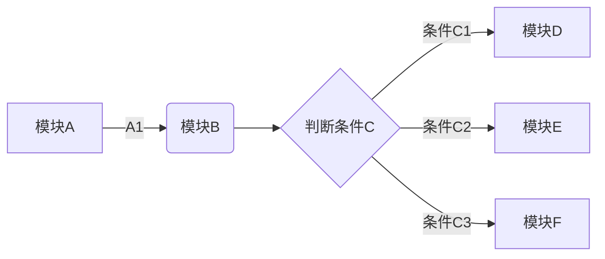

[TOC]


# 1. 文字  \#\#

斜体：*斜体字体*

加粗：**加粗字体**

高亮：==高亮字体==

转义字符：\theta

下划线：<u>Markdown</u>

删除线：~~微信公众号不能使用Markdown~~

字体颜色：<font color=#FF0000> 设置字体颜色为红色 </font>  

字体颜色：夏天是$\color{red}{红色}$的，秋天是$\color{yellow}{黄色}$的.


正常字体

*这是斜体*

<u>下划线咔咔咔咔咔咔扩扩扩扩</u>

~~删除线~~

<!--注释-->
发发发发发^上标^

哒哒哒哒哒哒~下标下标~

==高亮文本==

**加粗字体**

1. 控制文字属性：

正常字体哈哈哈哈哈哈哈哈哈哈或或或

*这是斜体斤斤计较军军军军军军军*

<u>下划线咔咔咔咔咔咔扩扩扩扩</u>

~~删除线少时诵诗书所所所所所所所所~~

<!--注释哒哒哒哒哒哒多多多多多多多多-->

超链接：[百度网址](www.baidu.com)

<font face="黑体">我是黑体字</font>

<font face="Time New Roman">我是新罗马字体</font>

<font face="微软雅黑">我是微软雅黑</font>
<font face="STCAIYUN">我是华文彩云</font>
<font color=red>我是红色</font>
<font color=#008000>我是绿色</font>


==字体标记==

<font color=Blue>我是蓝色</font>

<font size=5>我是尺寸</font>

<font face="黑体" color=green size=5>我是黑体，绿色，尺寸为5</font>


2. <table><tr><td bgcolor=yellow>背景色yellow</td></tr></table>

3. 颜色：

浅红色文字：<font color="#dd0000">浅红色文字：</font> 
深红色文字：<font color="#660000">深红色文字</font> 
浅绿色文字：<font color="#00dd00">浅绿色文字</font> 
深绿色文字：<font color="#006600">深绿色文字</font> 
浅蓝色文字：<font color="#0000dd">浅蓝色文字</font> 
深蓝色文字：<font color="#000066">深蓝色文字</font>
浅黄色文字：<font color="#dddd00">浅黄色文字</font> 
深黄色文字：<font color="#666600">深黄色文字</font> 
浅青色文字：<font color="#00dddd">浅青色文字</font> 
深青色文字：<font color="#006666">深青色文字</font> 
浅紫色文字：<font color="#dd00dd">浅紫色文字</font> 
深紫色文字：<font color="#660066">深紫色文字</font> 

4. 大小：

size为1：<font size="1">size为1</font> 
size为2：<font size="2">size为2</font> 
size为3：<font size="3">size为3</font> 
size为4：<font size="4">size为4</font> 
size为10：<font size="10">size为10</font> 

5. 字体：

+ <font face="黑体">我是黑体字</font>
+ <font face="宋体">我是宋体字</font>
+ <font face="微软雅黑">我是微软雅黑字</font>
+ <font face="fantasy">我是fantasy字</font>
+ <font face="Helvetica">我是Helvetica字</font>

6.背景色

<table><tr><td bgcolor=#FF00FF>背景色的设置是按照十六进制颜色值：#7FFFD4</td></tr></table>
<table><tr><td bgcolor=#FF83FA>背景色的设置是按照十六进制颜色值：#FF83FA</td></tr></table>
<table><tr><td bgcolor=#D1EEEE>背景色的设置是按照十六进制颜色值：#D1EEEE</td></tr></table>
<table><tr><td bgcolor=#C0FF3E>背景色的设置是按照十六进制颜色值：#C0FF3E</td></tr></table>
<table><tr><td bgcolor=#54FF9F>背景色的设置是按照十六进制颜色值：#54FF9F</td></tr></table>

7. 居中、左对齐、右对齐：

+ 居中：

<center>月是故乡明</center>
+ 左对齐：

<p align="left">月是故乡明</p>
+ 右对齐：

<p align="right">月是故乡明</p>

+ 颜色、字体、尺寸、居中

<center><font face="黑体" color=green size=5>我是黑体，绿色，尺寸为5，这一行需要居中</font></center>


水平分割线


+++++++

*****************************

------

水平分割线

## 列表

有序列表:

1. 第一：
2. 第二
3. 第三

无序列表：

- 第一
- 第二

任务列表：

- [ ] 任务列表1
- [ ] 任务列表2
- [ ] 任务列表3

无序列表

+ 第一
+ 第二
+ 第三

无序列表
* 第一
* 第二
* 第三


1. 一级有序列表  

   i. 二级有序列表  

   ii. 二级有序列表

2. 一级有序列表

   - 一级无序列表  
     - 二级无序列表  
     - 二级无序列表

   - 一级有序列表


* [] 复选框未选择

* [x] 复选框已选中


## 注脚

今天讲解了很多关于 Markdown[^11] 的内容，希望对大家有所帮助，同时也给大家强力安利一下 Typora[^12] 这款 Markdown 写作神器，你一定会爱上 Markdown 的.

**脚注会显示在文章的最后面**

[^11]:Markdown是非常好的笔记本
[^12]:Typora是非常好的编辑器


使用 Markdown[^1]可以效率的书写文档, 直接转换成 HTML[^2], 你可以使用 Typora[^T] 编辑器进行书写。
[^1]:Markdown是一种纯文本标记语言
[^2]:HyperText Markup Language 超文本标记语言
[^T]:NEW WAY TO READ & WRITE MARKDOWN.


## 快捷键


### 一、菜单栏

- 文件：alt+F
- 编辑：alt+E
- 段落：alt+P
- 格式：alt+O
- 视图：alt+V
- 主题：alt+T
- 帮助：alt+H

 ###二、文件操作

- 新建：Ctrl+N
- 新建窗口：Ctrl+Shift+N
- 打开：Ctrl+O
- 快速打开：Ctrl+P
- 保存：Ctrl+S
- 另存为：Ctrl+Shift+S
- 偏好：Ctrl+,
- 关闭：Ctrl+W

### 三、编辑

- 撤销：Ctrl+Z
- 重做：Ctrl+Y
- 剪切：Ctrl+X
- 复制：Ctrl+C
- 粘贴：Ctrl+V
- 复制为 MarkDown：Ctrl+Shift+C
- 粘贴为纯文本：Ctrl+Shift+V
- 全选：Ctrl+A
- 选中当前行 / 句：Ctrl+L
- 选中当前格式文本：Ctrl+E
- 选中当前词：Ctrl+D
- 跳转到文首：Ctrl+Home
- 跳转到所选内容：Ctrl+J
- 跳转到文末：Ctrl+End
- 查找：Ctrl+F
- 查找下一个：F3
- 查找上一个：Shift+F3
- 替换：Ctrl+H

### 四、段落

- 标题：Ctrl+1/2/3/4/5
- 段落：Ctrl+0
- 增大标题级别：Ctrl+=
- 减少标题级别：Ctrl±
- 表格：Ctrl+T
- 代码块：Ctrl+Shift+K
- 公式块：Ctrl+Shift+M
- 引用：Ctrl+Shift+Q
- 有序列表：Ctrl+Shift+[
- 无序列表：Ctrl+Shift+]
- 增加缩进：Ctrl+]
- 减少缩进：Ctrl+[

### 五、格式

- 加粗：Ctrl+B

- 斜体：Ctrl+I

- 下划线：Ctrl+U

- 代码：Ctrl+Shift+`

- 删除线：Alt+Shift+5

- 超链接：Ctrl+K

- 图像：Ctrl+Shift+I

- 清除样式：Ctrl+

  

### 六、视图

- 显示隐藏侧边栏：Ctrl+Shift+L
- 大纲视图：Ctrl+Shift+1
- 文档列表视图：Ctrl+Shift+2
- 文件树视图：Ctrl+Shift+3
- 源代码模式：Ctrl+/
- 专注模式：F8
- 打字机模式：F9
- 切换全屏：F11
- 实际大小：Ctrl+Shift+0
- 放大：Ctrl+Shift+=
- 缩小：Ctrl+Shift±
- 应用内窗口切换：Ctrl+Tab
- 打开 DevTools：Shift+F12


 ##   2. 二级标题-引用

我一般用引用来写一些解释性的东西比如名词的含义，或者添加一些附录性的信息.

需要在引用的句子前面加 > 即可

> 这是引用这是引用这是引用这是引用这是引用这是引用这是引用这是引用这是引用这是引用这是引用这是引用这是引用这是引用这是引用这是引用这是引用这是引用这是引用这是引用这是引用这是引用这是引用这是引用这是引用这是引用这是引用这是引用这是引用这是引用这是引用
>
> > 这是引用这是引用这是引用这是引用这是引用
> >
> > > 这是引用这是引用这是引用这是引用
> > >
> > > > 这是引用这是引用这是引用


相关工具推荐：

> Markdown在线编辑工具：**[dillinger](https://dillinger.io/)**、**[Cmd Markdown](https://www.zybuluo.com/mdeditor)**
>Markdown离线编辑工具：**[Typora](http://typora.io/)**、**[印象笔记](https://www.yinxiang.com/?utm_source=yinxiang_app&utm_medium=windows)**、**[MarkdownPad](http://markdownpad.com/)**
>Markdown离线PowerPoint工具：**[Marp](https://yhatt.github.io/marp/)**
>论文排版利器：**[LaTeX](https://en.wikibooks.org/wiki/LaTeX)**
>PowerPoint的LaTex加载项工具：**[IguanaTex](http://www.jonathanleroux.org/software/iguanatex/)**
>公式image转LaTex工具：**[mathpix](https://mathpix.com/)**


如果我们想在文中引用一段话，或者我们自己想将某段话当做引用的文字，可以通过下面的方式来实现：在文字的前面加一个 `>` 符号，同时要和后面的文字隔开；

> 路漫漫其修远兮，吾将上下而求索

> 本篇文章讲解的是Markdown，分为如下几个方面：
>> 1.我和Markdown的故事
>> 2.什么是Markdown
>> 3.Markdown的优势


### 三级标题-流程图、时序图

1. 流程图：




2. 时序图

   ```mermaid
   sequenceDiagram
     opt connect
     Note over PythonClient,CppSever: 三次握手连接确定双方信息
       PythonClient->>CppSever: SYN,1000(0),<mss 1024>
       CppSever-->>PythonClient: SYN,8000(0),ACK 1001,<mss 1024>
       PythonClient->>CppSever: ACK 8001
     end
     loop transfer
     Note over PythonClient,CppSever: Cpp一直向Python单向传输数据
       PythonClient->>CppSever: 1001(20),ACK 8001
       CppSever-->>PythonClient: 8001(258),ACK 1021
       PythonClient->>CppSever: ACK 8259
     end
     opt disconnect
     Note over PythonClient,CppSever: 四次握手断开，每个方向单独断开
       PythonClient->>CppSever: FIN,1021(0),ACK8001
       CppSever-->>PythonClient: ACK 1022
       CppSever-->>PythonClient: FIN,8001(0),ACK 1022
       PythonClient->>CppSever: ACK 8002
     end
   ```

   


#### 四级标题-折叠


之前写过一篇 [`Array 原型方法源码实现大解密`](http://mp.weixin.qq.com/s?__biz=MzA4Nzg0MDM5Nw==&mid=2247484483&idx=1&sn=c9102780d21214588f4359200356446c&chksm=903207a1a7458eb75bb46e0244c1651a6a74946bc75696025a7c3f7da325ef0e875b26b6f7b7&scene=21#wechat_redirect) 的文章，里面就用到了这一能力。点击下面例子的「展开查看规范」后，就会展开更多内容（公众号不支持，移步到 https://muyiy.cn 查看）。

展开查看规范

这是展开后的内容 1

原始写法比较简单，用到了 `<details>` 和  `<summary>` 标签

<details><summary>展开查看规范</summary>这是展开后的内容1</details>


##### 五级标题-换行


最后来介绍下怎么换行，比如最长使用的 Markdown 工具是 Typora，换行后发到 github 发现并没有什么卵用，其实这时候使用 CSS 的 `<br>` 标签就可以了。<br>上面这一行就是换行效果了。


###### 六级标题-锚点链接

> 锚点是网页制作中的一种，又叫命名锚记。命名锚记就像一个迅速定位器一样，它是一种页面内的超级链接。

锚点链接就是点击后会跳转到对应的锚点位置，想到链接跳转就能想到 `<a></a>` 标签

在这里我们有 2 种方式实现这个效果

- Markdown 原始写法 `[名称](#id)`
- HTML 语法 `<a href="#id">名称</a>`

[点击我跳转到目录树](#目录树)

<a href="#目录树">名称</a>


这种直接在文章中使用 `[TOC]` 就可以，会转化成下面这种格式


<div class="table-of-contents"> <ul>  <li><a href="">代码diff</a></li>  <li><a href="">待办事项</a></li>  ... </ul></div>


# 2. 公式


一般的向量模型：$$f(\boldsymbol{x})=\boldsymbol{w}^{\mathrm{T}} \boldsymbol{x}+b$$其中:$\boldsymbol{x}=\left(x_{1} ; x_{2} ; \ldots ; x_{d}\right)$,$\boldsymbol{w}=\left(w_{1} ; w_{2} ; \ldots ; w_{d}\right)$，其中$x_i$是$x$在第$i$个属性上的取值。


插入公式：

1. 这样的代码可以生成如$x^n+y^n=z^n$这样的行内公式。

2. 这样的代码可以生成如$$x^n+y^n=z^n$$这样的块级公式。

3. 这样的代码可以生成如$$x^n+y^n=z^n \tag{1.1}$$的编号块级公式。

4. 这样的代码可以生成如

$$
\begin{equation}

x^n+y^n=z^n

\end{equation}
$$

的自动编号块级公式。

5. 有时候需要罗列多个公式，可以用 eqnarray* 标签包围公式代码，在需要转行的地方使用 \\，每行需要使用 2 个 & 来标识对齐位置，两个 &...& 号之间的是公式间对齐的位置，每行公式后可使用 \tag{...} 标签编号：

$$
\begin{eqnarray*}

x^n+y^n &=& z^n \tag{1.4} \\

x+y &=& z \tag{1.5}

\end{eqnarray*}
$$


不编号：

$\sum_{i=1}^{N} = f(x)+g(x)^2    $

  编号：
$$
\begin{equation}
th^* =   \mathop{\arg\max}_{0<th<1}  \mathrm{AUC}(\mathrm{TPR}(th, {\Delta t}_\mathrm{alarm}),\mathrm{FPR}(th, {\Delta t}_\mathrm{alarm})) \tag{equ4}
\end{equation}
$$

$$
\begin{equation}
n_\mathrm{GW}(10^{20}\mathrm{m}^{-3}) = \frac{I_\mathrm{p}(\mathrm{MA})}{\pi a^{2}(\mathrm{m}^{2})}~,
\end{equation}
$$


#  3. 超链接


超链接有以下几种方式实现，分别阐述：

1. 超链接 Markdown 语法代码,内联方式：\[超链接显示名\]\(超链接地址 "超链接title"\)，渲染如下：
   + 这是一个链接 [Markdown语法](https://markdown.com.cn).
+ [百度网址](www.baidu.com)
  
2. 引用方式：
   + I get 10 times more traffic from [Google][1] than from [Yahoo][2] or [MSN][3]. 

[1] http://google.com/

[2] http://search.yahoo.com/

[3] http://search.msn.com/

3. 给链接增加 Title，链接 title 是当鼠标悬停在链接上时会出现的文字，这个 title 是可选的，它放在圆括号中链接地址后面，跟链接地址之间以空格分隔。这是一个链接 \[Markdown语法\]\(https://markdown.com.cn "最好的markdown教程"\)，渲染如下：

   + 这是一个链接 [Markdown语法](https://markdown.com.cn "最好的markdown教程")。

4. 网址和 Email 地址,使用尖括号可以很方便地把 URL 或者 email 地址变成可点击的链接。

   + <https://markdown.com.cn>

   + <fake@example.com>

5. 带格式化的链接,强调链接，在链接语法前后增加星号。 要将链接表示为代码，请在方括号中添加反引号。

   + I love supporting the **[EFF](https://eff.org)**.
   + This is the *[Markdown Guide](https://www.markdownguide.org)*.
   + See the section on [`code`](#code).

6. 引用类型链接
    引用样式链接是一种特殊的链接，它使 URL 在 Markdown 中更易于显示和阅读。参考样式链接分为两部分：与文本保持内联的部分以及存储在文件中其他位置的部分，以使文本易于阅读。
**==链接的第一部分格式==**

    引用类型的链接的第一部分使用两组括号进行格式设置。第一组方括号包围应显示为链接的文本。第二组括号显示了一个标签，该标签用于指向您存储在文档其他位置的链接。

    尽管不是必需的，可以在第一组和第二组括号之间包含一个空格。第二组括号中的标签不区分大小写，可以包含字母，数字，空格或标点符号。

    以下示例格式对于链接的第一部分效果相同：

    - [hobbit-hole][1]
    - [hobbit-hole] [1]

    **==链接的第二部分格式==** 

    引用类型链接的第二部分使用以下属性设置格式：

- 放在括号中的标签，其后紧跟一个冒号和至少一个空格（例如 `[label]:`）。

- 链接的 URL，可以选择将其括在尖括号中。

- 链接的可选标题，可以将其括在双引号，单引号或括号中。

  以下示例格式对于链接的第二部分效果相同：

  - [1]:https://en.wikipedia.org/wiki/Hobbit#Lifestyle

  - [1]: https://en.wikipedia.org/wiki/Hobbit#Lifestyle "Hobbit lifestyles"

  - [1]: https://en.wikipedia.org/wiki/Hobbit#Lifestyle "Hobbit lifestyles"

  - [1]: https://en.wikipedia.org/wiki/Hobbit#Lifestyle "Hobbit lifestyles"

  - [1]: <https://en.wikipedia.org/wiki/Hobbit#Lifestyle> "Hobbit lifestyles"

  - [1]: <https://en.wikipedia.org/wiki/Hobbit#Lifestyle> "Hobbit lifestyles"

  - [1]: <https://en.wikipedia.org/wiki/Hobbit#Lifestyle> "Hobbit lifestyles"

可以将链接的第二部分放在 Markdown 文档中的任何位置。有些人将它们放在出现的段落之后，有些人则将它们放在文档的末尾（例如尾注或脚注）。


# 4. 表格


表格：

Markdown 制作表格使用 **|** 来分隔不同的单元格，使用 **-** 来分隔表头和其他行。

| 表头   | 表头   |
| ------ | ------ |
| 单元格 | 单元格 |
| 单元格 | 单元格 |


表格背景色：

<table><tbody>
    <tr>
        <th>方法说明</th><th>颜色名称</th><th>颜色</th>
    </tr>
    <tr>
        <td><font color="Hotpink">此处实现方法利用 CSDN-markdown 内嵌 html 语言的优势</font></td><td><font color="Hotpink">Hotpink</font></td><td bgcolor="Hotpink">rgb(240, 248, 255)</td>
    </tr>
    <tr>
        <td><font color="Pink">借助 table, tr, td 等表格标签的 bgcolor 属性实现背景色设置</font></td><td><font color="pink">AntiqueWhite</font></td><td bgcolor="Pink">rgb(255, 192, 203)</td>
    </tr>
</table>


跨行表格：

<table><tbody>
    <tr>
        <th rowspan="3">我占了三行</th>
        <th>第一列</th>
        <th>第二列</th>
        <th>第三列</th>
    </tr>
    <tr>
        <td>第一列</td>
        <td>第二列</td>
        <td>第三列</td>
    </tr>
    <tr>
        <td>第一列</td>
        <td>第二列</td>
        <td>第三列</td>
    </tr>
</table>  


在 Markdown 中也会经常使用表格，比如一个简单的学生成绩表：

|      |               地址                | 语文 | 数学 | 英语 |
| :--: | :-------------------------------: | :--: | :--: | :--: |
| 小明 | 广东省深圳市南山区<br>向阳花园 25 栋 |  99  |  90  |  89  |
| 小红 |  湖南省长沙市岳麓区洋湖湿地公园   |  90  |  94  |  95  |
| 小芳 |        福建省漳州市平和县         |  93  |  91  |  90  |


对齐方式

**我们可以设置表格的对齐方式：**

- **-:** 设置内容和标题栏居右对齐。
- **:-** 设置内容和标题栏居左对齐。
- **:-:** 设置内容和标题栏居中对齐。

实例如下：

| 左对齐 | 右对齐 | 居中对齐 |
| :----- | -----: | :------: |
| 单元格 | 单元格 |  单元格  |
| 单元格 | 单元格 |  单元格  |


# 5. 代码

插入代码：

```python
def add(x,y): *# 定义一个求和函数*
    return x+y
```


```c
#include<stdio.h>
int main()
{
    printf("hello, world");
}
```


```c
#include <stdio.h>
#include <stdlib.h>
#include <float.h>
#include <limits.h>
#include <math.h>
#include <string.h>
#include <sys/socket.h>
#include <stddef.h>
#include <locale.h>
#include <time.h>
#include <complex.h>
#include <netdb.h>
#include <arpa/inet.h>

int main(int argc, char *argv[])
{
    struct hostent *host;

    host = gethostbyname("www.baidu.com");

    // 主机的规范名
    printf("h_name=%s\n", host->h_name);

    //别名
    for (int i = 0; host->h_aliases[i]; i++)
    {
        printf("Aliases %d: %s\n", i + 1, host->h_aliases[i]);
    }

    //IP地址类型
    printf("Address type: %s\n", (host->h_addrtype == AF_INET) ? "AF_INET" : "AF_INET6");
    printf("addrtype=%d\n", host->h_addrtype);

    // IP 地址
    for (int i = 0; host->h_addr_list[i]; i++)
    {
        //将IP指针转换为 in_addr 结构体, 再调用inet_ntoa转换为字符串形式
        printf("Ip addr: %s\n", inet_ntoa(*(struct in_addr *)host->h_addr_list[i]));
    }
}

```


# 6. 图片

插入一张图片，原图：


缩放70%大小。


$$
\sum_{i=0}^{N} = e^3*x^2 
$$


再来一次，缩放30%大小。


插入图片方式比较简单，上面这张图片原始写法如下，只要有 `` 就行了.

但是这时候的图片宽高是不受限制的，如何生成给定宽高的图片，我们先来看下效果。


这时候我们可以使用 `img` 标签，原始写法如下:


// 写法二，自动缩放


原理也很简单，因为 `` 转化成 html 后就会变成 `img` 标签，所以我们直接在 Markdown 中写 `img` 标签并且加上宽高就可以了。

// 原始 markdown 语法


// 转化成 html 后语法


