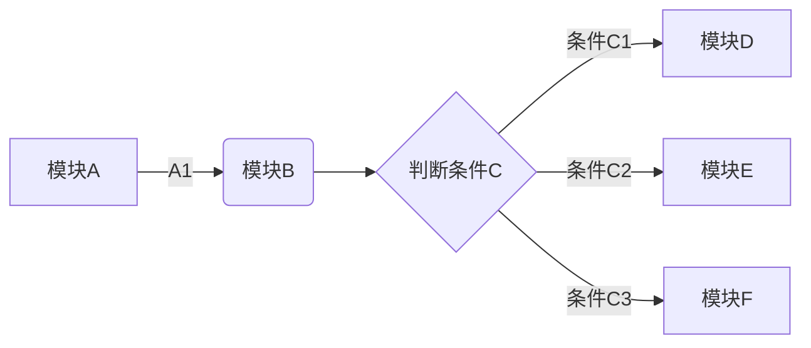

<span id='toc'></span>

[TOC]

# section one


对于该论述，<a id="jump_8"></a>，第一个锚点目标，欢迎读者查阅之前发过的文章，[你是《未来世界的幸存者》么？](https://mp.weixin.qq.com/s/s5IhxV2ooX3JN_X416nidA)

第 2 个锚点目标<span id='bla'></span>

<span id = "anchor"> 第 3 个锚点目标：内容 xxxxx</span>

<div id="acr3"> 第4个锚点目标跳转到这里</div>

<a name="acr4"> 第 5 个锚点目标，跳转到这里</a>

<p id="个人简介1">这是个人简介1</p>

<a name="个人简介2">这是个人简介 2</a>

<h1 id="个人简介3">这是个人简介3</h1>

<a name="个人简介4">这是个人简介 4</a>

# 文字 \#\#

斜体：_斜体字体_

加粗：**加粗字体**

高亮：==高亮字体==

转义字符：\theta

下划线：<u>Markdown</u>

删除线：~~微信公众号不能使用 Markdown~~

字体颜色：<font color=#FF0000> 设置字体颜色为红色 </font>

字体颜色：夏天是$\color{red}{红色}$的，秋天是$\color{yellow}{黄色}$的.

正常字体

_这是斜体_

<u>下划线咔咔咔咔咔咔扩扩扩扩</u>

~~删除线~~

<!--注释-->

发发发发发^上标^

哒哒哒哒哒哒~下标下标~

==高亮文本==

**加粗字体**

1. 控制文字属性：

正常字体哈哈哈哈哈哈哈哈哈哈或或或

_这是斜体斤斤计较军军军军军军军_

<u>下划线咔咔咔咔咔咔扩扩扩扩</u>

~~删除线少时诵诗书所所所所所所所所~~

<!--注释哒哒哒哒哒哒多多多多多多多多-->

超链接：[百度网址](www.baidu.com)

<font face="黑体">我是黑体字</font>

<font face="Time New Roman">我是新罗马字体</font>

<font face="微软雅黑">我是微软雅黑</font>
<font face="STCAIYUN">我是华文彩云</font>
<font color=red>我是红色</font>
<font color=#008000>我是绿色</font>

==字体标记==

<font color=Blue>我是蓝色</font>

<font size=5>我是尺寸</font>

<font face="黑体" color=green size=5>我是黑体，绿色，尺寸为 5</font>

2. <table><tr><td bgcolor=yellow>背景色yellow</td></tr></table>

3. 颜色：

浅红色文字：<font color="#dd0000">浅红色文字：</font>
深红色文字：<font color="#660000">深红色文字</font>
浅绿色文字：<font color="#00dd00">浅绿色文字</font>
深绿色文字：<font color="#006600">深绿色文字</font>
浅蓝色文字：<font color="#0000dd">浅蓝色文字</font>
深蓝色文字：<font color="#000066">深蓝色文字</font>
浅黄色文字：<font color="#dddd00">浅黄色文字</font>
深黄色文字：<font color="#666600">深黄色文字</font>
浅青色文字：<font color="#00dddd">浅青色文字</font>
深青色文字：<font color="#006666">深青色文字</font>
浅紫色文字：<font color="#dd00dd">浅紫色文字</font>
深紫色文字：<font color="#660066">深紫色文字</font>

4. 大小：

size 为 1：<font size="1">size 为 1</font>
size 为 2：<font size="2">size 为 2</font>
size 为 3：<font size="3">size 为 3</font>
size 为 4：<font size="4">size 为 4</font>
size 为 10：<font size="10">size 为 10</font>

5. 字体：

-   <font face="黑体">我是黑体字</font>
-   <font face="宋体">我是宋体字</font>
-   <font face="微软雅黑">我是微软雅黑字</font>
-   <font face="fantasy">我是 fantasy 字</font>
-   <font face="Helvetica">我是 Helvetica 字</font>

    6.背景色

<table><tr><td bgcolor=#FF00FF>背景色的设置是按照十六进制颜色值：#7FFFD4</td></tr></table>
<table><tr><td bgcolor=#FF83FA>背景色的设置是按照十六进制颜色值：#FF83FA</td></tr></table>
<table><tr><td bgcolor=#D1EEEE>背景色的设置是按照十六进制颜色值：#D1EEEE</td></tr></table>
<table><tr><td bgcolor=#C0FF3E>背景色的设置是按照十六进制颜色值：#C0FF3E</td></tr></table>
<table><tr><td bgcolor=#54FF9F>背景色的设置是按照十六进制颜色值：#54FF9F</td></tr></table>

7. 居中、左对齐、右对齐：

-   居中：

<center>月是故乡明</center>
+ 左对齐：

<p align="left">月是故乡明</p>
+ 右对齐：

<p align="right">月是故乡明</p>

-   颜色、字体、尺寸、居中

<center><font face="黑体" color=green size=5>我是黑体，绿色，尺寸为5，这一行需要居中</font></center>

水平分割线

+++++++

---

---

水平分割线

## 列表

有序列表:

1. 第一：
2. 第二
3. 第三

无序列表：

-   第一
-   第二

任务列表：

-   [ ] 任务列表 1
-   [ ] 任务列表 2
-   [ ] 任务列表 3

无序列表

-   第一
-   第二
-   第三

无序列表

-   第一
-   第二
-   第三

1. 一级有序列表

    i. 二级有序列表

    ii. 二级有序列表

2. 一级有序列表

    - 一级无序列表

        - 二级无序列表
        - 二级无序列表

    - 一级有序列表

-   [ ] 复选框未选择

-   [x] 复选框已选中

*   [ ] 复选框已选中
*   [x] 复选框已选中

## 注脚

今天讲解了很多关于 Markdown[^11] 的内容，Markdown[^11] 很好，Markdown[^11] 很棒，希望对大家有所帮助，同时也给大家强力安利一下 Typora[^12] 这款 Markdown 写作神器，Typora[^12] 非常好用，你一定会爱上 Markdown 的.

**脚注会显示在文章的最后面**

[^11]: Markdown 是非常好的笔记本
[^12]: Typora 是非常好的编辑器

使用 Markdown[^1]可以效率的书写文档, 直接转换成 HTML[^2], 你可以使用 Typora[^t] 编辑器进行书写。

[^1]: Markdown 是一种纯文本标记语言
[^2]: HyperText Markup Language 超文本标记语言
[^t]: NEW WAY TO READ & WRITE MARKDOWN.

,

## 快捷键

### 一、菜单栏

-   文件：alt+F
-   编辑：alt+E
-   段落：alt+P
-   格式：alt+O
-   视图：alt+V
-   主题：alt+T
-   帮助：alt+H

###二、文件操作

-   新建：Ctrl+N
-   新建窗口：Ctrl+Shift+N
-   打开：Ctrl+O
-   快速打开：Ctrl+P
-   保存：Ctrl+S
-   另存为：Ctrl+Shift+S
-   偏好：Ctrl+,
-   关闭：Ctrl+W

### 三、编辑

-   撤销：Ctrl+Z
-   重做：Ctrl+Y
-   剪切：Ctrl+X
-   复制：Ctrl+C
-   粘贴：Ctrl+V
-   复制为 MarkDown：Ctrl+Shift+C
-   粘贴为纯文本：Ctrl+Shift+V
-   全选：Ctrl+A
-   选中当前行 / 句：Ctrl+L
-   选中当前格式文本：Ctrl+E
-   选中当前词：Ctrl+D
-   跳转到文首：Ctrl+Home
-   跳转到所选内容：Ctrl+J
-   跳转到文末：Ctrl+End
-   查找：Ctrl+F
-   查找下一个：F3
-   查找上一个：Shift+F3
-   替换：Ctrl+H

### 四、段落

-   标题：Ctrl+1/2/3/4/5
-   段落：Ctrl+0
-   增大标题级别：Ctrl+=
-   减少标题级别：Ctrl±
-   表格：Ctrl+T
-   代码块：Ctrl+Shift+K
-   公式块：Ctrl+Shift+M
-   引用：Ctrl+Shift+Q
-   有序列表：Ctrl+Shift+[
-   无序列表：Ctrl+Shift+]
-   增加缩进：Ctrl+]
-   减少缩进：Ctrl+[

### 五、格式

-   加粗：Ctrl+B

-   斜体：Ctrl+I

-   下划线：Ctrl+U

-   代码：Ctrl+Shift+`

-   删除线：Alt+Shift+5

-   超链接：Ctrl+K

-   图像：Ctrl+Shift+I

-   清除样式：Ctrl+

### 六、视图

-   显示隐藏侧边栏：Ctrl+Shift+L
-   大纲视图：Ctrl+Shift+1
-   文档列表视图：Ctrl+Shift+2
-   文件树视图：Ctrl+Shift+3
-   源代码模式：Ctrl+/
-   专注模式：F8
-   打字机模式：F9
-   切换全屏：F11
-   实际大小：Ctrl+Shift+0
-   放大：Ctrl+Shift+=
-   缩小：Ctrl+Shift±
-   应用内窗口切换：Ctrl+Tab
-   打开 DevTools：Shift+F12

## 二级标题

我一般用引用来写一些解释性的东西比如名词的含义，或者添加一些附录性的信息.

需要在引用的句子前面加 > 即可

> 这是引用这是引用这是引用这是引用这是引用这是引用这是引用这是引用这是引用这是引用这是引用这是引用这是引用这是引用这是引用这是引用这是引用这是引用这是引用这是引用这是引用这是引用这是引用这是引用这是引用这是引用这是引用这是引用这是引用这是引用这是引用
>
> > 这是引用这是引用这是引用这是引用这是引用
> >
> > > 这是引用这是引用这是引用这是引用
> > >
> > > > 这是引用这是引用这是引用

相关工具推荐：

> Markdown 在线编辑工具：**[dillinger](https://dillinger.io/)**、**[Cmd Markdown](https://www.zybuluo.com/mdeditor)**
> Markdown 离线编辑工具：**[Typora](http://typora.io/)**、**[印象笔记](https://www.yinxiang.com/?utm_source=yinxiang_app&utm_medium=windows)**、**[MarkdownPad](http://markdownpad.com/)**
> Markdown 离线 PowerPoint 工具：**[Marp](https://yhatt.github.io/marp/)**
> 论文排版利器：**[LaTeX](https://en.wikibooks.org/wiki/LaTeX)**
> PowerPoint 的 LaTex 加载项工具：**[IguanaTex](http://www.jonathanleroux.org/software/iguanatex/)**
> 公式 image 转 LaTex 工具：**[mathpix](https://mathpix.com/)**

如果我们想在文中引用一段话，或者我们自己想将某段话当做引用的文字，可以通过下面的方式来实现：在文字的前面加一个 `>` 符号，同时要和后面的文字隔开；

> 路漫漫其修远兮，吾将上下而求索

> 本篇文章讲解的是 Markdown，分为如下几个方面：
>
> 1.我和 Markdown 的故事
>
> 2.什么是 Markdown
>
> 3.Markdown 的优势

### 三级标题-流程图、时序图

1. 流程图：



2. 时序图

    ```mermaid
    sequenceDiagram
      opt connect
      Note over PythonClient,CppSever: 三次握手连接确定双方信息
        PythonClient->>CppSever: SYN,1000(0),<mss 1024>
        CppSever-->>PythonClient: SYN,8000(0),ACK 1001,<mss 1024>
        PythonClient->>CppSever: ACK 8001
      end
      loop transfer
      Note over PythonClient,CppSever: Cpp一直向Python单向传输数据
        PythonClient->>CppSever: 1001(20),ACK 8001
        CppSever-->>PythonClient: 8001(258),ACK 1021
        PythonClient->>CppSever: ACK 8259
      end
      opt disconnect
      Note over PythonClient,CppSever: 四次握手断开，每个方向单独断开
        PythonClient->>CppSever: FIN,1021(0),ACK8001
        CppSever-->>PythonClient: ACK 1022
        CppSever-->>PythonClient: FIN,8001(0),ACK 1022
        PythonClient->>CppSever: ACK 8002
      end
    ```

#### 四级标题-折叠

之前写过一篇 [`Array 原型方法源码实现大解密`](http://mp.weixin.qq.com/s?__biz=MzA4Nzg0MDM5Nw==&mid=2247484483&idx=1&sn=c9102780d21214588f4359200356446c&chksm=903207a1a7458eb75bb46e0244c1651a6a74946bc75696025a7c3f7da325ef0e875b26b6f7b7&scene=21#wechat_redirect) 的文章，里面就用到了这一能力。点击下面例子的「展开查看规范」后，就会展开更多内容（公众号不支持，移步到 https://muyiy.cn 查看）。

展开查看规范

这是展开后的内容 1

原始写法比较简单，用到了 `<details>` 和 `<summary>` 标签

<details><summary>展开查看规范</summary> 这是展开后的内容1：哈哈哈收到哦机打票奖金金额</details>

##### 五级标题-换行

最后来介绍下怎么换行，比如最长使用的 Markdown 工具是 Typora，换行后发到 github 发现并没有什么卵用，其实这时候使用 CSS 的 `<br>` 标签就可以了。<br>上面这一行就是换行效果了。

# 公式

一般的向量模型：$$f(\boldsymbol{x})=\boldsymbol{w}^{\mathrm{T}} \boldsymbol{x}+b$$其中:$\boldsymbol{x}=\left(x_{1} ; x_{2} ; \ldots ; x_{d}\right)$,$\boldsymbol{w}=\left(w_{1} ; w_{2} ; \ldots ; w_{d}\right)$，其中$x_i$是$x$在第$i$个属性上的取值。

插入公式：

1. 这样的代码可以生成如$x^n+y^n=z^n$这样的行内公式。

2. 这样的代码可以生成如$$x^n+y^n=z^n$$这样的块级公式。

3. 这样的代码可以生成如$$x^n+y^n=z^n \tag{1.1}$$的编号块级公式。

4. 这样的代码可以生成如

$$
\begin{equation}

x^n+y^n=z^n

\end{equation}
$$

的自动编号块级公式。


<a name="个人简介">这是个人简介</a>

## 如何插入公式

### 行内公式

行内公式：  $ J_\alpha(x) = \sum_{m=0}^\infty \frac{(-1)^m}{m! \Gamma (m + \alpha + 1)} {\left({ \frac{x}{2} }\right)}^{2m + \alpha} \text {，行内公式示例} $


行内公式使用方法，比如这个化学公式：$\ce{Hg^2+ ->[I-] HgI2 ->[I-] [Hg^{II}I4]^2-}$

不编号：$\sum\_{i=1}^{N} = f(x)+g(x)^2 $


### 块公式

块公式使用方法如下：

$$
H(D_2) = -\left(\frac{2}{4}\log_2 \frac{2}{4} + \frac{2}{4}\log_2 \frac{2}{4}\right) = 1
$$


###  公式字体大小

$$
\Large E=mc^2
$$


$$
\Huge E=mc^2
$$


<font face="黑体" color=green size=12> $E=mc^2$ </font>


<font size=12> $E=mc^2$ </font>


| 码            | 字体           | 效果                      |
| ------------- | -------------- | ------------------------- |
| `\rm`         | 罗马体         | E=mc2                     |
| `\it`         | 意大利体(默认) | *E*=*m**c**2*             |
| `\bf`         | 粗体           | **E**=**m****c****2**     |
| `\boldsymbol` | 黑体           | **E****=****m****c****2** |
| `\Bbb`        | 黑板粗体       | (−∞,+∞)=R                 |


### 独立公式


$$
J_\alpha(x) = \sum_{m=0}^\infty \frac{(-1)^m}{m! \Gamma (m + \alpha + 1)} {\left({ \frac{x}{2} }\right)}^{2m + \alpha} \text {，独立公式示例}
$$


在公式 \eqref{eq:Sample} 中，我们看到了这个被自动编号的公式。

$$
\begin{equation}
E=mc^2 \text{，自动编号公式示例}
\label{eq:Sample}
\end{equation}
$$

### 多行并列公式

可以用 eqnarray\* 标签包围公式代码，在需要转行的地方使用 \\，每行需要使用 2 个 & 来标识对齐位置，两个 &...& 号之间的是公式间对齐的位置，每行公式后可使用 \tag{...} 标签编号：
$$
\begin{eqnarray*}

x^n+y^n &=& z^n \tag{1.4} \\

x+y &=& z \tag{1.5}

\end{eqnarray*}
$$

多行并列公式可以同样采用**align**环境， 但是不同的Markown编辑器定义的句法会稍有区别。

- 以**Typora**为例, 结合**tag**进行对并列的公式分别编号， 我们使用

$$
\begin{align}

  x &= v_0\cos\theta t \tag{1} \\

y &= v_0\sin\theta t - \frac{1}{2}gt^2 \tag{2}
\end{align}
$$


- 使用**aligned**环境，无编号：

$$
\begin{aligned}
x &= v_0\cos\theta t \\
y &= v_0\sin\theta t - \frac{1}{2}gt^2 
\end{aligned}
$$

编号：

$$
\begin{equation}
th^* =   \arg\mathop{\max}_{0<th<1}  \mathrm{AUC}(\mathrm{TPR}(th, {\Delta t}_\mathrm{alarm}),\mathrm{FPR}(th, {\Delta t}_\mathrm{alarm})) \tag{equ4}
\end{equation}
$$

$$
\begin{equation}
n_\mathrm{GW}(10^{20}\mathrm{m}^{-3}) = \frac{I_\mathrm{p}(\mathrm{MA})}{\pi a^{2}(\mathrm{m}^{2})}~,
\end{equation}
$$

$$
\sum_{i=0}^{N} = e^3*x^2
$$


`array` 环境用于简单的多行公式，比普通环境多了一个对齐选项

用法：`\begin{array}{l}\end{array}`，`l` 为对齐方式（`l`eft, `r`ight, `c`enter）

+ 示例：

$$
\begin{equation}
\dot{\boldsymbol{x}}=f(\boldsymbol{x})
=\left\{
	\begin{array}{ll}
		f_{1}(\boldsymbol{x}) & \boldsymbol{x} \in S_{1} \\
		f_{2}(\boldsymbol{x}) & \boldsymbol{x} \in S_{2}
	\end{array}\right.
\end{equation}
$$

Remark:

+ `\left\{ `和 `\right`. 用于自适应括号大小，只需要单边括号时，另一侧括号用 . 代替大括号在 LaTeX中用作参数括号，需要加转义字符`\`  使用array 环境中需要几列就设置几列的对齐方式，使用`&`  分列，\\ 分行`\boldsymbol{} `用于粗体数学符号array 也用于矩阵输入，但矩阵现多使用 matrix 环境。


## 如何输入上下标

`^` 表示上标, `_` 表示下标。如果上下标的内容多于一个字符，需要用 `{}` 将这些内容括成一个整体。上下标可以嵌套，也可以同时使用。

- 例子：

$$
x^{y^z}=(1+{\rm e}^x)^{-2xy^w}
$$

另外，如果要在左右两边都有上下标，可以用 `\sideset` 命令。

- 例子：
  $$
  \sideset{^1_2}{^3_4}\bigotimes
  $$

 ## 如何输入括号和分隔符

`()`、`[]` 和 `|` 表示符号本身，使用 `\{\}` 来表示 `{}` 。当要显示大号的括号或分隔符时，要用 `\left` 和 `\right` 命令。

一些特殊的括号：

|  输入   |   显示    |  输入   |   显示    |
| :-----: | :-------: | :-----: | :-------: |
| \langle | $\langle$ | \rangle | $\rangle$ |
| \lceil  | $\lceil$  | \rceil  | $\rceil$  |
| \lfloor | $\lfloor$ | \rfloor | $\rfloor$ |
| \lbrace | $\lbrace$ | \rbrace | $\rbrace$ |


| 运算符                                                       | markdown                                                     |
| ------------------------------------------------------------ | ------------------------------------------------------------ |
| 大括号: {a+x}                                                | $\lbrace a+x \rbrace$                                        |
| 尖括号: ⟨*x*⟩⟨x⟩                                             | $\langle x \rangle$                                          |
| 上取整: ⌈*x*2⌉⌈x2⌉                                           | $\lceil \frac{x}{2} \rceil$                                  |
| 下取整: ⌊*x*⌋⌊x⌋                                             | $\lfloor x \rfloor$                                          |
| 原始括号:$\lbrace \sum_{i=0}^{n}i^{2}=\frac{2a}{x^2+1} \rbrace$ | $\lbrace \sum_{i=0}^{n}i^{2}=\frac{2a}{x^2+1} \rbrace$       |
| 全包括号:$\left\lbrace \sum_{i=0}^{n}i^{2}=\frac{2a}{x^2+1} \right\rbrace$ | $\left\lbrace \sum_{i=0}^{n}i^{2}=\frac{2a}{x^2+1} \right\rbrace$ |


- 例子：

$$
f(x,y,z) = 3y^2z \left( 3+\frac{7x+5}{1+y^2} \right)
$$

有时候要用 `\left.` 或 `\right.` 进行匹配而不显示本身。

- 例子：

  
  $$
  \left. \frac{{\rm d}u}{{\rm d}x} \right.| _{x=0}
  $$


## 如何输入分数

  通常使用 `\frac {分子} {分母}` 命令产生一个分数，分数可嵌套。
 		便捷情况可直接输入 `\frac ab` 来快速生成一个  。
 		如果分式很复杂，亦可使用 `分子 \over 分母` 命令，此时分数仅有一层。

- 例子：

$$
\frac{a-1}{b-1} \quad and \quad {a+1\over b+1}
$$

## 如何输入开方

使用 `\sqrt [根指数，省略时为2] {被开方数}` 命令输入开方。

- 例子：

$$
\sqrt{2} \quad and \quad \sqrt[n]{3}
$$

## 如何输入省略号

数学公式中常见的省略号有两种，`\ldots` 表示与文本底线对齐的省略号，`\cdots` 表示与文本中线对齐的省略号。

- 例子：

$$
f(x_1,x_2,\underbrace{\ldots}_{\rm ldots} ,x_n) = x_1^2 + x_2^2 + \underbrace{\cdots}_{\rm cdots} + x_n^2
$$


## 如何输入矢量

使用 `\vec{矢量}` 来自动产生一个矢量。也可以使用 `\overrightarrow` 等命令自定义字母上方的符号。

- 例子：

$$
\vec{a} \cdot \vec{b}=0
$$


- 例子：

$$
\overleftarrow{xy} \quad and \quad \overleftrightarrow{xy} \quad and \quad \overrightarrow{xy}
$$


## 如何输入积分<span id='infcal'></span>

微积分运算符在此[点击此处跳转](#infcalsym)

使用 `\int_积分下限^积分上限 {被积表达式}` 来输入一个积分。

例子：
$$
\int_0^1 {x^2} \,{\rm d}x
$$

$$
\lim\limits_{r \to {0^{+}}}{\frac{1}{r^{3}}\iiint_{\Omega_{r}}f(x,y,z)dxdydz =\frac{4}{3}\pi f(P)}
$$


$$
\begin{equation}
\lim\limits_{r \to {0^{+}}}{\frac{1}{r^{3}}\iiint_{\Omega_{r}}f(x,y,z)dxdydz =\frac{4}{3}\pi f(P)}
\end{equation}
$$

## 如何输入极限运算

使用 `\lim_{变量 \to 表达式} 表达式` 来输入一个极限。如有需求，可以更改 `\to` 符号至任意符号。

例子：
$$
\lim_{n \to +\infty} \frac{1}{n(n+1)} \quad and \quad \lim_{x\leftarrow{示例}} \frac{1}{n(n+1)}
$$

$$
\left.\frac{\partial f(x,y)}{\partial x}\right|_{x=0}
$$


| 标志         | 符号                       | 显示                         |
| ------------ | -------------------------- | ---------------------------- |
| 省略号(下边) | x_1, x_2, \ldots, x_n      | $x_1, x_2, \ldots, x_n$      |
| 省略号(中间) | x_1, x_2, \cdots, x_n      | $x_1, x_2, \cdots, x_n$      |
| 矢量         | \vec{a}                    | $\vec{a}$                    |
| 积分         | \int_0^1x{\rm d}x          | $\int_0^1x{\rm d}x$          |
| 极限         | \lim_{n\rightarrow0}n      | $\lim_{n\rightarrow0}n$      |
| 累加         | \sum_1^n\frac{1}{x}        | $\sum_1^n\frac{1}{x}$        |
| 累乘         | \prod_{i=0}^n\frac{1}{x^2} | $\prod_{i=0}^n\frac{1}{x^2}$ |


$$
J_\alpha(x) = \sum_{m=0}^\infty \frac{(-1)^m}{m! \Gamma (m + \alpha + 1)} {\left({ \frac{x}{2} }\right)}^{2m + \alpha}
$$


## 如何输入累加、累乘运算

使用 `\sum_{下标表达式}^{上标表达式} {累加表达式}` 来输入一个累加。
 与之类似，使用 `\prod` `\bigcup` `\bigcap` 来分别输入累乘、并集和交集。
 此类符号在行内显示时上下标表达式将会移至右上角和右下角。

- 例子：

$$
\sum_{i=1}^n \frac{1}{i^2} \quad and \quad \prod_{i=1}^n \frac{1}{i^2} \quad and \quad \bigcup_{i=1}^{2} R    \not<
$$


## 如何输入希腊字母

输入 `\小写希腊字母英文全称` 和 `\首字母大写希腊字母英文全称` 来分别输入小写和大写希腊字母。
**对于大写希腊字母与现有字母相同的，直接输入大写字母即可。**

|   输入   | 显示       |  输入   | 显示      |   输入   | 显示       |   输入   | 显示       |
| :------: | ---------- | :-----: | --------- | :------: | ---------- | :------: | ---------- |
|  \alpha  | $\alpha$   |    A    | $A$       |  \beta   | $\beta$    |  \Beta   | $B$        |
|  \gamma  | $\gamma$   | \Gamma  | $\Gamma$  |  \delta  | $\delta$   |  \Delta  | $\Delta$   |
| \epsilon | $\epsilon$ |    E    | $E$       |  \zeta   | $\zeta$    |    Z     | $Z$        |
|   \eta   | $\eta$     |    H    | $H$       |  \theta  | $\theta$   |  \Theta  | $\Theta$   |
|  \iota   | $\iota$    |    I    | $I$       |  \kappa  | $\kappa$   |    K     | $K$        |
| \lambda  | $\lambda$  | \Lambda | $\Lambda$ |   \mu    | $\mu$      |    M     | $M$        |
|   \nu    | $\nu$      |    N    | $N$       |   \xi    | $\xi$      |   \Xi    | $\Xi$      |
|    o     | $o$        |    O    | $O$       |   \pi    | $\pi$      |   \Pi    | $\Pi$      |
|   \rho   | $\rho$     |    P    | $P$       |  \sigma  | $\sigma $  |  \Sigma  | $\Sigma$   |
|   \tau   | $\tau$     |    T    | $T$       | \upsilon | $\upsilon$ | \Upsilon | $\Upsilon$ |
|   \phi   | $\phi$     |  \Phi   | $\Phi$    |   \chi   | $\chi$     |    X     | $X$        |
|   \psi   | $\psi$     |  \Psi   | $\Psi$    |  \omega  | $\omega$   |  \Omega  | $\Omega$   |

**部分字母有变量专用形式，以 `\var-` 开头。**

| 小写形式 | 显示       | 大写形式 | 显示     |  变量形式   | 显示          |
| :------: | ---------- | :------: | -------- | :---------: | ------------- |
| \epsilon | $\epsilon$ |    E     | $E$      | \varepsilon | $\varepsilon$ |
|  \theta  | $\theta$   |  \Theta  | $\Theta$ |  \vartheta  | $\vartheta$   |
|   \rho   | $\rho$     |    P     | $P$      |   \varrho   | $\varrho$     |
|  \sigma  | $\sigma$   |  \Sigma  | $\Sigma$ |  \varsigma  | $\varsigma$   |
|   \phi   | $\phi$     |   \Phi   | $\Phi$   |   \varphi   | $\varphi$     |

字体Blackboard Bold:
`\mathbb{A}`呈现出的效果为：$\mathbb{A}$


## 关系运算符


|   输入    |    显示     |    输入    |     显示     |   输入    |    显示     |    输入    |     显示     |
| :-------: | :---------: | :--------: | :----------: | :-------: | :---------: | :--------: | :----------: |
| \sim | $\sim$ |            |              |           |             |            |              |
|    \pm    |    $\pm$    |   \times   |   $\times$   |   \div    |   $\div$    |    \mid    |    $\mid$    |
|   \nmid   |   $\nmid$   |   \cdot    |   $\cdot$    |   \circ   |   $\circ$   |    \ast    |    $\ast$    |
| \bigodot  | $\bigodot$  | \bigotimes | $\bigotimes$ | \bigoplus | $\bigoplus$ |    \leq    |    $\leq$    |
|   \geq    |   $\geq$    |    \neq    |    $\neq$    |  \approx  |  $\approx$  |   \equiv   |   $\equiv$   |
|   \sum    |   $\sum$    |   \prod    |   $\prod$    |  \coprod  |  $\coprod$  | \backslash | $\backslash$ |
|   \leq    |   $\leq$    |   \equiv   |   $\equiv$   |   \prec   |   $\prec$   |    \sim    |    $\sim$    |
|   \geq    |   $\geq$    |  \models   |  $\models$   |   \succ   |   $\succ$   |   \perp    |   $\perp$    |
|  \preceq  | $\preceq$    |\succeq|$ \succeq $|\simeq|$  \simeq $|\mid|$  \mid $|
|  \preceq  |  $\preceq$  |    \ll     |    $\ll$     |    \gg    |    $\gg$    |   \asymp   |   $\asymp$   |
| \parallel | $\parallel$ |  \approx   |  $\approx$   |   \cong   |   $\cong$   |    \neq    |    $\neq$    |
|  \doteq   |  $\doteq$   |  \propto   |  $\propto$   |  \bowtie  |  $\bowtie$  |   \Join    |   $\Join$    |
|  \smile   |  $\smile$   |   \frown   |   $\frown$   |  \vdash   |  $\vdash$   |   \dashv   |   $\dashv$   |


## 二元运算符

| 输入      | 显示        | 输入           | 显示             | 输入             | 显示               | 输入       | 显示         |
| --------- | ----------- | -------------- | ---------------- | ---------------- | ------------------ | ---------- | ------------ |
| \pm       | $\pm$       | \circ          | $\circ$          | \bigtriangledown | $\bigtriangledown$ | \bigcirc   | $\bigcirc$   |
| \mp       | $\mp$       | \bullet        | $\bullet$        | \triangleleft    | $\triangleleft$    | \odot      | $\odot$      |
| \times    | $\times$    | \cdot          | $\cdot$          | \triangleright   | $\triangleright$   | \bigodot   | $\bigodot$   |
| \div      | $\div$      | \wr            | $\wr$            | \lhd             | $\lhd$             | \oslash    | $\oslash$    |
| \ast      | $\ast$      | \diamond       | $\diamond$       | \rhd             | $\rhd$             | \ominus    | $\ominus$    |
| \star     | $\star$     | \Diamond       | $\Diamond$       | \unlhd           | $\unlhd$           | \otimes    | $\otimes$    |
| \mid      | $\mid$      | \triangle      | $\triangle$      | \unrhd           | $\unrhd$           | \bigotimes | $\bigotimes$ |
| \nmid     | $\nmid$     | \bigtriangleup | $\bigtriangleup$ | \circ            | $\circ$            | \oplus     | $\oplus$     |
| \bigoplus | $\bigoplus$ | \amalg         | $\amalg$         |                  | $$                 |            | $$           |
| \dagger   | $\dagger$   |                | $$               |                  | $$                 |            | $$           |
| \ddagger  | $\ddagger$  |                | $$               |                  | $$                 |            | $$           |


## 集合运算符

### 

|    输入     | 显示          |   输入    | 显示        |    输入     | 显示          |
| :---------: | ------------- | :-------: | ----------- | :---------: | ------------- |
|   \uplus    | $\uplus$      | \sqsupset | $\sqsupset$ | \sqsubseteq | $\sqsubseteq$ |
|  \sqsubset  | $\sqsubset$   |  \sqcap   | $\sqcap$    | \sqsupseteq | $\sqsupseteq$ |
|  \emptyset  | $\emptyset$   |    \in    | $\in$       |   \notin    | $\notin$      |
|   \subset   | $\subset$     |  \supset  | $\supset$   |  \subseteq  | $\subseteq$   |
|  \supseteq  | $\supseteq$   |  \bigcap  | $\bigcap$   |   \bigcup   | $\bigcup$     |
|   \bigvee   | $\bigvee$     | \bigwedge | $\bigwedge$ |  \biguplus  | $\biguplus$   |
|    \vee     | $\vee$        |  \wedge   | $\wedge$    |  \setminus  | $\setminus$   |
| \not\subset | $\not\subset$ |   \cap    | $\cap$      |    \cup     | $\cup$        |
|             | $$            |           | $$          |             | $$            |||


## 对数运算符


| 输入 |  显示  | 输入 | 显示  | 输入 | 显示  |
| :--: | :----: | :--: | :---: | :--: | :---: |
| \log | $\log$ | \lg  | $\lg$ | \ln  | $\ln$ |


## 三角运算符


|   输入   |    显示    | 输入 |  显示  |   输入   |    显示    |
| :------: | :--------: | :--: | :----: | :------: | :--------: |
| 30^\circ | $30^\circ$ | \bot | $\bot$ | \angle A | $\angle A$ |
|   \sin   |   $\sin$   | \cos | $\cos$ |   \tan   |   $\tan$   |
|   \csc   |   $\csc$   | \sec | $\sec$ |   \cot   |   $\cot$   |


## 微积分运算符<span id='infcalsym'></span>


|  输入   | 显示      |  输入   | 显示      |  输入  | 显示     |
| :-----: | --------- | :-----: | --------- | :----: | -------- |
|  \int   | $\int$    |  \iint  | $\iint$   | \iiint | $\iiint$ |
| \iiiint | $\iiiint$ |  \oint  | $\oint$   | \prime | $\prime$ |
| \oiint  | $\oiint$  | \oiiint | $\oiiint$ | \infty | $\infty$ |
|  \lim   | $\lim$    | \infty  | $\infty$  | \nabla | $\nabla$ |

微积分运算在此  [点击此处跳转](#infcal)


## 逻辑运算符


|   输入   | 显示       |    输入    | 显示         |    输入     | 显示   |
| :------: | ---------- | :--------: | ------------ | :---------: | ------ |
| \because | $\because$ | \therefore | $\therefore$ |    \vee     | $\vee$ |
|  \wedge  | $\wedge$   |            |              |             |        |
| \forall  | $\forall$  |  \exists   | $\exists$    | \not\subset | $$     |
|  \not<   | $\not<$    |   \not>    | $\not>$      |    \not=    | $$     |


## 戴帽符号


|    输入    | 显示         |      输入       | 显示              |
| :--------: | ------------ | :-------------: | ----------------- |
|  \hat{xy}  | $\hat{xy}$   |  \widehat{xyz}  | $\widehat{xyz}$   |
| \tilde{xy} | $\tilde{xy}$ | \widetilde{xyz} | $\widetilde{xyz}$ |
| \check{x}  | $\check{x}$  |    \breve{y}    | $\breve{y}$       |
| \grave{x}  | $$           |    \acute{y}    | $$       |\acute{y}|$\acute{y}$|


## 连线符号


|                      输入                      | 显示                                             |
| :--------------------------------------------: | ------------------------------------------------ |
|                 \fbox{a+b+c+d}                 | $ \fbox{a+b+c+d} $                               |
|            \overleftarrow{a+b+c+d}             | $\overleftarrow{a+b+c+d}$                        |
|            \overrightarrow{a+b+c+d}            | $\overrightarrow{a+b+c+d}$                       |
|          \overleftrightarrow{a+b+c+d}          | $\overleftrightarrow{a+b+c+d}$                   |
|            \underleftarrow{a+b+c+d}            | $\underleftarrow{a+b+c+d}$                       |
|           \underrightarrow{a+b+c+d}            | $\underrightarrow{a+b+c+d}$                      |
|         \underleftrightarrow{a+b+c+d}          | $\underleftrightarrow{a+b+c+d}$                  |
|               \overline{a+b+c+d}               | $\overline{a+b+c+d}$                             |
|              \underline{a+b+c+d}               | $\underline{a+b+c+d}$                            |
|          \overbrace{a+b+c+d}^{Sample}          | $\overbrace{a+b+c+d}^{Sample}$                   |
|         \underbrace{a+b+c+d}_{Sample}          | $\underbrace{a+b+c+d}_{Sample}$                  |
|  \overbrace{a+\underbrace{b+c}_{1.0}+d}^{2.0}  | $\overbrace{a+\underbrace{b+c}_{1.0}+d}^{2.0}$   |
| \underbrace{a\cdot a\cdots a}_{b\text{ times}} | $\underbrace{a\cdot a\cdots a}_{b\text{ times}}$ |


## 上下标符号


| 输入                                               | 显示                                                 |
| -------------------------------------------------- | ---------------------------------------------------- |
| \bar{a}                                            | $\bar{a}$                                            |
| \acute{a}                                          | $\acute{a}$                                          |
| \breve{a}                                          | $\breve{a}$                                          |
| \grave{a}                                          | $\grave{a}$                                          |
| \dot{a}                                            | $\dot{a}$                                            |
| \ddot{a}                                           | $\ddot{a}$                                           |
| \hat{a}                                            | $\hat{a}$                                            |
| \check{a}                                          | $\check{a}$                                          |
| \breve{a}                                          | $\breve{a}$                                          |
| \tilde{a}                                          | $\tilde{a}$                                          |
| \vec{a}                                            | $\vec{a}$                                            |
| \overline{a + b + c + d}                           | $\overline{a + b + c + d}$                           |
| \underline{a + b + c + d}                          | $\underline{a + b + c + d}$                          |
| \overbrace{a + b + c + d}                          | $\overbrace{a + b + c + d}$                          |
| \underline{a + b + c + d}                          | $\underline{a + b + c + d}$                          |
| \overbrace{a + \underbrace{b + c}_{1.0} + d}^{2.0} | $\overbrace{a + \underbrace{b + c}_{1.0} + d}^{2.0}$ |
|                                                    |                                                      |
|                                                    |                                                      |


## 箭头符号

推荐使用符号：
|输入|显示|输入|显示|输入|显示|
|:--:|:--:|:--:|:--:|:--:|:--:|
|\to|$\to$|\mapsto|$\mapsto$||$$|
|\implies|$\implies$|\iff|$\iff$|\impliedby|$\impliedby$|


其它可用符号：
|输入|显示|输入|显示|
|:--:|:--:|:--:|:--:|
|\uparrow|$\uparrow$|\Uparrow|$\Uparrow$|
|\downarrow|$\downarrow$|\Downarrow|$\Downarrow$|
|\leftarrow|$\leftarrow$|\Leftarrow|$\Leftarrow$|
|\rightarrow|$\rightarrow$|\Rightarrow|$\Rightarrow$|
|\leftrightarrow|$\leftrightarrow$|\Leftrightarrow|$\Leftrightarrow$|
|\longleftarrow|$\longleftarrow$|\Longleftarrow|$\Longleftarrow$|
|\longrightarrow|$\longrightarrow$|\Longrightarrow|$\Longrightarrow$|
|\longleftrightarrow|$\longleftrightarrow$|\Longleftrightarrow|$\Longleftrightarrow$|


## 其他符号

 

| 输入         | 显示           |
| ------------ | -------------- |
| \aleph       | $\aleph$       |
| \hbar        | $\hbar$        |
| \imath       | $\imath$       |
| \jmath       | $\jmath$       |
| \ell         | $\ell$         |
| \wp          | $\wp$          |
| \Re          | $\Re$          |
| \Im          | $\Im$          |
| \mho         | $\mho$         |
| \nabla       | $\nabla$       |
| \surd        | $\surd$        |
| \top         | $\top$         |
| \bot         | $\bot$         |
| \neg         | $\neg$         |
| \flat        | $\flat$        |
| \natural     | $\natural$     |
| \sharp       | $\sharp$       |
| \backslash   | $\backslash$   |
| \partial     | $\partial$     |
| \Box         | $\Box$         |
| \clubsuit    | $\clubsuit$    |
| \diamondsuit | $\diamondsuit$ |
| \heartsuit   | $\heartsuit$   |
| \spadesuit   | $\spadesuit$   |
|              | $$             |


## 如何进行字体转换

若要对公式的某一部分字符进行字体转换，可以用 `{\字体 {需转换的部分字符}}` 命令，其中 `\字体` 部分可以参照下表选择合适的字体。一般情况下，公式默认为意大利体  。

示例中 **全部大写** 的字体仅大写可用。

|输入|说明|显示|输入|说明|显示|
|:--:|:--:|:--:|:--:|:--:|----|
|\rm|罗马体|${\rm example}$|\cal|花体|${\cal example}$|
|\it|意大利体|${\it example}$|\Bbb|黑板粗体|${\Bbb example}$|
|\bf|粗体|${\bf example 例子}$|\mit|数学斜体|${\mit example}$|
|\sf|等线体|${\sf example S}$|\scr|手写体|${\scr example}$|
|\tt|打字机体|${\tt example例子 SSSS}  \tt{SSXXX}$||花体|$\cal{M,H,A,S, X}$|
|\frak|旧德式字体|${\frak example}$|\mathbb{A}|字体Blackboard Bold|$\mathbb{A}$|

转换字体十分常用，例如在积分中：

- 例子：

$$
\begin{array}{cc}
\mathrm{Bad} & \mathrm{Better} \\
\hline \\
\int_0^1 x^2 dx & \int_0^1 x^2 \,{\rm d}x
\end{array}
$$


注意比较两个式子间$dx$  和 ${\rm d} x$ 的不同。
使用 `\operatorname` 命令也可以达到相同的效果，


## 大括号和行标的使用

使用 `\left` 和 `\right` 来创建自动匹配高度的 (圆括号)，[方括号] 和 {花括号} 。
在每个公式末尾前使用 `\tag{行标}` 来实现行标。

- 例子：

$$
f\left(
   \left[ 
     \frac{
       1+\left\{x,y\right\}
     }{
       \left(
          \frac{x}{y}+\frac{y}{x}
       \right)
       \left(u+1\right)
     }+a
   \right]^{3/2}
\right)
\tag{行标}
$$

如果你需要在不同的行显示对应括号，可以在每一行对应处使用 `\left.` 或 `\right.` 来放一个"影子"括号：

- 例子：

$$
\begin{aligned}
a=&\left(1+2+3+  \cdots \right. \\
& \cdots+ \left. \infty-2+\infty-1+\infty\right)
\end{aligned}
$$

如果你需要将行内显示的分隔符也变大，可以使用 `\middle` 命令：

- 例子：

$$
\left\langle  
  q
\middle\|
  \frac{\frac{x}{y}}{\frac{u}{v}}
\middle| 
   p 
\right\rangle
$$


## 添加注释文字 \text

在 `\text {文字}` 中仍可以使用 `$公式$` 插入其它公式。

- 例子：

$$
f(n)= \begin{cases} n/2, & \text {if $n$ is even} \\ 3n+1, & \text{if $n$ is odd} \end{cases}
$$


## 在字符间加入空格

有四种宽度的空格可以使用： `\,`、`\;`、`\quad` 和 `\qquad` 。

- 例子：

$$
a \, b \mid a \; b \mid a \quad b \mid a \qquad b
$$

当然，使用 `\text {n个空格}` 也可以达到同样效果。

## 更改文字颜色

使用 `\color{颜色}{文字}` 来更改特定的文字颜色。
 更改文字颜色 **需要浏览器支持** ，如果浏览器不知道你所需的颜色，那么文字将被渲染为黑色。

对于较旧的浏览器（HTML4与CSS2），以下颜色是被支持的：

|  输入  | 显示                   |  输入   | 显示                    |
| :----: | ---------------------- | :-----: | ----------------------- |
| black  | $\color{black}{文字}$  |  grey   | $\color{grey}{文字}$    |
| silver | $\color{silver}{文字}$ |  white  | $\color{white}{文字}$   |
| maroon | $\color{maroon}{文字}$ |   red   | $\color{red}{文字}$     |
| yellow | $\color{yellow}{文字}$ |  lime   | $\color{lime}{文字}$    |
| olive  | $\color{olive}{文字}$  |  green  | $\color{green}{文字}$   |
|  teal  | $\color{teal}{文字}$   |  auqa   | $\color{auqa}{文字}$    |
|  blue  | $\color{blue}{文字}$   |  navy   | $\color{navy}{文字}$    |
| purple | $\color{purple}{文字}$ | fuchsia | $\color{fuchsia}{文字}$ |

对于较新的浏览器（HTML5与CSS3），额外的124种颜色将被支持：

输入 `\color {#rgb} {text}` 来自定义更多的颜色，其中 `#rgb` 的 `r` `g` `b` 可输入 `0-9` 和 `a-f` 来表示红色、绿色和蓝色的纯度（饱和度）。

- 例子：

$$
\begin{array}{|rrrrrrrr|}\hline
\verb+#000+ & \color{#000}{text} & & &
\verb+#00F+ & \color{#00F}{text} & & \\
& & \verb+#0F0+ & \color{#0F0}{text} &
& & \verb+#0FF+ & \color{#0FF}{text}\\
\verb+#F00+ & \color{#F00}{text} & & &
\verb+#F0F+ & \color{#F0F}{text} & & \\
& & \verb+#FF0+ & \color{#FF0}{text} &
& & \verb+#FFF+ & \color{#FFF}{text}\\
\hline
\end{array}
$$


+ 显示：

$$
\begin{array}{|rrrrrrrr|}
\hline
\verb+#000+ & \color{#000}{text} & \verb+#005+ & \color{#005}{text} & \verb+#00A+ & \color{#00A}{text} & \verb+#00F+ & \color{#00F}{text} \
\verb+#500+ & \color{#500}{text} & \verb+#505+ & \color{#505}{text} & \verb+#50A+ & \color{#50A}{text} & \verb+#50F+ & \color{#50F}{text} \
\verb+#A00+ & \color{#A00}{text} & \verb+#A05+ & \color{#A05}{text} & \verb+#A0A+ & \color{#A0A}{text} & \verb+#A0F+ & \color{#A0F}{text} \
\verb+#F00+ & \color{#F00}{text} & \verb+#F05+ & \color{#F05}{text} & \verb+#F0A+ & \color{#F0A}{text} & \verb+#F0F+ & \color{#F0F}{text} \
\hline
\verb+#080+ & \color{#080}{text} & \verb+#085+ & \color{#085}{text} & \verb+#08A+ & \color{#08A}{text} & \verb+#08F+ & \color{#08F}{text} \
\verb+#580+ & \color{#580}{text} & \verb+#585+ & \color{#585}{text} & \verb+#58A+ & \color{#58A}{text} & \verb+#58F+ & \color{#58F}{text} \
\verb+#A80+ & \color{#A80}{text} & \verb+#A85+ & \color{#A85}{text} & \verb+#A8A+ & \color{#A8A}{text} & \verb+#A8F+ & \color{#A8F}{text} \
\verb+#F80+ & \color{#F80}{text} & \verb+#F85+ & \color{#F85}{text} & \verb+#F8A+ & \color{#F8A}{text} & \verb+#F8F+ & \color{#F8F}{text} \
\hline
\verb+#0F0+ & \color{#0F0}{text} & \verb+#0F5+ & \color{#0F5}{text} & \verb+#0FA+ & \color{#0FA}{text} & \verb+#0FF+ & \color{#0FF}{text} \
\verb+#5F0+ & \color{#5F0}{text} & \verb+#5F5+ & \color{#5F5}{text} & \verb+#5FA+ & \color{#5FA}{text} & \verb+#5FF+ & \color{#5FF}{text} \
\verb+#AF0+ & \color{#AF0}{text} & \verb+#AF5+ & \color{#AF5}{text} & \verb+#AFA+ & \color{#AFA}{text} & \verb+#AFF+ & \color{#AFF}{text} \
\verb+#FF0+ & \color{#FF0}{text} & \verb+#FF5+ & \color{#FF5}{text} & \verb+#FFA+ & \color{#FFA}{text} & \verb+#FFF+ & \color{#FFF}{text} \
\hline
\end{array
$$


## 添加删除线

使用删除线功能必须声明 `$$` 符号。

在公式内使用 `\require{cancel}` 来允许 **片段删除线** 的显示。
 声明片段删除线后，使用 `\cancel{字符}`、`\bcancel{字符}`、`\xcancel{字符}` 和 `\cancelto{字符}` 来实现各种片段删除线效果。

- 例子：

$$
\require{cancel}\begin{array}{rl}
\verb|y+\cancel{x}| & y+\cancel{x}\\
\verb|\cancel{y+x}| & \cancel{y+x}\\
\verb|y+\bcancel{x}| & y+\bcancel{x}\\
\verb|y+\xcancel{x}| & y+\xcancel{x}\\
\verb|y+\cancelto{0}{x}| & y+\cancelto{0}{x}\\
\verb+\frac{1\cancel9}{\cancel95} = \frac15+& \frac{1\cancel9}{\cancel95} = \frac15 \\
\end{array}
$$


使用 `\require{enclose}` 来允许 **整段删除线** 的显示。
 声明整段删除线后，使用 `\enclose{删除线效果}{字符}` 来实现各种整段删除线效果。
 其中，删除线效果有 `horizontalstrike`、`verticalstrike`、`updiagonalstrike` 和 `downdiagonalstrike`，可叠加使用。

- 例子：

$$
\require{enclose}\begin{array}{rl}
\verb|\enclose{horizontalstrike}{x+y}| & \enclose{horizontalstrike}{x+y}\\
\verb|\enclose{verticalstrike}{\frac xy}| & \enclose{verticalstrike}{\frac xy}\\
\verb|\enclose{updiagonalstrike}{x+y}| & \enclose{updiagonalstrike}{x+y}\\
\verb|\enclose{downdiagonalstrike}{x+y}| & \enclose{downdiagonalstrike}{x+y}\\
\verb|\enclose{horizontalstrike,updiagonalstrike}{x+y}| & \enclose{horizontalstrike,updiagonalstrike}{x+y}\\
\end{array}
$$


## 矩阵：

$$
\begin{pmatrix}
  1 & a_1 & a_1^2 & \cdots & a_1^n \\
  1 & a_2 & a_2^2 & \cdots & a_2^n \\
  \vdots & \vdots & \vdots & \ddots & \vdots \\
  1 & a_m & a_m^2 & \cdots & a_m^n \\
\end{pmatrix}
$$

### 如何输入无框矩阵

在开头使用 `begin{matrix}`，在结尾使用 `end{matrix}`，在中间插入矩阵元素，每个元素之间插入 `&` ，并在每行结尾处使用 `\\` 。
使用矩阵时必须声明 `$` 或 `$$` 符号。

- 例子：


```ruby
$$
        \begin{matrix}
        1 & x & x^2 \\
        1 & y & y^2 \\
        1 & z & z^2 \\
        \end{matrix}
$$
```

+ 显示：

$$
        \begin{matrix}
        1 & x & x^2 \\
        1 & y & y^2 \\
        1 & z & z^2 \\
        \end{matrix}
$$

### 如何输入边框矩阵

在开头将 `matrix` 替换为 `pmatrix` `bmatrix` `Bmatrix` `vmatrix` `Vmatrix` 。

- 例子：

|                      matrix                       |                       pmatrix                       |                       bmatrix                       |                       Bmatrix                       |                       vmatrix                       |                       Vmatrix                       |
| :-----------------------------------------------: | :-------------------------------------------------: | :-------------------------------------------------: | :-------------------------------------------------: | :-------------------------------------------------: | :-------------------------------------------------: |
| $ \begin{matrix} 1 & 2 \\ 3 & 4 \\ \end{matrix} $ | $ \begin{pmatrix} 1 & 2 \\ 3 & 4 \\ \end{pmatrix} $ | $ \begin{bmatrix} 1 & 2 \\ 3 & 4 \\ \end{bmatrix} $ | $ \begin{Bmatrix} 1 & 2 \\ 3 & 4 \\ \end{Bmatrix} $ | $ \begin{vmatrix} 1 & 2 \\ 3 & 4 \\ \end{vmatrix} $ | $ \begin{Vmatrix} 1 & 2 \\ 3 & 4 \\ \end{Vmatrix} $ |

### 如何输入带省略符号的矩阵

使用 `\cdots`：$\cdots$  `\ddots`:$\ddots$  `\vdots` ： $\vdots$ 来输入省略符号。

- 例子：

$$
\begin{pmatrix}
        1 & a_1 & a_1^2 & \cdots & a_1^n \\
        1 & a_2 & a_2^2 & \cdots & a_2^n \\
        \vdots & \vdots & \vdots & \ddots & \vdots \\
        1 & a_m & a_m^2 & \cdots & a_m^n \\
\end{pmatrix}
$$


### 如何输入带分割符号的矩阵

- 例子：

$$
\left[
    \begin{array}{cc|c}
      1 & 2 &  3\\
      4 & 5 & 6
    \end{array}
\right]
$$

其中 `cc|c` 代表在一个三列矩阵中的第二和第三列之间插入分割线。

### 如何输入行中矩阵

若想在一行内显示矩阵，
使用`\bigl(\begin{smallmatrix} ... \end{smallmatrix}\bigr)`。

- 例子：

这是一个行中矩阵的示例 $\bigl( \begin{smallmatrix} a & b \\ c & d \end{smallmatrix} \bigr)$ 。


## 方程式序列使用参考

### 如何输入一个方程式序列

人们经常想要一列整齐且居中的方程式序列。使用 `\begin{align}…\end{align}` 来创造一列方程式，其中在每行结尾处使用 `\\` 。
 使用方程式序列无需声明公式符号 `$` 或 `$$` 。

请注意 `{align}` 语句是 **自动编号** 的。

- 例子：

$$
\begin{align}
\sqrt{37} & = \sqrt{\frac{73^2-1}{12^2}} \\
 & = \sqrt{\frac{73^2}{12^2}\cdot\frac{73^2-1}{73^2}} \\ 
 & = \sqrt{\frac{73^2}{12^2}}\sqrt{\frac{73^2-1}{73^2}} \\
 & = \frac{73}{12}\sqrt{1 - \frac{1}{73^2}} \\ 
 & \approx \frac{73}{12}\left(1 - \frac{1}{2\cdot73^2}\right)
\end{align}
$$

### 在一个方程式序列的每一行中注明原因

在 `{align}` 中灵活组合 `\text` 和 `\tag` 语句。`\tag` 语句编号优先级高于自动编号。

- 例子：

$$
\begin{align}
   v + w & = 0  &\text{Given} \tag 1\\
   -w & = -w + 0 & \text{additive identity} \tag 2\\
   -w + 0 & = -w + (v + w) & \text{equations $(1)$ and $(2)$}
\end{align}
$$


本例中第一、第二行的自动编号被 `\tag` 语句覆盖，第三行的编号为自动编号。


## 条件表达式使用参考

### 如何输入一个条件表达式

使用 `begin{cases}` 来创造一组条件表达式，在每一行条件中插入 `&` 来指定需要对齐的内容，并在每一行结尾处使用 `\\`，以 `end{cases}` 结束。
 条件表达式无需声明 `$` 或 `$$` 符号。

- 例子：

$$
f(n) =
        \begin{cases}
        n/2,  & \text{if $n$ is even} \\
        3n+1, & \text{if $n$ is odd}
        \end{cases}
$$

### 如何输入一个左侧对齐的条件表达式

若想让文字在 **左侧对齐显示** ，则有如下方式：

- 例子：

$$
\left.
        \begin{array}{l}
        \text{if $n$ is even:}&n/2\\
        \text{if $n$ is odd:}&3n+1
        \end{array}
        \right\}
        =f(n)
$$

### 如何使条件表达式适配行高

在一些情况下，条件表达式中某些行的行高为非标准高度，此时使用 `\\[2ex]` 语句代替该行末尾的 `\\` 来让编辑器适配。

- 例子：
  |不适配[2ex]|
  |:--:|

$$
f(n) = 
\begin{cases}
\frac{n}{2},  & \text{if $n$ is even} \\
3n+1, & \text{if $n$ is odd}
\end{cases}
$$

- |**适配[2ex]**|
  |:--:|

$$
f(n) = 
\begin{cases}
\frac{n}{2},  & \text{if $n$ is even} \\[2ex]
3n+1, & \text{if $n$ is odd}
\end{cases}
$$


**一个 `[ex]` 指一个 "X-Height"，即x字母高度。可以根据情况指定多个 `[ex]`，如 `[3ex]`、`[4ex]` 等。**
其实可以在任何地方使用 `\\[2ex]` 语句，只要你觉得合适。

## 数组与表格使用参考

### 如何输入一个数组或表格

通常，一个格式化后的表格比单纯的文字或排版后的文字更具有可读性。数组和表格均以 `begin{array}` 开头，并在其后定义列数及每一列的文本对齐属性，`c` `l` `r` 分别代表居中、左对齐及右对齐。若需要插入垂直分割线，在定义式中插入 `|` ，若要插入水平分割线，在下一行输入前插入 `\hline` 。与矩阵相似，每行元素间均须要插入 `&` ，每行元素以 `\\` 结尾，最后以 `end{array}` 结束数组。

使用单个数组或表格时无需声明 `$` 或 `$$` 符号。

- 例子：

$$
\begin{array}{c|lcr}
n & \text{左对齐} & \text{居中对齐} & \text{右对齐} \\
\hline
1 & 0.24 & 1 & 125 \\
2 & -1 & 189 & -8 \\
3 & -20 & 2000 & 1+10i
\end{array}
$$


### 如何输入一个嵌套的数组或表格

多个数组/表格可 **互相嵌套** 并组成一组数组/一组表格。
使用嵌套前必须声明 `$$` 符号。

- 例子：

$$
% outer vertical array of arrays 外层垂直表格
\begin{array}{c}
    % inner horizontal array of arrays 内层水平表格
    \begin{array}{cc}
        % inner array of minimum values 内层"最小值"数组
        \begin{array}{c|cccc}
        \text{min} & 0 & 1 & 2 & 3\\
        \hline
        0 & 0 & 0 & 0 & 0\\
        1 & 0 & 1 & 1 & 1\\
        2 & 0 & 1 & 2 & 2\\
        3 & 0 & 1 & 2 & 3
    \end{array}
    &
        % inner array of maximum values 内层"最大值"数组
    \begin{array}{c|cccc}
        \text{max}&0&1&2&3\\
        \hline
        0 & 0 & 1 & 2 & 3\\
        1 & 1 & 1 & 2 & 3\\
        2 & 2 & 2 & 2 & 3\\
        3 & 3 & 3 & 3 & 3
        \end{array}
 \end{array}
    % 内层第一行表格组结束
    \\
    % inner array of delta values 内层第二行Delta值数组
 \begin{array}{c|cccc}
        \Delta&0&1&2&3\\
        \hline
        0 & 0 & 1 & 2 & 3\\
        1 & 1 & 0 & 1 & 2\\
        2 & 2 & 1 & 0 & 1\\
        3 & 3 & 2 & 1 & 0
        \end{array}
        % 内层第二行表格组结束
\end{array}
$$


### 如何输入一个方程组

使用 `\begin{array}…\end{array}` 和 `\left\{…\right.` 来创建一个方程组。

- 例子：

$$
\left\{ 
\begin{array}{c}
a_1x+b_1y+c_1z=d_1 \\ 
a_2x+b_2y+c_2z=d_2 \\ 
a_3x+b_3y+c_3z=d_3
\end{array}
\right.
$$

或者使用条件表达式组 `\begin{cases}…\end{cases}` 来实现相同效果：

- 例子：

$$
\begin{cases}
a_1x+b_1y+c_1z=d_1 \\ 
a_2x+b_2y+c_2z=d_2 \\ 
a_3x+b_3y+c_3z=d_3
\end{cases}
$$

## 连分数使用参考

### 如何输入一个连分式

就像输入分式时使用 `\frac` 一样，使用 `\cfrac` 来创建一个连分数。

- 例子：

$$
x = a_0 + \cfrac{1^2}{a_1
          + \cfrac{2^2}{a_2
          + \cfrac{3^2}{a_3 + \cfrac{4^4}{a_4 + \cdots}}}}
$$

不要使用普通的 `\frac` 或 `\over` 来创建，否则会看起来 **很恶心** 。

- 反例：

$$
x = a_0 + \frac{1^2}{a_1
          + \frac{2^2}{a_2
          + \frac{3^2}{a_3 + \frac{4^4}{a_4 + \cdots}}}}
$$

当然，你可以使用 `\frac` 来表达连分数的 **紧缩记法** 。

- 例子：

$$
x = a_0 + \frac{1^2}{a_1+}
          \frac{2^2}{a_2+}
          \frac{3^2}{a_3 +} \frac{4^4}{a_4 +} \cdots
$$

连分数通常都太大以至于不易排版，所以建议在连分数前后声明 `$$` 符号，或使用像 `[a0;a1,a2,a3,…]` 一样的紧缩记法。


## 交换图表使用参考

###  如何输入一个交换图表

使用一行 `$ \require{AMScd} $` 语句来允许交换图表的显示。
 声明交换图表后，语法与矩阵相似，在开头使用 `begin{CD}`，在结尾使用 `end{CD}`，在中间插入图表元素，每个元素之间插入 `&` ，并在每行结尾处使用 `\\` 。

- 例子：

$$
$\require{AMScd}$
\begin{CD}
    A @>a>> B\\
    @V b VV \# @AA c A\\
    C @>>d> D
\end{CD}
$$

其中，`@>>>` 代表右箭头、`@<<<` 代表左箭头、`@VVV` 代表下箭头、`@AAA` 代表上箭头、`@=` 代表水平双实线、`@|` 代表竖直双实线、`@.`代表没有箭头。
 在 `@>>>` 的 `>>>` 之间任意插入文字即代表该箭头的注释文字。

- 例子：

$$
\begin{CD}
    A @>>> B @>{\text{very long label}}>> C \\
    @. @AAA @| \\
    D @= E @<<< F
\end{CD}
$$


在本例中， "very long label"自动延长了它所在箭头以及对应箭头的长度。

## 一些特殊的注意事项

在以e为底的指数函数、极限和积分中尽量不要使用 `\frac` 符号：它会使整段函数看起来很怪，而且可能产生歧义。也正是因此它在专业数学排版中几乎从不出现。
 横着写这些分式，中间使用斜线间隔 `/` （用斜线代替分数线）。

- 例子:

$$
\begin{array}{cc}
\mathrm{Bad} & \mathrm{Better} \\
\hline \\
e^{i\frac{\pi}2} \quad e^{\frac{i\pi}2} & e^{i\pi/2} \\
\int_{-\frac\pi2}^\frac\pi2 \sin x\,dx  & \int_{-\pi/2}^{\pi/2}\sin x\,dx \\
\end{array}
$$


- 例子:

$$
\begin{array}{cc}
\mathrm{Bad} & \mathrm{Better} \\
\hline \\
\{x|x^2\in\Bbb Z\} & \{x\mid x^2\in\Bbb Z\} \\
\end{array}
$$

使用多重积分符号时，不要多次使用 `\int` 来声明，直接使用 `\iint` 来表示 **二重积分** ，使用 `\iiint` 来表示 **三重积分** 等。对于无限次积分，可以用 `\int \cdots \int` 表示。

+ 例子:

$$
\begin{array}{cc}
\mathrm{Bad} & \mathrm{Better} \\
\hline \\
\int\int_S f(x)\,dy\,dx & \iint_S f(x)\,dy\,dx \\
\int\int\int_V f(x)\,dz\,dy\,dx & \iiint_V f(x)\,dz\,dy\,dx
\end{array}
$$

在微分符号前加入 `\,` 来插入一个小的间隔空隙；没有 `\,` 符号的话，$TEX$将会把不同的微分符号堆在一起。

- 例子：

$$
\begin{array}{cc}
\mathrm{Bad} & \mathrm{Better} \\
\hline \\
\iiint_V f(x){\rm d}z {\rm d}y {\rm d}x & \iiint_V f(x)\,{\rm d}z\,{\rm d}y\,{\rm d}x
\end{array}
$$


# 超链接<a id="hyperlink"></a>

超链接有以下几种方式实现，分别阐述：

1. 超链接 Markdown 语法代码,内联方式：\[超链接显示名\]\(超链接地址 "超链接 title"\)：

    ```text
    这是一个链接 [Markdown语法](https://markdown.com.cn)。
    ```

    渲染如下：

    - 这是一个链接 [Markdown 语法](https://markdown.com.cn).
    - [百度网址](www.baidu.com)

2. 网址和 Email 地址：

    使用尖括号可以很方便地把 URL 或者 email 地址变成可点击的链接。

    ```text
    <https://markdown.com.cn>
    <fake@example.com>
    ```

    渲染效果如下：

    <https://markdown.com.cn>
    <fake@example.com>

3. 给链接增加 Title，链接 title 是当鼠标悬停在链接上时会出现的文字，这个 title 是可选的，它放在圆括号中链接地址后面，跟链接地址之间以空格分隔。

4. 链接 title 是当鼠标悬停在链接上时会出现的文字，这个 title 是可选的，它放在圆括号中链接地址后面，跟链接地址之间以空格分隔。

    ```text
    这是一个链接 [Markdown语法](https://markdown.com.cn "最好的markdown教程")。
    ```

    渲染效果如下：

    这是一个链接 [Markdown 语法](https://markdown.com.cn "最好的markdown教程")。

    这是一个链接 [Markdown 语法](https://markdown.com.cn "最好的markdown教程")。

5. 网址和 Email 地址

    使用尖括号可以很方便地把 URL 或者 email 地址变成可点击的链接。

    - <https://markdown.com.cn>

    - <fake@example.com>

6. 带格式化的链接

    强调链接，在链接语法前后增加星号。 要将链接表示为代码，请在方括号中添加反引号。

    - I love supporting the **[EFF](https://eff.org)**.
    - This is the _[Markdown Guide](https://www.markdownguide.org)_.
    - See the section on [`code`](#code).

7. 引用类型链接
   引用样式链接是一种特殊的链接，它使 URL 在 Markdown 中更易于显示和阅读。参考样式链接分为两部分：与文本保持内联的部分以及存储在文件中其他位置的部分，以使文本易于阅读。
   **==链接的第一部分格式==**

    引用类型的链接的第一部分使用两组括号进行格式设置。第一组方括号包围应显示为链接的文本。第二组括号显示了一个标签，该标签用于指向您存储在文档其他位置的链接。

    尽管不是必需的，可以在第一组和第二组括号之间包含一个空格。第二组括号中的标签不区分大小写，可以包含字母，数字，空格或标点符号。

    以下示例格式对于链接的第一部分效果相同：

    - [hobbit-hole][1]
    - [hobbit-hole] [1]

    **==链接的第二部分格式==**

    引用类型链接的第二部分使用以下属性设置格式：

-   放在括号中的标签，其后紧跟一个冒号和至少一个空格（例如 `[label]:`）。

-   链接的 URL，可以选择将其括在尖括号中。

-   链接的可选标题，可以将其括在双引号，单引号或括号中。

    以下示例格式对于链接的第二部分效果相同：

    -   [1]: https://en.wikipedia.org/wiki/Hobbit#Lifestyle

    -   [1]: https://en.wikipedia.org/wiki/Hobbit#Lifestyle "Hobbit lifestyles"

    -   [1]: https://en.wikipedia.org/wiki/Hobbit#Lifestyle "Hobbit lifestyles"

    -   [1]: https://en.wikipedia.org/wiki/Hobbit#Lifestyle "Hobbit lifestyles"

    -   [1]: https://en.wikipedia.org/wiki/Hobbit#Lifestyle "Hobbit lifestyles"

    -   [1]: https://en.wikipedia.org/wiki/Hobbit#Lifestyle "Hobbit lifestyles"

    -   [1]: https://en.wikipedia.org/wiki/Hobbit#Lifestyle "Hobbit lifestyles"

可以将链接的第二部分放在 Markdown 文档中的任何位置。有些人将它们放在出现的段落之后，有些人则将它们放在文档的末尾（例如尾注或脚注）。

8. 行内式链接

    [我的博客](https://www.jianshu.com/u/7ecaba2d594c "郭斌勇的主页")

    <a href="https://www.jianshu.com/u/7ecaba2d594c" title="郭斌勇的主页">我的博客</a>

    <a href="https://www.jianshu.com/u/7ecaba2d594c" title="郭斌勇的主页">我的博</a>

    <a href="https://www.jianshu.com/u/7ecaba2d594c" title="郭斌勇的主页">博客</a>

9.

10.

# 表格<span id='table'></span>

表格：

Markdown 制作表格使用 **|** 来分隔不同的单元格，使用 **-** 来分隔表头和其他行。

| 表头   | 表头   |
| ------ | ------ |
| 单元格 | 单元格 |
| 单元格 | 单元格 |

表格背景色：

<table><tbody>
    <tr>
        <th>方法说明</th><th>颜色名称</th><th>颜色</th>
    </tr>
    <tr>
        <td><font color="Hotpink">此处实现方法利用 CSDN-markdown 内嵌 html 语言的优势</font></td><td><font color="Hotpink">Hotpink</font></td><td bgcolor="Hotpink">rgb(240, 248, 255)</td>
    </tr>
    <tr>
        <td><font color="Pink">借助 table, tr, td 等表格标签的 bgcolor 属性实现背景色设置</font></td><td><font color="pink">AntiqueWhite</font></td><td bgcolor="Pink">rgb(255, 192, 203)</td>
    </tr>
</table>

跨行表格：

<table><tbody>
    <tr>
        <th rowspan="3">我占了三行</th>
        <th>第一列</th>
        <th>第二列</th>
        <th>第三列</th>
    </tr>
    <tr>
        <td>第一列</td>
        <td>第二列</td>
        <td>第三列</td>
    </tr>
    <tr>
        <td>第一列</td>
        <td>第二列</td>
        <td>第三列</td>
    </tr>
</table>

在 Markdown 中也会经常使用表格，比如一个简单的学生成绩表：

|      |                 地址                 | 语文 | 数学 | 英语 |
| :--: | :----------------------------------: | :--: | :--: | :--: |
| 小明 | 广东省深圳市南山区<br>向阳花园 25 栋 |  99  |  90  |  89  |
| 小红 |    湖南省长沙市岳麓区洋湖湿地公园    |  90  |  94  |  95  |
| 小芳 |          福建省漳州市平和县          |  93  |  91  |  90  |

<table><tbody>
    <tr>
        <th>表头1</th>
        <th>表头2</th>
        <th colspan="2">colspan="2"</th>
    </tr>
    <tr>
        <td rowspan="2">rowspan="2"</td>
        <td>21</td>
        <td bgcolor="Pink">bgcolor="Pink"</td>
        <td colspan="2">41</td>
    </tr>
    <tr>
        <td>22</td>
        <td>32</td>
        <td >42</td>
    </tr>
</table>

对齐方式

**我们可以设置表格的对齐方式：**

-   **-:** 设置内容和标题栏居右对齐。
-   **:-** 设置内容和标题栏居左对齐。
-   **:-:** 设置内容和标题栏居中对齐。

实例如下：

| 左对齐 | 右对齐 | 居中对齐 |
| :----- | -----: | :------: |
| 单元格 | 单元格 |  单元格  |
| 单元格 | 单元格 |  单元格  |


# 代码<a name="code"></a>

插入代码：

```python
def add(x,y): *# 定义一个求和函数*
    return x+y
```

```c
#include<stdio.h>
int main()
{
    printf("hello, world");
}
```


# 图片

## 插入本地图片

插入一张<span id="jump">图片</span>，锚点目标，原图：


缩放 50%大小。


再来一次，缩放 30%大小。


填加图注，方法一，

<center>
    
    <br>
    <div style="color:orange; border-bottom: 1px solid #d9d9d9;
    display: inline-block;
    color: #999;
    padding: 2px;">这里输入图注</div>
</center>


填加图注：方法2，


<center style="font-size:14px;color:#C0C0C0;text-decoration:underline">图1.知乎</center> 

## 插入网络图片

插入图片方式比较简单，上面这张图片原始写法如下，只要有 `` 就行了.

但是这时候的图片宽高是不受限制的，如何生成给定宽高的图片，我们先来看下效果。


<span id="jump">Hello World</span>

这时候我们可以使用 `img` 标签，原始写法如下:


写法二，自动缩放


// 转化成 html 后语法


给图片增加链接，请将图像的 Markdown 括在方括号中，然后将链接添加在圆括号中。

```text
[](https://markdown.com.cn)
```

渲染效果如下：


如右格式，在图片的最后添加 width = “100” height = “100”，就可以设置图片的大小。也可以在后边输入百分比为多少，如 width = 20% height = 20%，或 style="zoom: 23%;"

斤斤计较军军军军军军军军军军军军军军军军军军军军军军军军军军军军军军军军军军军军军军军军军军军军军军军斤斤计较军军军军军军军军军军军军军军军军军军军军斤斤计较军军军军军军军军军军军军军军军军军斤斤计较军军军军军军军军军军军军军军军军军军军军军军军军军军斤斤计较军军军军军军军军军军军军。

## 图片交叉引用

<div align="center">
<a name="ML"></a>

<br>图1：Machine Learning</div>

其中，aligh="center"表示将图片居中，`<br>`为换行符。``中的 alt="ML"在 HTML 中表示可用于定位的标签，但是在有的 Markdown 编辑器中无法实现这个作用。该功能需要借助`<a name="ML"></a>`来实现，表示命名为 ML 的锚点。

需要注意的是，`<a name="ML"></a>`的放置位置决定了交叉引用所指向的位置。如果`<a>和</a>`之间包含了其他标签，比如在这里如果`<a>和</a>`将图片包括进来，即，将`</a>`放到`<br>`左或右边，则交叉引用所指的位置位于整幅图片的正中间。如果像上面举例的那样，`<a>和</a>`间不包括其他部分，则直接指向`<a>和</a>`所在位置。
也就是说，交叉引用指向的位置位于`<a>和</a>`所包含内容的正中间。

<div align="center">
<a name="ML1"></a>

<br>图2：截图</div>

插入图片，格式如下：


# 文献引用

1990 年，推荐系统的概念首次被哥伦比亚大学的 Jusii Karlgren 教授在一份报告[<sup>[1]</sup>](#R1)中提及, [<sup>[2]</sup>](#R1)中提及。

其中，`<sup>[1]</sup>`表示将`1`给标成脚标形式。正文中的引用的方式都为`[xx](#xx)`。

1990 年，推荐系统的概念首次被哥伦比亚大学的 Jusii Karlgren 教授在一份报告[[1]](#R1)中提及。[[2]](#R1)

# 图引用

[图 1](#ML)是一张机器学习的宣传图。

[图 2](#ML1)是一张机器学习的宣传图。

# 交叉引用

```csharp
1. 先定义一个锚(id)

       <span id="jump">Hello World</span>

 2. 然后使用markdown的语法:

       [XXXX](#jump)
```

跳转到本文内部其他部分[点击这里](#jump)，这里是跳转到图片；

Markdown 实现页面内部跳转

-   先定义要跳转的锚点

    ```html
    <span id="anchor" \>锚点\</span>
    ```

    注: id 是您随意取的，当然必须是唯一的.

-   跳转

    ```html
    [锚点](#anchor)
    ```

    渲染如下：

    _[锚点](#anchor)_

    ==[点击跳转](#jump1)==

> 微信公众号排版工具。问题或建议，请公众号留言。**[点击这里跳转公众号](#jump_8)**

建议使用 **Chrome** 浏览器，体验最佳效果。

> 跳转到章节标题为 [section one](#section-one) 的章节。
>
> here are [blabla's](#bla)

1. Markdown 引用同一个文件的某一标题
   `[title](#title)`

    使用 # 选中章节
    将大写字母改成小写
    去掉括号 （） 。 . 等特殊字符
    空格用 - 替代

2. Markdown 引用另一个文件
   `[title](./dir/file.md)`

3. 可以用相对文件路径
   其它注意事项同上

4. Markdown 引用另一个文件的某一标题
   `[title](./dir/file.md#title)`

# 锚点链接

> 锚点是网页制作中的一种，又叫命名锚记。命名锚记就像一个迅速定位器一样，它是一种页面内的超级链接。

锚点链接就是点击后会跳转到对应的锚点位置，想到链接跳转就能想到 `<a></a>` 标签。

在这里我们有 2 种方式实现这个效果

-   Markdown 原始写法 `[名称](#id)`
-   HTML 语法 `<a href="#id">名称</a>`

[点击我跳转到目录树](#toc)

<a href="#toc">点击我跳转到目录树</a>

[点击跳转到第四章-超链接](#hyperlink)

[点击跳转到第 5 章-表格](#table)

[点击跳转到第 6 章-代码](#code)

[MarkDown 方式的锚点](#acr3)，自动跳转

<a href="#acr4" >HTML 方式的锚点</a>，自动跳转

[跳转到个人简介 1](#个人简介1)

[跳转到个人简介 2](#个人简介2)

<a href="#个人简介3">跳转到个人简介 3</a>

<a href="#个人简介4">跳转到个人简介 4</a>

# 致谢

-   编程如画 [markdown-nice-docs](https://github.com/mdnice/markdown-nice "插件原作者")
-   歌词经理 [wechat-fromat](https://github.com/lyricat/wechat-format "灵感来源")
-   颜家大少 [MD2All](http://md.aclickall.com/ "MdA2All")

# 参考文献

<div><a name="R1"></a>
[1] Karlgren, Jussi. An algebra for recommendations: using reader data as a basis for measuring document proximity, 1990.
</div>
<div><a name="R2"></a>
[2] Karlgren, Jussi. An algebra for recommendations: using reader data as a basis for measuring document proximity, 1990.
</div>
