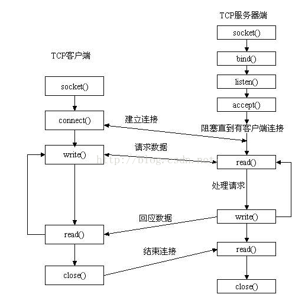
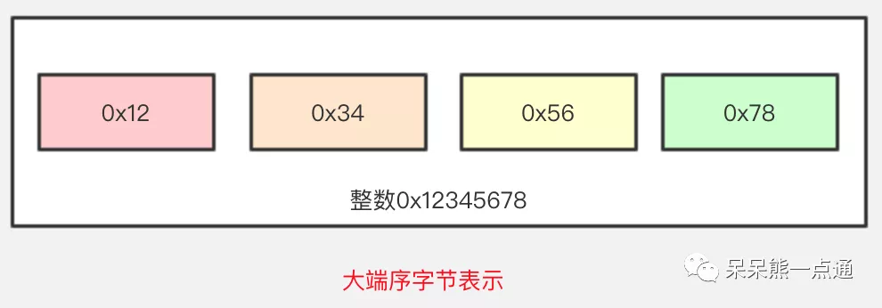

[TOC]


#  Linux系统


##  linux系统装机配置

###  搜狗输入法安装

> 1. 去[搜狗输入法官网](https://pinyin.sogou.com/linux/)下载.deb安装包；

2. 去Ubuntu软件商店搜索fcitx，并安装所有搜索结果；
3. sudo dpkg -i sougou-xxx.deb
4. 去字体设置中心，打开设置区域和语言将“键盘输入法系统”从ibus切换为fcitx；


###  安装字体

> 1. 安装文泉驿微米黑字体

   ```bash
   sudo apt-get install fonts-wqy-microhei
   sudo apt-get install fonts-wqy-zenhei
   ```


> 2. 安装微软字体、宋体等

   第一种方法：

   ```bash
   sudo apt-get update
   sudo apt-get install ttf-mscorefonts-installer
   sudo fc-cache -f -v # 更新字体缓存
   ```

   第二种：

   +  sudo mkdir /usr/share/fonts/truetype/windows-fonts
   + 拷贝字体到 windows-fonts 目录下
   + 修改权限，并更新字体缓存
   +  cd /usr/share/fonts/truetype/windows-font
   +  sudo mkfontscale
   +  sudo mkfontdir
   +  sudo fc-cache -fv
   +  重启

> 3. [安装 Nerd Fonts 字体](https://shuhm-gh.github.io/2017/03/23/linux-admin-%E5%AE%89%E8%A3%85nerd-fonts%E5%AD%97%E4%BD%93/)

   ```bash
   #下载字体，存放在字体目录
   $:mkdir -p ~/.local/share/fonts
   $:cd ~/.local/share/fonts && curl -fLo "Droid Sans Mono for Powerline Nerd Font Complete.otf" https://raw.githubusercontent.com/ryanoasis/nerd-fonts/master/patched-fonts/DroidSansMono/complete/Droid%20Sans%20Mono%20for%20Powerline%20Nerd%20Font%20Complete.otf
   #:生成字体信息缓存
   $:fc-cache -vf ~/.local/share/fonts/
   #:查看是否安装成功
   fc-list | grep -i droid
   ```

> 4. 安装Fira Code 字体

   + 创建 sh 脚本文件

     ```
     vim download_and_install.sh
     ```

   + 在文件中写入以下内容,若需要指定字体安装的目录，更改 file_path 的值即可

     ```bash
     #!/usr/bin/env bash

     fonts_dir="${HOME}/.local/share/fonts"
     if [ ! -d "${fonts_dir}" ]; then
         echo "mkdir -p $fonts_dir"
         mkdir -p "${fonts_dir}"
     else
         echo "Found fonts dir $fonts_dir"
     fi

     for type in Bold Light Medium Regular Retina; do
         file_path="${HOME}/.local/share/fonts/FiraCode-${type}.ttf"
         file_url="https://github.com/tonsky/FiraCode/blob/master/distr/ttf/FiraCode-${type}.ttf?raw=true"
         if [ ! -e "${file_path}" ]; then
             echo "wget -O $file_path $file_url"
             wget -O "${file_path}" "${file_url}"
         else
     	echo "Found existing file $file_path"
         fi;
     done

     echo "fc-cache -f"
     fc-cache -f

     ```

   + 运行脚本进行安装

     chmode +x download_and_install.sh

     需要注意的是，该脚本会将字体下载到: `~/.local/share/fonts/` 下，如果要设置为系统字体，将该目录中的所有字体复制到系统字体目录中，即 `sudo cp ~/.local/share/fonts/FiraCode-*.ttf /usr/share/fonts/`

   + 查看本地字体:fc-list,看到这一行就说明已经安装成功了

     ```bash
     ...
     /root/.local/share/fonts/FiraCode-Light.ttf: Fira Code,Fira Code Light:style=Light,Regular
     ...
     ```

   + 完成；


###  修改终端提示符

+ 主要是将.bashrc中的PS1改为[github.bashrc](https://github.com/junjiecjj/configure_file/blob/master/bashrc)中此PS1的形式；

###  安装谷歌浏览器

+ 去[谷歌官网](https://www.google.cn/chrome/)下载.deb安装包
+ sudo dpkg -i google-chrome-xxx.deb
+ 打开谷歌浏览器，安装谷歌上网助手；
+ 登陆谷歌账号，自动同步；
+ 完成;


###  VIM打造IDE

```bash
sudo apt-get update
sudo apt-get upgrade
sudo apt-get install vim
sudo apt-get install git
#安装bundle
git clone https://github.com/VundleVim/Vundle.vim.git ∼/.vim/bundle/Vundle.vim

cd /home/jack/
```

将[github.vimrc](https://github.com/junjiecjj/configure_file/blob/master/vimrc)中的内容加入到~/.vimrc中，打开 vim，进入命令模式，输入:PluginInstall;

PluginInstall 就是 vundle 的包管理器 Plugin 常用命令：

+ PluginInstall: 安装插件
+ PluginCleqn: 移除不要的插件
+  PluginUpdate: 更新插件
+  PluginList: 列出说所有的安装插件
+ PluginSearch: 查找插件

接下来安装以来工具

+ sudo apt-get install build-essential cmake
+ sudo apt-get install python-dev python3-dev
+ sudo apt-get install libxml2-dev libxslt-dev
+ sduo apt-get install clang
+ sudo apt-get install libclang-dev

接下来进入目录：

```bash
cd .vim/bundle
git clone –recursive git://github.com/Valloric/YouCompleteMe
cd /.vim/bundle/YouCompleteMe/
git submodule update –init –recursive # 获取 YCM 的依赖包
```

此时如果检测完整性, 即输入:

```bash
git submodule update - -init –recursive
```

不会出现任何返回, 因为一开始的 git 加了 recursive 参数。接下来:

```bash
sudo ./install.py –clang-completer –system-libclang
```

或者:

```bash
sudo ./install.py
```

+ +GO 支持：安装 Go 并在调用./install.py 时添加–go-completer

+ +TypeScript 支持：安装 Node.js 和 npm，然后使用 npm install -g typescript 安装 TypeScript SDK

+ +JavaScript 支持：安装 Node.js 和 npm，并在调用./install.py时添加–js-completer

+ +Rust 支持：安装 Rust 并在调用./install.py 时添加–rust-completer

+ +Java 支持：安装 JDK8（需要版本 8），并在调用./install.py 时添加–java-completer


###  WPS

+ 去[wps官网](https://www.wps.cn/product/wpslinux)下载.deb安装包
+ sudo dpkg -i wps_xxx.deb


###  PDF阅读器

+ sudo apt install okular


###  射手影音

+ sudo apt install smplayer
+ sudo apt install vlc


###  截图

> 1.深度截图

+ sudo apt install  deepin-screenshot

> 2. 火焰截图

+ 第一种方法：
  
+ sudo apt-get install flameshot
  
+ 第二种：

  ```bash
  # 如果您以前安装过，需要先进行卸载
  sudo apt remove flameshot

  # 卸载完成之后需要先克隆项目到本地(本人安装在  /opt  这个目录)
  sudo git clone https://github.com/lupoDharkael/flameshot.git

  # 如果您没有安装 git 需要先安装 git
  sudo apt install git

  #我把项目克隆在 /opt 目录，所以接下来切换到目录 /opt/flameshot/, 在这个目录下作以下操作：
  sudo mkdir build
  cd build
  sudo qmake ../
  sudo make   # 这个步骤是编译，根据每个人的电脑配置不同，需要的时间也不同
  #编译完成之后执行命令
  sudo make install
  #安装完成！
  ```

+ 第三种：
   + 下载[.deb包](https://www.linuxmi.com/flameshot-0.9.html);
   + sudo dpkg -i xxx.deb


###  qq、微信、百度网盘、迅雷

> 1.安装qq

  + 去[腾讯官网](https://im.qq.com/linuxqq/index.html)下载.deb安装包
  + sudo dpkg -i qq-xxx.deb

> 2. 安装微信

   + 去软件中心下载

> 3. 安装百度网盘、迅雷

   ```bash
   $: git clone https://gitee.com/wszqkzqk/deepin-wine-for-ubuntu.git
   $: cd ./deepin-wine-for-ubuntu
   $: ./install.sh
   #去[阿里镜像](http://packages.deepin.com/deepin/pool/non-free/d/)下载.deb包
   $:  dpkg -i 命令安装
   ```


###  Latex

+ sudo apt-get install texlive-full
+ sudo apt-get install texlive-xetex
+ sudo apt-get install texlive-lang-chinese
+ sudo apt-get install texstudio
+  编译时需要设置编译器为 XeLaTeX，TeXstudio 中在 Options−→TeXstudio−→Build−→Default Compiler 中更改默认编译器为XeLaTeX 即可。在配置中可以更改软件界面语言，将 Options−→Configure
  TeXstudio−→General−→Language 更改为 zh-CN 即可将界面设置为中文。

###  Lyx

1. Lyx 在 ubuntu 软件中心就有, 直接点击下载. 关键是接下来配置 Lyx 显示、导出中文 PDF，以及安装 Imagemagick 图片转换工具‘;

2. 中文界面：Tools→ Perfrences→ 用户界面语言 → 简体中文；

3. sudo apt-get install texlive-full

4. 显示中文 PDF: 文档 → 首选项 → 文档类 →Document calss→chinese Article(CTeX); 页边距 → 上下内外边距设置 为 2cm; 语言 → 简体中文;fromats→ 输出格式 →PDF(XeTeX)；

5. 重配置，重启;

6. 现在导出中文 PDF 没问题，但是 Lyx 里面的 eps 图形没法显示，导出 PDF 可以显示. 安装 ImageMagick, 但是安装 Imagemagick之前需要先先安装 Ghostscript 和 freetype；

7. 安装 Ghostscript:

   + 首先下载源码包:https://github.com/ArtifexSoftware/ghostpdl-downloads/releasesghostscript-9.27.tar.gz 到/usr/src下，然后解压到/usr/src/ghostscript-0.27/；
   + cd /usr/src/ghostscript-0.27/；
   + sudo ./configure – prefix/usr
   + sudo make all
   + sudo make install
   + 完成 ghostscript 安装

8. 安装 freetype

   +  首先下载源码https://www.freetype.org/download.htmlfreetype-2.10.1.tar.xz 到/usr/src/，解压到/usr/src/freetype-2.10.1/；
   +  cd /usr/src/freetype-2.10.1/
   +  ./configure –prefix=/usr/local/freetype
   +  make
   +  sudo make install
   +  完成

9. 最后安装 imageMagick

   +  首先下载源码https://imagemagick.org/script/install-source.phpImageMagick.tar.gz到/home/jack/下载/，解压到/home/jack/下载/ImageMagick-7.0.8-56/
   +  cd /home/jack/下载/ImageMagick-7.0.8-56/
   +  ./configure –with-magick-plus-plus
   +  make
   +  sudo make install
   +  sudo ldconfig /usr/local/lib
   +  /usr/local/bin/convert logo: logo.gif
   +  make check

   如果没有报错，则成功，可以完美的显示 eps 图像了.

###  dstat

+ sudo apt install dstat

###  bpytop

+ python3 -m pip install psutil
+ pip3 install bpytop --upgrade
+ sudo snap install bpytop

配置文件：/home/jack/.config/bpytop/bpytop.conf

###  duf

+ wget https://github.com/muesli/duf/releases/download/v0.5.0/checksums.txt
+ wget https://github.com/muesli/duf/releases/download/v0.5.0/duf_0.5.0_linux_amd64.deb
+ sha256sum --ignore-missing -c checksums.txt
+ sudo dpkg -i duf_0.5.0_linux_amd64.deb

###  plots

+ `sudo add-apt-repository ppa:apandada1/plots`
+ `sudo apt update`
+ `sudo apt install plots`


###  窗口管理器FVWM

+ sudo apt install fvwm
+ 去[网址](https://github.com/junjiecjj/configure_file)下载fvwm至~/.fvwm文件夹即可

###  Markdown编辑器remarkable

+ 去[remarkable](http://remarkableapp.github.io/linux/download.html)下载.deb文件
+ sudo dpkg -i remarkable-xxx.deb
+ sudo apt-get install -f
+ *remarkable &*

如果报警说少了 gtkspellcheck：

+ sudo apt-get install python3-gtkspellcheck


###  Markdown编辑器Typora

1.方法一：
  + [**官网下载**]()

  + 解压:tar -zxvf Typora-linux-x64.tar.gz

  + 拷贝到常用的软件安装目录下:sudo cp -ar Typora-linux-x64 /opt

  + 拷贝桌面快捷方式到桌面:

  ```bash
  cd /opt/Typora-linux-x64
  cp Typora.desktoop ~/Desktop/
  ```
2.方法二：

   ```bash
   # or run:
   # sudo apt-key adv --keyserver keyserver.ubuntu.com --recv-keys BA300B7755AFCFAE
   wget -qO - https://typora.io/linux/public-key.asc | sudo apt-key add -
   # add Typora's repository
   sudo add-apt-repository 'deb https://typora.io/linux ./'
   sudo apt-get update
   # install typora
   sudo apt-get install typora
   ```


###  VS Code

+ 下载[VSCode](https://code.visualstudio.com/Download)的.deb文件
+ sudo dpkg -i xxx.deb


###  窗口管理器i3


###  窗口管理器awesome


------


##  linux系统其它软件


###  Python IDE Anaconda


###  Java IDE IntelliJ


###  Matlab


###  QT


###  Code::Block


###  Eclipse


###  Emacs


###


##  linux软件自动安装脚本

根据以上软件的安装流程，可以写一个bash脚本实现装机软件自动化安装流程，这是比较高效的方式，大幅度释放劳动力，但是前期此脚本的撰写是费事的，但是提升了bash脚本的编写能力。


##  linux命令大全


### 


###


#  计算机基础知识

本节记录平时用到或者学到的计算机的基础知识。

##  Linux/C结构体


##   Linux/C网络


###   linux C Socket函数介绍与使用

[<font color=green> <工程师纯干货总结：TCP/IP 网络编程></font>](https://mp.weixin.qq.com/s/SIFdmkoZDVJGD-0Z4SIEiA)

[<font color=green><linux C socket 函数介绍和使用实例></font>](https://blog.csdn.net/XiaoXiaoPengBo/article/details/50349834)


以上两篇文章是以下内容的铺垫。


Socket 是应用层与协议族通信的中间软件抽象层，它是一组接口。

先附图一张，虽然是讲解 TCP 的 socket，但是道理相通。



#### 基本 socket 函数

Linux 系统是通过提供套接字 (socket) 来进行网络编程的。网络的 socket 数据传输是一种特殊的I/O,socket 也是一种文件描述符。socket 也有一个类似于打开文件的函数：socket (), 调用 socket (), 该函数返回一个整型的 socket 的描述符，随后的连接建立、数据传输等操作也都是通过该 socket 实现。

#####   socket 函数

```c
#include <sys/scoket.h>
int socket(int af, int type, int protocol)；
```

<font color=blue> 功能说明：</font>

+ 调用成功，返回 socket 文件描述符；失败，返回－ 1，并设置errno;两个网络程序之间的一个网络连接包括五种信息：通信协议、本地协议地址、本地主机端口、远端主机地址和远端协议端口。 socket 数据结构中包含这五种信息。

<font color=blue> 参数说明：</font>

+ af 指明所使用的协议族，通常为 PF_INET，表示 TCP/IP协议。AF 是“Address Family”的简写。AF_INET 表示 IPv4 地址，例如 127.0.0.1；AF_INET6 表示IPv6 地址，例如 1030::C9B4:FF12:48AA:1A2B。大家需要记住 127.0.0.1，它是一个特殊 IP 地址，表示本机地址，后面的教程会经常用到;

  | 名称     | 协议族               |
  | -------- | -------------------- |
  | PF_INET  | IPv4 互联网协议族    |
  | PF_INET6 | IPv4 互联网协议族    |
  | PF_LOCAL | 本地通信 unix 协议族 |


   + type 参数指定 socket 的类型，基本上有三种：数据流套接字、数据报套接字、原始套接字;

     + 面向链接的套接字类型 (SOCK_STREAM)

        SOCK_STREAM 表示面向连接的数据传输方式。数据可以准确无误地到达另一台计算机，如果损坏或丢失，可以重新发送，但效率相对较慢。常见的 http 协议就使用SOCK_STREAM 传输数据，因为要确保数据的正确性，否则网页不能正常解析。

     + 面向消息的套接字类型 ( SOCK_DGRAM)

        SOCK_DGRAM 表示无连接的数据传输方式。计算机只管传输数据，不作数据校验，如果数据在传输中损坏，或者没有到达另一台计算机，是没有办法补救的。也就是说，数据错了就错了，无法重传。因为 SOCK_DGRAM 所做的校验工作少，所以效率比 SOCK_STREAM 高。

     <font color=red>注意：SOCK_DGRAM 没有想象中的糟糕，不会频繁的丢失数据，数据错误只是小概率事件。</font>


   + protocol : 计算机通信中实用的协议信息， protocol 参数协议最终选择,常用的有 IPPROTO_TCP 和 IPPTOTO_UDP，分别表示 TCP传输协议和 UDP 传输协议。
     有了地址类型和数据传输方式，还不足以决定采用哪种协议吗？为什么还需要第三个参数呢？正如大家所想，一般情况下有了 af 和 type 两个参数就可以创建套接字了，操作系统会自动推演出协议类型，除非遇到这样的情况：有两种不同的协议支持同一种地址类型和数据传输类型。如果我们不指明使用哪种协议，操作系统是没办法自动推演的。该教程使用 IPv4 地址，参数 af 的值为 PF_INET。如果使用
     SOCK_STREAM 传输数据，那么满足这两个条件的协议只有TCP，因此可以这样来调用 socket () 函数;

     ```c
     int tcp_socket = socket(AF_INET, SOCK_STREAM, IPPROTO_TCP); // IPPROTO_TCP表示TCP协议
     ```

     这种套接字称为 TCP 套接字。

     如果使用 SOCK_DGRAM 传输方式，那么满足这两个条件的协议只有 UDP，因此可以这样来调用 socket () 函数：

     ```c
     int ud_socket = socket(AF_INET, SOCK_DGRAM, IPPROTO_UDP); //IPPROTO_UDP表示UDP协议
     ```

     这种套接字称为 UDP 套接字。
     上面两种情况都只有一种协议满足条件，可以将 protocol 的值设为 0，系统会自动推演出应该使用什么协议，如下所示：

     ```c
     int tcp_socket = socket(AF_INET, SOCK_STREAM, 0); //创建TCP套接字
     int udp_socket = socket(AF_INET, SOCK_DGRAM, 0); //创建UDP套接字
     ```


#####   bind 函数

```c
#include <sys/socket.h>
int bind(int server_sockfd, struct sockaddr *server_addr, int addrlen);
// socketfd 要分配的套接字文件描述 符
// myaddr 存储地址信息的结构体变量地址值
// addrlen 第二个结构体变量的长度
```

<font color=blue>功能说明：</font>

+ 调将套接字和指定的端口相连，对于服务器和客户端都是这样。成功返回 0，否则，返回-1，并置 errno;

<font color=blue>参数说明：</font>

+ server_sockfd 是调用 socket 函数返回值;

+ server_addr 是一个指向包含有本机 IP 地址及端口号等信息的sockaddr类型的指针；

  ```c
  struct sockaddr {
      __uint8_t sa_len;
      sa_family_t sa_family; //地址族
      char sa_data[14]; //地址信息
  };
  ```

  在 sa_data 一个成员里，包含了 ip、port 的地址信息，这样写起来很麻烦，所以有了新的结构体 sockaddr_in (IP 和端口进行了拆分)。sockaddr_in 结构体：

  ```c
  struct sockaddr_in {
      __uint8_t sin_len;
      sa_family_t sin_family;  //地址族
      in_port_t sin_port;      // TCP/UDP端口号
      struct in_addr sin_addr; //IP地址
      char sin_zero[8];
  };
  ```

  在上面的结构体中，又嵌套了 in_addr 结构体，记录 IP 地址:

  ```c
  struct in_addr {
  	in_addr_t s_addr; //32位IPv4地址
  };
  ```

  <font color=blue>结构体 sockaddr_in 的成员分析:</font>

  +  **成员 sin_family**:

    | 地址族   | 含义                       |
    | :------- | :------------------------- |
    | AF_INET  | IPv4 互联网使用的地址族    |
    | AF_INET6 | IPv6 互联网使用的地址族    |
    | AF_LOCAL | 本地通信 unix 使用的地址族 |
    | …        | …                          |

  + **成员 sin_port**:16 位端口号;

  + **成员 sin_addr**:32 位 ip 地址信息，以网络字节序保存;

  + **成员 sin_zero**:无特殊含义，为与 sockaddr 大小保持一致，写入 0 即可。

+ **addrlen 参数**:传递地址信息的长度;

  <font color=blue>**最终我们使用 bind 绑定地址方式**</font>

```c
//分配内存-构造服务端地址端口
memset(&serv_addr, 0, sizeof(serv_addr));
//IPv4中的地址族
serv_addr.sin_family = AF_INET;
//32位的IPv4地址， INADDR_ANY表示当前ip
serv_addr.sin_addr.s_addr = htonl(INADDR_ANY);
//16位tcp/udp端口号
serv_addr.sin_port = htons(atoi(argv[1]));

//分配地址
if (bind(serv_sock, (struct sockaddr*) &serv_addr,sizeof(serv_addr) )==-1){
    printf("bind() error");
    exit(0);
}
```

   bind 函数之前，构造了 sockaddr_in 结构体的数据，其中介绍几个点.

 + INADDR_ANY 会自动获取当前服务器的 IP;

 + 我们看到使用到了 htonl、htons 函数，构造 IP 地址和端口;

**==为什么构造结构体地址时候使用了 htonl、htons 对 IP、端口进行了转换？==**

首先我们来看下这几个函数的含义:

| 地址族 | 含义                                        |
| :----- | :------------------------------------------ |
| htons  | 把 short 型数据从主机字节序转化为网络字节序 |
| htonl  | 把 long 型数据从主机字节序转化为网络字节序  |
| ntohs  | 把 short 型数据从网络字节序转化为主机字节序 |
| ntohl  | 把 long 型数据从网络字节序转化为主机字节序  |
| …      | …                                           |

数据传输采用的网络字节序，那在传输前应直接把数据转换成网络字节序，接收的数据也需要转换城主机字节序再保存。上面这句话是有问题的，原因是数据收发过程中是有自动转换机制的。

除了 socketaddr_in 结构体变量手动填充数据转换外，其他情况不需要考虑字节序问题。

**==说了这么多字节序，那到底什么是网络字节序，什么是主机字节序==**

- 主机字节序：主机内部内存中数据的处理方式。
- 网络字节序：网络字节顺序是 TCP/IP 中规定好的一种数据表示格式，它与具体的 CPU 类型、操作系统等无关，从而可以保证数据在不同主机之间传输时能够被正确解释。网络字节顺序采用 big endian（大端）排序方式。

 **==大端又是啥，我们从两种网络字节顺序说起==**

+ 字节序：是指整数在内存中保存的顺序
+ cpu 向内存保存数据字节序有两种实现方式：
  + **小端字节序（little endian）**：低字节数据存放在内存低地址处，高字节数据存放在内存高地址处。
  + **大端字节序（bigendian）**：高字节数据存放在低地址处，低字节数据存放在高地址处。

图例:




大字节序更符合我们的阅读习惯。但是我们的主机使用的是哪种字节序取决于 CPU，不同的 CPU 型号有不同的选择。


当我们两台计算机是需要网络通信时，规范统一约定为大端序进行通讯处理.


#####   connect 函数

```c
#include <sys/types.h>
int connect(int client_sockfd, struct sockaddr_in *serv_addr,int addrlen);
```

<font color=blue>功能说明：</font>

+ 客户端发送服务请求，只有客户端才用，对于客户端，client_sockfd是客户端 socket() 返回的套接字描述符，serv_addr 是服务端的sockadd_in 结构体。成功返回 0，否则返回-1，并置 errno。

<font color=blue>参数说明：</font>

+ client_sockfd 是客户端 socket 函数返回的 socket 描述符；serv_addr是包含远端主机 IP 地址和端口号的指针；addrlen 是结构 sockaddr_in 的长度。

#####  listen 函数

   ```c
   #include <sys/socket.h>
   int listen(int sock_fd, int backlog);  //Linux
   int listen(SOCKET sock, int backlog);  //Windows
   ```


<font color=blue>功能说明：</font>

   + 等待指定的端口的出现客户端连接，只有服务器端才用。调用

    成功返回 0，否则，返回－ 1，并置 errno.

<font color=blue>参数说明：</font>

   + sock_fd 是服务器端 socket() 函数返回值；
   + backlog 指定在请求队列中允许的最大请求数

   **请求队列**

   当套接字正在处理客户端请求时，如果有新的请求进来，套接字是没法处理的，只能把它放进缓冲区，待当前请求处理完毕后，再从缓冲区中读取出来处理。如果不断有新的请求进来，它们就按照先后顺序在缓冲区中排队，直到缓冲区满。这个缓冲区，就称为请求队列（Request Queue）。

   缓冲区的长度（能存放多少个客户端请求）可以通过 listen () 函数的 backlog 参数指定，但究竟为多少并没有什么标准，可以根据你的需求来定，并发量小的话可以是 10 或者 20。

   如果将 backlog 的值设置为 SOMAXCONN，就由系统来决定请求队列长度，这个值一般比较大，可能是几百，或者更多。

   当请求队列满时，就不再接收新的请求，对于 Linux，客户端会收到 ECONNREFUSED 错误，对于 Windows，客户端会收到 WSAECONNREFUSED 错误。

   <font color=red>注意：listen () 只是让套接字处于监听状态，并没有接收请求。接收请求需要使用 accept () 函数。</font>

> ##### accept函数

   ```c
   #include <sys/types.h>
   int accept(int server_sockfd, struct sockadd * client_addr, int addrlen);
   ```

   <font color=blue>功能说明：</font>

   + 只在服务端使用，用于接受客户端的服务请求，成功返回新的套接字描述符 clent_sockfd，这个新的描述符是服务端的 send/recv/read/write 函数的第一个参数，失败返回－1，并置 errno。

     errno错误代码：

     + EBADF 参数 s 非合法 socket 处理代码.
     + EFAULT 参数 addr 指针指向无法存取的内存空间.
     + ENOTSOCK 参数 s 为一文件描述词，非 socket.
     + EOPNOTSUPP 指定的 socket 并非 SOCK_STREAM.
     + EPERM 防火墙拒绝此连线.
     + ENOBUFS 系统的缓冲内存不足.
     + ENOMEM 核心内存不足.

   <font color=blue>参数说明：</font>

   + server_sockfd 是被监听的 socket 描述符，也就是服务端的 socket 返回的 socket 描述符，是服务器端套接字, addr 通常是一个指向客户端 sockaddr 变量的指针，这个指针的内容是不需要指定的，只需要定义、分配好内存空间；addrlen 是结构 sockaddr 的长度。

   <font color=red>注意：accept () 返回一个新的套接字来和客户端通信，client_addr 保存了客户端的 IP 地址和端口号，而 sock 是服务器端的套接字，大家注意区分。后面服务端和客户端通信时，要使用这个新生成的套接字，而不是原来服务器端的套接字。accept () 用来接受参数 server_sockfd 的 socket 连线。参数 server_sockfd 的 socket 必需先经 bind ()、listen () 函数处理过，当有连线进来时 accept () 会返回一个新的 socket 处理代码，往后的数据传送与读取就是经由新的 socket 处理，而原来参数 server_sockfd 的 socket 能继续使用 accept () 来接受新的连线要求。连线成功时，参数 client_addr 所指的结构会被系统填入远程主机的地址数据，参数 addrlen 为 scokaddr 的结构长度。

   最后需要说明的是：listen () 只是让套接字进入监听状态，并没有真正接收客户端请求，listen () 后面的代码会继续执行，直到遇到 accept ()。accept () 会阻塞程序执行（后面代码不能被执行），直到有新的请求到来。</font>


#####   write函数

```c
#include <unistd.h>
ssize_t write(int fd, const void *buf, size_t nbytes);
```

<font color=blue>功能说明：</font>

+ write 函数将 buf 中的 nbytes 字节内容写入文件描述符 fd，write () 会把参数 buf 所指的内存写入 count 个字节到参数 fd 所指的文件内。当然，文件读写位置也会随之移动. 对于客户端，fd 为客户端 socket 返回的套接字描述符 client_sockfd，对于服务端，fd 为 accept 返回的新的套接字描述符。成功时返回写的字节数. 失败时返回-1. 并设置 errno 变量,错误代码：
  + EINTR 此调用被信号所中断.
  + EAGAIN 当使用不可阻断 I/O 时 (O_NONBLOCK), 若无数据可读取则返回此值.
  + EADF 参数 fd 非有效的文件描述词，或该文件已关闭.

<font color=blue>参数说明：</font>

#####    read函数

```c
#include <unistd.h>
ssize_t read(int fd,void *buf,size_t nbyte);
```


<font color=blue>功能说明：</font>

+ read 函数是负责从 fd 中读取内容，对于客户端，fd 为客户端socket 返回的套接字描述符 client_sockfd，对于服务端，fd 为accept 返回的新的套接字描述符。当读成功时，read 返回实际
  所读的字节数，如果返回的值是 0 表示已经读到文件的结束了,当有错误发生时则返回-1, 错误代码存入 errno 中，而文件读写位置则无法预期. 小于 0 表示出现了错误. 如果错误为 EINTR 说明读是由中断引起的, 如果错误是 ECONNREST 表示网络连接出了问题.
+ read () 会把参数 fd 所指的文件传送 count 个字节到 buf 指针所指的内存中。若参数 count 为 0, 则 read () 不会有作用并返回 0. 返回值为实际读取到的字节数，如果返回 0, 表示已到达文件尾或是无可读取的数据，此外文件读写位置会随读取到的字节移动.错误代码：
  + EINTR 此调用被信号所中断.
  + EAGAIN 当使用不可阻断 I/O 时 (O_NONBLOCK), 若无数据可读取则返回此值.
  + EBADF 参数 fd 非有效的文件描述词，或该文件已关闭.

write 和 read 可以用send/recv替代。

> #####    send/recv函数

```c
#include <sys/socket.h>
ssize_t send(int sockfd, const void *buf, size_t len, int flags);
ssize_t recv(int sockfd, void *buf, size_t len, int flags);
```

recv 和 send 的前 3 个参数等同于 read 和 write。flags 参数一般置为 0，或：

| flags         | 说明               | recv  | send |
| ------------- | ------------------ | ----- | ---- |
| MSG_DONTROUTE | 绕过路由表查找     |       | •    |
| MSG_DONTWAIT  | 仅本操作非阻塞     | **•** | •    |
| MSG_OOB       | 发送或接收带外数据 | •     | •    |
| MSG_PEEK      | 窥看外来消息       | •     |      |
| MSG_WAITALL   | 等待所有数据       | •     |      |

<font size=24, color=blue>Send</font>

同步 Socket 的 send 函数的执行流程：当调用该函数时，send先比较待发送数据的长度 len 和套接字 sockfd 的发送缓冲的长度（因为待发送数据是要 copy 到套接字 sockfd 的发送缓冲区的，注意并不是 send 把 sockfd 的发送缓冲中的数据传到连接的另一端的，而是协议传的，send 仅仅是把 buf 中的数据 copy到 sockfd 的发送缓冲区的剩余空间里）：

+ 如果 len 大于 sockfd 的发送缓冲区的长度，该函数返回SOCKET_ERROR；
+ 如果 len 小于或者等于 sockfd 的发送缓冲区的长度，那么send 先检查协议是否正在发送 sockfd 的发送缓冲中的数据，如果是就等待协议把数据发送完，如果协议还没有开始发送 sockfd 的发送缓冲中的数据或者 sockfd 的发送缓冲中没有数据，那么 send 就比较 sockfd 的发送缓冲区的剩余空间
  和 len：
  + 如果 len 大于剩余空间大小 send 就一直等待协议把 sockfd 的发送缓冲中的数据发送完；
  + 如果 len 小于剩余空间大小 send 就仅仅把 buf 中的数据 copy 到剩余空间里。

+ 如果 send 函数 copy 数据成功，就返回实际 copy 的字节数，如果 send 在 copy 数据时出现错误，那么 send 就返回SOCKET_ERROR；如果 send 在等待协议传送数据时网络断开的话，那么 send 函数也返回 SOCKET_ERROR。
+ send 函数把 buf 中的数据成功 copy 到 sockfd 的发送缓冲的剩余空间里后它就返回了，但是此时这些数据并不一定马上被传到连接的另一端。如果协议在后续的传送过程中出现网络错误的话，那么下一个 Socket 函数就会返回 SOCKET_ERROR。(每一个除 send 外的 Socket 函数在执行的最开始总要先等待套接字的发送缓冲中的数据被协议传送完毕才能继续，如果在等待时出现网络错误，那么该 Socket 函数就返回 SOCKET_ERROR）.
+ 在 unix 系统下，如果 send 在等待协议传送数据时网络断开，调用 send 的进程会接收到一个 SIGPIPE 信号，进程对该信号的处理是进程终止。

<font size=24, color=blue>recv</font>

```c
#include <sys/socket.h>
ssize_t recv(int sockfd, void *buf, size_t len, int flags);
```


+ 同步 Socket 的 recv 函数的执行流程：当应用程序调用 recv 函数时，recv 先等待 sockfd 的发送缓冲中的数据被协议传送完毕;
+ 如果协议在传送 sockfd 的发送缓冲中的数据时出现网络错误，那么 recv 函数返回 SOCKET_ERROR；
+ 如果sockfd 的发送缓冲中没有数据或者数据被协议成功发送完毕后，recv 先检查套接字 sockfd 的接收缓冲区;
+ 如果 sockfd 接收缓冲区中没有数据或者协议正在接收数据，那么 recv 就一直等待，直到协议把数据接收完毕;
+ 当协议把数据接收完毕，recv 函数就把 sockfd 的接收缓冲中的数据 copy 到 buf 中（注意协议接收到的数据可能大于 buf 的长度，所以在这种情况下要调用几次 recv 函数才能把 sockfd 的接收缓冲中的数据 copy 完。recv 函数仅仅是 copy 数据，真正的接收数据是协议来完成的），recv 函数返回其实际 copy 的字节数;
+ 如果 recv 在 copy 时出错，那么它返回 SOCKET_ERROR；如果 recv 函数在等待协议接收数据时网络中断了，那么它返回0。


#####  close函数

   ```
   #include <unistd.h>
   int close(sock_fd);
   ```

   <font color=blue>功能说明：</font>

   + 当所有的数据操作结束以后，你可以调用 close() 函数来释放该socket，从而停止在该 socket 上的任何数据操作，函数运行成功返回 0，否则返回-1;


#####  示例
>
> 实例1：
>
> ```c
> //server.c
> #include <sys/types.h>
> #include <sys/socket.h>
> #include <stdio.h>
> #include <netinet/in.h>
> #include <arpa/inet.h>
> #include <unistd.h>
> #include <string.h>
> #include <stdlib.h>
> #include <fcntl.h>
> #include <sys/shm.h>
> 
> #define MYPORT 8887
> #define QUEUE 20
> #define BUFFER_SIZE 1024
> 
> int main()
> {
>     ///定义sockfd
>     int server_sockfd = socket(AF_INET, SOCK_STREAM, 0);
> 
>     ///定义sockaddr_in
>     struct sockaddr_in server_sockaddr;
>     server_sockaddr.sin_family = AF_INET;
>     server_sockaddr.sin_port = htons(MYPORT);
>     server_sockaddr.sin_addr.s_addr = htonl(INADDR_ANY);
> 
>     ///bind，成功返回0，出错返回-1
>     if (bind(server_sockfd, (struct sockaddr *)&server_sockaddr, sizeof(server_sockaddr)) == -1)
>     {
>         perror("bind");
>         exit(1);
>     }
> 
>     ///listen，成功返回0，出错返回-1
>     if (listen(server_sockfd, QUEUE) == -1)
>     {
>         perror("listen");
>         exit(1);
>     }
> 
>     ///客户端套接字
>     char buffer[BUFFER_SIZE];
>     struct sockaddr_in client_addr;
>     socklen_t length = sizeof(client_addr);
> 
>     ///成功返回非负描述字，出错返回-1
>     int conn = accept(server_sockfd, (struct sockaddr *)&client_addr, &length);
>     if (conn < 0)
>     {
>         perror("connect");
>         exit(1);
>     }
> 
>     while (1)
>     {
>         memset(buffer, 0, sizeof(buffer));
>         int len = recv(conn, buffer, sizeof(buffer), 0);
>         if (strcmp(buffer, "exit\n") == 0)
>             break;
>         fputs(buffer, stdout);
>         send(conn, buffer, len, 0);
>     }
>     close(conn);
>     close(server_sockfd);
>     return 0;
> }
> ```
>
> ```c
> //client.c
> #include <sys/types.h>
> #include <sys/socket.h>
> #include <stdio.h>
> #include <netinet/in.h>
> #include <arpa/inet.h>
> #include <unistd.h>
> #include <string.h>
> #include <stdlib.h>
> #include <fcntl.h>
> #include <sys/shm.h>
> 
> #define MYPORT 8887
> #define BUFFER_SIZE 1024
> 
> int main()
> {
>     ///定义sockfd
>     int sock_cli = socket(AF_INET, SOCK_STREAM, 0);
> 
>     ///定义sockaddr_in
>     struct sockaddr_in servaddr;
>     memset(&servaddr, 0, sizeof(servaddr));
>     servaddr.sin_family = AF_INET;
>     servaddr.sin_port = htons(MYPORT);                 ///服务器端口
>     servaddr.sin_addr.s_addr = inet_addr("127.0.0.1"); ///服务器ip
> 
>     ///连接服务器，成功返回0，错误返回-1
>     if (connect(sock_cli, (struct sockaddr *)&servaddr, sizeof(servaddr)) < 0)
>     {
>         perror("connect");
>         exit(1);
>     }
> 
>     char sendbuf[BUFFER_SIZE];
>     char recvbuf[BUFFER_SIZE];
>     while (fgets(sendbuf, sizeof(sendbuf), stdin) != NULL)
>     {
>         send(sock_cli, sendbuf, strlen(sendbuf), 0); ///发送
>         if (strcmp(sendbuf, "exit\n") == 0)
>             break;
>         recv(sock_cli, recvbuf, sizeof(recvbuf), 0); ///接收
>         fputs(recvbuf, stdout);
> 
>         memset(sendbuf, 0, sizeof(sendbuf));
>         memset(recvbuf, 0, sizeof(recvbuf));
>     }
> 
>     close(sock_cli);
>     return 0;
> }
> ```
>
> 实例2
>
> ```c
> //echo_server.c
> #include <stdio.h>
> #include <sys/socket.h>
> #include <arpa/inet.h>
> 
> #define BUF_SIZE 5
> 
> int main(int argc, char *argv[])
> {
>     char message[BUF_SIZE];
>     int str_len, i;
> 
>     struct sockaddr_in serv_addr, clnt_addr;
> 
>     int serv_sock = socket(PF_INET, SOCK_STREAM, 0);
>     if (serv_sock == -1)
>     {
>         printf("socket() error");
>         exit(1);
>     }
> 
>     memset(&serv_addr, 0, sizeof(serv_addr));
>     serv_addr.sin_family = AF_INET;
>     serv_addr.sin_addr.s_addr = htonl(INADDR_ANY);
>     serv_addr.sin_port = htons(9600);
> 
>     if (bind(serv_sock, (struct sockaddr *)&serv_addr, sizeof(serv_addr)) == -1)
>     {
>         printf("bind() error");
>         exit(1);
>     }
> 
>     if (listen(serv_sock, 5) == 1)
>     {
>         printf("listen() error");
>         exit(1);
>     }
> 
>     int clnt_addr_sz = sizeof(clnt_addr);
>     for (i = 0; i < 5; i++)
>     {
>         int clnt_sock = accept(serv_sock, (struct sockaddr *)&clnt_addr, &clnt_addr_sz);
>         if (clnt_sock == -1)
>         {
>             printf("accept() error");
>             exit(1);
>         }
> 
>         while (str_len = read(clnt_sock, message, BUF_SIZE) > 0)
>         {
>             write(clnt_sock, message, str_len);
>         }
> 
>         close(clnt_sock);
>     }
> 
>     close(serv_sock);
>     return 0;
> }
> ```
>
> ```c
> //echo_client.c
> #include <stdio.h>
> #include <string.h>
> #include <sys/socket.h>
> #include <arpa/inet.h>
> 
> #define BUF_SIZE 5
> 
> int main(int argc, char *argv[])
> {
>     char message[BUF_SIZE];
>     int str_len, i;
> 
>     struct sockaddr_in serv_addr, clnt_addr;
> 
>     int serv_sock = socket(PF_INET, SOCK_STREAM, 0);
>     if (serv_sock == -1)
>     {
>         printf("socket() error");
>         exit(1);
>     }
> 
>     memset(&serv_addr, 0, sizeof(serv_addr));
>     serv_addr.sin_family = AF_INET;
>     serv_addr.sin_addr.s_addr = inet_addr("127.0.0.1");
>     serv_addr.sin_port = htons(9600);
> 
>     if (connect(serv_sock, (struct sockaddr *)&serv_addr, sizeof(serv_addr)) == -1)
>     {
>         printf("connect() error");
>         exit(1);
>     }
> 
>     while (1)
>     {
>         fputs("请输入您的信息,按Q键退出\n", stdout);
>         fgets(message, 1024, stdin);
> 
>         //因为fgets会保留输入中换行符,故判断加\n
>         if (!strcmp(message, "q\n") || !strcmp(message, "Q\n"))
>         {
>             break;
>         }
> 
>         write(serv_sock, message, sizeof(message));
>         read(serv_sock, message, BUF_SIZE - 1);
>         printf("Message from server: %s\n", message);
>     }
> 
>     close(serv_sock);
>     return 0;
> }
> ```
>
> 


#### gethostbyname函数


##   Linux/C时间函数

​      time () 提供了秒级的精确度，用 time () 函数结合其他函数（如：localtime、gmtime、asctime、ctime）可以获得当前系统时间或是标准时间。如果需要更高的时间精确度，就需要 `struct timespec` 和 `struct timeval `来处理。


+ 通过系统调用函数 time () 可以从内核获得一个类型为 time_t 的 1 个值，该值叫 calendar 时间，即从 1970 年 1 月 1 日的 UTC 时间从 0 时 0 分 0 妙算起到现在所经过的秒数。而该时间也用于纪念 UNIX 的诞生。
+ 函数 gmtime ()、localtime () 可以将 calendar 时间转变成 struct tm 结构体类型变量中。通过该结构体成员可以很方便的得到当前的时间信息。我们也可以通过函数 mktime 将该类型结构体的变量转变成 calendar 时间。
+ asctime () 和 ctime () 函数产生形式的 26 字节字符串，这与 date 命令的系统默认输出形式类似：Tue Feb 10 18:27:38 2020/n/0.
+ strftime () 将一个 struct tm 结构格式化为一个字符串。


###   一般时间函数

####   相关结构体

```c
#include<types.h>
#ifndef _CLOCK_T
#define _CLOCK_T
	typedef    long   clock_t;
#endif 


// time_t  类型：长整型，一般用来表示从 1970-01-01 00:00:00 时以来的秒数，精确度：秒；由函数 time () 获取；
#define _TIME_T
	typedef   long   time_t;        
#endif 

#include <sys/timeb.h>
// struct timeb 结构：它有两个主要成员，一个是秒，另一个是毫秒；精确度：毫秒 (10E-3 秒)；
struct  timeb{
    time_t   time;                      /* 为 1970-01-01 至今的秒数 */
    unsigned   short   millitm;        /* 千分之一秒即毫秒 */
    short   timezonel;               /* 为目前时区和 Greenwich 相差的时间，单位为分钟 */
    short   dstflag;                   /* 为日光节约时间的修正状态，如果为非 0 代表启用日光节约时间修正 */
};

// struct timespec 有两个成员，一个是秒，一个是纳秒，所以最高精确度是纳秒。
struct  timespec
{
	time_t    tv_sec;        // 秒   
	long       tv_nsec;       //纳秒
};

//struct  timeval 结构，它有两个成员；一个是秒，另一个表示微秒，所以最高精确度是微秒，精确度：微秒 (10E-6)；
struct  timeval
{
    long  tv_sec;    //秒
    long  tv_usec;  // 微秒
};

//timespec和timeval两者的区别是 timespec 的第二个参数是纳秒数，而 timeval 的第二个参数是毫秒数。

//struct  timezone 结构的定义为：
struct  timezone
{
    int  tz_minuteswest; 
    int  tz_dsttime;        
};

// 结构 tm 的定义为
struct tm
{
    int   tm_sec;    //tm_sec 代表目前秒数，正常范围为 0-59，但允许至 61 秒
    int   tm_min;    // tm_min 代表目前分数，范围 0-59
    int   tm_hour;    //tm_hour 从午夜算起的时数，范围为 0-23 
    int   tm_mday;    //tm_mday 目前月份的日数，范围 01-31 
    int   tm_mon;    // tm_mon 代表目前月份，从一月算起，范围从 0-11
    int   tm_year;   //tm_year 从 1900 年算起至今的年数
    int   tm_wday;   // tm_wday 一星期的日数，从星期一算起，范围为 0-6
    int   tm_yday;   // tm_yday 从今年 1 月 1 日算起至今的天数，范围为 0-365
    int tm_isdst;    //tm_isdst 日光节约时间的旗标
};

```


####    time函数

```c
// 头文件：time.h
// 函数定义：
 time_t   time (time_t*  lpt)；
```

说明： 返回从1970年1月1日的UTC时间从0时0分0妙算起到现在所经过的秒数。

```c
#include<stdio.h>
#include<time.h>
int main(){
 time_t timep;
 
 long seconds = time(&timep);
 printf("%ld\n",seconds);
 printf("%ld\n",timep);
 return 0;
}
```


####   ctime函数

```
char *ctime(const time_t *timep);
```

说明：将参数所指的time_t结构中的信息转换成真实世界的时间日期表示方法，然后将结果以字符串形式返回。
注意这个是本地时间。

```c
#include <stdio.h>
#include<time.h>
int main(void) {
 time_t timep;
 
 time(&timep);
 printf("%s\n",ctime(&timep));
 return 0;
}
```


####    gmtime 函数

```c
struct tm *gmtime(const time_t *timep);
```

说明：将参数timep所指的time_t结构中的信息转换成真实世界所使用的时间日期表示方法，然后将结果由结构tm返回。此函数返回的时间日期未经时区转换，而是UTC时间。


```c
#include <stdio.h>
#include<time.h>
 
int main(void){
    char *wday[] = {"Sun","Mon","Tue","Wed","Thu","Fri","Sat"};
 
 	time_t timep;
	struct tm *p;
 
 	time(&timep);
 	p = gmtime(&timep);
 	printf("%d/%d/%d ",(1900+p->tm_year),(1+p->tm_mon),p->tm_mday);
 	printf("%s %d:%d:%d\n",wday[p->tm_wday],p->tm_hour,p->tm_min,p->tm_sec);
 	return 0;
}
```


####    strftime 函数

```c
#include <time.h> 
size_t strftime(char *s, size_t max, const char *format,const struct tm *tm);
```

说明：
类似于snprintf函数，我们可以根据format指向的格式字符串，将struct tm结构体中信息输出到s指针指向的字符串中，最多为max个字节。当然s指针指向的地址需提前分配空间，比如字符数组或者malloc开辟的堆空间。
其中，格式化字符串各种日期和时间的详细的确切表示方法有如下多种，我们可以根据需要来格式化各种各样的含时间字符串。

+ %a 星期几的简写

+  %A 星期几的全称

+ %b 月分的简写

+ %B 月份的全称

+ %c 标准的日期的时间串

+ %C 年份的前两位数字

+ %d 十进制表示的每月的第几天

+ %D 月/天/年

+ %e 在两字符域中，十进制表示的每月的第几天

+ %F 年-月-日

+ %g 年份的后两位数字，使用基于周的年

+  %G 年分，使用基于周的年

+ %h 简写的月份名

+ %H 24小时制的小时

+ %I 12小时制的小时

+ %j 十进制表示的每年的第几天

+ %m 十进制表示的月份

+ %M 十时制表示的分钟数

+ %n 新行符

+ %p 本地的AM或PM的等价显示

+ %r 12小时的时间

+ %R 显示小时和分钟：hh:mm

+ %S 十进制的秒数

+  %t 水平制表符

+ %T 显示时分秒：hh:mm:ss

+ %u 每周的第几天，星期一为第一天 （值从0到6，星期一为0）

+ %U 第年的第几周，把星期日做为第一天（值从0到53）

+ %V 每年的第几周，使用基于周的年

+ %w 十进制表示的星期几（值从0到6，星期天为0）

+ %W 每年的第几周，把星期一做为第一天（值从0到53）

+ %x 标准的日期串

+ %X 标准的时间串

+ %y 不带世纪的十进制年份（值从0到99）

+ %Y 带世纪部分的十制年份

+ %z，%Z 时区名称，如果不能得到时区名称则返回空字符。

+ %% 百分号
  返回值：
  成功的话返回格式化之后s字符串的字节数，不包括null终止字符，但是返回的字符串包括null字节终止字符。否则返回0，s字符串的内容是未定义的。值得注意的是，这是libc4.4.4以后版本开始的。对于一些的老的libc库，比如4.4.1，如果给定的max较小的话，则返回max值。即返回字符串所能容纳的最大字节数。

  ```c
  #include <stdio.h>
  #include <time.h>
  #define BUFLEN 255
  int main(int argc, char **argv)
  {
  	time_t t = time( 0 );   
      char tmpBuf[BUFLEN];                                                                           
      strftime(tmpBuf, BUFLEN, "%Y%m%d%H%M%S", localtime(&t)); //format date a
      printf("%s\n",tmpBuf);
      return 0;
  }
  ```

####    asctime 函数

```c
char *asctime(const struct tm *timeptr);
```

 将参数timeptr所指的struct tm结构中的信息转换成真实时间所使用的时间日期表示方法，结果以字符串形态返回。与ctime()函数不同之处在于传入的参数是不同的结构。
返回值：返回的也是UTC时间。

```c
#include <stdio.h>
#include <stdlib.h>
#include<time.h>
int main(void) {
    time_t timep;
    time(&timep);
    printf("%s\n",asctime(gmtime(&timep)));
    return EXIT_SUCCESS;
}
```


####    localhost 函数

```c
struct tm *localhost(const time_t *timep);
//取得当地目前的时间和日期
```


```c
#include <stdio.h>
#include <stdlib.h>
#include<time.h>

int main(void) {
    char *wday[] = {"Sun","Mon","Tue","Wed","Thu","Fri","Sat"};
 	time_t timep;
 	struct tm *p;

 	time(&timep);
 	p = localtime(&timep);
 	printf("%d/%d/%d ",(1900+p->tm_year),(1+p->tm_mon),p->tm_mday);
 	printf("%s %d:%d:%d\n",wday[p->tm_wday],p->tm_hour,p->tm_min,p->tm_sec);
 	return EXIT_SUCCESS;
}
```


####   mktime 函数

````c
time_t mktime(struct tm *timeptr);
````

 用来将参数timeptr所指的tm结构数据转换成从1970年1月1日的UTC时间从0时0分0妙算起到现在所经过的秒数。

```c
#include <stdio.h>
#include <stdlib.h>
#include<time.h>
 
int main(void) {
 time_t timep;
 struct tm *p;
 
 time(&timep);
 printf("time():%ld\n",timep);
 p = localtime(&timep);
 timep = mktime(p);
 printf("time()->localtime()->mktime():%ld\n",timep);
 return EXIT_SUCCESS;
}
```

####   gettimeofday 函数


```c
int  gettimeofday(struct  timeval*  tv，struct  timezone*  tz);
//该函数会提取系统当前时间，并把时间分为秒和微秒两部分填充到结构 struct  timeval 中；同时把当地的时区信息填充到结构 struct  timezone 中；
// 返回值：成功则返回 0，失败返回－1，错误代码存于 errno。附加说明 EFAULT 指针 tv 和 tz 所指的内存空间超出存取权限。


//struct  timeval 结构，它有两个成员；一个是秒，另一个表示微秒，精确度：微秒 (10E-6)；
struct  timeval
{
    long  tv_sec;  
    long  tv_usec;  
}

//struct  timezone 结构的定义为：
struct  timezone
{
    int  tz_minuteswest; 
    int  tz_dsttime;        
}
```


```c
#include <stdio.h>
#include <stdlib.h>
#include<time.h>
#include<sys/time.h>
 
int main(void) {
    struct timeval tv;
	struct timezone tz;
	gettimeofday(&tv,&tz);
	printf("tv_sec :%d\n",tv.tv_sec);
	printf("tv_usec: %d\n",tv.tv_usec);
	printf("tz_minuteswest:%d\n",tz.tz_minuteswest);
	printf("tz_dsttime:%d\n",tz.tz_dsttime);
	return EXIT_SUCCESS;
}
```


####    ftime函数

```c
//表头文件：
#include <sys/timeb.h>
//函数定义：
int ftime (struct timeb *tp);
//函数说明：ftime () 将目前日期由 tp 所指的结构返回,ftime () 函数取得目前的时间和日期。

#include <sys/timeb.h>
// struct timeb 结构：它有两个主要成员，一个是秒，另一个是毫秒；精确度：毫秒 (10E-3 秒)；
struct  timeb{
    time_t   time;                      /* 为 1970-01-01 至今的秒数 */
    unsigned   short   millitm;        /* 千分之一秒即毫秒 */
    short   timezonel;               /* 为目前时区和 Greenwich 相差的时间，单位为分钟 */
    short   dstflag;                   /* 为日光节约时间的修正状态，如果为非 0 代表启用日光节约时间修正 */
};

```


####    clock函数

```c
clock_t   clock(void);
// 该函数以微秒的方式返回 CPU 的时间；
```


####   gethrestime、gethrestime_lasttick函数

 

```c
#include<time_impl.h>
void   gethrestime(timespec_t*);
void   gethrestime_lasttick(timespec_t*);

// struct timespec 有两个成员，一个是秒，一个是纳秒，所以最高精确度是纳秒。
struct  timespec
{
	time_t    tv_sec;           
	long       tv_nsec;         
};
```


###   定时器相关函数

最强大的定时器接口来自 POSIX 时钟系列，其创建、初始化以及删除一个定时器的行动被分为三个不同的函数：timer_create()(创建定时器)、timer_settime()(初始化定时器) 以及 timer_delete (销毁它)。


####   相关结构体

````c
#include <signal.h>

union sigval {          /* Data passed with notification */
    int  sival_int;         /* Integer value */
    void   *sival_ptr;      /* Pointer value */
};

struct sigevent {
    int sigev_notify; /* Notification method */
    int sigev_signo;  /* Notification signal */
    union sigval sigev_value;  /* Data passed with notification */
    void (*sigev_notify_function) (union sigval);/* Function used for thread notification (SIGEV_THREAD) */
    void *sigev_notify_attributes;/* Attributes for notification thread (SIGEV_THREAD) */
    pid_t sigev_notify_thread_id; /* ID of thread to signal (SIGEV_THREAD_ID) */
};


struct itimerspec
  {
    struct timespec it_interval;  //该值表示定时器启动后定时周期是多少
    struct timespec it_value;  //该值表示过多久开始启动定时器
  };

// struct timespec 有两个成员，一个是秒，一个是纳秒，所以最高精确度是纳秒。
struct  timespec
{
	time_t    tv_sec;        // 秒   
	long       tv_nsec;       //纳秒
};
````


####   time_creat()函数

```c
int timer_create(clockid_t clock_id, struct sigevent *evp, timer_t *timerid);
```

函数说明：创建一个 POSIX 标准的定时器，函数返回值：返回 0 表示成功，返回 - 1 表示失败。
参数说明：

+ clock_id：系统时钟的宏，该参数表明了定时器是基于哪个系统时钟来创建的。常见的宏有以下：

  ```c
  #define CLOCK_REALTIME    0    
  //表示从1970.1.1到目前系统时间，属于相对时间
  
  #define CLOCK_MONOTONIC   1
  //单调的时间，也是绝对的时间，表示系统开启到目前的时间
  
  #define CLOCK_PROCESS_CPUTIME_ID  2
  // 本进程到当前代码系统CPU花费的时间
  
  #define CLOCK_THREAD_CPUTIME_ID  3
  //本线程到当前代码系统CPU花费的时间
  ```

  除了以上宏，还有七种系统时钟的宏，这里就不一一介绍了，在 time.h 中可以查看。

+ evp: 环境值，其结构体主要成员以下有如下：

  ```c
  struct sigevent {
      int sigev_notify; /* Notification method */
      int sigev_signo;  /* Notification signal */
      union sigval sigev_value;  /* Data passed with notification */
      void (*sigev_notify_function) (union sigval);/* Function used for thread notification (SIGEV_THREAD) */
      void *sigev_notify_attributes;/* Attributes for notification thread (SIGEV_THREAD) */
      pid_t sigev_notify_thread_id; /* ID of thread to signal (SIGEV_THREAD_ID) */
  };
  
  
  union sigval {          /* Data passed with notification */
   	int  sival_int;         /* Integer value */
      void   *sival_ptr;      /* Pointer value */
  };
  ```

  sigev_notify 表示定时器到期后需要采取的行为，它的取值有如下几种：

  ```c
  //sigev_notify 表示定时器到期后需要采取的行为，它的取值有如下几种：
  enum
  {
  	SIGEV_SIGNAL = 0, // 设置该值时说明定时器到期时会产生信号，该信号由sigev_signo指定,向进程发送 sigev_signo 中指定的信号，这涉及到 sigaction 的使用;
  	SIGEV_NONE , // 设置该值防止定时器到期时产生信号,空的提醒，事件发生时不做任何事情;
  	SIGEV_THREAD, //通过线程创建传递信号，通知进程在一个新的线程中启动 sigev_notify_function 函数，函数的实参是 sigev_value，系统 API 自动启动一个线程，我们不用显式启动;
  	SIGEV_THREAD_ID //表示信号会发送到指定的线程;
  }
  ```

  sigev_signo 表示定时器到期时将会发出的信号。这些信号在 signum.h 中有定义。常用的信号由如下：

  ```c
  #define SIGALRM 		14 // 时钟信号
  #define SIGUSR1			10 //用户自定义信号1
  #define SIGUSR2 		12  //用户自定义信号2
  ...
  ```

  还有最后一个成员是 sigev_value，它则是来绑定定时器的。表示这些设置的环境将会作用到哪个定时器上。

+ 该函数最后一个参数是 timerid，表示定时器的 id，定时器创建成功，将会产生一个 id，而该 id 就会被赋值给 timerid。


####   timer_settime函数

​		经过上述函数创建了一个定时器之后，还需要设置定时器的定时周期以及启动时钟周期（即过了多久开始启动时钟）。这项工作交由 timer_settime 接口来完成。

函数返回值：返回 0 表示成功，返回 - 1 表示失败。

其函数原型如下：

```c
int timer_settime (timer_t timerid, int flags, const struct itimerspec *value, struct itimerspec *old_value);
```

函数参数说明：

+ timer_id：定时器的 ID，指定初始化的定时器，由 timer_create 函数产生。

+ flags：0 表示相对时间，1 表示绝对时间。

+ value：保存一个结构体的地址，该结构体就包含了定时周期以及启动周期。
  结构体如下：

  ```c
  struct itimerspec
  {
      struct timespec it_interval;  //该值表示定时器启动后定时周期是多少
      struct timespec it_value;    //该值表示过多久开始启动定时器
  };
  // it_value 用于指定当前的定时器到期时间。当定时器到期，it_value 的值会被更新成 it_interval 的值。如果 it_interval 的值为 0，则定时器不是一个时间间隔定时器，一旦 it_value 到期就会回到未启动状态。
  ```
  
  ``` c
    // 而结构体 timespec 则有两个成员，分别是秒和纳秒，如下：
    struct timespec
    {
      __time_t tv_sec;		        /* Seconds.秒  */
      __syscall_slong_t tv_nsec;	/* Nanoseconds.纳秒  */
    };
  ```
  
  

可见该定时器的精准度还是非常高的。

+ 参数 old_value 通常情况下都是取 0 值或者 NULL。


####   timer_delete函数

任务完成后，不需要定时器则可以使用下面的接口来删除定时器。
函数原型：

```c
int timer_delete (timer_t __timerid);
```

函数只有一个参数，即定时器的 ID，表明删除指定 id 的定时器。

好了，现在定时器有了，并且也可以设置定时器到期时产生的信号，现在就差信号产生时，怎么去触发执行指定的任务了。这就需要 signal 函数介入了。


####   signal 函数

```c
void (*signal(int sig, void (*func)(int)))(int);
```

函数说明：该函数是用于设置捕获到某一信号时所要采用的动作。
参数说明：

+ sig：指明了所要处理的信号类型，它可以取除 SIGKILL 和 SIGSTOP 之外的任意信号。
+ 第二个参数则是一个函数指针，该函数无返回值，且包含一个 int 型的参数，表明了当产生信号时，函数指针指向的函数将会被调用。
  


> 实例
>
> >  接下来看一个简单的小例子来了解一下定时器的使用。该程序的功能就是在 while 中隔 1s 打印一个字符串，10s 后退出 while 结束打印。
>
> ```c
> #include<stdio.h>
> #include<signal.h>
> #include<time.h>
> #include<string.h>
> #include <unistd.h>
> 
> static bool flag = true;
> timer_t timeid;  //定义一个全局的定时器id
> 
> void task(int i)
> {
>     printf("task start\n");
>     flag = false;
> }
> 
> void create_timer()
> {
> /****创建定时器***********/
>     struct sigevent evp;  //环境结构体
>     int ret = 0;
> 
>     memset(&evp, 0, sizeof(struct sigevent));
> 
>     evp.sigev_value.sival_ptr = &timeid;    //绑定i定时器
>     evp.sigev_notify = SIGEV_SIGNAL;  //设置定时器到期后触发的行为是为发送信号
>     evp.sigev_signo = SIGUSR1;  //设置信号为用户自定义信号1
>     signal(SIGUSR1, task);  //绑定产生信号后调用的函数
> 
>     ret = timer_create(CLOCK_REALTIME, &evp, &timeid);  //创建定时器
>     if( ret  == 0)
>     {
>         printf("timer_create ok\n");
>     }    
> }
> 
> void init_timer()
> {
>     int ret = 0;
>     struct itimerspec ts;
>     ts.it_interval.tv_sec = 1;  //设置定时器的定时周期是1s
>     ts.it_interval.tv_nsec = 0;
>     ts.it_value.tv_sec = 10;  //设置定时器10s后启动
>     ts.it_value.tv_nsec = 0;
> 
>     ret = timer_settime(timeid, 0, &ts, NULL);  //初始化定时器
>     if( ret ==0)
>         printf("timer_settime ok\n");
> }
> 
> int main()
> {
>     create_timer();
>     init_timer();
>     while(flag)
>     {
>         printf("ss\n");
>         usleep(1000*1000);
>     }
> }
> ```
>
> 


####  sigaction函数

signum 参数指出要捕获的信号类型，act 参数指定新的信号处理方式，oldact 参数输出先前信号的处理方式（如果不为 NULL 的话）。

 signal 函数的使用方法简单，但并不属于 POSIX 标准，在各类 UNIX 平台上的实现不尽相同，因此其用途受到了一定的限制。而 POSIX 标准定义的信号处理接口是 sigaction 函数，其接口头文件及原型如下：

```c
// sigaction 函数的功能是检查或修改与指定信号相关联的处理动作（可同时两种操作）
int sigaction(int signum, const struct sigaction *act, struct sigaction *oldact);
```

+  signum：要操作的信号。
+  act：要设置的对信号的新处理方式。
+ oldact：原来对信号的处理方式。
+ 返回值：0 表示成功，-1 表示有错误发生。

```c
struct sigaction {
    void (*sa_handler)(int);
    void (*sa_sigaction)(int, siginfo_t *, void *);
    sigset_t sa_mask;
    int sa_flags;
    void (*sa_restorer)(void);
}
```

+ sa_handler 此参数和 signal () 的参数 handler 相同，代表新的信号处理函数；
+ sa_mask 用来设置在处理该信号时暂时将 sa_mask 指定的信号集搁置；
+ sa_flags 用来设置信号处理的其他相关操作，下列的数值可用；
+ SA_RESETHAND：当调用信号处理函数时，将信号的处理函数重置为缺省值 SIG_DFL；
+ SA_RESTART：如果信号中断了进程的某个系统调用，则系统自动启动该系统调用；
+ SA_NODEFER ：一般情况下， 当信号处理函数运行时，内核将阻塞该给定信号。但是如果设置了 SA_NODEFER 标记， 那么在该信号处理函数运行时，内核将不会阻塞该信号；


##   Linux/C进程与线程


###   什么是系统调用


###   函数与内存？


###   线程间共享了哪些进程资源？


###   进程和线程


###   进程通信 (IPC) 方式


###   进程间同步方式


###   线程同步方式


###   线程间同步方式


#  附录


## 附录1


