<!--中心排版，结束后添加分页符-->

<!--敲几个回车-->
     
<!--标题调整，在这里选择你想要的字号和字体-->
    
        最优化理论与算法及其应用  <!--内容自己改-->
    
<!--敲几个回车-->
      
<!--敲几个回车-->
      
    
        COIN@SYSU  
        陈俊杰<!--内容自己改--> 
        2023年11月12日
    

<!-- 注释语句：导出PDF时会在这里分页 -->

[TOC]

# 数学基础

## 范数

**向量的范数**

对$\forall x,y \in \mathbb{R}^n$，内积定义为$<x,y> = x^Ty = \sum_{i=1}^{n}x_iy_i$。

Euclid范数或$\ell_2$-范数，定义为$||x||_2 = \left(x ^Tx \right)^{1/2} = \left( x_1^2+\cdots+x_2^2 \right)^{1/2}$。

**矩阵范数**

元素范数

诱导范数

## 导数

函数$f:\mathbb{R}^n \rightarrow \mathbb{R}$，则
$$
\nabla f(x) = \left[ \frac{\partial f(x)}{\partial x_1},~ \frac{\partial f(x)}{\partial x_2},\cdots, \frac{\partial f(x)}{\partial x_n} \right]^T
$$
如果只关心对一部分变量的梯度，则可以对$\nabla$加下标来表示。如$\nabla_x f(x,y)$表示将$y$视为常数时$f$关于$x$的梯度。

**【定义】海瑟(Hessian)矩阵**。如果函数$f(x):\mathbb{R}^n \rightarrow \mathbb{R}$在点$x$处的二阶偏导数$\frac{\partial^2f(x)}{\partial x_i \partial y_i},~i,j = 1,2,\cdots,n$都存在，则
$$
\nabla^2f(x) = 

\begin{bmatrix}
   \frac{\partial^2f(x)}{\partial x_1^2} & \frac{\partial^2f(x)}{\partial x_1 \partial x_2} & \frac{\partial^2f(x)}{\partial x_1 \partial x_3} & \cdots &  \frac{\partial^2f(x)}{\partial x_1 \partial x_n} \\

   \frac{\partial^2f(x)}{\partial x_2 \partial x_1 } & \frac{\partial^2f(x)}{\partial x_2^2 } & \frac{\partial^2f(x)}{\partial x_2 \partial x_3} & \cdots &  \frac{\partial^2f(x)}{\partial x_2 \partial x_n} \\

\vdots & \vdots & \vdots & \cdots  &  \vdots \\

   \frac{\partial^2f(x)}{\partial x_n \partial x_1 } & \frac{\partial^2f(x)}{\partial x_n \partial x_2 } & \frac{\partial^2f(x)}{\partial x_n \partial x_3} & \cdots &  \frac{\partial^2f(x)}{\partial x_n^2} \\

  \end{bmatrix}
$$
称为$f$在点$x$的海瑟矩阵。

**【多元函数泰勒展开】**

设在开集$S \subset \mathbb{R}^n$上连续可导，给定$\boldsymbol{x_0}$，则在$f$在点$\boldsymbol{x_0}$的一阶Taylor展开式为
$$
f(\boldsymbol{x}) = f(\boldsymbol{x_0}) + \nabla f(\boldsymbol{x_0})^T(\boldsymbol{x}-\boldsymbol{x_0}) + o(||\boldsymbol{x} - \boldsymbol{x_0}||),
$$
其中$o(||\boldsymbol{x} - \boldsymbol{x_0} ||)$当$|| \boldsymbol{x} - \boldsymbol{x_0} || \rightarrow 0$时，关于$|| \boldsymbol{x} - \boldsymbol{x_0} ||$是高阶无穷小量。

设在开集$S \subset \mathbb{R}^n$上连续可导，给定$\boldsymbol{x_0}$，则在$f$在点$\boldsymbol{x_0}$的一阶Taylor展开式为
$$
f(\boldsymbol{x}) = f(\boldsymbol{x_0}) + \nabla f(\boldsymbol{x_0})^T(\boldsymbol{x}-\boldsymbol{x_0}) + \frac{1}{2}(\boldsymbol{x}-\boldsymbol{x_0})^T\nabla^2f(\boldsymbol{x_0})(\boldsymbol{x}-\boldsymbol{x_0})  + o(||\boldsymbol{x} - \boldsymbol{x_0}||),
$$
其中$o(||\boldsymbol{x} - \boldsymbol{x_0} ||)$当$|| \boldsymbol{x} - \boldsymbol{x_0} || \rightarrow 0$时，关于$|| \boldsymbol{x} - \boldsymbol{x_0} ||$是高阶无穷小量。

**【泰勒展开】**

记多项式$p_n(x)$为
$$
p_n(x) = f(x_0) + f^{(1)}(x_0)(x-x_0) + \frac{f^{(2)}(x_0)}{2 !}(x-x_0)^2 + \cdots + \frac{f^{(n)}(x_0)}{n!}(x-x_0)^n
$$
**【泰勒中值定理1】** 

如果函数$f(x)在$$x_0$处具有$n$阶导数，那么存在$x_0$的一个领域，对于该邻域内的任一$x$，有
$$
f(x) = f(x_0) + f^{(1)}(x_0)(x-x_0) + \frac{f^{(2)}(x_0)}{2 !}(x-x_0)^2 + \cdots + \frac{f^{(n)}(x_0)}{n!}(x-x_0)^n + R_n(x),~~  \tag{1}\label{eq1}
$$
其中$R_n(x) = o((x-x_0)^n)$。

上式被称为$f(x)$在$x_0$处的带有佩亚诺(Peano)余项的$n$阶泰勒公式，而$R_n(x)$的表达式称为佩亚诺余项，它就是用$n$次泰勒多项式近似表达$f(x)$所产生的误差，这一误差是当$x \rightarrow x_0$时比$(x-x_0)^n$高阶的无穷小，但不能由它具体估算出误差的大小，下面给出的具有另一种余项多项式的泰勒定理则解决了这一问题。

**【泰勒中值定理2】**

如果函数$f(x)$在$x_0$的某个领域$U(x_0)$内具有$(n+1)$阶导数，那么对任一$x \in U(x_0)$，有
$$
f(x) = f(x_0) + f^{(1)}(x_0)(x-x_0) + \frac{f^{(2)}(x_0)}{2 !}(x-x_0)^2 + \cdots + \frac{f^{(n)}(x_0)}{n!}(x-x_0)^n + R_n(x),~~\tag{2}\label{eq2}
$$
$R_n(x) = \frac{f^{(n+1)}(\xi)}{(n+1)!}(x-x_0)^{n+1}$被称为拉格朗日余项，这里$\xi$是$x_0$与$x$之间的某个值。

上式称为$f(x)$在$x_0$处的带有拉格朗日余项的$n$阶泰勒公式，而$R_n(x)$的表达式称为拉格朗日余项。

当$n=0$时，泰勒公式变成拉格朗日中值定理公式
$$
f(x) = f(x_0) + f^{(1)}(\xi)(x-x_0),~~\xi \in [x_0, x],
$$
因此，泰勒中值定理2是**拉格朗日中值定理**的推广。

由泰勒中值定理2可知，以多项式$p_n(x)$近似表达函数$f(x)$时，其误差为$|R_n(x)|$。如果对于某个固定的$n$，当$x \in U(x_0)$时，$|f^{(n+1)}(x)| \leqslant M$，那么有估计式
$$
| R_n(x)| = \bigg| \frac{f^{(n+1)}(\xi)}{(n+1)!}(x-x_0)^{n+1}  \bigg| \leqslant \frac{M}{(n+1)!}|x-x_0|^{n+1},
$$
在泰勒展开定理1中，如果取$x_0 = 0$，那么有**带佩亚诺余项的麦克劳林公式**
$$
f(x) = f(0) + f^{(1)}(0)x + \frac{f^{(2)}(0)}{2 !}x^2 + \cdots + \frac{f^{(n)}(0)}{n!}x^n + o(x^n),
$$
在泰勒定理2中，如果取$x_0 = 0$，那么可以令$\xi = \theta x~(0 < \theta < 1)$，从而泰勒定理2的公式变为所谓**带有拉格朗日余项的麦克劳林公式**
$$
f(x) = f(0) + f^{(1)}(0)x + \frac{f^{(2)}(0)}{2 !}x^2 + \cdots + \frac{f^{(n)}(0)}{n!}x^n + \frac{f^{(n+1)}(\theta x)}{(n+1)!}x^{n+1},~~(0 \leq \theta \leq 1),
$$
由上述两个麦克劳林公式可得$f(x)$的近似公式
$$
f(x) \approx  f(0) + f^{(1)}(0)x + \frac{f^{(2)}(0)}{2 !}x^2 + \cdots + \frac{f^{(n)}(0)}{n!}x^n,
$$
误差估计式相应地变成
$$
|R_n(x)| \leqslant \frac{M}{(n+1)!}|x|^{n+1},
$$
常见函数的泰勒展开
$$
e^x \approx 1 +  x + \frac{x^2}{2!} + \cdots + \frac{x^n}{n!},
$$

$$
\sin x = x - \frac{x^3}{3!} + \frac{x^5}{5!} + (-1)^{m-1}\frac{x^{2m-1}}{(2m-1)!} + R_{2m}(x),~~
$$

其中$R_{2m}(x) = \frac{\text{sin}[\theta x+ (2m+1)\frac{\pi}{2}]}{(2m+1)!}x^{2m+1} = (-1)^m \frac{\cos \theta x}{(2m+1)!}x^{2m+1},~(0<\theta < 1)$
$$
\cos x = 1 - \frac{x^2}{2!} + \frac{x^4}{4} + \cdots + (-1)^m \frac{x^{2m}}{(2m)!}+ R_{2m+1}(x)
$$
其中$R_{2m+1}(x) = \frac{\text{cos}[\theta x + (m+1)\pi ]} {(2m+2)!}x^{2m+2} = (-1)^{m+1} \frac{\cos \theta x}{(2m+2)!}x^{2m+2},~(0<\theta < 1)$
$$
\ln (x+1) = x - \frac{x^2}{2} + \frac{x^3}{3} + \cdots + (-1)^{n-1}\frac{x^n}{n} + R_n(x)
$$
其中$R_n(x) = \frac{(-1)^n}{(n+1)(1+\theta x)^{n+1}}x^{n+1}~(0< \theta < 1)$;
$$
(1+x)^{\alpha} = 1+ \alpha x + \frac{\alpha(\alpha-1)}{2!} + \cdots + \frac{\alpha(\alpha-1)\cdots(\alpha-n+1)}{n!}x^n + R_n(x),
$$
其中$R_n(x) = \frac{\alpha(\alpha-1)\cdots(\alpha-n)}{(n+1)!}(1+\theta x)^{\alpha-n-1}x^{n+1}~(0< \theta < 1)$。

#   介绍

**最优化理论和算法**不仅是一个重要的数学分支，更是求解诸多现实问题的有力工具。**它研究的是**在一个问题的诸多方案中什么样的方案最优以及怎么找出最优方案。最优化问题一般可以描述为
$$
& & \min f(\boldsymbol{x}),  \\
%  & &  \text{s.t.}~~ \boldsymbol{x} \in \mathcal{X}, \\
\text{s.t.}~~ & &  g_i(\boldsymbol{x}) \leq 0, ~~ i=1,2,..,m,\\
& &  h_j(\boldsymbol{x}) = 0, ~~ j=1,2,...,l.
$$
其中 $\boldsymbol{x}=(x_1, x_2,...,x_n)^\text{T} \in \mathbb{R}^n$ 为**优化变量**，$f:\mathbb{R}^n \rightarrow \mathbb{R}$为**目标函数**，$g_i:\mathbb{R}^n \rightarrow \mathbb{R}$是**不等式约束函数**，$h_j:\mathbb{R}^n \rightarrow \mathbb{R}$是**等式约束**。

按照不同的分类标准，可以如下划分：

+ 线性和非线性规划问题 
  +  线性规划：目标函数和约束函数函数全为线性。
  + 非线性规划：目标函数和约束函数至少有一个是非线性的。
+ 凸和非凸优化问题
  + 凸优化：目标函数和可行域分别是凸函数和凸集。
  + 非凸优化：如果目标函数和可行域有一个或者两者都不是凸的。

+ 无约束和约束优化问题
  + 无约束：决策变量没有约束条件限制。
  + 有约束：决策变量有约束条件限制，即约束条件为 $\text{s.t.}~\boldsymbol{x} \in \mathbb{R}^n$。

一般，使用最优化算法求解问题分为三步：

+ 建模：根据待解决问题的目标和约束构造合适的模型；
+ 识别或转换：确定模型的类型。如果为非凸优化模型，则需要经过适当的转换变为可解或近似可解的问题；
+ 求解：手动实现算法或者调用优化算法软件包进行求解。

常见的优化模型和求解方法总结。

1. 线性规划：
   $$
   & \min_{x\in\mathbb{R}^n}~~c^{T}x,\\
   \text{s.t.} & Ax = b,\\
   & Gx \leq e,
   $$
   其中：$c\in\mathbb{R}^n,~A \in \mathbb{R}^{m\times n}, b \in \mathbb{R}^{m}, G \in \mathbb{R}^{p\times n}$是给定的矩阵和向量，$x$是决策变量。

   线性规划常用的解法有：

   + 单纯性法
   + 对偶问题
   + 运输问题(约束条件的特殊结构)
   + 内点法

2. 非线性规划：

   最小二乘问题、二次规划、半正定规划、矩阵优化、整数规划、几何规划、二阶锥规划、动态规划、最优传输等。
   
   非线性规划的求解方法：理论上讲可以利用最优性条件解非线性规划的最优解，但是在实践中往往不可行，这是因为利用最优性条件求解一个问题时，一般需要解非线性方程组，这本身就是一个困难的问题，因此求解非线性方程组一般需要数值计算方法。
   
   + 一维搜索
   + 无约束优化
     + 需要计算导数：最速下降法、牛顿法、共轭梯度法、拟牛顿法、信赖域法、最小二乘法；
     + 不需要计算导数：模式搜索法、单纯性搜索法、powell方法；
   + 约束优化算法：
     + 可行方向法：
     + 惩罚函数法：
     + 内点惩罚函数法：
     + 乘子法：
     + Lagrange对偶法：
   + 二次规划：二次规划是特殊的一种非线性规划问题，它的目标函数是二次实函数，约束是线性的。

#  基础

直线与线段: 设$\boldsymbol{x}_1 \neq \boldsymbol{x}_2 $是$\mathbb{R}^n$中的两个点，那么，$\boldsymbol{y}=\theta\boldsymbol{x}_1 + (1-\theta)\boldsymbol{x}_2 = \boldsymbol{x}_2 + \theta(\boldsymbol{x}_1 - \boldsymbol{x}_2)$ 组成穿过$\boldsymbol{x}_1$和$\boldsymbol{x}_2$的一条直线(line)。当$0\leq \theta \leq 1$时$\boldsymbol{y}$为线段(line segment)。

## 凸集

### 仿射

【定义】称**集合$C$是仿射的(Affine Sets)**，若$\forall ~\boldsymbol{x}_1,~\boldsymbol{x}_2 \in C$ 及 $\theta \in \mathbb{R}$ 有 $\theta\boldsymbol{x}_1 + (1-\theta)\boldsymbol{x}_2 \in C$，换言之，$C$包含了过$C$中任意两点的直线。

若$\theta_1 + \theta_2 + \cdots + \theta_k=1$，称具有$\theta_1\boldsymbol{x}_1+\theta_2\boldsymbol{x}_2+ \cdots+\theta_k \boldsymbol{x}_k$形式的点为**$x_1,...,x_k$的仿射组合(Affine Combination)**。

一个仿射集合包含其中任意点的仿射组合，即如果$C$是一个仿射集合，$\boldsymbol{x}_1,...,\boldsymbol{x}_k \in C$，且$\theta_1+ \cdots +\theta_k = 1$，那么$\theta_1 \boldsymbol{x}_1 + \cdots + \theta_k \boldsymbol{x}_k$仍在$C$中。

【定义】称由集合$C \subseteq \mathbb{R}^n$中的点的所有仿射组合组成的集合为**$C$的仿射包(Affine Hull)**，记为$\textbf{aff} ~C$:
$$
\textbf{aff} ~C = \{ \theta_1 \boldsymbol{x}_1 + \cdots + \theta_k \boldsymbol{x}_k ~|~ x_1,\cdots,x_k \in C,~~\theta_1+ \cdots +\theta_k = 1  \}
$$
*仿射包是包含$C$的最小的仿射集合，*也就是说，如果$S$是满足$C \subseteq S$的仿射集合，则$\textbf{aff} ~C \subseteq S$。

【例】线性方程组的解集$C = \{ x|Ax=b \}$，其中$A \in \mathbb{R}^{m\times n},~b\in \mathbb{R}^m$，是一个仿射集合。

【例】空集$\empty$、单点集$\{x_0\}$、全空间$\mathbb{R}^n$都是仿射的(自然也是凸的)。

###  凸集

**【定义】凸集(Convex Sets)**。如果连接集合$C$中任意两点的线段都在$C$内，则称$C$为凸集，即
$$
x_1, x_2 \in C \Longrightarrow \theta x_1 + (1-\theta)x_2 \in C,~~ \forall ~~ 0\leq \theta \leq 1.
$$

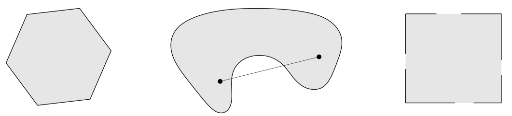

图例：凸和非凸示例。

从凸集可以引出凸组合和凸包等概念。

**【定义】凸组合(Convex Combination)**。称点$x = \theta_1 x_1+\cdots+ \theta_kx_k$为点$x_1,...,x_k$的凸组合，其中$\theta_1 + \cdots +\theta_k =1$ 且 $\theta_i \geq 0, \forall i$。 

与仿射集类似，一个集合是凸集等价于集合包含其中所有的点的凸组合。

**【定义】凸包(Convex Hull)**。称集合$C$中所有的点的凸组合的集合为其凸包，记为 $\textbf{conv} ~C$:
$$
\textbf{conv}~ C = \{ \theta_1 x_1 + \cdots \theta_k x_k ~| ~ x_i \in C,~\theta_i \geq 0,~ i=1,\cdots,k,~~ \theta_1 + \cdots \theta_k = 1 \}
$$
*凸包总是凸的，凸包是包含$C$的最小凸集。*

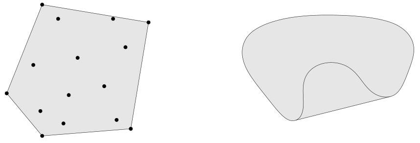

图例： 左：十五个点的集合的凸包是一个五边形；右：肾形集合对应的凸包。

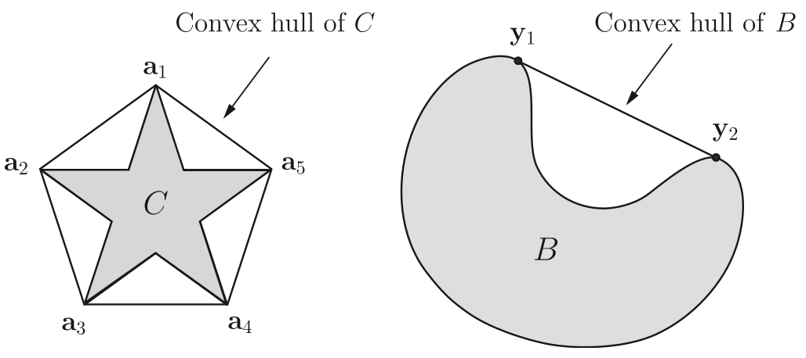

图例：非凸集及其凸包。

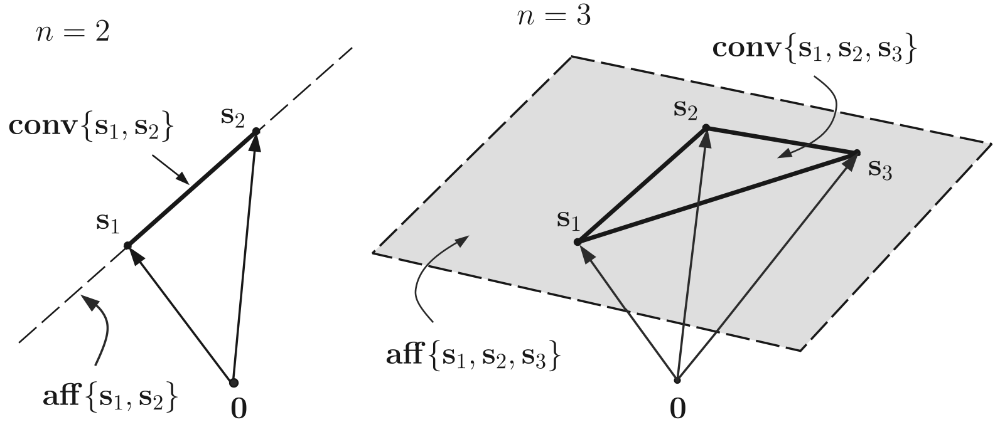

图例：仿射包和凸包。左图位于二维空间，右图位于三维空间。

【例】仿射集是凸集。

【例】线段是凸集，但不是仿射的，除非退化为一个点。

【例】凸组合的概念可以拓展到无穷级数、积分、以及大多数形式的概率分布。假设$\theta_1,~\theta_2,...$满足
$$
\theta_i \geq 0,~~ i=1,2\cdots,~~~\sum_{i=1}^{+\infty} \theta_i =1,
$$
且$x_1,x_2,\cdots \in C$，其中$C\subseteq \mathbb{R}^n$为凸集，如果级数收敛，则
$$
\sum_{i=1}^{+\infty} \theta_i x_i \in C.
$$
更一般地，假设$p:\mathbb{R}^n \rightarrow \mathbb{R}$对所有$x\in C$满足$p(x) \geq 0$，且$\int_{C}p(x) = 1$，其中$C \subseteq \mathbb{R}^n$是凸集，那么，如果下述积分存在，则
$$
\int_{C}p(x)x \mathrm{d}x \in C,
$$
最一般的情况，设$C \subseteq \mathbb{R}^n$ 是凸集，$X$是随机向量，且$X$以概率1落入$C$，则$E(X) \in C$。

### 锥和凸锥

**【定义】锥(Cone)**。如果对于任意$x\in C,~~ \theta \geq 0$都有$\theta x \in C$，则称集合$C$是锥或非负齐次(nonnegative homogeneous)。

**【定义】凸锥(Convex Cone)**。称$C$为凸锥，若$\forall x_1, x_2 \in C$和$\theta_1, \theta_2 \geq 0$ 有
$$
\theta_1 x_1 + \theta_2 x_2 \in C,
$$
**【定义】锥组合(Conic Combination)**。具有$\theta_1 x_1 + \cdots + \theta_k x_k, \theta_1,\cdots, \theta_k \geq 0$形式的点称为$x_1,\cdots,x_k$的锥组合或非负线性组合(Nonnegative Linear Combination)。

集合$C$是凸锥的充要条件是它包含其元素的所有锥组合。和凸组合一样，锥组合可以拓展到无穷级数和积分中。

**【定义】锥包(Conic Hull)**。锥包是$C$中所有元素的所有锥组合的集合，即
$$
\{\theta_1 x_1 + \cdots + \theta_k x_k ~|~x_i \in C, \theta_i \geq 0,~~i-1,\cdots,k \},
$$
锥包是包含$C$的最小凸锥。凸集不一定包含原点，但是锥一定包含原点。不是所有的锥都是凸锥。

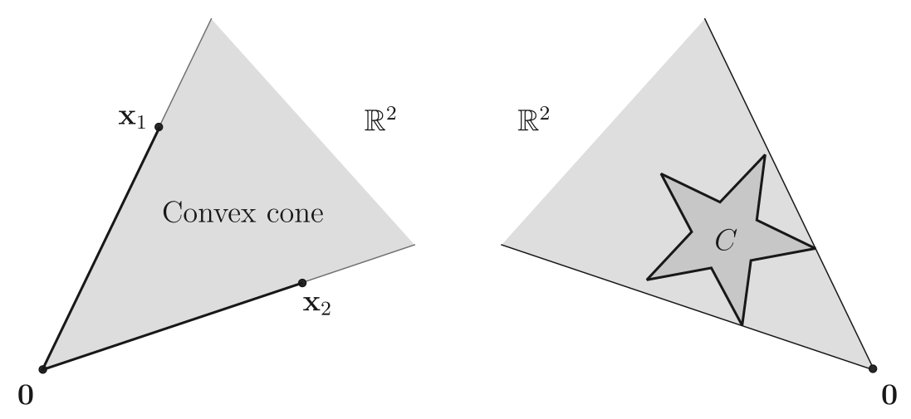

图例：锥包示例。

【例】任何直线都是仿射的。如果直线过零点，则是凸锥。

【例】射线，即具有形式$\{ x_0 + \theta v | \theta \geq 0 \},~~ x_0, v \in \mathbb{R}^n,~ v \neq 0$ 的集合，是凸的，但不是仿射的。如果$x_0=0$，则它是凸锥。

### 重要的凸集

**【超平面(Hyperplane)】**: $\{x ~|~ a^{\mathrm{T}}x=b \}$，其中$a \in \mathbb{R}^n,~ a \neq 0,~b \in \mathbb{R}$。它是凸的且仿射的。设$x_0$为任意满足$a^{\mathrm{T}}x_0=b$的点 则超平面可以表示为$\{ x~|~a^{\mathrm{T}}(x - x_0) = 0 \} = x_0 + a^{\perp}$，$a^{\perp}$为$a$的正交补。

**【半空间(Halfspace)】**: $\{ x~|~ a^{\mathrm{T}}x \leq b \}$，其中$a \neq 0$。它是凸的但不是仿射的。

**【欧几里得球(Euclidean Balls)】**$B(x_c, r) = \{x ~|~||x -x_c ||_2 \leq r \} = \{ x~|~ (x-x_c)^\text{T}(x-x_c) \leq r^2 \}$。

**【椭球(Ellipsoids)】**$\varepsilon = \{ x~|~(x-x_c)^\text{T} P^{-1}(x-x_c) \leq 1 \} = \{ x_c+Au~|~||u||_2 \leq 1 \}$，其中$P = P^{\text{T}} \succ 0$是对称正定矩阵。

**【范数球(Norm Balls)】**$\{ x~|~~ ||x-x_c|| \leq r \}$，其中$||\cdot||$是$\mathbb{R}^n$中的任意范数。

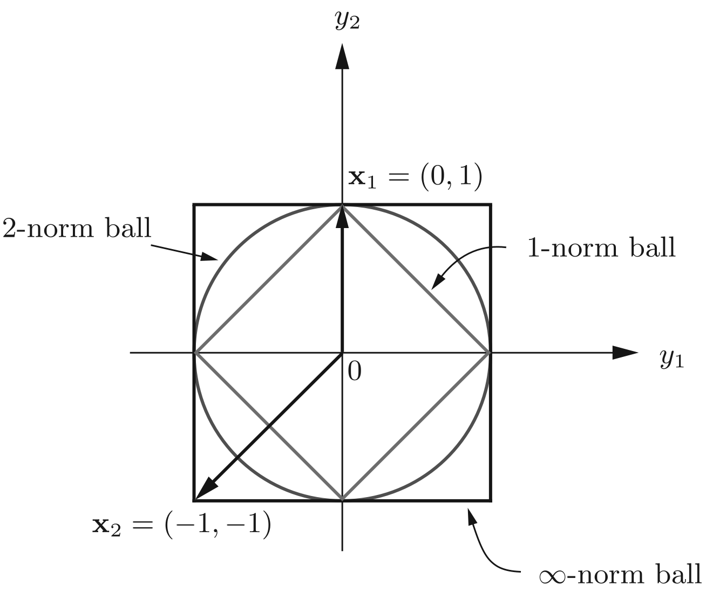

如果$v \in \mathbb{R}^n,~p > q \geq 1$，则$||v||_p \leq ||v||_q$。

**【范数锥(Norm Cones)】**$\{(x,t)~|~~ ||x|| \leq t\} \subseteq \mathbb{R}^{n+1}$。范数球和范数锥都是凸集。

**【二阶锥(Second-Order Cone)】**二阶锥是由Euclid范数定义的范数锥，也叫**二次锥、Lorentz锥、冰淇淋锥**，即
$$
C &=& \{ (x,t) \in \mathbb{R}^{n+1}~|~~||x||_2 \leq t \}\\
 &=& \left\{ \left[\begin{matrix} x \\ t \\ \end{matrix}\right]  ~\Bigg|~ \begin{bmatrix} x \\ t \\ \end{bmatrix}^T         \begin{bmatrix}
   I & 0 \\
   0  & -1 \\
  \end{bmatrix} \begin{bmatrix} x \\ t \\ \end{bmatrix} \leq 0,~t \geq 0 \right\}
$$

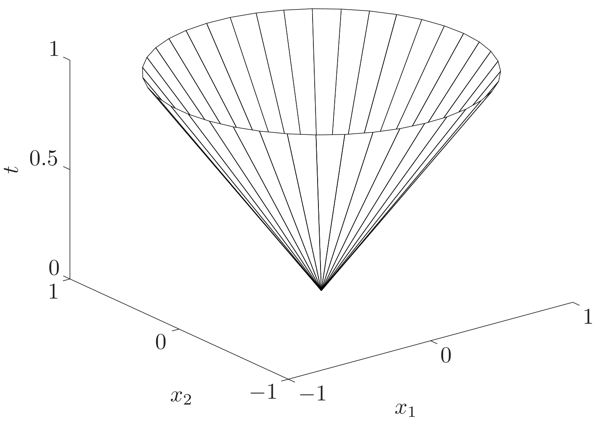

**【多面体(Polyhedra)】**有限个线性等式和不等式的解集：
$$
\mathcal{P} &=& \{ a_j^Tx \leq b_j, j = 1,\cdots,m,~ c_j^Tx = d_j, ~j=1,\cdots,p \} \\
&=& \{ x~|~Ax \preceq b,~~Cx = d  \}
$$
其中
$$
A 
= \begin{bmatrix}
   a_1^T \\
   \vdots \\
   a_m^T
  \end{bmatrix},~~ 
  C =  
  \begin{bmatrix}
   c_1^T \\
   \vdots \\
   c_p^T
  \end{bmatrix}
$$
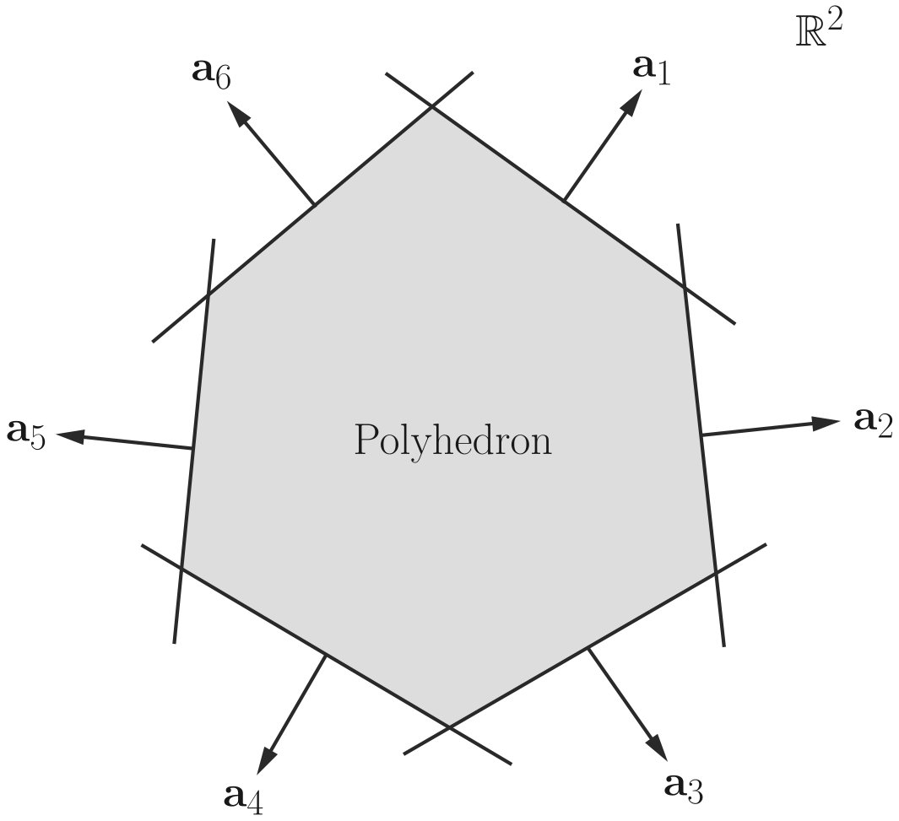

**【单纯形(Simplexes)】**设$k+1$个点$v_0, v_k \in \mathbb{R}^n$仿射独立，即$v_1-v_0,\cdots, v_k-v_0$线性独立，则这些点决定了一个单纯行：
$$
C = \textbf{conv}\{  \theta_0v_0+\cdots+ \theta_kv_k ~|~\theta \succeq 0, \mathbf{1}^T\theta =1 \}
$$
这个单纯形的仿射维数为$k$。单纯形是一类重要的多面体。多面体不一定是单纯形，如上图。

**单纯性的等价定义**：对于一个有限集合$\mathcal{S} = \{s_1,\cdots, s_n\} \subset \mathbb{R}^{\ell} $，其某个子集$S \subseteq \mathcal{S}$是仿射独立的，若该子集的凸包满足$\mathbf{conv}~S = \mathbf{conv}~\mathcal{S}$，则该子集的凸包$\mathbf{conv}~S$就被称为单纯形。

【例】常见的单纯形。1维单纯形是线段；2维单纯形是三角形；3维单纯形是一个四面体。

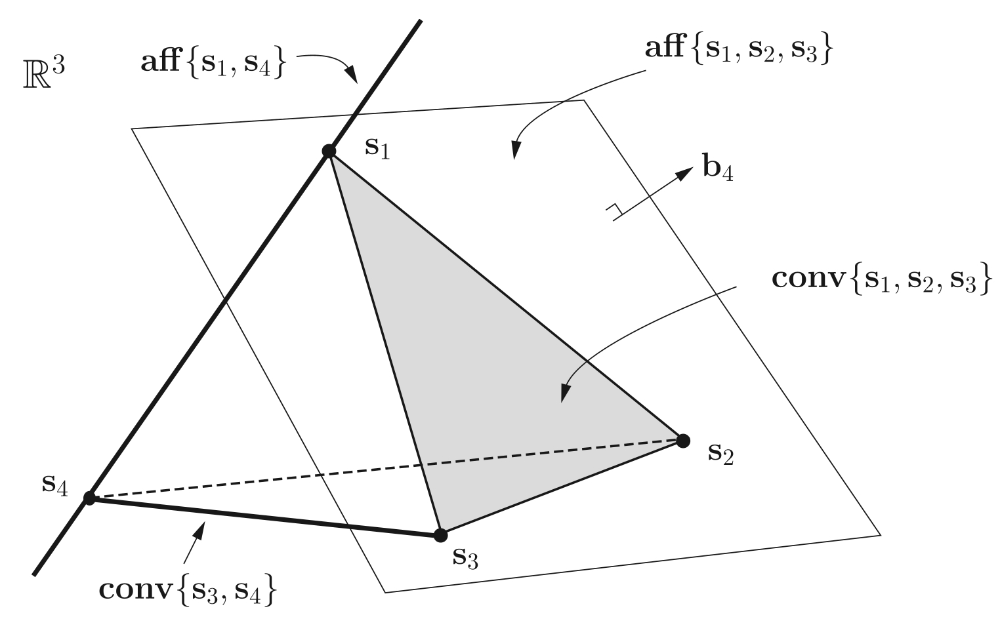

**【(半)正定锥(The positive (semi)definite cone)】**  记$\mathcal{S}^n = \{X \in \mathbb{R}^{n\times n} ~|~ X = X^T\}$ ，即$n\times n$对称矩阵的集合，记$\mathcal{S}_{+}^n = \{X \in \mathbb{S}^{n} ~|~ X \succeq 0 \}$为对称半正定矩阵的集合，记$\mathcal{S}_{++}^n = \{X \in \mathbb{S}^{n} ~|~ X \succ 0 \}$为对称正定矩阵的集合。$\mathcal{S}_{+}^n $为凸锥，因此$\mathcal{S}_{+}^n $又被称为半正定锥。

下图是一个$\mathcal{S}^2$上的半正定锥，
$$
X = 
\begin{bmatrix}
   x & y \\
   y & z
  \end{bmatrix} \in \mathcal{S}_{+}^{2} ~~~\Longleftrightarrow ~~~ x\geq 0,~~z \geq 0,~~ xz \geq y^2，
$$

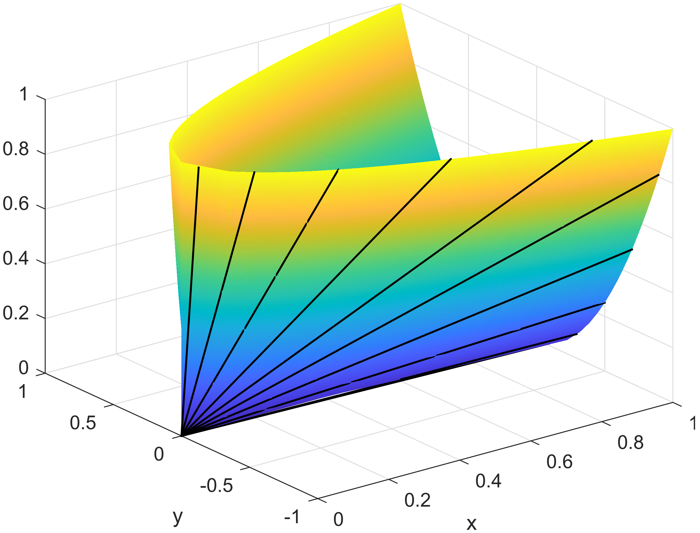

###  保凸运算

利用一些集合的运算可以从一些凸集合构造出其他凸集。

**【交集】**交集运算是保凸的。若$\forall~\alpha \in \mathcal{A}, C_{\alpha}$都是凸的，则$\bigcap_{\alpha \in \mathcal{A}}C_{\alpha}$也是凸集。

**【仿射函数】**设$f:\mathbb{R}^n \rightarrow \mathbb{R}^m$是仿射变换，$f(x) = Ax+b,~A\in\mathbb{R}^{m\times n},~b\in\mathbb{R}^m$，则

+ 凸集在$f$下的像是凸集

$$
C \in \mathbb{R}^n是凸集 \Longrightarrow f(C) \stackrel{\text{def}}{=} \{f(x)~|~ x \in C \}是凸集
$$

+ 凸集在$f$下的原像是凸集

$$
C \in \mathbb{R}^m 是凸集 \Longrightarrow f^{-1}(C) \stackrel{\text{def}}{=} \{ x \in \mathbb{R}^n ~|~ f(x) \in C \}是凸集
$$

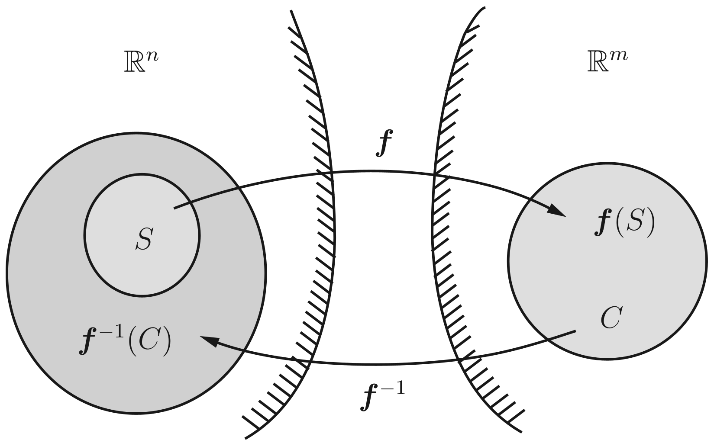

【透视函数】定义$P:\mathbb{R}^{n+1} \rightarrow \mathbb{R},~P(z,t) = z/t$为透视函数，其定义域为$\mathbf{dom}~P = \mathbb{R}^n \times \mathbb{R}_{+_+}$。则，

+ $C \subseteq \mathbf{dom}~P$是凸集，那么它的象$P(C) = \{ P(x)~|~x \in C \}$也是凸集；
+ 一个凸集在透视函数下的原象也是凸集。即，如果$C \subseteq  \mathbb{R}^n$是凸的，那么$P^{-1}(C) = \{(x,t) \in \mathbb{R}^{n+1}~|~ x/t, t>0\}$。

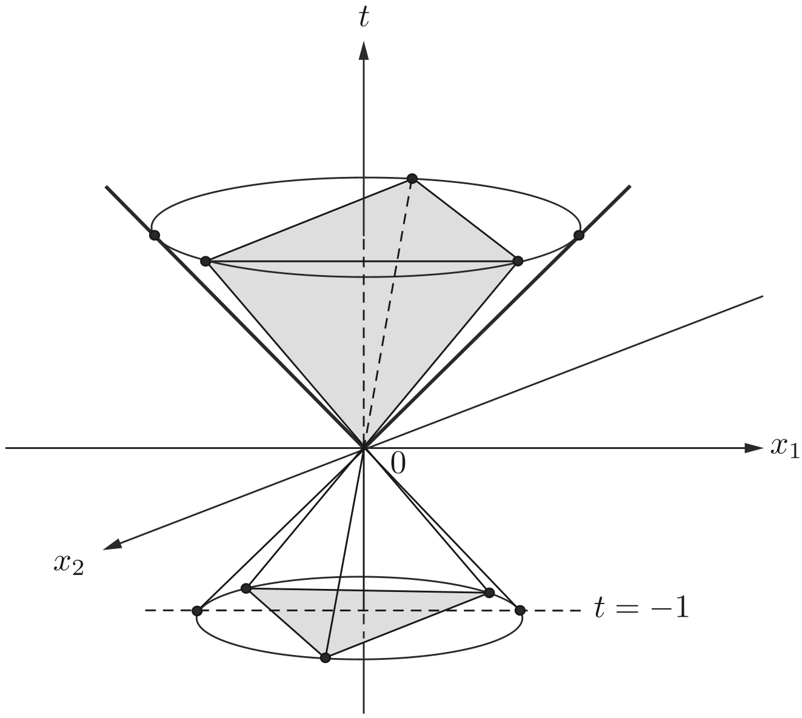

### 分离超平面定理

**【定理】分离超平面定理**。如果$C$和$D$是不相交的两个凸集，则存在非零向量$a$和常数$b$，使得
$$
a^Tx \leq b, \forall x \in C,~~且a^Tx \geq b,~ \forall x \in D,
$$
即超平面$\{ x~|~a^Tx = b \}$分离了$C$和$D$。

当$C$是闭凸集，$D$是单点集时，有如下严格分离定理。

**【定理】严格分离定理**。设$C$是闭凸集，点$x_0 \notin C$，则存在非零向量$a$和$b$，使得
$$
a^Tx < b,~\forall x \in C,~ 且a^Tx_0 > b.
$$
**【定义】支撑超平面**。给定集合$C$及其边界上的一点$x_0$，如果$a \neq 0$满足$a^Tx \leq a^T x_0,~\forall x \in C$，那么称集合
$$
\{ x~|~a^Tx = a^Tx_0 \}，
$$
为$C$在边界点$x_0$处的支撑超平面。根据凸集的超平面定理，我们有如下支撑超平面定理。

**【定理】支撑超平面定理**。如果$C$是凸集，则在$C$的任意边界点处都存在支撑超平面。

### 上方图

**【定义】$\alpha$-下水平集**。对于函数$f: \mathbb{R}^n \rightarrow  \mathbb{R}$，称
$$
C_\alpha = \{ x~|~ x \in \mathbf{dom}~f,~~f(x) \leq \alpha \}
$$
为$f$的$\alpha$-下水平集。

**【定义】上方图/上境图(Epigraph)**。函数$f:\mathbb{R}^n \rightarrow \mathbb{R}$的上方图定义为
$$
\mathbf{epi}~f = \{(x,t) ~|~ x\in \mathbf{dom}~f,~~f(x) \leq t  \},
$$

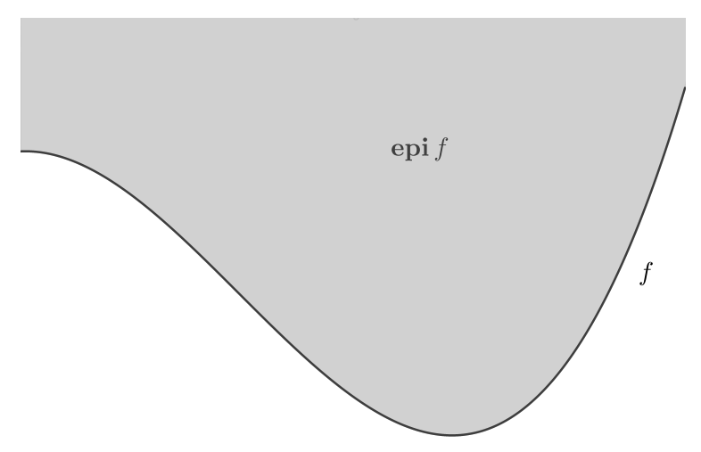

## 凸函数

**【定义】凸函数**。称函数$f:\mathbb{R}^n \rightarrow \mathbb{R}$是凸的，如果$\mathbf{dom}~f$是凸集，且$\forall~x,y \in \mathbf{dom}~f$和任意$0\leq \theta \leq 1$有:
$$
f(\theta x + (1-\theta)t) \leq \theta f(x) + (1-\theta)f(y),
$$
**【定理】凸函数的判定定理。**函数是凸的，当且仅当其在与其定义域相交的任何直线上都是凸的。即$f(x)$是凸函数当且仅当对任意的$x \in \mathbf{dom}~f$，$v \in \mathbb{R}^n,~~g: \mathbb{R} \rightarrow  \mathbb{R}$，
$$
g(t) = f(x+tv),~~ \mathbf{dom}~g = \{t| x+tv \in \mathbf{dom}~f \},
$$
是凸函数。

###  一阶条件、二阶条件、性质

**【定理】一阶条件**。对于定义在凸集上的可微函数$f$，$f$是凸函数当且仅当
$$
f(y) \geq f(x) + \nabla f(x)^T(y-x),~~ \forall x,y \in \mathbf{dom}~f,
$$

**【定理】二阶条件**。设$f$为定义在凸集上的二阶连续可微函数，即对于开集$\mathbf{dom}~f$内的任意一点，它的Hessian矩阵或者二阶导数$\nabla^2 f$存在，则函数$f$是凸函数的充要条件是
$$
\nabla^2 f(x) \succeq 0,~~ \forall x \in \mathbf{dom}~f，
$$

**【定理】梯度单调性。**设$f$为可微函数，则$f$为凸函数当且仅当$\mathbf{dom}~f$为凸集且$\nabla f$为单调映射，即
$$
(\nabla f(x) - \nabla f(y))^T(x-y) \geq 0,~~\forall x,y \in \mathbf{dom}~f，
$$
【定理】函数$f(x)$为凸函数当且仅当其上方图$\mathbf{epi}~f$是凸集。

【命题】设$f(x)$是凸函数，则$f(x)$所有的$\alpha$-下水平集$C_{\alpha}$都是凸集。需要注意的是，此命题的逆命题不成立，即任意下水平集为凸集的函 数不一定是凸函数。

凸函数不一定是连续函数，但下面这个定理说明凸函数在定义域中内点处是连续的。

**【定理】连续性。**设$f:\mathbb{R}^n \rightarrow (-\infty, +\infty]$为凸函数。对任意点$x_0 \in \mathbf{int~dom}~f$，有$f$在点$x_0$处连续。这里$\mathbf{int~dom}~f$表示定义域$\mathbf{dom}~f$的内点。

此定理表明凸函数“差不多”是连续的，它的一个直接推论为：

【推论】设$f(x)$是凸函数，且$\mathbf{dom}~f$是开集，则$f(x)$在$\mathbf{dom}~f$上是连续的。

### 常见的凸函数

**【二次函数】**$f(x) = (1/2)x^TPx+q^Tx+r,~~P \in \mathcal{S}_{+}^n,~~x,q \in \mathbb{R}^n,~~ r \in \mathbb{R}$，其定义域为$\mathbf{dom}~f = \mathbb{R}^n$。

**【仿射函数】**$f(x) = a^Tx+b$，其中$a,x \in \mathbb{R}^n$是向量。$f(X) = AX+b$，其中$A, X, b$是符合运算法则的矩阵。

**【指数函数】**对任意$a \in \mathbb{R}$，函数$e^{ax}$在$\mathbb{R}$上是凸的。

**【负对数函数】**$f(x) = -\log x$在$\mathbb{R}_{++}$上是凸函数。

**【幂函数】**当$a \geq 1或a \leq 0$时，$x^a$在$\mathbb{R}_{++}$上是凸函数，当$0 \leq a \leq 1$时，$x^a$在$\mathbb{R}_{++}$上是凹函数。

**【负熵】**$x\ln x,~x >0$是凸函数。

**【范数】**所有的范数(向量和矩阵版本)都是凸函数，这是因为范数有三角不等式。

**【最大值函数】**$f(x) = \max\{x_1,\cdots,x_n \}$是$\mathbb{R}^n$上是凸的。

**【二次-线性分段函数】**函数$f(x,y) = x^2/y$，定义域为
$$
\mathbf{dom}~f = \mathbb{R} \times \mathbb{R}_{++} = \{ (x,y) \in \mathbb{R}^2~|~y >0 \},
$$
上述函数实际上可以看成是半定二次锥。

**【指数和的对数】**$f(x) = \log(e^{x_1}+\cdots+e^{x_n})$在$\mathbb{R}^n$上是凸函数。

**【几何平均】**$f(x) = \left( \prod_{i=1}^{n}x_i \right)^{1/n}$在定义域$\mathrm{dom}~f = \mathbb{R}_{++}^{n}$上是凹函数。

**【对数-行列式】**$f(x) = -\log \det(X)$在定义域$\mathrm{dom}~f = \mathbb{R}_{++}^{n}$上是凸函数。证明过程需要利用矩阵分析。

### 保凸运算

介绍几种保持函数凸性或凹性的运算。

**【非负加权求和】**$f = w_1f_1+\cdots+w_kf_k$，其中$f_1,\cdots,f_k$为凸函数，$w_i \geq 0,~\forall i$。

**【复合仿射映射】**定义函数$g:\mathbb{R}^m \rightarrow \mathbb{R}$为$g(x) = f(Ax+b)$，其中$f:\mathbb{R}^n \rightarrow \mathbb{R},~~A \in \mathbb{R}^{n\times m},~~ b \in \mathbb{R}^n$，$\mathbf{dom}~g = \{x~|~ Ax+b \in \mathbf{dom}~f \}$。若函数$f$是凸函数，则函数$g$是凸函数。

**【逐点最大】**如果函数$f_1, \cdots, f_k$为凸函数，则它们的逐点最大函数$f(x) = \max\{f_1(x),\cdots,f_k(x) \}$也是凸函数。

**【逐点上确界】**如果对于任意$y \in \mathcal{A}$，函数$f(x,y)$关于$x$都是凸的，则函数$g(x) = \sup_{y\in \mathcal{A}}f(x,y)$关于$x$是凸的。$\mathbf{dom}~f = \{ x~|~(x,y) \in \mathbf{dom}~f, \forall~y \in \mathcal{A},~\sup_{y \in \mathcal{A}}f(x,y) \leq \infty \}$.

**【复合】**给定函数$g:\mathbb{R}^n \rightarrow \mathbb{R}$和$h:\mathbb{R} \rightarrow \mathbb{R}$，令$f(x) = h(g(x))$。若$g$是凸函数，$h$是凸函数且单调不减，那么$f$是凸函数；若$g$是凹函数，$h$是凸函数且单调不增，那么$f$是凸函数。

**【矢量复合】**给定函数$g:\mathbb{R}^n \rightarrow \mathbb{R}^k,~~h:\mathbb{R}^k \rightarrow \mathbb{R}$，函数
$$
f(x) = h(g(x)) = h(g_1(x),~g_2(x) ,\cdots,~g_k(x) ),
$$
若$g_i$是凸函数，$h$是凸函数且关于每个分量单调不减，则$f$是凸函数；若$g_i$是凹函数，$h$是凸函数且关于每个分量单调不减，那么$f$是凸函数。

**【最小化】**若$f(x,y)$关于$(x,y)$整体是凸函数，$C$是凸集，则
$$
g(x) = \inf_{y \in C}f(x,y)
$$
是凸函数。

**【透视函数】**给定函数$f:\mathbb{R}^n \rightarrow \mathbb{R}$的透视函数$g:\mathbb{R}^n \times \mathbb{R} \rightarrow \mathbb{R} $，
$$
g(x,t) = tf(\frac{x}{t}),~~ \mathbf{dom}~g = \left\lbrace (x,t)~|~ \frac{x}{t}  \in \mathbf{dom}~f,~t > 0  \right\rbrace,
$$
若$f$是凹/凸函数，则$g$是凹/凸函数。

【例】相对熵可以看成是负对数函数的透视函数。考虑$\mathbb{R}_{++}$上的凸函数$f(x) = -\log x$，其透视函数为$g(x,t) = -t \log(1/t) = t\log t - t \log x$，在$\mathbb{R}_{++}$上它是凸函数。若$u,v \in \mathbb{R}_{++}^n$的相对熵$\sum_{i=1}^{n}u_i \log(u_i/v_i)$是关于$u,v的凸函数。

### 凸分析中常用的定义和定理

**【定义】梯度利普希茨连续。**给定可微函数$f$，若存在$L >0$，对任意的$x,y \in \mathbf{dom}~f$有
$$
|| \partial f(x) - \partial f(y) || \leq L||x-y||,
$$
则称函数$f$是梯度梯度利普希茨连续的。相应的梯度利普希茨常数为$L$，有时也间记为梯度$L$-梯度利普希茨连续或$L$-光滑($L$-smooth)。

**【定理】二次上界。**设可微函数$f(x)$的定义域$\mathbf{dom}~f = \mathbb{R}^n$，且为梯度$L$-利普希茨连续的，则函数$f(x)$有二次上界:
$$
f(y) \leq f(x) + \nabla f(x)^T(y-x) + \frac{L}{2}||y-x||^2,~~ \forall x, y \in \mathbf{dom}~f,
$$
**【定义】强凸函数(Strongly Convex)**。若存在常数$m > 0$，使得
$$
g(x) = f(x) - \frac{m}{2} ||x||^2
$$
为凸函数，则称$f(x)$为强凸函数，$m$为强凸参数。我们也称$f(x)$为$m$-强凸函数。

**【定义】强凸函数的等价定义**。若存在常数$m>0$，使得对任意$x,y \in \mathbf{dom}~f$以及$\theta \in (0,1)$，有
$$
f(\theta x+(1-\theta)y) \leq \theta f(x) + (1-\theta)y - \frac{m}{2}\theta(1-\theta)||x-y||^2
$$
则称$f(x)$为强凸函数，$m$为强凸参数。

【推论】设$f$为可微函数，且$\mathbf{dom}~f$是凸集，则

+ $f$是严格凸函数，当且仅当
  $$
  (\nabla f(x)-\nabla f(y))^T(x-y) \geq 0,~~\forall x,y \in \mathbf{dom}~f,
  $$

+ $f$是$m$-强凸函数当且仅当
  $$
  (\nabla f(x) - \nabla f(y))^T(x-y) \geq m||x-y||^2,~~ \forall x,y \in \mathbf{dom}~f,
  $$

**【引理】二次下界**。设$f(x)$是参数为$m$的可微强凸函数，则
$$
f(y) \geq  f(x) + \nabla f(x)^T(y-x) + \frac{m}{2}||y-x||^2,~~ \forall x,y \in \mathbf{dom}~f,
$$

##  共轭

共轭函数是凸分析中的一个重要概念，其在凸优化问题的理论与算法 中扮演着重要角色．

**【定义】共轭函数。**设函数$f:\mathbb{R}^n  \rightarrow \mathbb{R}$，定义函数$f^* = \mathbb{R} \rightarrow \mathbb{R}$为
$$
f^*(y) = \sup_{x \in \mathbf{dom}~f}(y^Tx-f(x)),
$$
为函数$f$的共轭函数。

##  次梯度和次微分

次梯度在凸优化算法设计与理论分析中扮演着重要角色。

**【定义】次梯度。**设$f$为适当函数，$x$为定义域$\mathbf{dom}~f$中的一点，若向量$g \in \mathbb{R}^n$满足
$$
f(y) \geq f(x) + g^T(y-x),~~\forall y \in \mathbf{dom}~f,
$$
则称$g$为函数$f$在点$x$处的一个次梯度。进一步地，称集合
$$
\partial f(x) = \{g~|~g \in \mathbb{R}^n,~~f(y) \geq f(x) + g^T(y-x),~~\forall y \in \mathbf{dom}~f  \}，
$$
为$f$在$x$处的**次微分**。

### 次梯度和次微分的性质

# 最优性理论

#    对偶、Lagrange对偶、KKT条件

本章主要介绍对偶相关问题，在此之前，先大概回答以下几个问题，并以这几个问题为核心点去理解对偶。这对学习的效果有很大作用，大部分教材上来就是堆公式，目的也不说，为什么这么做也不说，达到的效果就是读者学完记不住也不会用。

1. 什么是对偶，对偶的目的是什么，或者说为什么需要对偶？
2. 什么是Lagrange对偶？
3. 什么是KKT条件，它和对偶有什么关系？
4. 既然有了各种优化方法，为啥还需要对偶，即，什么情况下需要使用对偶技术求解优化问题？

(1) 首先，之所以需要对偶，是因为转为对偶后即使原问题不是凸优化问题，对偶问题也是凸的，这一点是至关重要的好处，虽然对偶问题和原问题不完全等价，但是对偶问题能为原问题提供下界，能在一定程度上解决原问题。这也间接回答了问题(4)。其次，对偶能把约束优化转为无约束优化，这是第二个好处。

(2) Langrange是最常用的一种对偶，也是发展比较好的一种，也比较直观和成熟。

(3) KKT条件是求解原问题的对偶问题时的约束条件。一般，对偶的过程是这样，先是有原(主)问题，然后根据原问题的目标函数和约束函数，引入拉格朗日乘子，写出原问题的拉格朗日函数$L(x,\lambda, \mu)$，此时可以给出KKT条件，注意，KKT条件是针对拉格朗日函数的，即原问题可转化为在KKT约束下最小化朗格朗日函数。接着引出原问题的对偶问题$\Gamma(\lambda, \mu) = \inf_{x \in \mathbb{D}}L(x,\lambda, \mu)$，而对偶问题的最优值$d^*$给出了原问题最优值$p^*$(注意不是最优解，这里是最优值，即函数值)的下界，即$d^* \leq p^*$，所以为了得到最大的下界，我们需要构建对偶问题$\max_{\lambda, \mu}\Gamma(\lambda, \mu)$，无论原问题是啥，对偶问题都是凸的。若$d^* < p^*$，此时称为弱对偶，这时只能得到原问题最优值的下界；当$d^* = p^*$时为强对偶，将拉格朗日函数分别对原变量和对偶变量求偏导，并令导数为0，得到原变量和对偶变量的数值关系，其实就是KKT条件，即可解决主问题变量求解主问题，这样，对偶问题解决了，原问题也解决了。

(4) 一般的凸优化问题都有专门的优化算法，利用拉格朗日对偶可以解决非凸优化问题，其次，对于某些凸优化问题也可以转换为拉格朗日对偶问题来解决。

## 线性规划中的对偶

##  Lagrange 对偶

参考：

+ https://zhuanlan.zhihu.com/p/114574438
+ https://zhuanlan.zhihu.com/p/440297403
+ 西瓜书附录

拉格朗日乘子法 (Lagrange multipliers) 是一种寻找多元函数在一组约束下的极值的方法。通过引入拉格朗日乘子，可将有$d$个变量与$k$个约束条件的最优化问题转化为具有$k+d$个变量的无约束优化问题求解。

**先考虑等式约束优化问题。**
$$
& \min_{x\in\mathbb{R}^d}~~ f(x),\\
\text{s.t.} & g(x) = 0,
$$
对于一个具有等式约束$g(x) = 0$的优化问题，欲使目标函数$f(x)$最小，从几何角度看，该问题的目标是在由方程$g(x) = 0$确定的$d-1$维曲面上寻找能使目标函数$f(x)$最小化的点。因此有如下两个重要结论：

- 对于约束曲面上的任意点$x$，该点的梯度$\nabla g(x)$正交于约束曲面；
- 在最优点$x^*$，目标函数在该点的梯度$\nabla f(x^*)$正交于约束曲面。

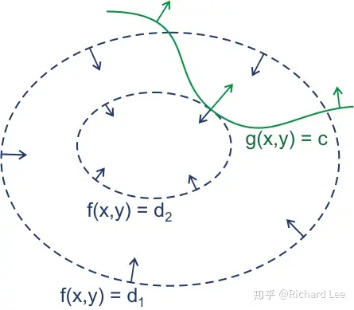

图中画出了目标函数的一系列等值面$f(x) = c$(蓝线) 和约束曲面$g(x) = 0$(绿线，假设常数 $c = 0$)。直观上，最优解$x^*$一定位于约束曲面上某处和等值面相切的位置，否则的话，一定可以沿着约束曲面移动到目标函数$f(x)$更小的等值面上，即梯度$\nabla f(x)$和$\nabla g(x)$方向必定相同或相反。 
$$
\nabla f(x^*) + \lambda \nabla g(x^*) = 0  \tag{1}\label{eq1}
$$
$\lambda$为拉格朗日乘子，定义**拉格朗日函数：**
$$
L(x, \lambda) = f(x) + \lambda g(x),
$$
不难发现，将其对$x$的偏导数$\nabla_xL(x, \lambda) $置0得 $\eqref{eq1}$，同时，将其对$\lambda$的偏导$\nabla_{\lambda}L(x, \lambda) $数置为0即得到约束条件$g(x) = 0$。即
$$
\frac{\partial L}{\partial x} = \nabla f(x) + \lambda \nabla g(x) = 0\\
\frac{\partial L}{\partial \lambda} =  g(x) = 0
$$
于是，原等式约束优化问题转化为对拉格朗日函数$L(x, \lambda)$的无约束优化问题。

**再考虑不等式约束问题：**

现在进一步考虑不等式约束
$$
& \min_{x\in\mathbb{R}^d}~~ f(x),\\
\text{s.t.} & g(x) \leq 0,
$$
借用一张图来理解：

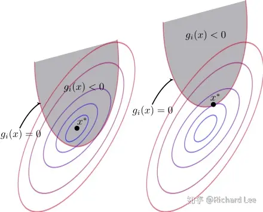

图中阴影部分代表不等式约束表示的可行域，我们可以根据目标函数$f(x)$的最优解$x^*$是否在可行域内将这类不等式约束优化问题分为两类：

1）$g(x) < 0$，最优解$x^*$在可行域内，此时不等式约束不起作用，只需求解$f(x)$的极值即可，即$\nabla f(x) = 0$，这等价于将$\lambda = 0$，然后对$\nabla_x L(x, \lambda)$置0得到。

2）$g(x) = 0$，最优解$x^*$在可行域边界上，此时不等式约束退化为等式约束。此时的$\nabla f(x^*)$必定与$\nabla g(x^*)$反向，即存在常数$\lambda >0$使得$\nabla f(x^*) + \lambda \nabla g(x^*) = 0$。

仍然构造**拉格朗日函数：**$L(x, \lambda) = f(x) + \lambda g(x)$,

- 对于第一种情形，等价于将$\lambda$置零然后求$L(x, \lambda)$极值：
  $$
  \frac{\partial L}{\partial x} = \nabla f(x) = 0 \\
  \lambda = 0\\
  g(x) < 0
  $$
  
- 对于第二种情形，若要在边界上取得极小值，等值面$f(x)$的梯度必定是指向$g(x) < 0$区域内，而$g(x)$的梯度显然是向外。因此$\nabla f(x)$和$\nabla g(x)$方向相反，$\lambda > 0$。
  $$
  \frac{\partial L}{\partial x} = \nabla f(x) + \lambda \nabla g(x) = 0 \\
  \lambda > 0\\
   g(x)  = 0,
  $$
  整合这两种情形，在约束$g(x) \leq 0$下最小化$f(x)$，可转化为在如下约束下最小化朗格朗日函数。

$$
\frac{\partial L}{\partial x} = \nabla f(x) + \lambda \nabla g(x) = 0 \\
\lambda \geq 0\\
g(x) \leq 0 \\
\lambda g(x)  = 0,
$$

以上约束称为 KKT(Karush-Kuhn-Tucker)条件。

**上述做法可以推广到多个约束的情况。考虑**具有$m$个等式约束和$n$个不等式约束，且可行域$\mathbb{D} \subset \mathbb{R}^d$非空的优化问题:
$$
& & \min_{x}~~ f(x)\\
\text{s.t.} & & h_i(x) = 0,~~~i = 1,\cdots,m \\
& & g_j(x) \leq 0,~~j = 1,\cdots, n,   \tag{2}\label{eq2}
$$
引入拉尔格朗日乘子$\mathbf{\lambda} = (\lambda_1, \lambda_2, \cdots, \lambda_m)$和$\mu = (\mu_1, \mu_2, \cdots, \mu_n)$，相应的**拉格朗日函数为**
$$
L(x, \lambda, \mu) = f(x) + \sum_{i=1}^{m}\lambda_i h_i(x) + \sum_{j=1}^{n} \mu_j g_j(x), \tag{3}\label{eq3}
$$
**其KKT条件为：**
$$
\begin{cases}
\frac{\partial L}{\partial x} = \nabla f(x) + \sum_{i=1}^{m}\lambda_i h_i(x) + \sum_{j=1}^{n} \mu_j g_j(x) = 0 \\
\frac{\partial L}{\partial x} = h_i(x) = 0 \\
\mu_j \geq 0\\
g_j(x) \leq 0 \\
\mu_j g_j(x)  = 0 \\
\end{cases}, \tag{4}\label{eq4}
$$
KKT条件虽然从理论上给出了极值的必要条件，但实际上方程解不一定好求。于是，我们又引入了它的“对偶问题”来辅助求解。

换句话说，一个优化问题可以从两个角度来考察，即“主问题(Primal problem)”和“对偶问题(Dual problem)”，为了引出对偶问题，我们先定义主问题的拉格朗日对偶函数。对“主问题”$\eqref{eq2}$，其**拉格朗日“对偶函数”**$\Gamma: \mathbb{R}^m \times \mathbb{R}^n \mapsto \mathbb{R} $定义为：
$$
\Gamma(\lambda, \mu) &=& \inf_{x \in \mathbb{D}} L(x, \lambda, \mu) \\
 & = & \inf_{x \in \mathbb{D}} \left( f(x)+ \sum_{i=1}^{m}\lambda_i h_i(x) + \sum_{j=1}^{n} \mu_j g_j(x) \right),  \tag{5}\label{eq5}
$$
$\inf$表示拉格朗日函数的下界， $\Gamma(\lambda, \mu)$是以$\lambda$和$\mu$为自变量的函数，具体含义是：对于给定的 $\lambda$和$\mu$，在可行域$\mathbb{D}$内变动 $x$，函数$L$取值的下界就是$\Gamma$的值。

需要注意的是这里的$\lambda$和$\mu$已经不受KKT条件的约束，下面我们要证明的就是在什么新的约束条件下，对偶函数能给出主问题最优值的下界。

假设$\widetilde{x}$为主问题 $\eqref{eq2}$ 可行域中的点，则对任意的$\mathbf{\mu} \succeq 0 $和$\lambda$，结合主问题的约束条件$h_i(x) = 0$和 $g_j(x) \leq 0$，可以得出：
$$
\sum_{i=1}^{m}\lambda_i h_i(x) + \sum_{j=1}^{n} \mu_j g_j(x) \leqslant 0,  \tag{6}\label{eq6}
$$
进而有：
$$
\Gamma(\lambda, \mu) = \inf_{x \in \mathbb{D}} L(x, \lambda, \mu) \leqslant L(\widetilde{x}, \lambda, \mu) \leqslant f(\widetilde{x}),
$$
若主问题 $\eqref{eq2}$ 的最优值为$p^*$,则对任意的都有$\mathbf{\mu} \succeq 0 $和$\lambda$：
$$
\Gamma(\lambda, \mu) \leq p^*,
$$
因此，我们得出一个最重要的结论：对偶函数给出了主问题最优值的下界，在满足新的约束条件$\mathbf{\mu} \succeq 0 $时。于是，一个很自然的问题就是: 基于对偶函数能获得的最好的下界是什么？显然，对偶函数的最大值便是最趋近于$p^*$的那个值，于是引出优化问题:
$$
\max_{\lambda, \mu}~~\Gamma(\lambda, \mu) \\
\text{s.t.}~~ \mu \succeq 0,  \tag{7}\label{eq7}
$$
上式子 $ \eqref{eq7} $ 就是主问题 $\eqref{eq2} $ 的**对偶问题**，且对偶问题的最大值仅仅取决于对偶变量$\lambda, \mu$。无论主问题凸性如何，对偶问题始终都是凸优化问题。

**为什么要求对偶问题？**

我们来看看将主问题转化为对偶问题获得了哪些好处：

1. 约束减少了，对偶问题只剩 n 个不等式约束；
2. 主问题不一定是凸优化问题（局部最优不一定是全局最优），对偶问题一定是凸优化问题。

记对偶问题 $\eqref{eq7}$的最优值为$d^*$，则称$p^*-d^*$是**原问题的最优对偶间隙**。它给出了原问题最优值以及通过Lagrange对偶函数所能得到的最好(最大)下界之间的差值，最优对偶间隙总是非负的。

当$d^* < p^*$时，为弱对偶性；

当$d^* = p^*$时称为**强对偶性成立**，由对偶问题的最优值可得到主问题的最优值，强对偶成立必须满足以下条件：

+ 主问题是凸优化问题，$f(x)$和$g_j(x)$均为凸函数，$h_i(x)$为仿射函数。即
  $$
  & & \min_{x}~~ f(x)\\
  \text{s.t.} & &  g_j(x) \leq 0,~~j = 1,\cdots, n,\\
  & &    Ax = b,
  $$
  在这个(凸性)条件下，强对偶性通常(但不总是)成立。有很多研究给出了强对偶成立的条件(凸性除外)。这些条件称为约束准则。如下两种：

+ 一个简单的约束准则是Slater条件：可行域中至少存在一点使得不等式约束严格成立。即

  + 存在一点$x \in \text{relient}~\mathbb{D}$使得下式成立
    $$
    g_j(x) < 0,~~ j=1,\cdots,m \\
    Ax=  b
    $$

  + 当不等式约束$g_j$中有一些是仿射函数时，Slater条件可以进一步改进。如果前面$k$个约束函数$g_1,\cdots, g_k$是放射的，则若下列弱化的条件成立，强对偶性成立，该条件为：存在一点$x \in \text{relient}~\mathbb{D}$使得：
    $$
    g_i(x) \leq 0,~~i=1,\cdots,k\\
    g_i(x) < 0,~~i=k+1, \cdots, m, \\
    Ax = b
    $$
    

**强对偶时如何求解主问题变量？**

强对偶性成立时，将拉格朗日函数分别对原变量和对偶变量求偏导，并令导数为0，得到原变量和对偶变量的数值关系，其实就是KKT条件，即可解决主问题变量求解主问题，这样，对偶问题解决了，原问题也解决了。

#  优化问题/优化模型

本章介绍常用的优化模型的一般形式，以及可以转化为这些模型的其他形式的模型，和相应的转化方法。

## 线性规划 (Line Programming, LP)

$$
& \min_{x\in\mathbb{R}^n}~~c^{T}x,\\
\text{s.t.} & Ax = b,\\
& Gx \leq e,
$$

其中：$c\in\mathbb{R}^n,~A \in \mathbb{R}^{m\times n}, b \in \mathbb{R}^{m}, G \in \mathbb{R}^{p\times n}$是给定的矩阵和向量，$x$是决策变量。线性规划是凸优化问题。

下面介绍非线性规划。

##  二次规划 (Quadratic Program, QP)

二次函数$f: \mathbb{R}^n \rightarrow \mathbb{R},~~f(x) = \frac{1}{2}x^TAx+b^Tx+c, ~~x \in \mathbb{R}^n$，其中$A$是$n$阶对称矩阵，$b$是$n$维列向量，$c$是常数，则$f(x)$在$x$处的梯度$\nabla f(x) = Ax+b$，Hesse矩阵$\nabla^2f(x) = A$。

当凸优化问题的目标函数是凸二次型且约束函数为仿射时，该问题称为二次规划问题。表述为
$$
& & \min_{x} ~~\frac{1}{2}x^T P x+q^Tx+r,\\
\text{s.t.} & & Gx \preceq h, \\
& & Ax = b,
$$
其中$P \in \mathcal{S}_{+}^{n},~ G \in \mathbb{R}^{m \times n}$且$A \in R^{p \times n}$。在二次规划中我们在一个多面体上极小化一个凸二次函数。

## 二次约束二次规划问题(Quadratically Constrained Quadratic Program, QCQP)

如果上述式子中不仅目标函数，其不等式约束也是(凸)二次型，例如
$$
& & \min_{x} ~~\frac{1}{2}x^T P_0 x+q^Tx+r,\\
\text{s.t.} & & \frac{1}{2}x^T P_i x+q_i^Tx+r_i \leqslant 0,~~i=1,\cdots,m\\
& & Ax = b,
$$
其中$P_i \in \mathcal{S}_{+}^{n},~i=1,2,\cdots, m$，这一问题称为**二次约束二次规划问题(QCQP)**。

## 二阶锥规划 (Second-Order Cone Programming, SOCP)

与二次规划相关的问题是二阶锥规划
$$
& & \min_{x} ~~f^Tx,\\
\text{s.t.} & &  ||A_ix+b_i||_2 \leqslant c_i^Tx + d_i,~~i=1,\cdots,m\\
& & Fx = g,
$$
其中$x \in \mathbb{R}^n$为优化变量，$A_i \in \mathbb{R}^{n_i \times n}$且$F \in \mathbb{R}^{p\times n}$。我们称这种形式中的约束
$$
||Ax+b ||_2 \leqslant c^Tx + d,
$$
其中$A \in \mathbb{R}^n$为二阶锥优化，因为这等同于要求仿射函数$(Ax+b,~c^Tx+d)$在$\mathbb{R}^{k+1}$的二阶锥中。

当$c_i,~i=1,2,\cdots,m$时，SOCP等同于QCQP(将每个约束平方得到)。如果$A_i=0,~i=1,2,\cdots,m$，SOCP退化为一般的线性规划问题。

## 半正定规划(Semidefinite Programming, SDP)

$$
& & \min ~~c^{T}x,\\
\text{s.t.} & &  x_1A_1+x_2A_2+\cdots+x_nA_n +B \preceq b,\\
& & Gx = h
$$

其中$c \in \mathbb{R}^n,~~A_i \in \mathcal{S}^m,~i=1,2,\cdots,m,~~B \in \mathcal{S}^m,~~G \in \mathbb{R}^{p\times n},~~h \in \mathbb{R}^p$为已知的向量和矩阵。

## 整数规划()

$$
& &\min ~~c^{T}x,\\
\text{s.t.} & & Ax \leq b,\\
& & x_i \in  \mathbb{Z}_{+},~~i = 1,2,\cdots, n \\
$$

其中：$c\in\mathbb{R}^n,~A \in \mathbb{R}^{m\times n}, b \in \mathbb{R}^{m}$是给定的矩阵和向量，$x$是决策变量。

#   优化算法

本章主要介绍常用的优化算法，以及每种优化算法的优化目标和约束方程的形式。

##  无约束优化算法

### 收敛性分析

## 约束优化算法

###  收敛性分析

##  复合优化算法

### 收敛性分析

#  通信和信号处理中典型的优化模型及其求解

 

# 附录

## 函数的梯度为什么与等高线垂直

首先需要强调以下几点，对于函数$z = f(x,y)$

+ 梯度为$\mathrm{grad}~f = ( f_x, f_y )$
+ 等高线定义为$f(x,y) = C$，等高线是在xoy平面的。
+ **梯度是一个向量，既有大小又有方向**。
+ **梯度的方向是最大方向导数的方向。**
+ 梯度的模是方向导数的最大值。

函数$z = f(x,y)$为一个三维曲面，该面被平面$z = C$所截的曲线方程$f(x,y)=C$为
$$
z = f(x,y) \\
z = C
$$
该曲线在$XoY$平面上的投影是一条曲线，曲线方程为$f(x,y)=C$，该曲线就是等高线。

等高线上一点$p$的切线处的斜率为
$$
\frac{\mathrm{d}y}{\mathrm{d}x} = -\frac{f_x}{f_y}
$$
上式成立是因为隐函数存在定理：设函数$f(x,y)$在点$P(x_0,y_0)$的某一翎域内具有连续偏导数，且$f(x_0,y_0) =C,~ f_y \neq 0$，则方程$f(x,y) = C$在点$(x_0, y_0)$的某一邻域内能唯一确定一个连续球儿具有连续导数的函数$y =f(x)$，它满足$y_0 = f(x_0)$，且
$$
\frac{\mathrm{d}y}{\mathrm{d}x} = -\frac{f_x}{f_y}
$$
而梯度为$\frac{\partial f}{\partial x}i + \frac{\partial f}{\partial y}j$，可以看出$(1,  -\frac{f_x}{f_y})\cdot(\frac{\partial f}{\partial x}, \frac{\partial f}{\partial y}) = 0$，因此函数在某点的梯度垂直于这点的等高线。

# 参考资料

\[1] [Lieven Vandenberghe教授课件](https://www.seas.ucla.edu/~vandenbe/)

\[2] 凸优化 stephen boyd

\[3] 最优化：建模、算法与理论，李勇锋，刘浩杨，文再文

\[4] 最优化理论与算法，陈宝林

\[5] 信号处理与通信中的凸优化：从基础到应用，祁忠勇等著，陈翔等译

